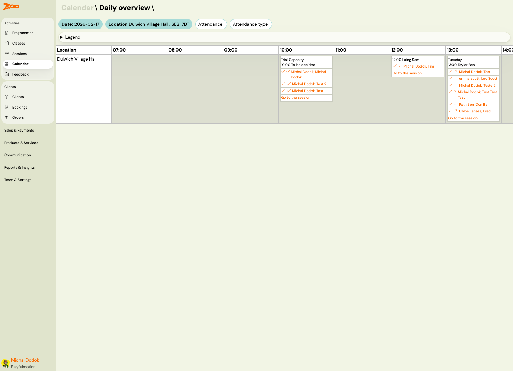
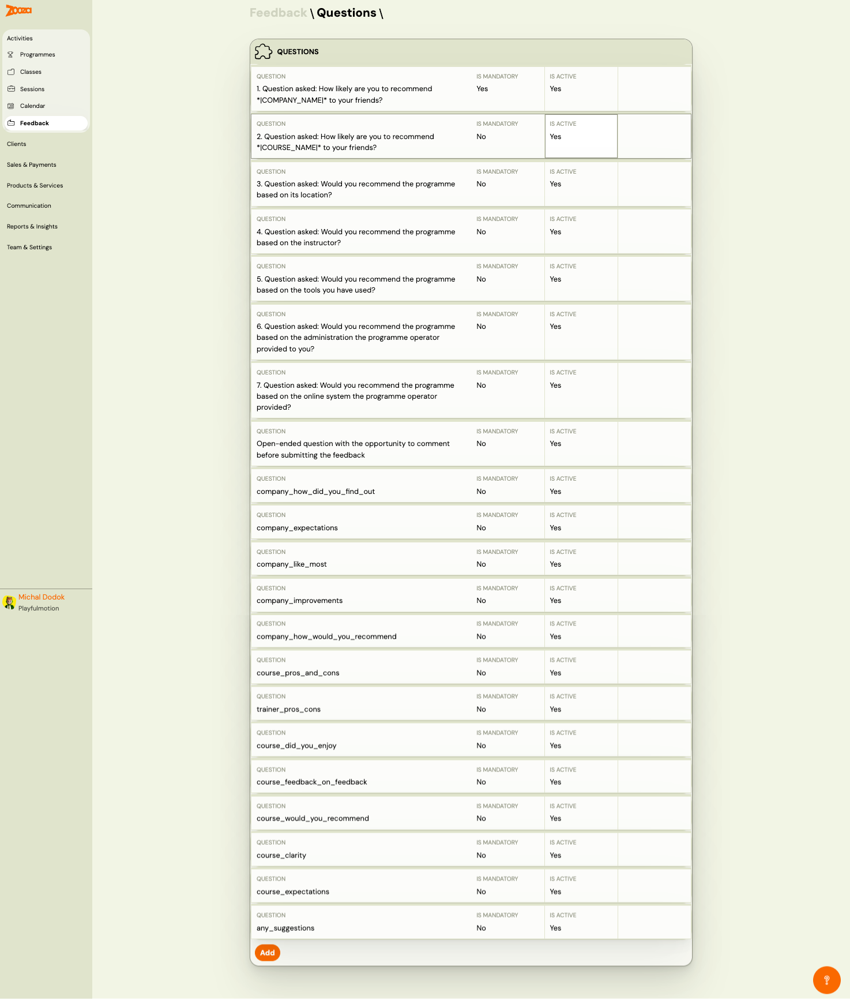
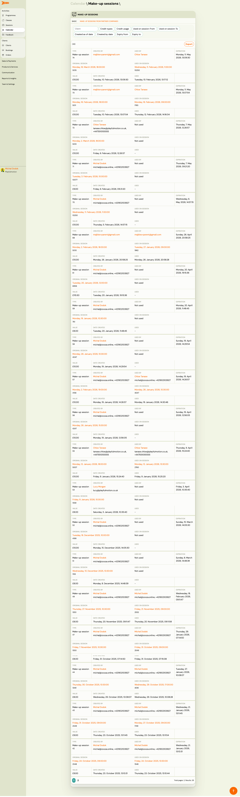

# Calendar

The Calendar provides a visual, location-based view of all sessions scheduled for a given day. It shows sessions as time blocks with attendee lists and attendance status, making it ideal for managing a busy venue with multiple classes running in parallel.

> **Navigation:** Go to **Activities** → **Calendar**.

## Daily Overview

The main calendar view shows a daily timeline grouped by location.

### Filters

| Filter | Description |
|---|---|
| `Date` | Select the date to view (e.g., "2026-02-17"). |
| `Location` | Filter by venue (e.g., "Dulwich Village Hall, SE21 7BT"). |
| `Attendance` | Filter by attendance status. |
| `Attendance type` | Filter by type of attendance record. |
| **Legend** | Expandable legend explaining the colour codes and icons. |

### Timeline

The calendar displays a horizontal timeline with hourly columns (07:00, 08:00, ..., 14:00, etc.). Each location row shows sessions as blocks at their scheduled time.

Each session block shows:

| Element | Description |
|---|---|
| Class name and time | E.g., "Trial Capacity, 10:00 To be decided" or "Tuesday, 13:30 Taylor Ben". |
| Attendee list | Names of enrolled clients with attendance icons. |
| Attendance icons | Colour-coded checkmarks: green = attended, orange = pending, question mark = unknown. |
| **Go to the session** | Link to the full session detail page. |

## Feedback Questions

The Feedback section manages the survey questions sent to clients for programme feedback.

> **Navigation:** Go to **Activities** → **Feedback**.

### Questions List

Each question row shows:

| Column | Description |
|---|---|
| `Question` | The question text (e.g., "How likely are you to recommend *|COMPANY_NAME|* to your friends?"). |
| `Is mandatory` | Whether the question must be answered (Yes/No). |
| `Is active` | Whether the question is currently included in feedback forms (Yes/No). |

### Default Questions

Zooza provides a set of pre-configured feedback questions:

1. **NPS — company**: "How likely are you to recommend *|COMPANY_NAME|* to your friends?"
2. **NPS — programme**: "How likely are you to recommend *|COURSE_NAME|* to your friends?"
3. **Location**: "Would you recommend the programme based on its location?"
4. **Instructor**: "Would you recommend the programme based on the instructor?"
5. **Tools**: "Would you recommend the programme based on the tools you have used?"
6. **Administration**: "Would you recommend the programme based on the administration?"
7. **Online system**: "Would you recommend the programme based on the online system?"
8. **Open-ended comment**: Free-text comment before submitting.

### Custom Questions

Additional questions using internal identifiers (e.g., `company_how_did_you_find_out`, `company_expectations`, `company_like_most`, `company_improvements`, `course_pros_and_cons`, `trainer_pros_cons`, `course_did_you_enjoy`, etc.).

Click **Add** to create a new feedback question.

## Make-up Sessions Overview

The make-up sessions management view shows all pending and completed make-up session requests.

This view provides a centralized list of make-up sessions across all programmes and classes, allowing admins to track, approve, and manage replacement sessions.

## Related

- [Sessions List](sessions-list.md) — chronological list of all sessions.
- [Class Detail](class-detail.md) — managing a single class.
- [Attendance and Catch-ups FAQ](../faq/attendance-and-catchups-faq.md) — marking attendance, catch-up flow.
