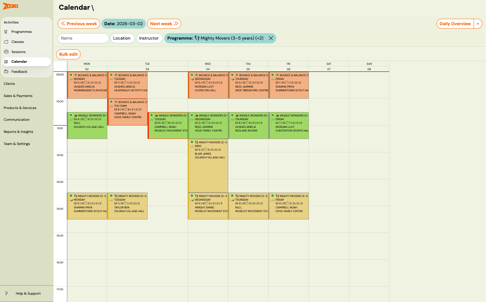
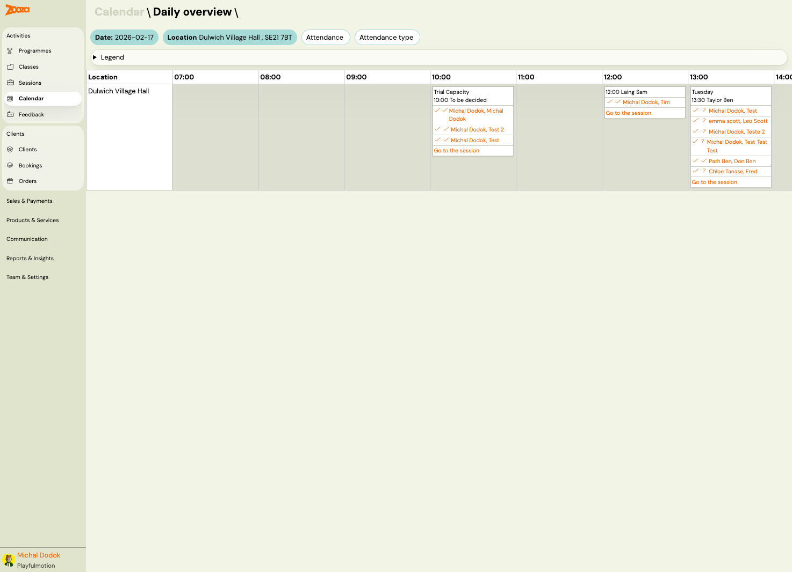
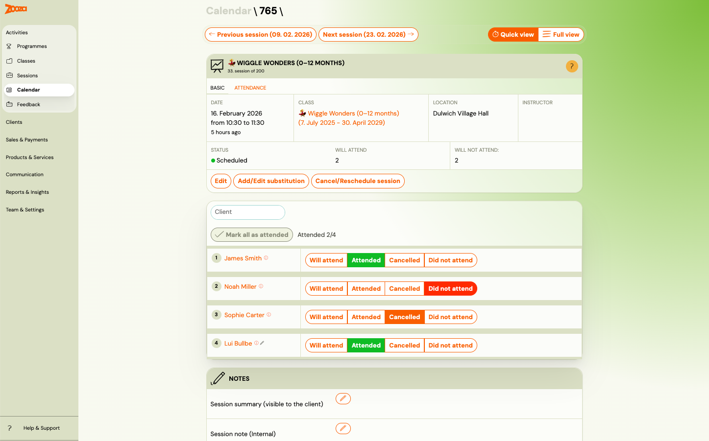
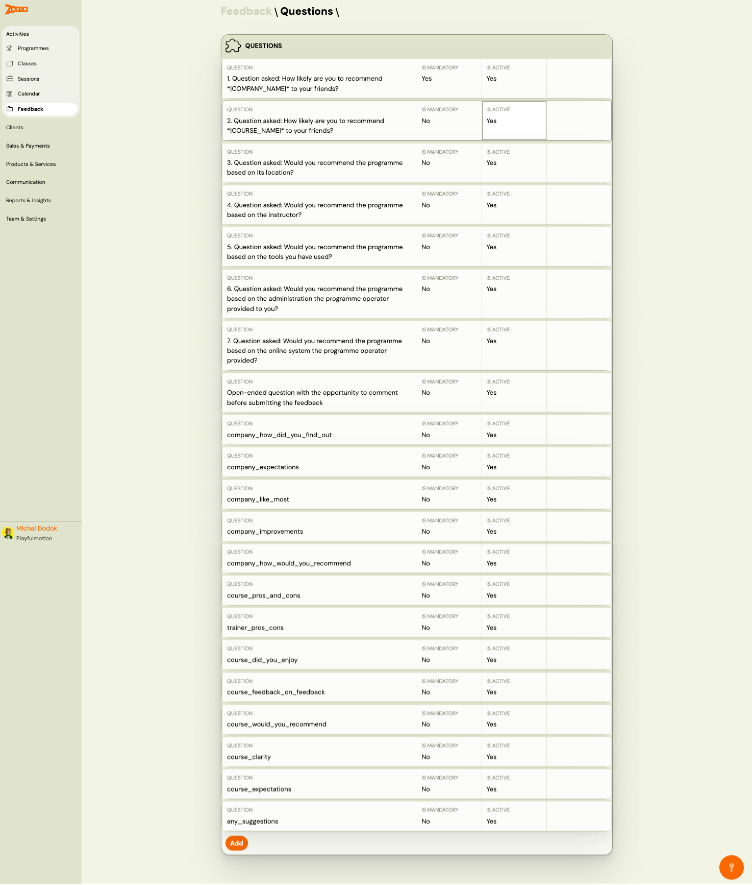
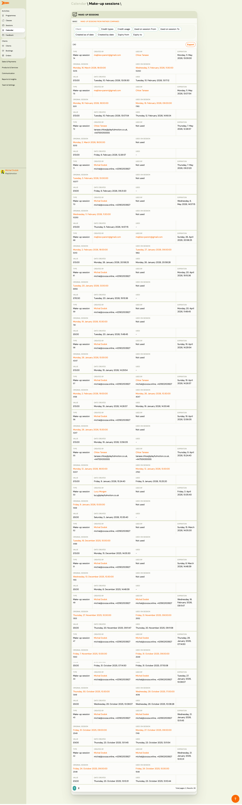

# Calendar

The Calendar provides a visual, location-based view of all sessions scheduled for a given day. It shows sessions as time blocks with attendee lists and attendance status, making it ideal for managing a busy venue with multiple classes running in parallel.

> **Navigation:** Go to **Activities** → **Calendar**.

## Daily Overview

The main calendar view shows a daily timeline grouped by location.

### Filters

| Filter | Description |
|---|---|
| `Date` | Select the date to view (e.g., "2026-02-17"). |
| `Location` | Filter by venue (e.g., "Dulwich Village Hall, SE21 7BT"). |
| `Attendance` | Filter by attendance status. |
| `Attendance type` | Filter by type of attendance record. |
| **Legend** | Expandable legend explaining the colour codes and icons. |

> **The Name filter searches clients, not instructors.** This is the most common cause of "the instructor's calendar is empty". Typing an instructor's name there filters for a *parent or child* of that name, finds nobody, and empties the calendar — with no error, because the filter did exactly what it was asked.
>
> To see one instructor's schedule, use the **Instructor** filter instead.
>
> If a calendar looks empty and the sessions definitely exist, clear every filter first and add them back one at a time. It is faster than checking the sessions.

### Timeline

The calendar displays a horizontal timeline with hourly columns (07:00, 08:00, ..., 14:00, etc.). Each location row shows sessions as blocks at their scheduled time.

Each session block shows:

| Element | Description |
|---|---|
| Class name and time | E.g., "Trial Capacity, 10:00 To be decided" or "Tuesday, 13:30 Taylor Ben". |
| Attendee list | Names of enrolled clients with attendance icons. |
| Attendance icons | Colour-coded checkmarks: green = attended, orange = pending, question mark = unknown. |
| **Go to the session** | Link to the full session detail page. |

### Session detail — attendance views

When you open a session from the calendar, the attendance panel offers two views (toggle in the top right):

| View | What it shows |
|---|---|
| **Quick view** | Simplified list with attendance buttons (Will attend, Attended, Cancelled, Did not attend), **Mark all as attended** button, and attended count (e.g. "Attended 3/5"). |
| **Full view** | Everything from Quick view plus make-up session selection, cancellation reasons, attendance notes, and replacement credit management. |

Use **Quick view** for fast daily attendance. Switch to **Full view** when you need to manage make-up sessions or record details.

## Feedback Questions

The Feedback section manages the survey questions sent to clients for programme feedback.

> **Navigation:** Go to **Activities** → **Feedback**.

### Questions List

Each question row shows:

| Column | Description |
|---|---|
| `Question` | The question text (e.g., "How likely are you to recommend *|COMPANY_NAME|* to your friends?"). |
| `Is mandatory` | Whether the question must be answered (Yes/No). |
| `Is active` | Whether the question is currently included in feedback forms (Yes/No). |

### Default Questions

Zooza provides a set of pre-configured feedback questions:

1. **NPS — company**: "How likely are you to recommend *|COMPANY_NAME|* to your friends?"
2. **NPS — programme**: "How likely are you to recommend *|COURSE_NAME|* to your friends?"
3. **Location**: "Would you recommend the programme based on its location?"
4. **Instructor**: "Would you recommend the programme based on the instructor?"
5. **Tools**: "Would you recommend the programme based on the tools you have used?"
6. **Administration**: "Would you recommend the programme based on the administration?"
7. **Online system**: "Would you recommend the programme based on the online system?"
8. **Open-ended comment**: Free-text comment before submitting.

### Custom Questions

Additional questions using internal identifiers (e.g., `company_how_did_you_find_out`, `company_expectations`, `company_like_most`, `company_improvements`, `course_pros_and_cons`, `trainer_pros_cons`, `course_did_you_enjoy`, etc.).

Click **Add** to create a new feedback question.

## Make-up Sessions Overview

The make-up sessions management view shows all pending and completed make-up session requests.

This view provides a centralized list of make-up sessions across all programmes and classes, allowing admins to track, approve, and manage make-up sessions.

> **Note:** Make-up sessions are also accessible under **Reports & Insights → Reports → Sessions → Make-up sessions**.

## Printable Calendar (PDF Export)

> **Permission required:** Owner role

The **Print version** control on the calendar (owner-only) opens a print dialog where you choose layouts and locations before downloading a PDF.

### Layouts

Select one or more layouts. All selected layouts are combined into a single PDF, in the order you pick them.

| Layout | What it shows |
|---|---|
| **Week per room** | One section per room, sessions arranged across the week. Ideal for multi-room venues. |
| **Board** | Board-style weekly overview — all sessions across the week in a compact grid. |
| **Per day** | One section per day, with all sessions for that day listed under it. |
| **Compact** | Condensed, text-heavy layout for printing on limited paper or sharing digitally. |

### Location and room scope

After choosing layouts, select which locations and rooms to include. By default, the selection matches the location filter you had active on the calendar. You can widen or narrow it before downloading.

- Tick a **location** to include all its rooms.
- Tick individual **rooms** to include only those rooms from that location.
- Roomless locations appear as a single selectable item.

Your layout and scope choice is remembered per user and company, so the dialog reopens with your last selection.

### Generating the PDF

Click **Download** in the dialog. Zooza generates a single PDF containing all selected layouts for the current week. A "Generating PDF…" notice appears while the server renders it.

## Related

- [Sessions List](sessions-list.md) — chronological list of all sessions.
- [Class Detail](class-detail.md) — managing a single class.
- [Attendance and Catch-ups FAQ](../faq/attendance-and-catchups-faq.md) — marking attendance, catch-up flow.
