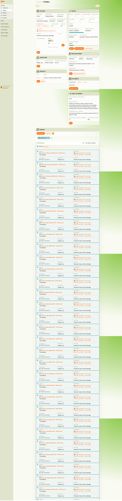
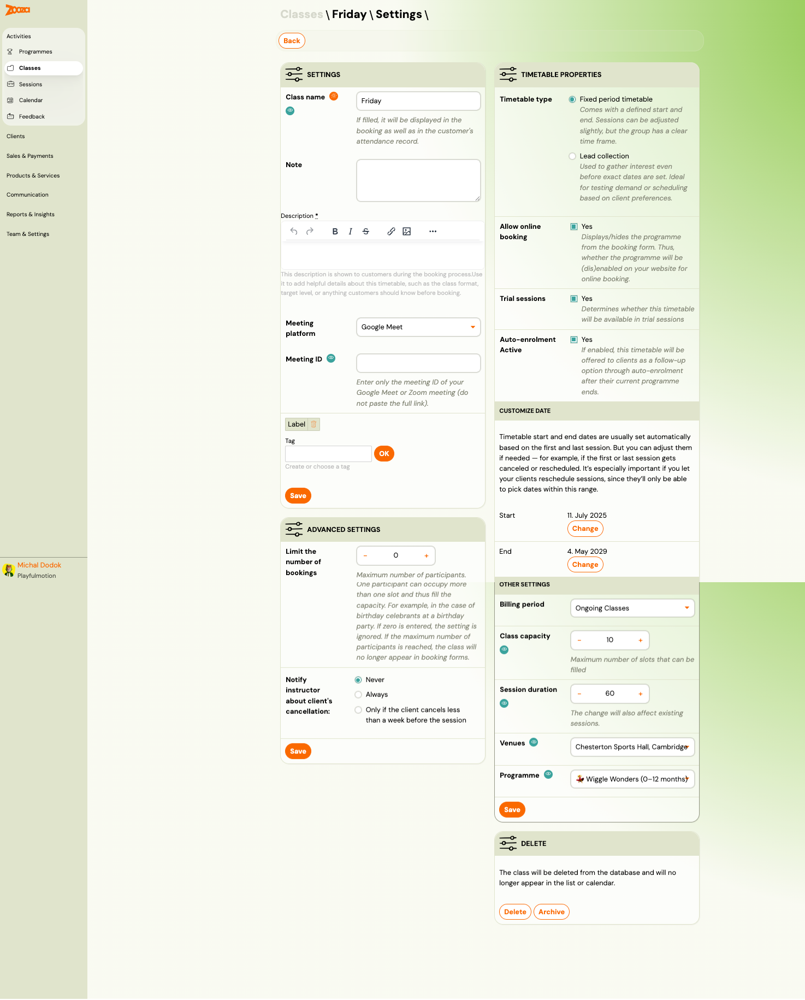
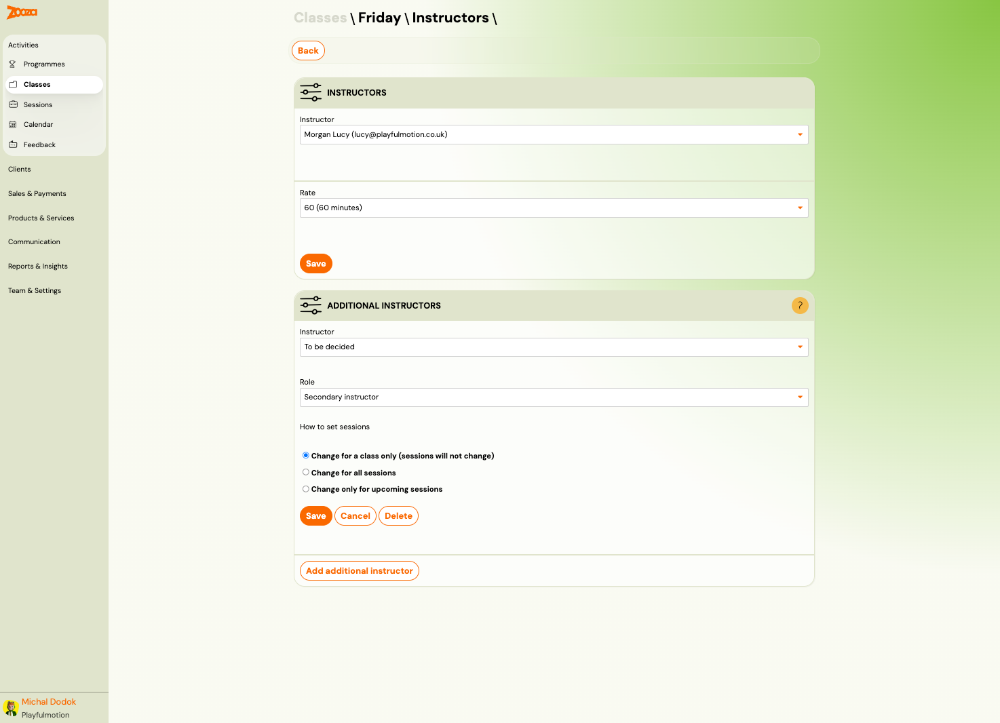
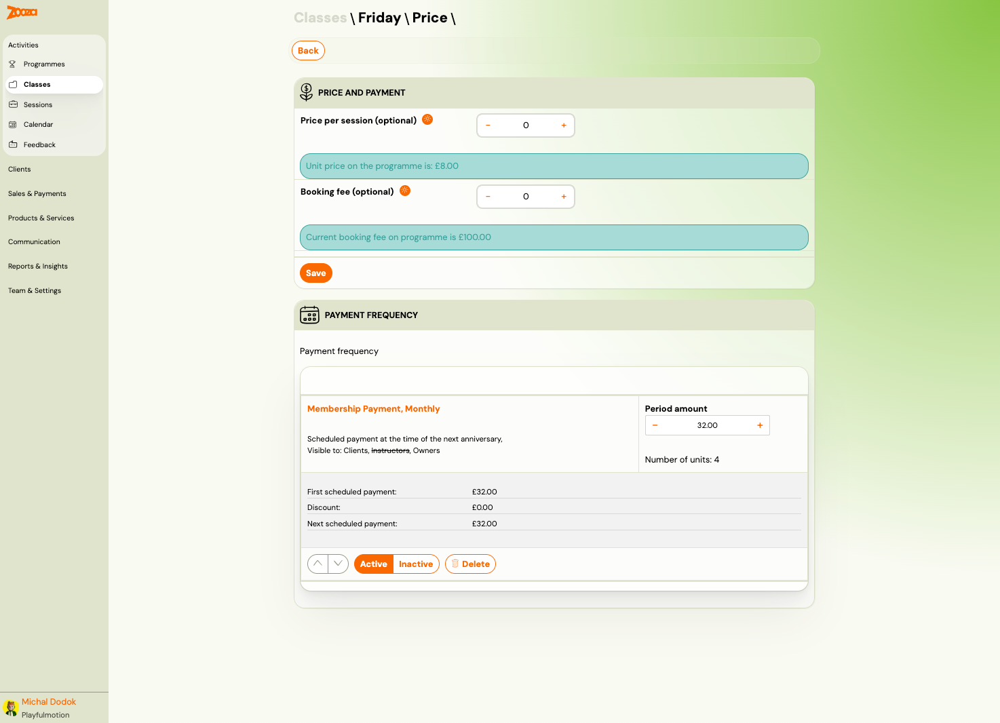
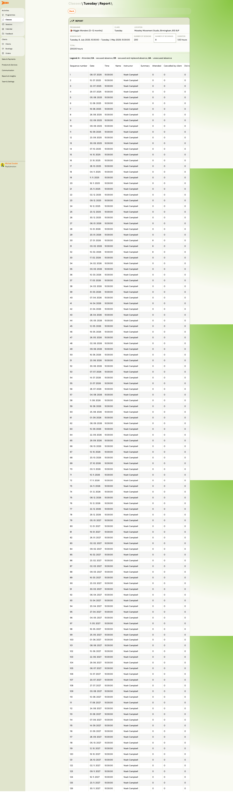

# Class Detail

The Class Detail page is the central hub for managing a single timetable. It shows settings, instructors, products, pricing, documents, make-up sessions, and the full list of sessions with attendance data.

> **Navigation:** Go to **Activities** → **Classes** → click a class name. Or from **Programmes** → select a programme → click a class.

## Overview Tabs

The class detail page is organized into sections accessible from the top of the page:

| Section | Description |
|---|---|
| **Settings** | Class name, timetable type, venue, capacity, dates, billing period, and advanced settings. |
| **Instructors** | Primary and additional instructors with roles and rate. |
| **Products** | Products linked to this class (e.g., merchandise, kits). |
| **Price and Payment** | Per-session price, booking fee, and payment frequency/plans. |
| **Documents** | Documents attached to the class. |
| **Make-up Sessions** | Make-up session configuration and rules for this class. |
| **Videos** | Video content linked to the class. |
| **Report** | Session-by-session attendance report. |
| **Sessions** | Full list of all sessions with date, status, and actions. |

## Settings

The settings section has two columns: general settings on the left and timetable properties on the right.

### General Settings

| Field | Description |
|---|---|
| `Class name` | Display name (shown in bookings and attendance records). |
| `Note` | Internal note (not visible to clients). |
| `Description` | Rich-text description shown to clients during booking. Use it for class format, age range, or other details. |
| `Meeting platform` | Online meeting tool (e.g., Google Meet, Zoom). |
| `Meeting ID` | Meeting room ID (not the full link). |
| `Label` | Custom label badge. |
| `Tag` | Categorization tag. |

### Timetable Properties

| Field | Description |
|---|---|
| `Timetable type` | **Fixed period timetable** — defined start/end. **Lead collection** — interest gathering. |
| `Allow online booking` | Shows/hides this class on the booking form. |
| `Trial sessions` | Whether this timetable is available for trial sessions. |
| `Auto-enrolment Active` | Whether this timetable is offered via auto-enrolment. |

### Customize Date

| Field | Description |
|---|---|
| `Start` | First session date. Click **Change** to adjust. |
| `End` | Last session date. Click **Change** to adjust. |

> Timetable dates are set automatically from the first and last session but can be adjusted manually. This is important if you allow rescheduling — clients can only pick dates within this range.

### Other Settings

| Field | Description |
|---|---|
| `Billing period` | Payment grouping for this class (e.g., "Ongoing Classes"). |
| `Class capacity` | Maximum number of participants. |
| `Session duration` | Duration in minutes (affects all existing sessions). |
| `Venues` | Assigned venue. |
| `Programme` | Parent programme (read-only reference). |

### Advanced Settings

| Field | Description |
|---|---|
| `Limit the number of bookings` | Max participants (0 = unlimited). One person can occupy more than one slot. |
| `Notify instructor about client's cancellation` | **Never**, **Always**, or **Only if the client cancels less than a week before the session**. |

### Delete Section

- **Delete** — permanently removes the class from the database.
- **Archive** — hides the class from lists and calendar but keeps the data.

## Instructors

Manage the primary instructor and any additional instructors for the class.

### Primary Instructor

| Field | Description |
|---|---|
| `Instructor` | Select from the instructor list. |
| `Rate` | Pay rate (e.g., "60 (60 minutes)"). |

### Additional Instructors

| Field | Description |
|---|---|
| `Instructor` | Select an additional instructor. |
| `Role` | **Secondary instructor** or other roles. |
| `How to set sessions` | **Change for a class only** (sessions unchanged), **Change for all sessions**, or **Change only for upcoming sessions**. |

Click **Add additional instructor** to assign more instructors.

## Price and Payment

Override programme-level pricing at the class level.

### Price and Payment

| Field | Description |
|---|---|
| `Price per session (optional)` | Override the programme unit price for this class. |
| `Booking fee (optional)` | Override the programme booking fee for this class. |

Info banners show the current programme-level prices for reference.

### Payment Frequency

Shows the active payment plan for the class:

| Field | Description |
|---|---|
| `Payment plan name` | E.g., "Membership Payment, Monthly". |
| `Period amount` | Amount per payment period. |
| `Number of units` | Number of periods in the plan. |
| `First scheduled payment` / `Discount` / `Next scheduled payment` | Financial details. |
| `Visible to` | Who can see the plan (Clients, Instructors, Owners). |

Payment plans can be reordered, activated, deactivated, or deleted.

## Report

Session-by-session attendance and financial report for the class.

The report shows:

| Column | Description |
|---|---|
| `Sequence number` | Session number (1, 2, 3, ...). |
| `Date` | Session date. |
| `Time` | Session start time. |
| `Name` | Instructor name. |
| `Instructor` | Instructor name (confirmed). |
| `Summary` | Attendance summary count. |
| `Attended` | Number who attended. |
| `Cancelled by client` | Client cancellations. |
| `Absence count` | Unexcused absences. |

The report header shows the class name, programme, day, location, date range, and total hours.

## Sessions

The sessions list shows every scheduled session for the class.

Each session row shows:
- Date, day, and time range (e.g., "Friday, 13. February 2026, 10:00 – 11:00")
- Status indicator (colour-coded: green = scheduled, orange = in progress)
- Programme name and date range
- Instructor name and venue
- **Detail** and **Bulk edit** action buttons

### Session Actions

| Button | Description |
|---|---|
| **Add sessions** | Add new sessions to the class. |
| **Colourize** | Toggle colour coding on sessions. |
| **Filter by date** | Filter the session list by date. |
| **Choose all** | Select all sessions for bulk operations. |
| **Bulk edit** | Edit multiple sessions at once (e.g., change time, instructor). |

Sessions can be sorted by date (ascending/descending).

## Related

- [Classes List](classes-list.md) — the cross-programme classes view.
- [Sessions List](sessions-list.md) — global sessions view.
- [Change Instructor Guide](../guides/change-instructor.md) — how to reassign instructors.
- [Edit Sessions in Programmes Guide](../guides/edit-events-in-courses.md) — modifying sessions.
- [Attendance and Catch-ups FAQ](../faq/attendance-and-catchups-faq.md) — marking attendance, catch-up flow.
