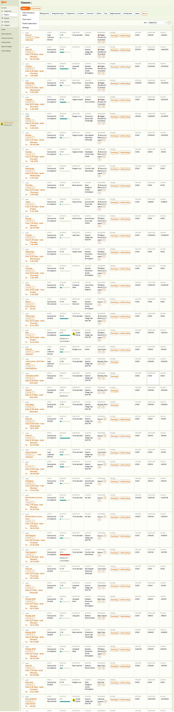

# Classes List

The Classes screen shows all timetables (classes) across all programmes in a single, filterable table. Use it to get a cross-programme view of your schedule, occupancy, financials, and instructors.

> **Navigation:** Go to **Activities** → **Classes**.

## List View

The table supports two export options at the top: **Export** (standard) and **Fixed export** (predefined format). A **Product sales report** link is also available.

### Filters

| Filter | Description |
|---|---|
| `Name` | Free-text search by class name. |
| `Billing period` | Filter by billing period (e.g., "Ongoing Classes"). |
| `Programme type` | Filter by programme structure. |
| `Programme` | Filter by specific programme. |
| `Location` | Filter by venue. |
| `Instructor` | Filter by assigned instructor. |
| `Status` | Filter by class status (in progress, scheduled, ended). |
| `Day` | Filter by day of week. |
| `Beginning date` / `Ending date` | Filter by date range. |
| `Labels` | Filter by programme labels. |
| `Search` | Apply the selected filters. |

### Table Columns

| Column | Description |
|---|---|
| `Name` | Class name (clickable — opens class detail). Includes **Copy link** button and status indicator. |
| `Date range` | Start and end dates with day-of-week and time. |
| `Billing period` | Payment grouping (e.g., "Ongoing Classes"). |
| `Programme type` | "Fixed period" / "Lead collection" + status ("in progress", "Scheduled"). |
| `Programme` | Parent programme name. |
| `Location` | Venue name and address. |
| `Instructor` | Assigned instructor. |
| `Status` | Occupancy indicator (e.g., coloured bar). |
| `Day` | Day of the week. |
| `Registrations` | Number of active bookings (highlighted in orange if near capacity). |
| `Actions` | **Bookings** and **Add booking** buttons. |
| Financial columns | `Paid debt`, `Issued debt`, `Balance` — payment totals for the class. |

The total number of records is shown above the table. Results can be sorted by various columns.

## Related

- [Class Detail](class-detail.md) — the detail view for a single class.
- [Programmes List](programmes-list.md) — managing programmes and their classes.
- [Course Group Lesson Definition Guide](../guides/course-group-lesson-definition.md) — how to set up class structures.
