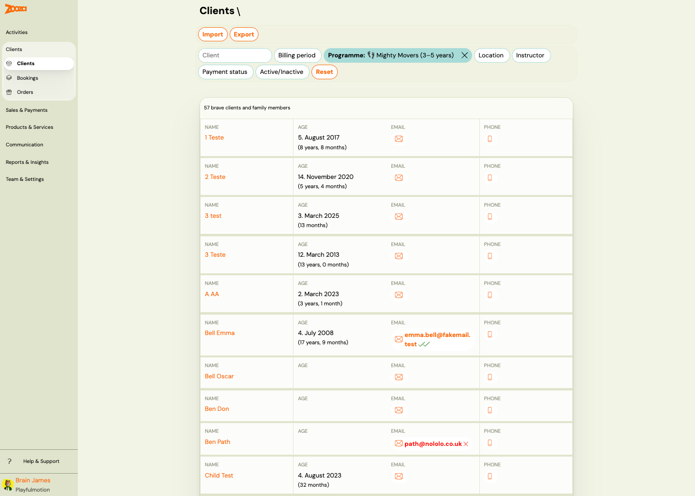
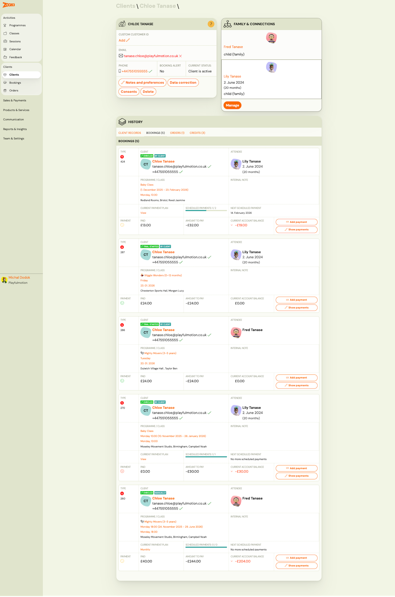
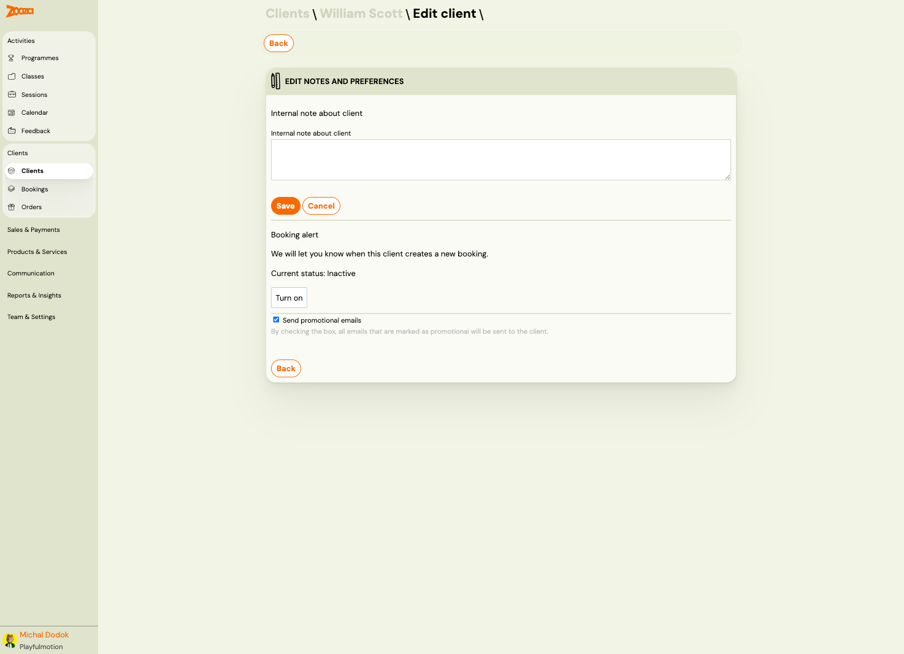
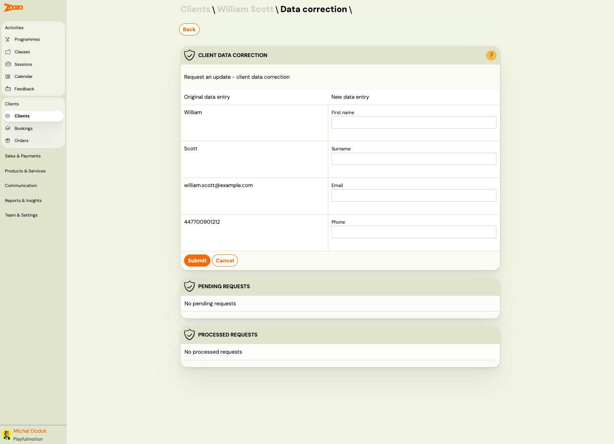
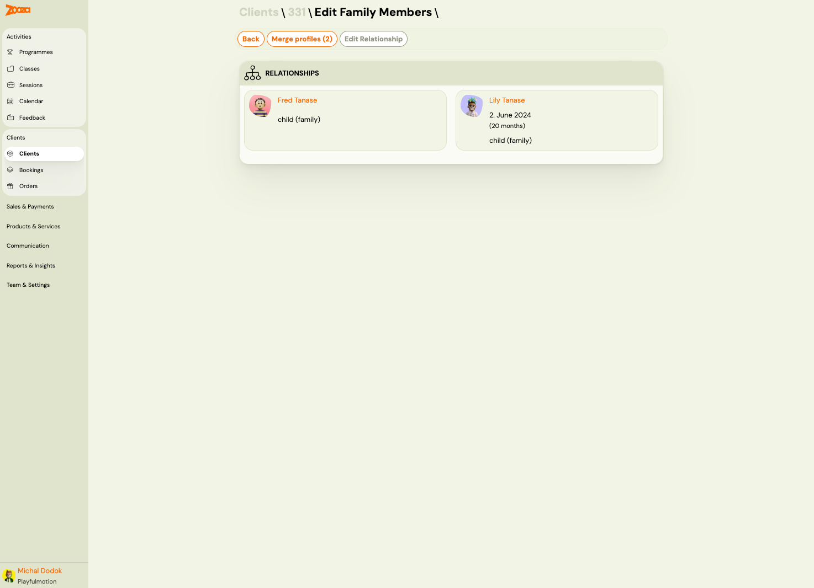
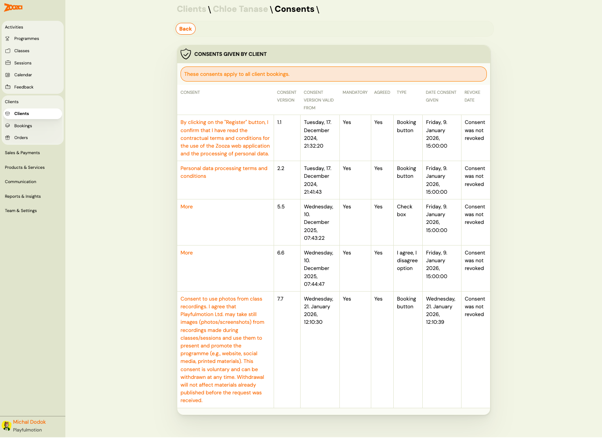
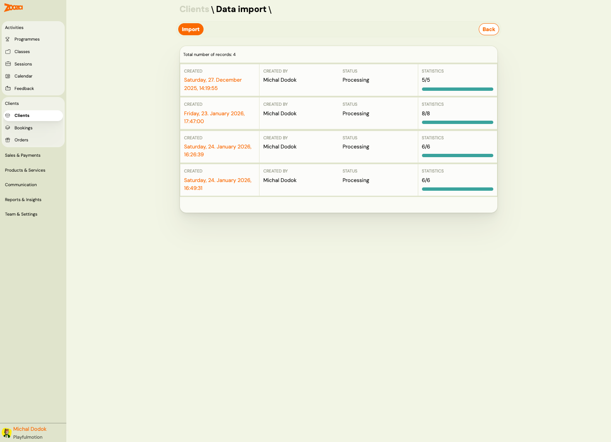
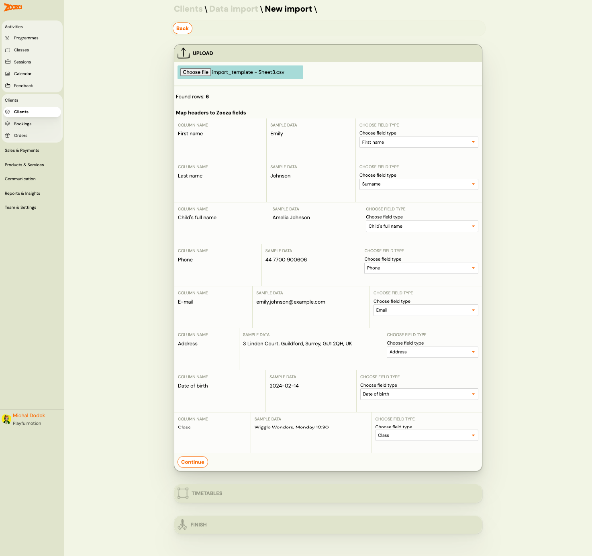
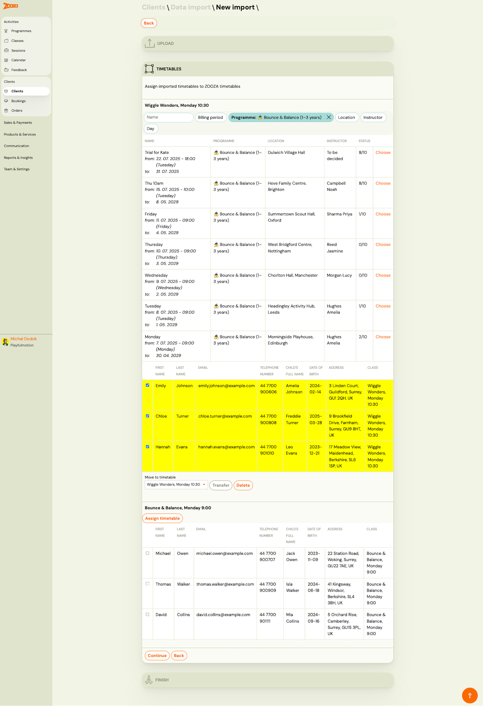
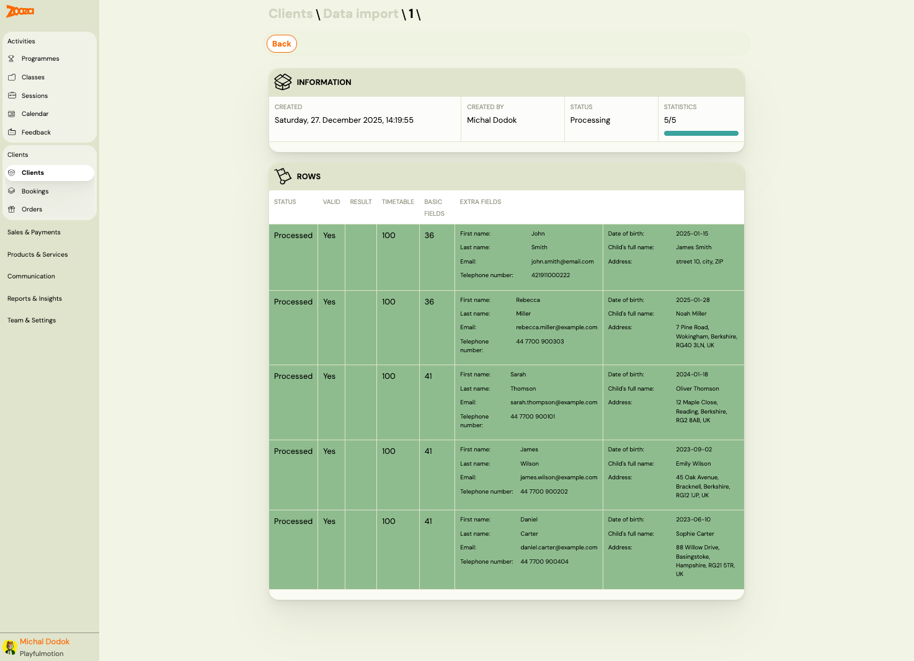

# Clients

The Clients screen is the central directory for managing all client and family member records. It lists every client in your account and provides quick access to contact details, bookings, orders, and credits.

> **Navigation:** Go to **Clients** → **Clients**.

## List View

The list shows all clients and family members. Each row displays:

| Column | Description |
|---|---|
| `Name` | Client or family member name (clickable link to detail). |
| `Age` | Date of birth and calculated age in parentheses. |
| `Email` | Email icon — indicates whether an email address is on file. |
| `Phone` | Phone icon — indicates whether a phone number is on file. |

The header shows the total count, e.g. "106 the best clients and family members".

### Filters

Use the filter bar at the top to narrow the list:

- **Client** — free-text search by name.
- **Billing period** — filter by billing period.
- **Programme** — filter by programme (shows active filter as a highlighted chip).
- **Location** — filter by venue.
- **Instructor** — filter by assigned instructor.
- **Billing** — filter by billing status.
- **Active/Inactive** — filter by client status.
- **Reset** — clears all active filters.

### Top Actions

| Button | Description |
|---|---|
| **Import** | Opens the data import wizard (see [Data Import](#data-import) below). |
| **Export** | Exports the client list. |

## Client Detail (Adult)

Click a client name to open their detail page.

### Contact Card

The top-left card shows the client's key information:

| Field | Description |
|---|---|
| `Custom customer ID` | Optional custom identifier. Click **Add** to set one. |
| `Email` | Email address with a verification tick. |
| `Phone` | Phone number with a verification tick. |
| `Booking alert` | Whether you receive alerts when this client books. Shows "Yes" or "No". |
| `Current status` | "Client is active" or "Client is inactive". |

### Action Buttons

Below the contact card:

- **Notes and preferences** — opens the notes and preferences editor (see [Edit Notes and Preferences](#edit-notes-and-preferences)).
- **Data correction** — opens the data correction request form (see [Data Correction](#data-correction)).
- **Consents** — shows all consents given by this client (see [Consents](#consents)).
- **Delete** — permanently deletes the client. Shows a confirmation dialog with checkbox "I understand that this deletion is permanent and cannot be undone."

### Family & Connections

The top-right card shows linked family members:

- Each family member displays their name, date of birth, age, and relationship type (e.g. "child (family)").
- Click **Manage** to edit family relationships (see [Edit Family Members](#edit-family-members)).

### History

The lower section has four tabs:

| Tab | Description |
|---|---|
| **Client Records** | Communication records for this client. Includes a search bar, filters for `Created by` and `Type`, and a **New message** button. |
| **Bookings** | All bookings associated with this client, showing count in parentheses. |
| **Orders** | Orders placed by this client. |
| **Credits** | Credit entries for this client. |

#### Bookings Tab (in Client Detail)

Each booking card in the client detail shows:

| Field | Description |
|---|---|
| `Type` | Booking number and status badges (e.g. "Enrolled", "Imported", "Trial started", "Manually"). |
| `Client` | Client name, email, and phone with verification ticks. |
| `Attendee` | The person attending (may be a child/family member). |
| `Programme / Class` | Programme name, class name, date range, day/time, and location with instructor. |
| `Internal note` | Optional internal note for this booking. |
| `Current payment plan` | Link to view the active payment plan, with scheduled payments progress bar. |
| `Next scheduled payment` | Date of the next upcoming payment. |
| `Payment` | Payment status icon (green = paid, red = overdue). |
| `Paid` | Total amount paid. |
| `Amount to pay` | Outstanding amount (negative = amount owed). |
| `Current account balance` | Running balance for this client. |

Each booking has **Add payment** and **Show payments** action buttons.

## Client Detail (Child / Family Member)

A child record shows a simplified contact card:

| Field | Description |
|---|---|
| `Age` | Date of birth and calculated age. |
| `Email` | Email icon (usually empty for children). |
| `Phone` | Phone icon (usually empty for children). |

Action buttons are **Edit** and **Delete** (instead of Notes/Data correction/Consents).

The Family & Connections card shows the parent/guardian link.

## Edit Notes and Preferences

> **Navigation:** Client detail → **Notes and preferences**.

| Field | Description |
|---|---|
| `Internal note about client` | Free-text note visible only to staff. |
| `Booking alert` | Toggle notification when this client creates a new booking. Shows current status ("Inactive"). Click **Turn on** to enable. |
| `Send promotional emails` | Checkbox — when checked, promotional emails are sent to this client. |

Click **Save** to apply changes, or **Cancel** / **Back** to discard.

## Data Correction

> **Navigation:** Client detail → **Data correction**.

The data correction screen lets you request changes to client contact details. This is useful when GDPR or data handling policies require a formal update process.

| Column | Description |
|---|---|
| `Original data entry` | Current value (read-only). |
| `New data entry` | Field to enter the corrected value. |

Fields available for correction:

- `First name`
- `Surname`
- `Email`
- `Phone`

Click **Submit** to create a data correction request, or **Cancel** to discard.

Below the form, two sections track request history:

- **Pending Requests** — requests awaiting processing.
- **Processed Requests** — completed correction requests.

## Edit Family Members

> **Navigation:** Client detail → Family & Connections → **Manage**.

The family members screen shows all relationships for a client.

### Relationships

Each family member card displays:

- Name (clickable link to their profile).
- Photo/avatar.
- Date of birth and age (for children).
- Relationship type (e.g. "child (family)").

### Top Actions

| Button | Description |
|---|---|
| **Back** | Returns to the client detail. |
| **Merge profiles** | Merges duplicate profiles. Shows count of selected profiles in parentheses. |
| **Edit Relationship** | Opens the relationship editor to change or add connections. |

## Consents

> **Navigation:** Client detail → **Consents**.

Shows all consents given by the client. A notice at the top reads: "These consents apply to all client bookings."

| Column | Description |
|---|---|
| `Consent` | Consent text or link (e.g. terms and conditions, photo consent). |
| `Consent version` | Version number of the consent document. |
| `Consent version valid from` | Date when this consent version became active. |
| `Mandatory` | "Yes" or "No" — whether the consent is required. |
| `Agreed` | "Yes" or "No" — whether the client agreed. |
| `Type` | How the consent was collected — "Booking button", "Check box", or "I agree, I disagree option". |
| `Date consent given` | Timestamp when consent was recorded. |
| `Revoke date` | "Consent was not revoked" or the revocation date. |

## Data Import

> **Navigation:** **Clients** → **Import** (or **Clients** → **Data import**).

### Import List

The data import list shows all previous imports with:

| Column | Description |
|---|---|
| `Created` | Date and time of the import. |
| `Created by` | User who initiated the import. |
| `Status` | Processing status (e.g. "Processing"). |
| `Statistics` | Progress indicator — processed rows vs. total (e.g. "5/5") with a progress bar. |

Click **Import** to start a new import, or click a row to view details.

### New Import — Step 1: Upload & Map Fields

1. Click **Choose file** to upload a CSV file.
2. The system detects columns and shows sample data.
3. For each column, select the matching Zooza field type from the dropdown:
   - `First name`, `Surname`, `Child's full name`, `Phone`, `Email`, `Address`, `Date of birth`, `Class`, and more.
4. Click **Continue** to proceed.

### New Import — Step 2: Assign Timetables

After mapping fields, assign imported clients to timetables:

1. The system classes clients by their `Class` value from the CSV.
2. For each class, a list of matching timetables is shown with filters for `Name`, `Billing period`, `Programme`, `Location`, `Instructor`, and `Day`.
3. Click **Choose** next to the target timetable to assign clients.
4. Selected clients appear in a highlighted table. Use checkboxes to select/deselect individual rows.
5. Use **Transfer** to move selected clients, or **Delete** to remove them.
6. Click **Continue** to proceed, or **Back** to return.

### Import Detail

The import detail shows:

- **Information** — created date, created by, status, and statistics.
- **Rows** — each imported row with columns:

| Column | Description |
|---|---|
| `Status` | "Processed", "Error", etc. |
| `Valid` | "Yes" or "No". |
| `Result` | Result code (e.g. 100 = success). |
| `Timetable` | Assigned timetable ID. |
| `Basic fields` | First name, last name, email, telephone number. |
| `Extra fields` | Date of birth, child's full name, address. |

## Related

- [Data Correction Guide](../guides/data-correction-change-client.md) — step-by-step guide to correcting client data.
- [Client Import Guide](../guides/client-import.md) — how to import clients from a CSV file.
- [Common Booking Scenarios](../faq/common-booking-scenarios.md) — FAQ for booking-related tasks.
