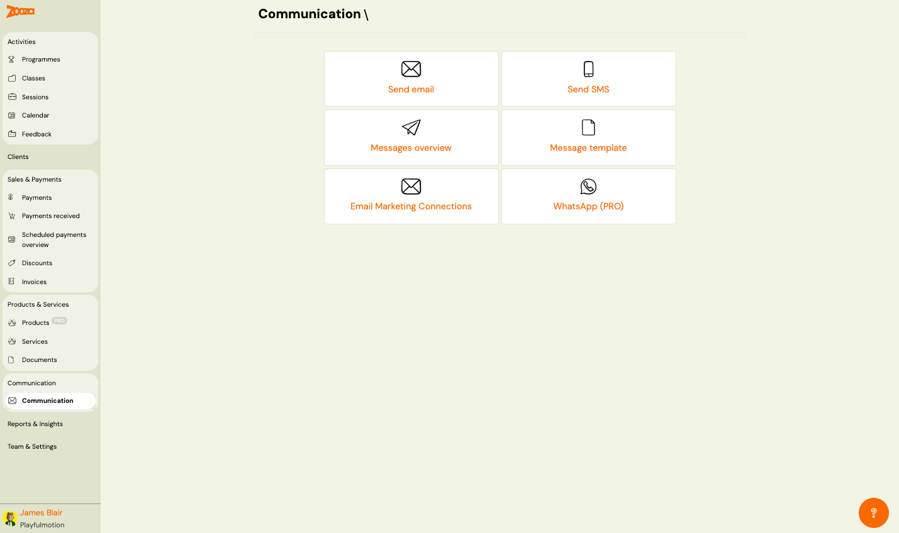
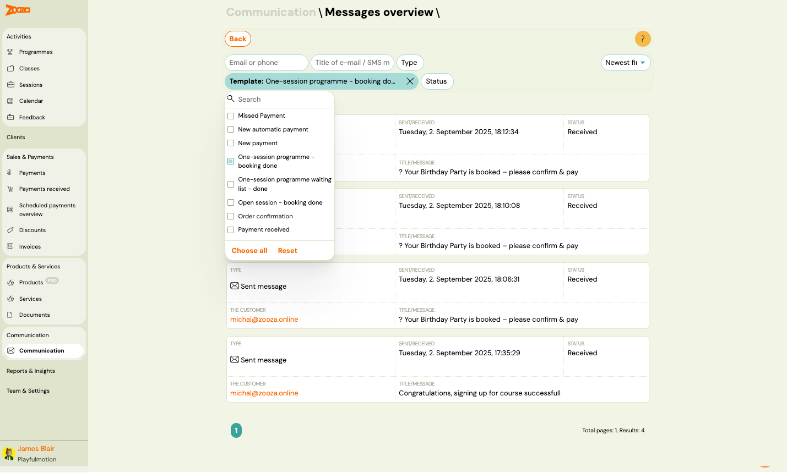

# Communication

The Communication screen is the central hub for all messaging features. Use it to send emails, SMS messages, manage templates, view message history, connect email marketing tools, and access WhatsApp messaging.

> **Navigation:** Go to **Communication** → **Communication**.

## Dashboard Tiles

The dashboard displays six navigation tiles:

| Tile | Description |
|---|---|
| **Send email** | Opens the [Send Email](communication-send-email.md) wizard to compose and send emails to clients. |
| **Send SMS** | Opens the SMS sending screen (similar workflow to Send Email). |
| **Messages overview** | Opens the [Messages Overview](#messages-overview) — a log of all sent and received messages. |
| **Message template** | Opens [Message Templates](communication-message-templates.md) — manage email and SMS templates for automated and manual messages. |
| **Email Marketing Connections** | Opens [Email Integrations](communication-email-integrations.md) — connect with Mailchimp or Ecomail. |
| **WhatsApp (PRO)** | Opens [WhatsApp](communication-whatsapp.md) — manage WhatsApp conversations and templates. Requires PRO plan. |

## Messages Overview

> **Navigation:** **Communication** → **Messages overview**.

### Filters

Use the filter bar at the top to narrow the message list:

- **Email or phone** — search by recipient email or phone number.
- **Title of e-mail / SMS m** — search by message subject or title.
- **Type** — dropdown filter by message type (e.g. "Sent message").
- **Template** — multi-select dropdown to filter by template used. Options include:
  - Missed Payment
  - New automatic payment
  - New payment
  - One-session programme – booking done
  - One-session programme waiting list – done
  - Open session – booking done
  - Order confirmation
  - Payment received
- **Status** — filter by delivery status.

Active filters show as highlighted chips with an X to remove. Use **Choose all** to select all types, or **Reset** to clear.

### Sort

- **Newest first** (default) — dropdown to change sort order.

### Message List

Each message card shows:

| Field | Description |
|---|---|
| `Type` | Message type with icon (e.g. "Sent message" with envelope icon). |
| `Sent/Received` | Timestamp of when the message was sent or received. |
| `Status` | Delivery status — "Received", "Sent", "Failed", etc. |
| `The customer` | Recipient email address (clickable link). |
| `Title/Message` | Subject line or message preview. |

Pagination shows total pages and results count.

## Related

- [Send Email Reference](communication-send-email.md) — compose and send emails.
- [Message Templates Reference](communication-message-templates.md) — manage message templates.
- [Email Integrations Reference](communication-email-integrations.md) — Mailchimp and Ecomail setup.
- [WhatsApp Reference](communication-whatsapp.md) — WhatsApp conversations and templates.
- [Message Templates Guide](../guides/message-templates.md) — how to create and use templates.
- [Sending Email/SMS Guide](../guides/sending-email-sms.md) — step-by-step sending instructions.
- [Email Communication FAQ](../faq/email-communication-faq.md) — common email questions.
