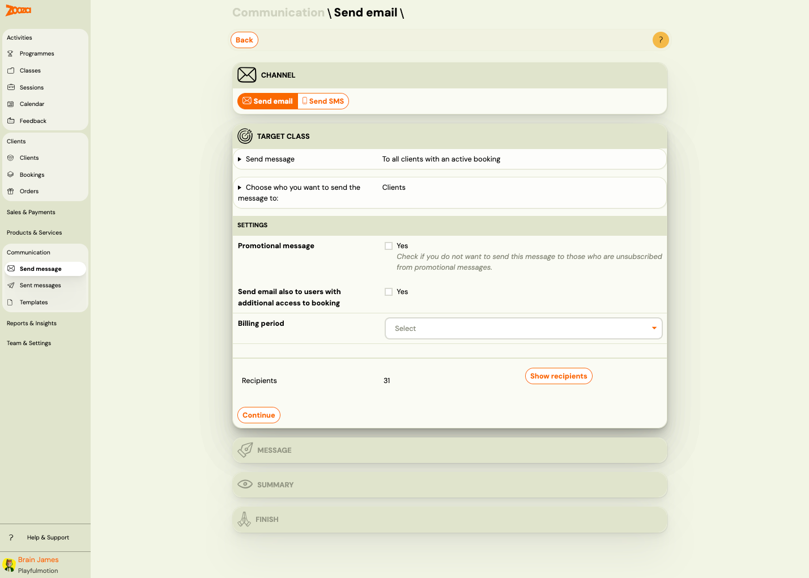

# Communication

The Communication section in the left menu gives direct access to all messaging features — no intermediate hub page. Each item opens its screen directly.

## Menu Items

| Menu item | Description |
|---|---|
| **Send message** | Compose and send an email or SMS to clients. Opens the [Send Message](communication-send-email.md) screen. |
| **Sent messages** | View the history of all sent and received messages. See [Sent Messages](#sent-messages) below. |
| **Templates** | Manage email and SMS templates for automated and manual messages. See [Message Templates](communication-message-templates.md). |

WhatsApp (PRO plan) and Email Marketing Connections are accessible from within the Send message screen or via Settings.

## Sent Messages

> **Navigation:** Go to **Communication** → **Sent messages**.

### Filters

| Filter | Description |
|---|---|
| **Email or phone** | Search by recipient email or phone number. |
| **Title of e-mail / SMS** | Search by message subject or title. |
| **Type** | Filter by message type (e.g. "Sent message"). |
| **Template** | Filter by template used (multi-select). |
| **Status** | Filter by delivery status. |

Active filters show as chips with an X to remove. Use **Reset** to clear all.

### Message List

Each message shows:

| Field | Description |
|---|---|
| `Type` | Message type with icon (e.g. "Sent message"). |
| `Sent/Received` | Timestamp. |
| `Status` | Delivery status — "Received", "Sent", "Failed", etc. |
| `The customer` | Recipient email address (clickable). |
| `Title/Message` | Subject line or message preview. |

## Related

- [Send Message Reference](communication-send-email.md) — compose and send emails or SMS.
- [Message Templates Reference](communication-message-templates.md) — manage templates.
- [Email Integrations Reference](communication-email-integrations.md) — Mailchimp and Ecomail setup.
- [WhatsApp Reference](communication-whatsapp.md) — WhatsApp conversations and templates.
- [Message Templates Guide](../guides/message-templates.md) — how to create and use templates.
- [Sending Email/SMS Guide](../guides/sending-email-sms.md) — step-by-step sending instructions.
- [Email Communication FAQ](../faq/email-communication-faq.md) — common email questions.
