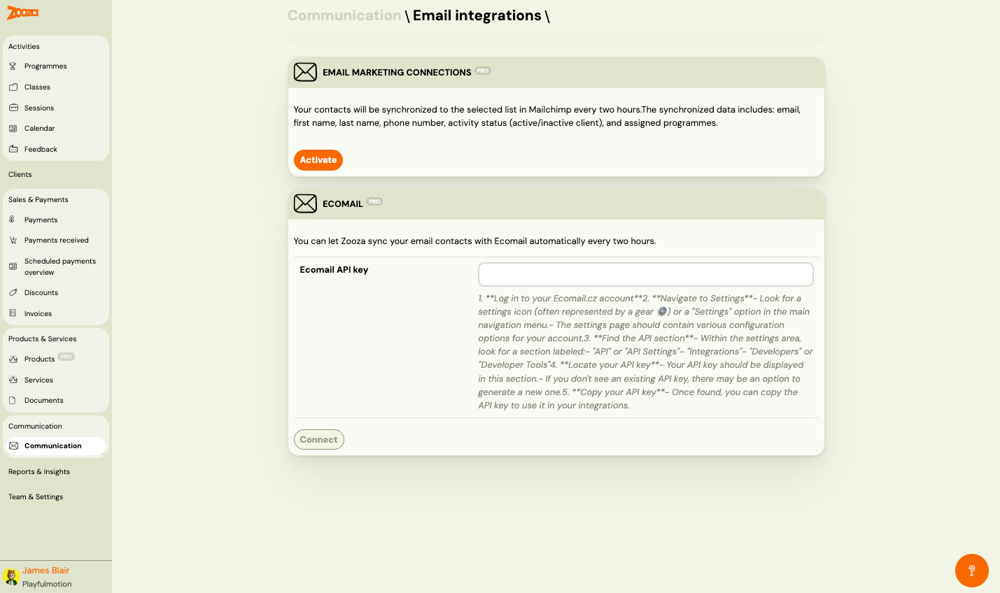

# Email Integrations

The Email Integrations screen connects Zooza with external email marketing platforms. Use it to sync your client contacts with Mailchimp or Ecomail for marketing campaigns.

> **Navigation:** Go to **Communication** → **Email Marketing Connections**.

## Email Marketing Connections (PRO)

### Mailchimp

Syncs your contacts to a selected Mailchimp list every two hours. The synchronized data includes:

- Email
- First name
- Last name
- Phone number
- Activity status (active/inactive client)
- Assigned programmes

| Button | Description |
|---|---|
| **Activate** | Connect Zooza to your Mailchimp account. |

### Ecomail (PRO)

Syncs your email contacts with Ecomail automatically every two hours.

| Field | Description |
|---|---|
| `Ecomail API key` | Paste your Ecomail API key here. |

To find your Ecomail API key:

1. Log in to your Ecomail.cz account.
2. Go to **Settings** (gear icon or "Settings" in the navigation menu).
3. Find the **API** section (labeled "API", "API Settings", "Integrations", "Developers", or "Developer Tools").
4. Copy your API key from this section. If no key exists, generate a new one.

| Button | Description |
|---|---|
| **Connect** | Save the API key and connect Zooza to Ecomail. |

## Related

- [Communication Dashboard](communication-dashboard.md) — main communication hub.
