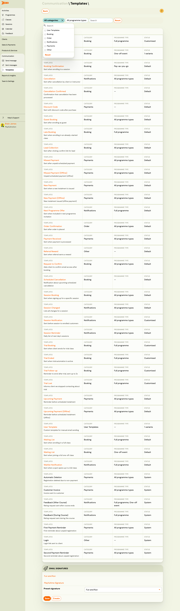
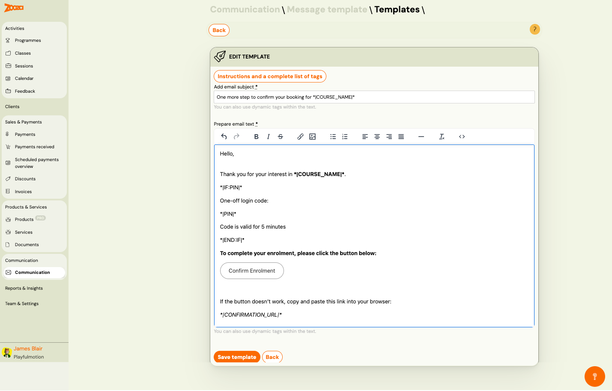

# Message Templates

The Message Templates screen manages all email and SMS templates used by Zooza for automated and manual communication. Templates are organized by category: user-created, booking, order, notifications, other, and email signatures.

> **Navigation:** Go to **Communication** → **Message template**.

## User Templates

Custom templates created by your team.

| Field | Description |
|---|---|
| `User templates` | List of custom templates (clickable link to edit). |
| **Add new template** | Create a new custom template. |

## Booking

Templates triggered by booking-related sessions:

| Template | When it is sent |
|---|---|
| **Request to confirm booking** | After booking — the client must confirm via email. Otherwise, the booking status cannot be changed to "Enrolled". |
| **Confirmation of booking (Session programme)** | Sent automatically after clicking the confirmation link from the email invitation. |
| **Trial timetable bookings completed** | Sent to the client when they enrol for the trial timetable. |
| **Trial ended** | Sent automatically if the trial automation in programme settings is set up. The goal is to send the booking link to the client. |
| **Trial ended follow-up** | Sent automatically up to two times if trial automation is enabled. Includes follow-up to remind the client to enrol via the provided booking link. |
| **Trial lost** | Sent automatically if trial automation is enabled in programme settings. Informs the client that they have decided not to enrol. |
| **Booking confirmation – Lead collection** | Sent automatically after clicking the link from the email invitation to confirm booking. |
| **Waiting list (Continuous programme)** | Sent after enrolling for a class that is full. |
| **Late booking** | Sent to clients in session programmes who have enrolled for a class that has already started. |
| **Booking confirmation – Open sessions** | Sent automatically after clicking the link from the email invitation to confirm booking. |
| **Booking confirmation – One-off session** | Sent automatically after clicking the link from the email invitation to confirm booking. |
| **Waiting list (One-off session)** | Sent after joining a class that is full. |

Each template shows a **Template** link and optionally **Custom templates** with an **Add new template** button.

## Order

Templates triggered by order sessions:

| Template | When it is sent |
|---|---|
| **Order confirmation** | Sent after the order has been successfully sent. |

## Notifications

Templates for automated notifications:

| Template | When it is sent |
|---|---|
| **Upcoming session notification** | Sent every day at three o'clock and contains a list of the following day's sessions for which the client is not excused. |
| **Automatic session reminder** | Sent the day before the session to all clients who are enrolled for the session. |
| **Cancellation confirmation** | Sent following a cancellation by either the client or the instructor. |
| **Automatic waiting list notification** | Sent to people on the waiting list for a one-session programme. |
| **Next programme offer** | Sent when the client is included in the next programme invitation. |

## Other

Templates for miscellaneous system sessions:

| Template | When it is sent |
|---|---|
| **System import invitation** | Sent to users upon importing them into Zooza. |
| **Payment received** | Sent to users when payment has been processed. |
| **Imported booking confirmation** | Sent to users as a confirmation when they accept an invitation into Zooza. |
| **Booking imported** | Sent to users as a confirmation on being imported into Zooza. |
| **Sign up for an open session** | Sent to users when they enrol to a session (Pay-as-you-go). |
| **New payment** | Sent to users as a payment request when a new instalment is issued. |
| **Booking as guest done** | Sent to users after they enrol to a full programme as guests. |
| **Changed session** | Notification for users that lists all changes for a given session. |
| **Upcoming payment** | Sent to users as a reminder before a scheduled instalment is issued. |
| **Missed payment** | Sent to users after a scheduled payment is unpaid. |
| **Scheduled booking cancellation** | Sent when a booking is scheduled for cancellation. |
| **Scheduled cancellation confirmation** | Sent to confirm a scheduled cancellation. |

## Email Signatures

Manage email signatures appended to outgoing messages.

| Field | Description |
|---|---|
| Signature list | Named signatures (clickable links to edit). |
| `Preset signature` | Dropdown to select the default signature. |
| **Save** | Save the selected preset signature. |
| **Create** | Create a new email signature. |

## Template Editor

> **Navigation:** Message Templates → click any **Template** link.

### Edit Template

| Field | Description |
|---|---|
| `Add email subject` | Email subject line. Supports dynamic tags (e.g. `*|COURSE_NAME|*`). Required. |
| `Prepare email text` | Rich text editor for the email body. Required. |

The hint text below each field reads: "You can also use dynamic tags within the text."

Click **Instructions and a complete list of tags** to view all available dynamic tags.

### Rich Text Toolbar

The editor toolbar provides:

- Undo / Redo
- **Bold**, *Italic*, ~~Strikethrough~~
- Insert link, Insert image
- Bulleted list, Numbered list
- Text alignment (left, center, right, justify)
- Horizontal rule
- Clear formatting
- Source code view (`<>`)

### Dynamic Tags

Common dynamic tags used in templates:

| Tag | Description |
|---|---|
| `*\|COURSE_NAME\|*` | Programme name. |
| `*\|PIN\|*` | One-time login code. |
| `*\|IF:PIN\|*` … `*\|END:IF\|*` | Conditional block — only shown if a PIN exists. |
| `*\|CONFIRMATION_URL\|*` | Link for the client to confirm their enrolment. |

For a full list, see the [Dynamic Tags Guide](../guides/dynamic-tags.md).

### Actions

| Button | Description |
|---|---|
| **Save template** | Save changes to the template. |
| **Back** | Return to the templates list without saving. |

## Related

- [Communication Dashboard](communication-dashboard.md) — main communication hub.
- [Message Templates Guide](../guides/message-templates.md) — how to create and manage templates.
- [Dynamic Tags Guide](../guides/dynamic-tags.md) — full list of available merge fields.
- [Sending Email/SMS Guide](../guides/sending-email-sms.md) — how to send messages.
