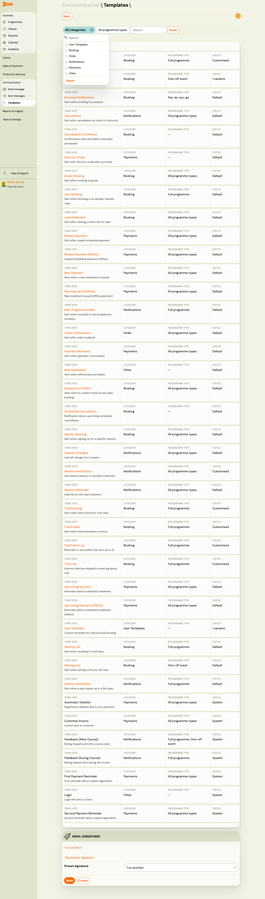
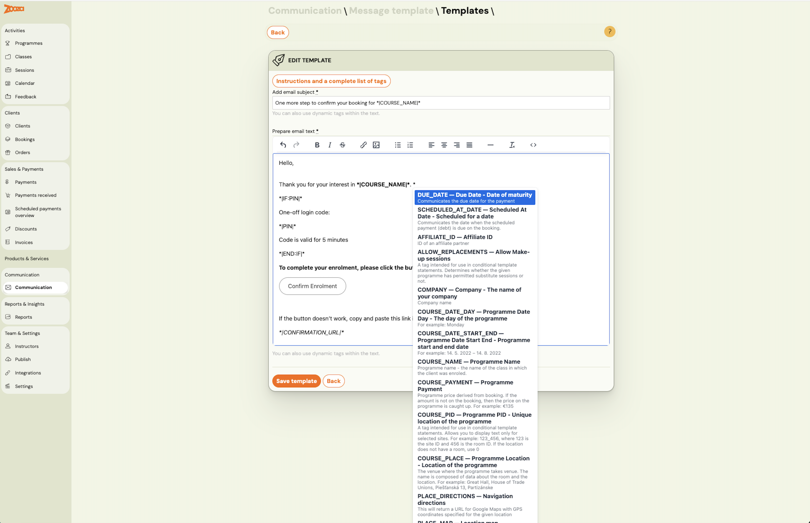

# Message Templates

The Templates screen lists all email and SMS templates in one filterable table — both your custom templates and the built-in system templates that Zooza uses for automated communication.

> **Navigation:** Go to **Communication** → **Templates**.

---

## Filters

Use the filter bar above the list to narrow down templates:

| Filter | Description |
|---|---|
| **Type** | Filter by template category (e.g. Booking, Notifications, Order, Other). |
| **Name** | Search by template name. |

The list updates as you type or select a filter. Click **Reset** to clear all filters.

---

## Template list

Each row in the list shows one template:

| Column | Description |
|---|---|
| **Name** | Template name — click to open the template editor. |
| **Type** | Template category (Booking, Order, Notifications, Other, User). |
| **Custom templates** | Shows how many custom variants exist for this template. |
| **Created** | Date the template or its custom variant was created. |

---

## System templates vs. custom templates

### System templates

System templates are built into Zooza and are sent automatically for specific events — booking confirmation, payment reminders, cancellations, etc. They **cannot be deleted or renamed**, but you can create a **custom variant** to override the default content.

System templates are shown in the list but their row has no edit button — only an **Add new template** option to create a custom variant.

### Custom (user) templates

Templates you or your team have created — either from scratch or as a custom variant of a system template. These can be freely edited, duplicated, or deleted.

To create a new template from scratch, click **Add new template** at the top of the list.

---

## System template reference

### Booking templates

| Template | When it is sent |
|---|---|
| **Request to confirm booking** | After booking — the client must confirm via email before the booking status can be set to Enrolled. |
| **Confirmation of booking (Session programme)** | Sent automatically after the client clicks the confirmation link. |
| **Trial timetable bookings completed** | Sent when a client enrols for the trial timetable. |
| **Trial ended** | Sent automatically if trial automation is configured in programme settings. Includes the booking link. |
| **Trial ended follow-up** | Follow-up sent up to two times if trial automation is enabled. |
| **Trial lost** | Sent if trial automation is enabled and the client has not enrolled. |
| **Booking confirmation – Lead collection** | Sent after the client confirms a lead collection booking. |
| **Waiting list (Continuous programme)** | Sent after enrolling in a full class. |
| **Late booking** | Sent to clients who enrol in a class that has already started. |
| **Booking confirmation – Open sessions** | Sent after confirming an open session booking. |
| **Booking confirmation – One-off session** | Sent after confirming a one-off session booking. |
| **Waiting list (One-off session)** | Sent after joining the waiting list for a full one-off session. |

### Order templates

| Template | When it is sent |
|---|---|
| **Order confirmation** | Sent after an order has been successfully submitted. |

### Notification templates

| Template | When it is sent |
|---|---|
| **Upcoming session notification** | Sent daily at 3:00 AM with a list of the next day's sessions for clients who are not excused. |
| **Automatic session reminder** | Sent the day before a session to all enrolled clients. |
| **Cancellation confirmation** | Sent after a cancellation by the client or instructor. |
| **Automatic waiting list notification** | Sent to waiting list clients for a one-session programme. |
| **Next programme offer** | Sent when a client is included in the next programme invitation. |

### Other templates

| Template | When it is sent |
|---|---|
| **System import invitation** | Sent to users when they are imported into Zooza. |
| **Payment received** | Sent when a payment has been processed. |
| **Imported booking confirmation** | Sent when a client accepts an import invitation. |
| **Booking imported** | Sent as confirmation when a client is imported. |
| **Sign up for an open session** | Sent when a client enrols in a Pay-as-you-go session. |
| **New payment** | Sent as a payment request when a new instalment is issued. |
| **Booking as guest done** | Sent after a guest enrols in a full programme. |
| **Changed session** | Notification listing all changes to a session. |
| **Upcoming payment** | Reminder sent before a scheduled instalment is issued. |
| **Missed payment** | Sent after a scheduled payment is not paid. |
| **Scheduled booking cancellation** | Sent when a booking is scheduled for cancellation. |
| **Scheduled cancellation confirmation** | Sent to confirm a scheduled cancellation. |

---

## Email Signatures

Manage email signatures at the bottom of the Templates screen.

| Field | Description |
|---|---|
| Signature list | Named signatures — click to edit. |
| `Preset signature` | Select the default signature appended to outgoing emails. |
| **Save** | Save the selected preset. |
| **Create** | Create a new signature. |

---

## Template editor

> **Navigation:** Templates list → click a template name.

### Fields

| Field | Description |
|---|---|
| `Add email subject` | Email subject line. Supports dynamic tags. Required. |
| `Prepare email text` | Rich text editor for the email body. Required. |

### Dynamic tags

Dynamic tags automatically insert client-specific data — name, programme, payment amount, booking link — into the subject and body.

**Two ways to insert a tag:**

1. **Type `*` in the editor** — a dropdown appears with tags valid for this template type. Start typing to filter, then click to insert.
2. **Copy from the reference** — click **Instructions and a complete list of tags** below the editor to open the full tag reference.

Tags use the format `*|TAG_NAME|*` and work in both subject and body.

> **Note:** Not all tags are available in every template. The autocomplete only shows tags valid for the current template type.

Common tags:

| Tag | Description |
|---|---|
| <code>&#42;&#124;FIRST_NAME&#124;&#42;</code> | Client's first name. |
| <code>&#42;&#124;COURSE_NAME&#124;&#42;</code> | Programme name — class name. |
| <code>&#42;&#124;COURSE_PAYMENT&#124;&#42;</code> | Amount the client should pay. |
| <code>&#42;&#124;VARIABLE_SYMBOL&#124;&#42;</code> | Payment reference / variable symbol. |
| <code>&#42;&#124;CONFIRMATION_URL&#124;&#42;</code> | Link for the client to confirm enrolment. |
| <code>&#42;&#124;PIN&#124;&#42;</code> | One-time login code. |
| <code>&#42;&#124;IF:PIN&#124;&#42;</code> … <code>&#42;&#124;END:IF&#124;&#42;</code> | Conditional block — only shown if a PIN exists. |

For the full list, see [Dynamic Tags Guide](../guides/dynamic-tags.md).

### Actions

| Button | Description |
|---|---|
| **Save template** | Save changes. |
| **Back** | Return to the templates list without saving. |

---

## Related

- [Communication](communication-dashboard.md) — Communication menu overview.
- [Message Templates Guide](../guides/message-templates.md) — how to create and manage templates.
- [Dynamic Tags Guide](../guides/dynamic-tags.md) — full list of available merge fields.
- [Sending Email/SMS Guide](../guides/sending-email-sms.md) — how to send messages.
