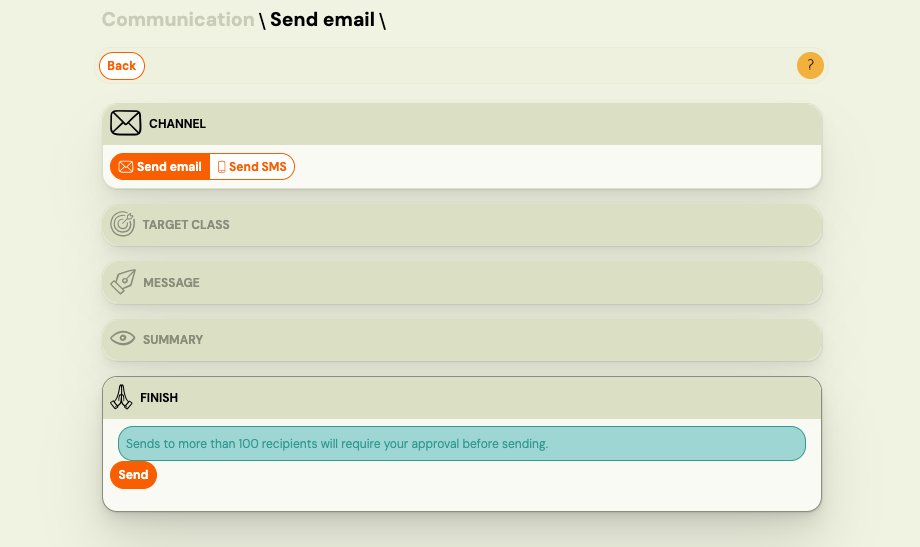
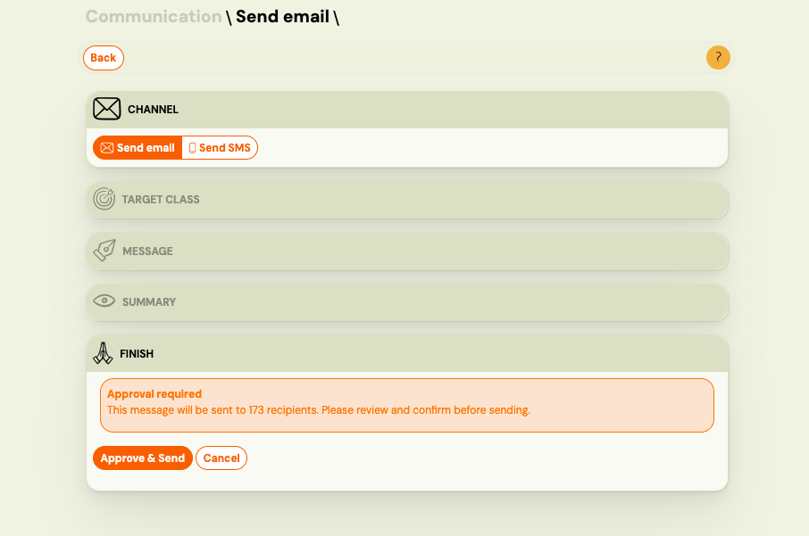
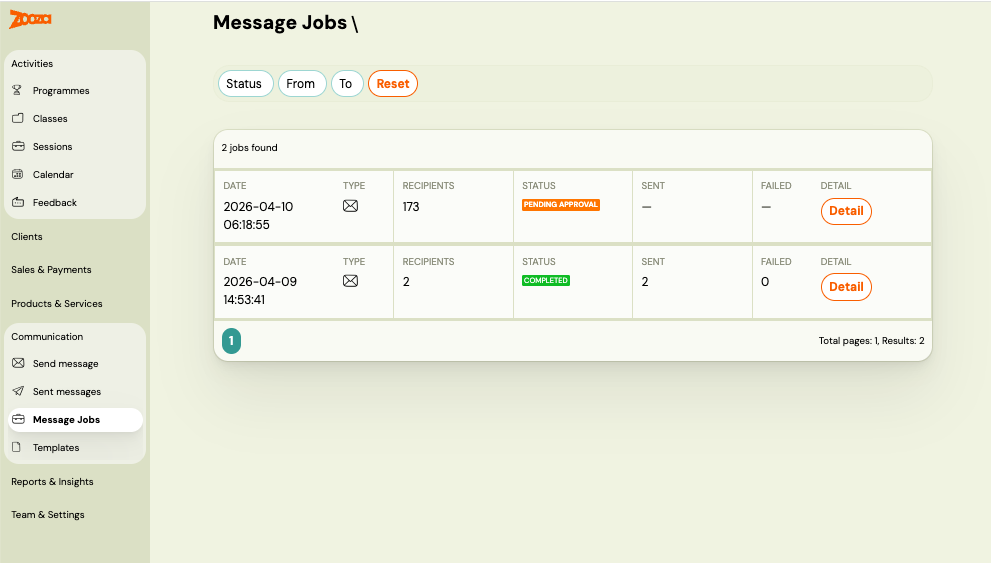

# Send Email

The Send Email screen lets you compose and send email messages to clients. Bulk sends are processed in the background — Zooza shows you the exact recipient count before sending starts and tracks delivery progress in real time.

> **Navigation:** Go to **Communication** → **Send message**.

## Step 1: Target

### Send Message

Choose who receives the email:

| Option | Description |
|---|---|
| **To all clients with an active booking** | Sends to all clients in the selected billing class with status "Enrolled". |
| **To all clients** | Sends to all clients regardless of bookings or billing periods. |
| **To a specific class** | Sends to all clients in the selected class with status "Enrolled". |
| **To a single recipient** | Sends to a single email address only. |
| **To selected bookings** | Sends to a manually selected set of bookings. |

### Choose Who You Want to Send the Message To

| Option | Description |
|---|---|
| **Clients** | Message is sent to each client just once. If the client has multiple bookings, merge fields specific to a booking (such as `COURSE_PRICE` or `VARIABLE_SYMBOL`) cannot be used. Best for general announcements. |
| **Individual bookings** | Message is sent to each booking that meets the criteria. If a client has multiple bookings, they receive one email per booking. Best for messages about specific bookings. |

### Settings

| Field | Description |
|---|---|
| `Promotional message` | Check **Yes** if you do not want to send this message to clients who have opted out of promotional messages. |
| `Send email also to users with additional access to booking` | Check **Yes** to also send to users with shared access to the booking. |
| `Billing period` | Dropdown to select the billing period (e.g. "Ongoing Classes"). |

### Recipients

Shows the count and list of recipients matching your criteria.

| Column | Description |
|---|---|
| `Name` | Client (parent) name. |
| `Child` | Child name associated with the booking. |
| **Remove** | Remove the recipient from this send. |

Use **Show recipients** / **Hide recipients** to toggle the recipient list.

Click **Continue** to proceed to the Message step.

## Step 2: Message

Compose the email content. This step uses the rich text editor (same as the template editor — see [Template Editor](communication-message-templates.md#template-editor)).

## Step 3: Summary

Review recipients, message content, and settings before sending. Click **Continue**.

## Step 4: Approval and sending

When you confirm the send, Zooza creates a **message job** — it counts the exact recipient list and breaks it into chunks for background processing.

### Approval gate

Sends to **100 or more recipients** require explicit approval before any emails are dispatched.

| Status shown         | What it means                                                |
| -------------------- | ------------------------------------------------------------ |
| **Pending approval** | Job created, waiting for you to approve. No emails sent yet. |
| **Approve** button   | Click to start sending.                                      |
| **Cancel** button    | Abandon the send entirely.                                   |
|                      |                                                              |

> Sends under 100 recipients are approved automatically and start immediately.

### Progress view

Once approved (or auto-approved), Zooza processes the send in the background. The progress view shows:

| Field | Description |
|---|---|
| **Status** | Current job status: Queued, Sending, Completed, or Failed. |
| **Recipients** | Total number of recipients in this send. |
| **Sent** | Recipients successfully handed off to the mail gateway. |
| **Failed** | Recipients that could not be processed. |
| **Queued** | Job is waiting because another send for your account is already in progress. |

> Only one bulk send can be active per account at a time. If you start a second send while the first is still running, the second enters the queue and starts automatically when the first completes.

### Cancellation

You can cancel a send that is in progress. Chunks already sent cannot be recalled, but unsent chunks are stopped.

Click **Cancel** on the progress view to stop the send.

## Related

- [Communication](communication-dashboard.md) — Communication menu overview.
- [Message Templates Reference](communication-message-templates.md) — manage reusable templates.
- [Sending Email/SMS Guide](../guides/sending-email-sms.md) — step-by-step instructions.
- [Bulk Send Tracking](../guides/bulk-email-send-tracking.md) — understanding job statuses, queue, and send history.
- [Dynamic Tags Guide](../guides/dynamic-tags.md) — available merge fields for templates.
- [Email Communication FAQ](../faq/email-communication-faq.md) — common email questions.
