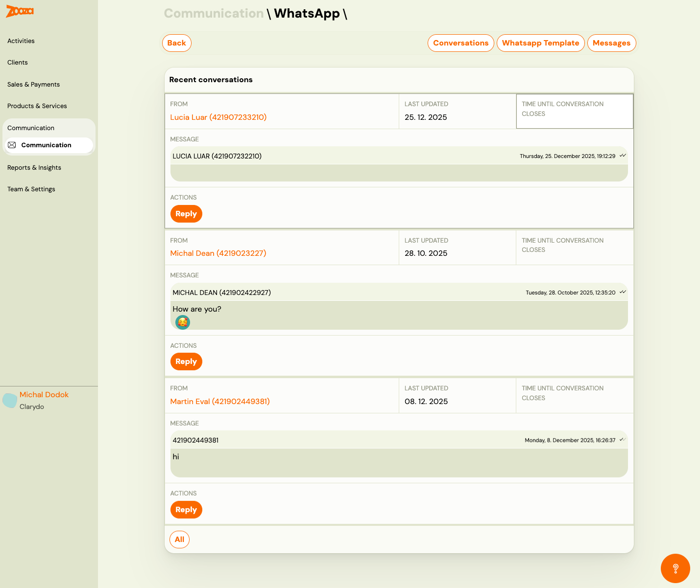
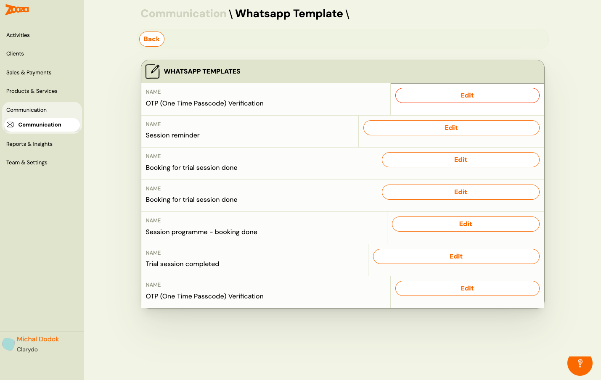
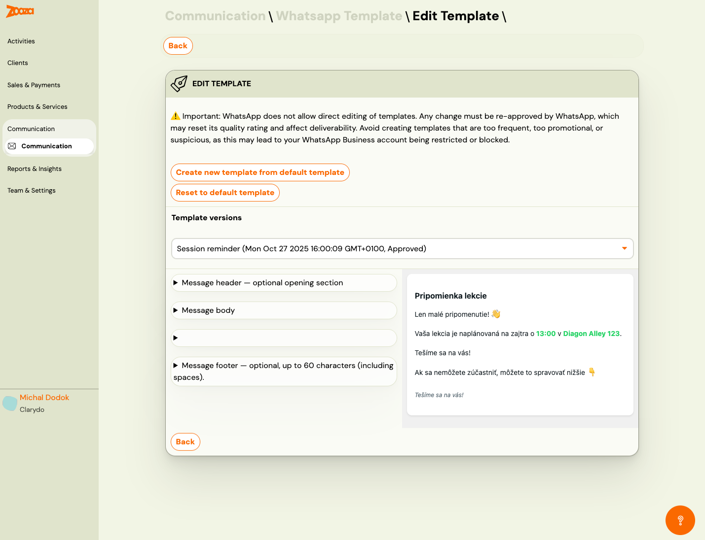

# WhatsApp

The WhatsApp screen manages WhatsApp Business messaging within Zooza. Use it to view conversations, reply to clients, and manage WhatsApp message templates. Requires PRO plan.

> **Navigation:** Go to **Communication** → **WhatsApp (PRO)**.

## Tabs

The WhatsApp screen has three tabs:

| Tab | Description |
|---|---|
| **Conversations** | View and reply to recent WhatsApp conversations. |
| **Whatsapp Template** | Manage WhatsApp message templates. |
| **Messages** | View sent WhatsApp messages log. |

## Conversations

### Recent Conversations

Each conversation card shows:

| Field | Description |
|---|---|
| `From` | Client name and phone number (clickable link). |
| `Last updated` | Date of the last message in the conversation. |
| `Time until conversation closes` | WhatsApp 24-hour window timer — after this period, you can only send template messages. |
| `Message` | Phone number header and latest message preview with timestamp and delivery status (double tick = delivered). |
| **Reply** | Open the conversation to send a reply. |

The **All** button at the bottom loads all conversations.

## WhatsApp Templates

> **Navigation:** WhatsApp → **Whatsapp Template** tab.

### Template List

Each row shows:

| Field | Description |
|---|---|
| `Name` | Template name (e.g. "OTP (One Time Passcode) Verification", "Session reminder", "Booking for trial session done"). |
| **Edit** | Open the template editor. |

## Edit WhatsApp Template

> **Navigation:** WhatsApp Templates → **Edit**.

> **Important:** WhatsApp does not allow direct editing of templates. Any change must be re-approved by WhatsApp, which may reset its quality rating and affect deliverability. Avoid creating templates that are too frequent, too promotional, or suspicious, as this may lead to your WhatsApp Business account being restricted or blocked.

### Actions

| Button | Description |
|---|---|
| **Create new template from default template** | Create a new version based on the default template. |
| **Reset to default template** | Revert to the original default template. |

### Template Versions

A dropdown to select the template version, showing version name, creation timestamp, and approval status (e.g. "Approved").

### Template Structure

The template editor shows collapsible sections:

| Section | Description |
|---|---|
| **Message header** | Optional opening section (e.g. title or greeting). |
| **Message body** | Main message content with dynamic variables. |
| *(unnamed section)* | Additional content section. |
| **Message footer** | Optional closing section, up to 60 characters (including spaces). |

A live preview panel on the right shows how the message will appear to the recipient.

### Actions

| Button | Description |
|---|---|
| **Back** | Return to the templates list. |

## Related

- [Communication Dashboard](communication-dashboard.md) — main communication hub.
- [WhatsApp Integration Guide](../setup/whatsapp-integration.md) — how to set up WhatsApp with Zooza.
- [WhatsApp FAQ](../faq/whatsapp-faq.md) — common WhatsApp questions.
