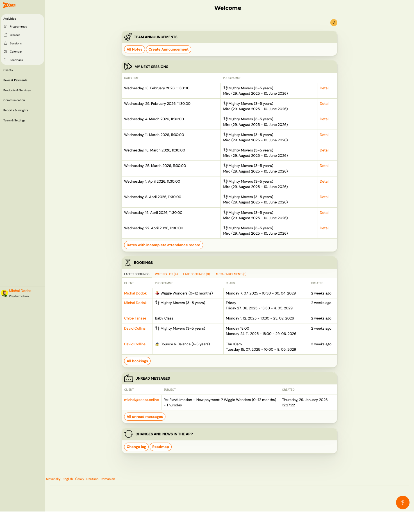
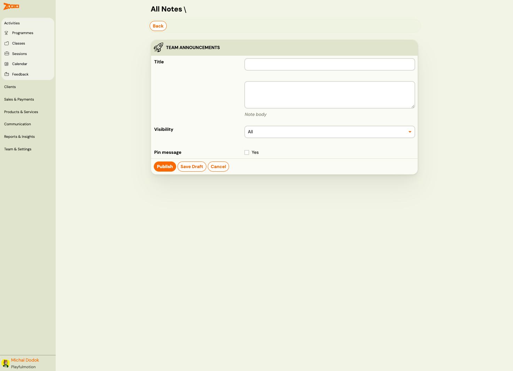
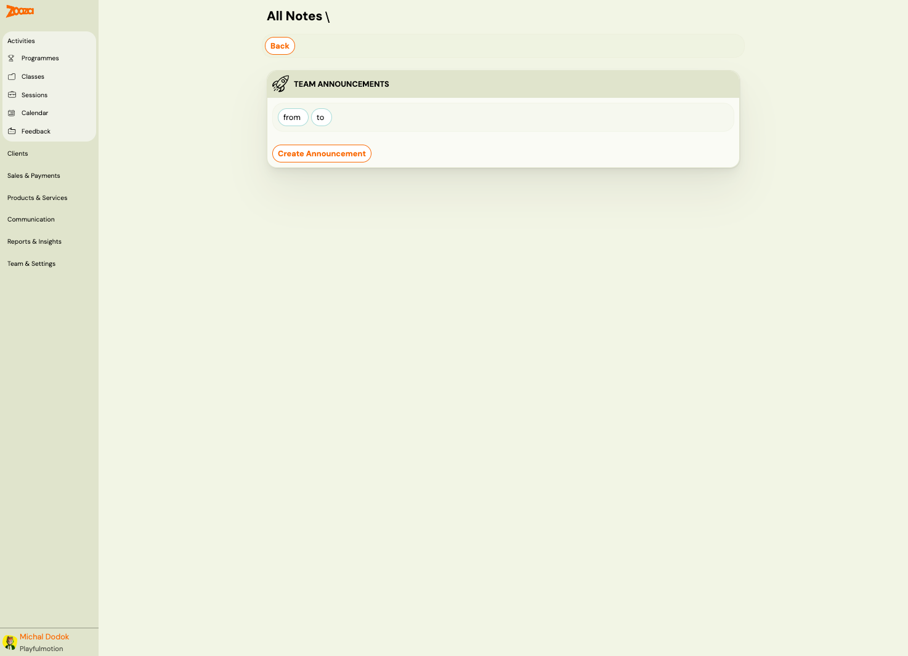

# Dashboard

The Dashboard is the first screen you see after logging in to Zooza. It provides a quick overview of your upcoming sessions, latest bookings, unread messages, and team announcements.

> **Navigation:** This is the home screen — click the Zooza logo or go to your Zooza app URL.

## Team Announcements

The top section of the Dashboard. Use it to share internal notes with your team (instructors, staff).

| Element | Description |
|---|---|
| **All Notes** | Opens the list of all published announcements with date filters. |
| **Create Announcement** | Opens the announcement editor. |

### Creating an announcement

| Field | Description |
|---|---|
| `Title` | Short headline for the announcement. |
| `Note body` | Full text of the announcement. |
| `Visibility` | Who can see it: **All** (everyone on the team) or specific roles. |
| `Pin message` | Check **Yes** to keep the announcement pinned at the top of the list. |
| **Publish** | Publishes the announcement immediately. |
| **Save Draft** | Saves without publishing — you can publish later. |
| **Cancel** | Discards the announcement. |

### Announcements list

The list view shows all published announcements. Use the **from** and **to** date filters to narrow the view. Click **Create Announcement** to add a new one.

## My Next Sessions

A table showing your upcoming sessions as an instructor or admin.

| Column | Description |
|---|---|
| `Date/Time` | Date and start time of the session. |
| `Programme` | Programme name and class name with date range. |
| **Detail** | Link to the session detail (attendance, notes). |

Below the table:

- **Dates with incomplete attendance record** — quick link to sessions where attendance has not been fully marked. Helps you stay on top of tracking.

## Bookings

A summary of your latest booking activity with four tabs:

| Tab | Description |
|---|---|
| **Latest Bookings** | Most recent bookings across all programmes. |
| **Waiting List (n)** | Bookings where the class was full — awaiting your approval. |
| **Late Bookings (n)** | Bookings submitted after the programme/billing period started. |
| **Auto-Enrolment (n)** | Bookings created automatically by an automation rule. |

Each row shows:

| Column | Description |
|---|---|
| `Client` | Parent name (clickable — opens client profile). |
| `Programme` | Programme the booking belongs to. |
| `Class` | Day, time, and date range of the class. |
| `Created` | When the booking was created. |

Click **All bookings** to go to the full Bookings list.

## Unread Messages

Shows incoming messages from clients (replies to system emails).

| Column | Description |
|---|---|
| `Client` | Sender email (clickable — opens conversation). |
| `Subject` | Email subject line. |
| `Created` | Date and time received. |

Click **All unread messages** to see the full inbox.

## Changes and News in the App

Links at the bottom of the Dashboard:

| Link | Description |
|---|---|
| **Change log** | What's new — recent updates and fixes to the app. |
| **Roadmap** | Upcoming features and planned improvements. |

## Related

- [Common Booking Scenarios](../faq/common-booking-scenarios.md) — how to handle waitlist, duplicates, refunds.
- [Attendance and Catch-up Classes FAQ](../faq/attendance-and-catchups-faq.md) — marking attendance, catch-up flow.
- [Email and Communication FAQ](../faq/email-communication-faq.md) — understanding messages and notifications.
