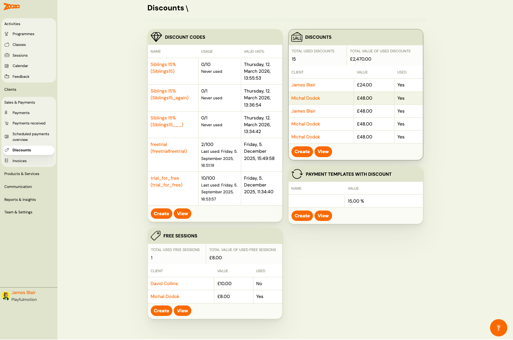
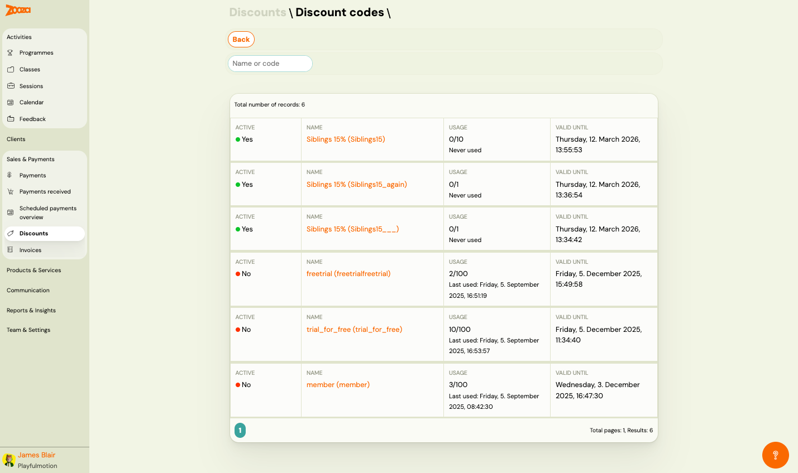
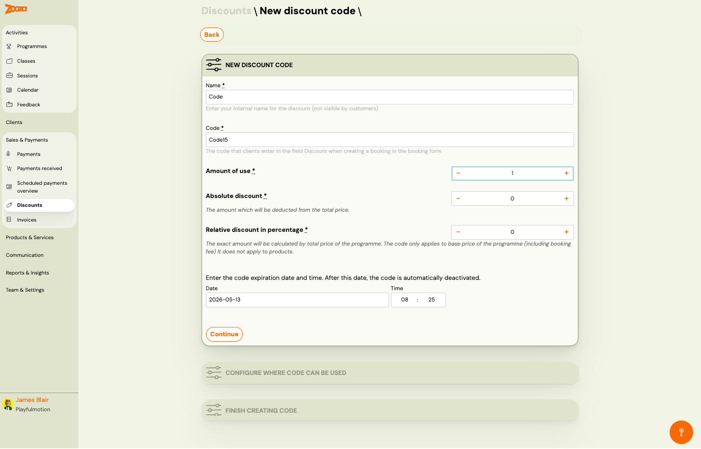
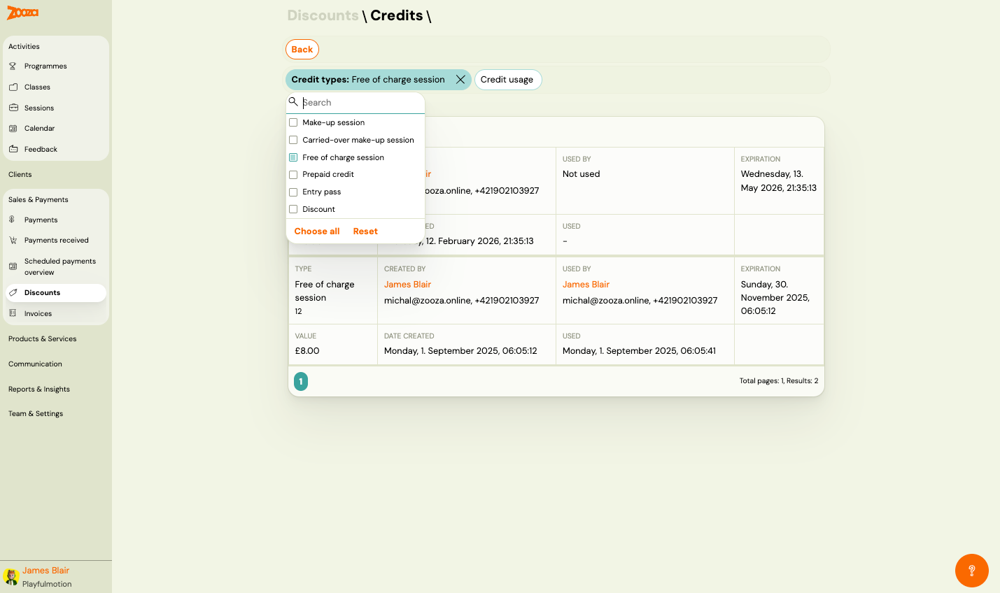

# Discounts

The Discounts screen manages all discount codes, applied discounts, free session credits, and payment template discounts. Use it to create promotional codes, track usage, and review credits.

> **Navigation:** Go to **Sales & Payments** → **Discounts**.

## Dashboard

The dashboard is divided into four sections:

### Discount Codes

Lists all discount codes:

| Column | Description |
|---|---|
| `Name` | Discount code display name with internal code in parentheses (clickable link). |
| `Usage` | Usage count vs. limit (e.g. "0/10", "2/100") and last used date or "Never used". |
| `Valid until` | Expiration date and time. |

Buttons: **Create** (new discount code) and **View** (opens [Discount Codes List](#discount-codes-list)).

### Discounts

Summary of applied discounts:

| Field | Description |
|---|---|
| `Total used discounts` | Number of discounts applied. |
| `Total value of used discounts` | Sum of all discount values. |

Below, a table shows individual discount usage:

| Column | Description |
|---|---|
| `Client` | Client name (clickable link). |
| `Value` | Discount value applied. |
| `Used` | "Yes" or "No". |

Buttons: **Create** and **View**.

### Free Sessions

Summary of free session credits:

| Field | Description |
|---|---|
| `Total used free sessions` | Number of free sessions used. |
| `Total value of used free sessions` | Sum of free session values. |

Table of free session credits:

| Column | Description |
|---|---|
| `Client` | Client name (clickable link). |
| `Value` | Credit value. |
| `Used` | "Yes" or "No". |

Buttons: **Create** and **View**.

### Payment Templates with Discount

Lists payment templates that include a built-in discount:

| Column | Description |
|---|---|
| `Name` | Template name. |
| `Value` | Discount percentage (e.g. "15,00 %"). |

Buttons: **Create** and **View**.

## Discount Codes List

> **Navigation:** Discounts dashboard → Discount Codes → **View**.

### Filter

- **Name or code** — free-text search by discount name or code.

### List

Each row shows:

| Column | Description |
|---|---|
| `Active` | Green dot = "Yes" (active), Red dot = "No" (inactive/expired). |
| `Name` | Discount name with internal code in parentheses (clickable link to detail). |
| `Usage` | Usage count vs. limit (e.g. "0/10") and last used date or "Never used". |
| `Valid until` | Expiration date and time. |

Pagination shows total records count.

## New Discount Code

> **Navigation:** Discounts dashboard → Discount Codes → **Create**.

### Step 1: New Discount Code

| Field | Description |
|---|---|
| `Name` | Internal name for the discount (not visible to clients). Required. |
| `Code` | The code clients enter in the booking form. Required. |
| `Amount of use` | Maximum number of times the code can be used. +/− controls. Required. |
| `Absolute discount` | Fixed amount deducted from the total price. +/− controls. |
| `Relative discount in percentage` | Percentage discount calculated on the total programme price (including booking fee). Does not apply to products. |
| `Date` / `Time` | Expiration date and time. After this date, the code is automatically deactivated. |

Click **Continue** to proceed.

### Step 2: Configure Where Code Can Be Used

Select which programmes and/or classes accept this discount code.

### Step 3: Finish Creating Code

Review and confirm the discount code creation.

## Credits

> **Navigation:** Discounts dashboard → any section → **View**, or **Sales & Payments** → **Discounts** → **Credits** tab.

### Filters

- **Credit types** — multi-select dropdown with options:
  - Make-up session
  - Carried-over make-up session
  - Free of charge session
  - Prepaid credit
  - Entry pass
  - Discount
- **Credit usage** — filter by usage status.

Active filters show as highlighted chips with X to remove. Use **Choose all** to select all types, or **Reset** to clear.

### Credits List

Each credit card shows:

| Field | Description |
|---|---|
| `Type` | Credit type and number (e.g. "Free of charge session 12"). |
| `Created by` | User who created the credit (name, email, phone). |
| `Used by` | User who redeemed the credit, or "Not used". |
| `Expiration` | Expiration date and time. |
| `Value` | Credit monetary value. |
| `Date created` | Creation timestamp. |
| `Used` | Usage timestamp (or "−" if unused). |

Pagination shows total pages and results count.

## Related

- [Discount Code Guide](../guides/discount-code.md) — how to create and manage discount codes.
- [Discount Types Guide](../guides/discount-types.md) — overview of available discount types.
- [Discounts and Sibling Pricing FAQ](../faq/discounts-and-sibling-pricing-faq.md) — common questions about discounts.
