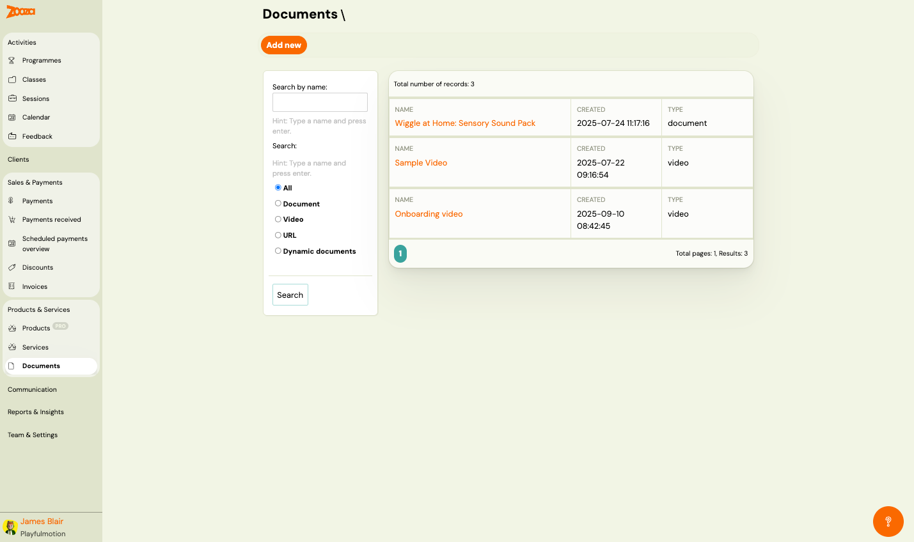
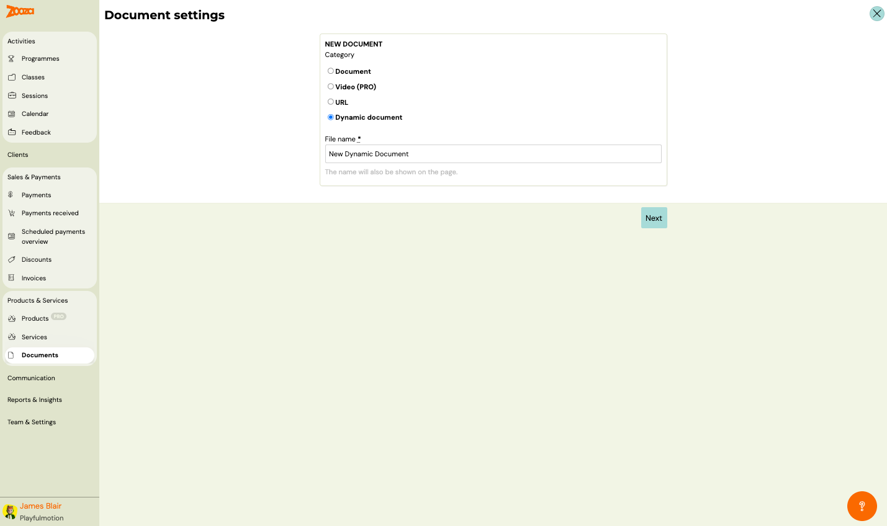
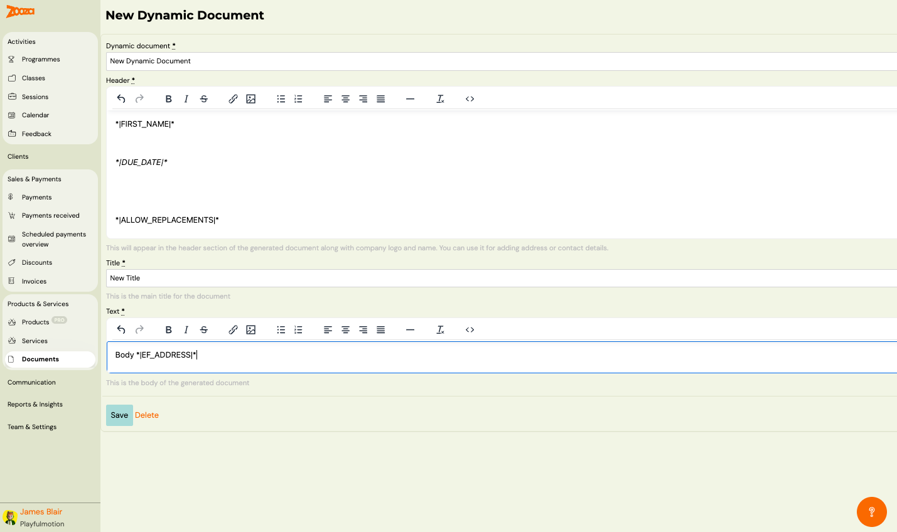

# Documents

The Documents screen manages all digital assets — documents, videos, URLs, and dynamic documents — that can be attached to products, classes, or used as standalone resources.

> **Navigation:** Go to **Products & Services** → **Documents**.

## Top Actions

| Button | Description |
|---|---|
| **Add new** | Create a new document (see [New Document](#new-document)). |

## Filters

The left sidebar provides filters:

- **Search by name** — type a name and press Enter.
- **Search** — additional text search field.
- **Type filter** (radio buttons):
  - **All** — show all document types.
  - **Document** — uploaded files (PDF, etc.).
  - **Video** — video files.
  - **URL** — external links.
  - **Dynamic documents** — auto-generated documents with merge fields.

Click **Search** to apply.

## Document List

The header shows the total number of records.

Each row displays:

| Column | Description |
|---|---|
| `Name` | Document name (clickable link to detail/edit). |
| `Created` | Creation date and time. |
| `Type` | Document type — "document", "video", etc. |

Pagination shows total pages and results count.

## New Document

> **Navigation:** Documents → **Add new**.

### Document Settings

| Field | Description |
|---|---|
| `Category` | Document type to create (radio buttons). |

Available categories:

| Category | Description |
|---|---|
| **Document** | Upload a file (PDF, image, etc.). |
| **Video (PRO)** | Upload or embed a video. Requires PRO plan. |
| **URL** | Link to an external resource. |
| **Dynamic document** | A template-based document that auto-fills with client data using merge fields. |

| Field | Description |
|---|---|
| `File name` | Display name for the document. The name will also be shown on the page. Required. |

Click **Next** to proceed to content configuration.

## Dynamic Document Editor

> **Navigation:** Documents → Add new → **Dynamic document** → Next.

| Field | Description |
|---|---|
| `Dynamic document` | Internal name for the document. Required. |
| `Header` | Rich text editor for the document header. Appears in the header section along with company logo and name. Use it for adding address or contact details. Supports dynamic tags. |
| `Title` | Main title of the document. Required. |
| `Text` | Rich text editor for the document body. Supports dynamic tags. |

### Dynamic Tags for Documents

Common tags available in dynamic documents:

| Tag | Description |
|---|---|
| `*\|FIRST_NAME\|*` | Client's first name. |
| `*\|DUE_DATE\|*` | Payment due date. |
| `*\|ALLOW_REPLACEMENTS\|*` | Replacement sessions information. |
| `*\|EF_ADDRESS\|*` | Client's address (from extra fields). |

Both the Header and Text fields include a rich text toolbar with: undo/redo, bold, italic, strikethrough, link, image, lists, alignment, horizontal rule, clear formatting, and source code view.

Buttons: **Save** and **Delete**.

## Related

- [Products Reference](products-list.md) — attach documents and videos to products.
- [Services Reference](services-list.md) — manage service add-ons.
- [Dynamic Tags Guide](../guides/dynamic-tags.md) — full list of available merge fields.
