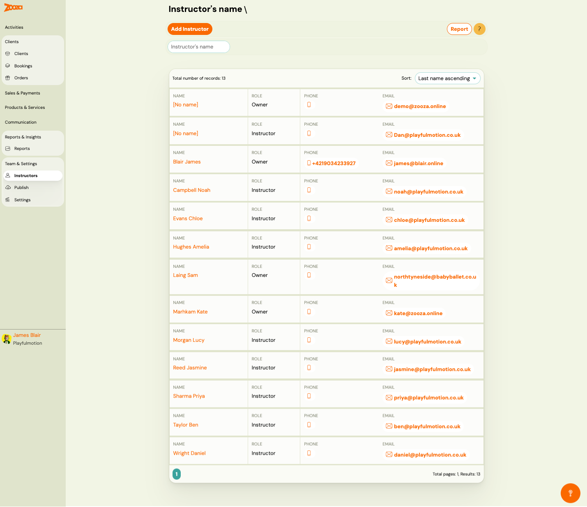
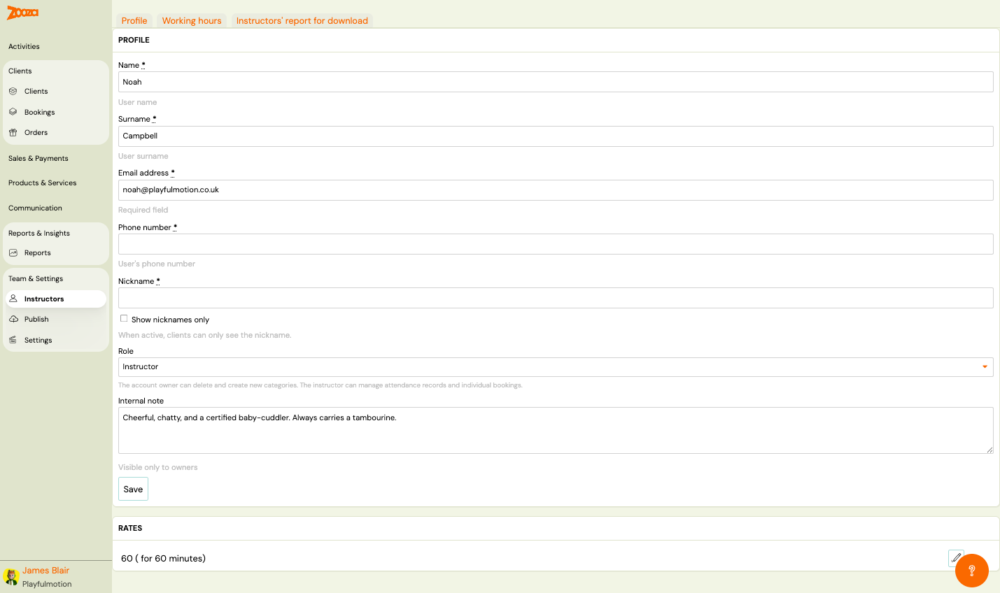
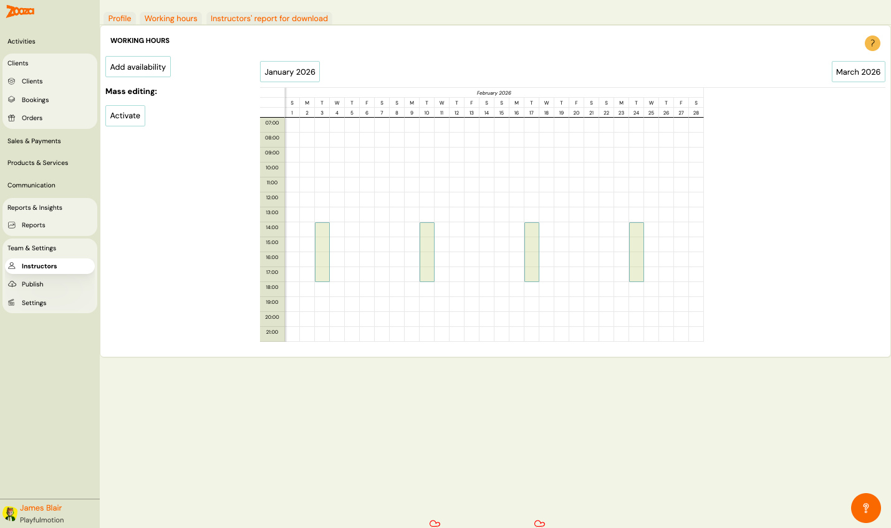
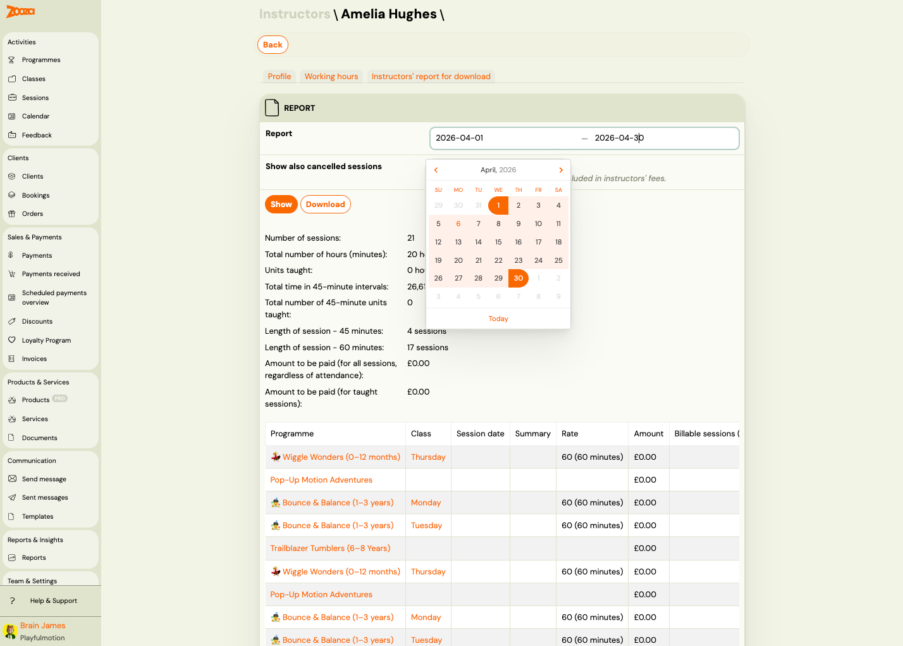
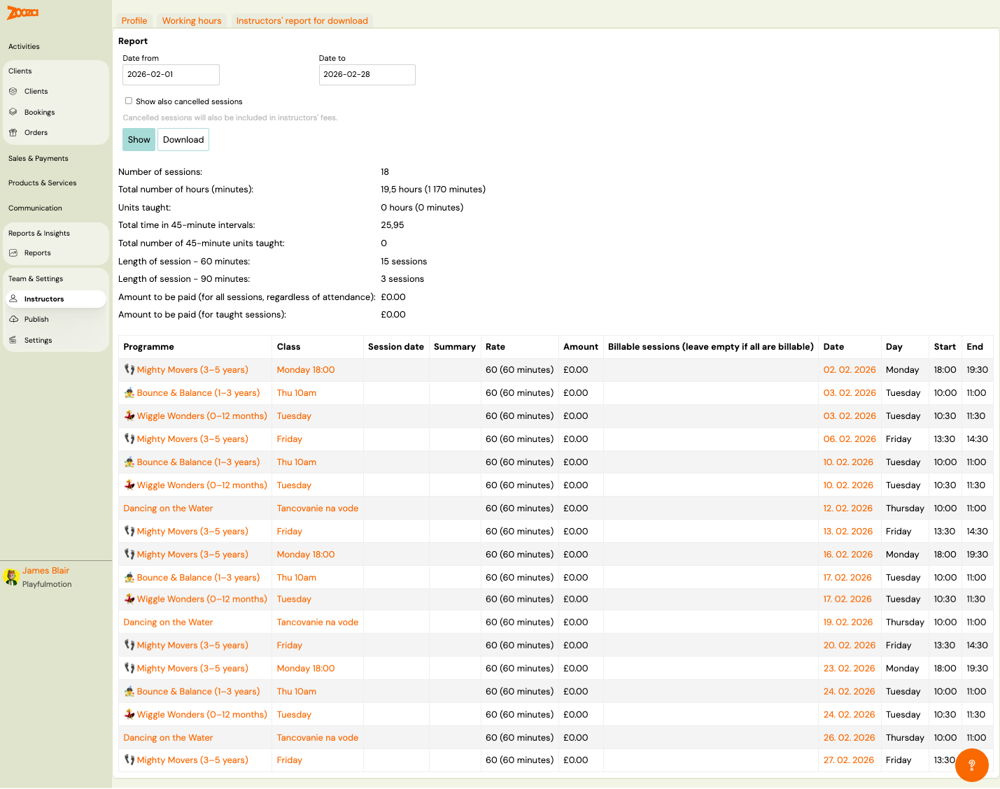

# Instructors

The Instructors screen manages your team of instructors and account owners. Use it to add team members, manage profiles, set working hours, and download instructor reports.

> **Navigation:** Go to **Team & Settings** → **Instructors**.

## Top Actions

| Button | Description |
|---|---|
| **Add Instructor** | Create a new instructor (see [Instructor Profile](#instructor-profile)). |
| **Report** | Open the [Instructors Report for Download](#instructors-report-for-download). |

## Filter

- **Instructor's name** — search by name.

## Sort

- **Last name ascending** (default) — dropdown to change sort order.

## Instructor List

The header shows the total number of records.

Each row displays:

| Column | Description |
|---|---|
| `Name` | Instructor name (clickable link to profile). Shows "[No name]" if not set. |
| `Role` | "Owner" or "Instructor". |
| `Phone` | Phone number (clickable). |
| `Email` | Email address (clickable). |

Pagination shows total pages and results count.

## Instructor Profile

> **Navigation:** Instructors → click an instructor name, or **Add Instructor**.

The instructor detail has three tabs: **Profile**, **Working hours**, and **Instructors' report for download**.

### Profile

| Field | Description |
|---|---|
| `Name` | First name. Required. |
| `Surname` | Last name. Required. |
| `Email address` | Email address. Required. |
| `Phone number` | Phone number. Required. |
| `Nickname` | Display nickname for clients. |
| `Show nicknames only` | When active, clients can only see the nickname. |
| `Role` | Dropdown — "Owner" or "Instructor". The owner can delete and create new categories. The instructor can manage attendance records and individual bookings. |
| `Internal note` | Free-text note visible only to owners. |

Button: **Save**.

### Rates

Below the profile section, the instructor's pay rates are listed (e.g. "60 (for 60 minutes)"). Click the edit icon to modify rates.

## Working Hours

> **Navigation:** Instructor detail → **Working hours** tab.

A monthly calendar view showing the instructor's scheduled sessions and availability.

| Action | Description |
|---|---|
| **Add availability** | Add a new availability block. |
| **Mass editing: Activate** | Enable bulk editing of availability. |
| Month navigation | **Previous month** / **Next month** buttons. |

The calendar shows days of the week (S–S) with hourly time slots (07:00–21:00). Green blocks indicate scheduled sessions.

## Instructors' Report for Download

> **Navigation:** Instructor detail → **Instructors' report for download** tab, or Instructors list → **Report**.

### Report Filters

| Field | Description |
|---|---|
| `Date from` | Start date for the report period. |
| `Date to` | End date for the report period. |
| `Show also cancelled sessions` | Check to include cancelled sessions in instructor fees. |
| `Select instructors` | **All instructors** or **Selected instructors (as currently filtered)**. |

Buttons: **Download** and **Back**.

### Report Detail (Show)

Summary statistics:

| Metric | Description |
|---|---|
| `Number of sessions` | Total sessions in the period. |
| `Total number of hours (minutes)` | Total teaching time. |
| `Units taught` | Number of units actually taught. |
| `Total time in 45-minute intervals` | Time converted to 45-minute units. |
| `Total number of 45-minute units taught` | Units taught in 45-minute intervals. |
| `Length of session – 60 minutes` | Count of 60-minute sessions. |
| `Length of session – 90 minutes` | Count of 90-minute sessions. |
| `Amount to be paid (for all sessions, regardless of attendance)` | Pay for all scheduled sessions. |
| `Amount to be paid (for taught sessions)` | Pay only for sessions actually taught. |

### Session Table

| Column | Description |
|---|---|
| `Programme` | Programme name with icon (clickable link). |
| `Class` | Class name (clickable link). |
| `Session date` | Date of the session. |
| `Summary` | Session summary. |
| `Rate` | Pay rate (e.g. "60 (60 minutes)"). |
| `Amount` | Payment amount. |
| `Billable sessions` | Checkbox — leave empty if all are billable. |
| `Date` | Session date. |
| `Day` | Day of the week. |
| `Start` | Start time. |
| `End` | End time. |

Buttons: **Show** (view report) and **Download** (export).

## Related

- [Instructor Access FAQ](../faq/instructor-access-faq.md) — common questions about instructor permissions.
- [Instructor Rate Guide](../setup/instructor-rate-reward.md) — how to set up instructor pay rates.
