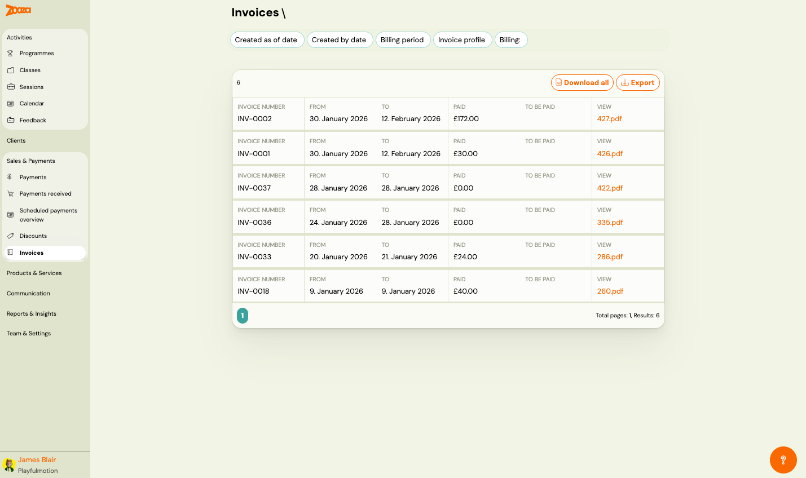

# Invoices

The Invoices screen lists all generated invoices across your bookings. Use it to search, filter, download, and export invoices.

> **Navigation:** Go to **Sales & Payments** → **Invoices**.

## Filters

Use the filter bar at the top to narrow the list:

- **Created as of date** — filter by creation date.
- **Created by date** — filter by the date range when invoices were created.
- **Billing period** — filter by billing period.
- **Invoice profile** — filter by invoice profile/template.
- **Billing** — filter by billing status.

## Top Actions

| Button | Description |
|---|---|
| **Download all** | Download all invoices as a batch (ZIP). |
| **Export** | Export the invoice list data. |

## Invoice List

The header shows the total number of invoices.

Each row displays:

| Column | Description |
|---|---|
| `Invoice number` | Unique invoice identifier (e.g. "INV-0002"). |
| `From` | Invoice period start date. |
| `To` | Invoice period end date. |
| `Paid` | Amount paid on this invoice. |
| `To be paid` | Remaining amount (empty if fully paid). |
| `View` | Link to download the invoice PDF (e.g. "427.pdf"). |

Pagination shows total pages and results count.

## Related

- [Billing and invoicing](../setup/billing-and-invoicing.md) — setting up billing profiles and invoice generation.
- [Xero Integration Guide](../setup/xero-integration.md) — how to connect Zooza with Xero for invoicing.
- [Xero Invoicing FAQ](../faq/xero-invoicing-faq.md) — common questions about Xero integration.
