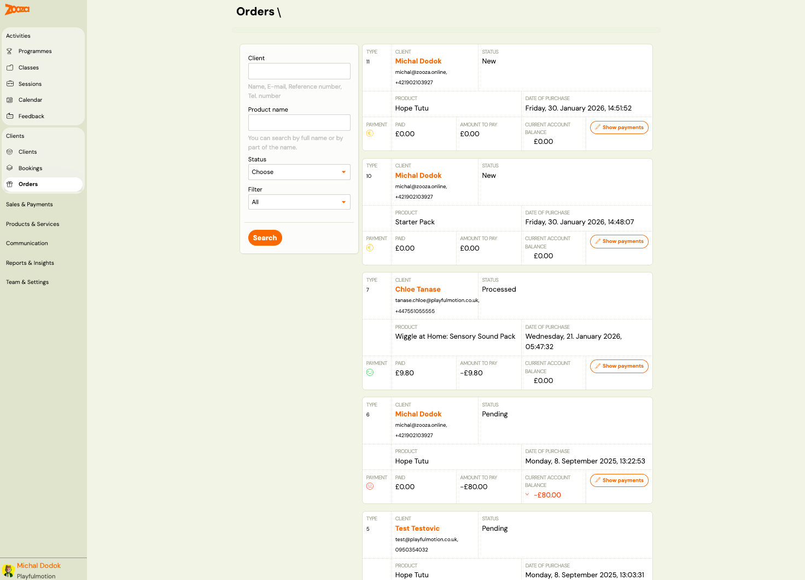
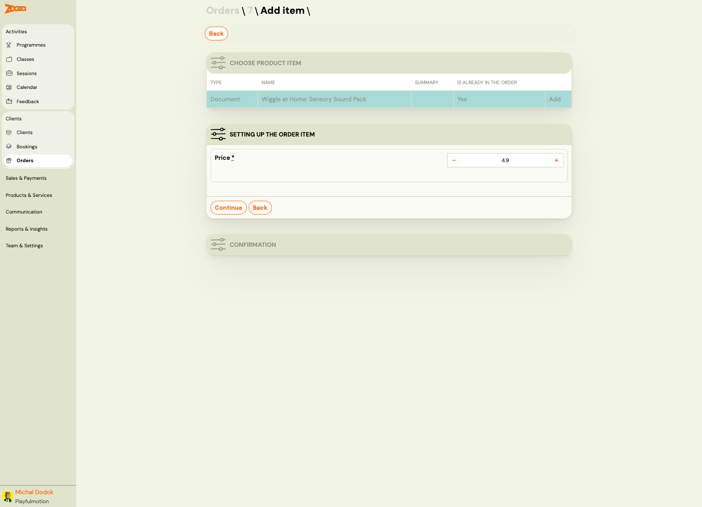

# Orders

The Orders screen lists all product orders placed by clients. Use it to track order status, manage payments, and add items to existing orders.

> **Navigation:** Go to **Clients** → **Orders**.

## List View

Each order card shows:

| Field | Description |
|---|---|
| `Type` | Order number. |
| `Client` | Client name, email, and phone number. |
| `Status` | Order status — "New", "Pending", or "Processed". |
| `Product` | Product name (e.g. "Hope Tutu", "Starter Pack"). |
| `Date of purchase` | Timestamp of the order. |
| `Payment` | Payment status icon (green = paid, red = overdue). |
| `Paid` | Amount paid. |
| `Amount to pay` | Outstanding amount (negative = owed). |
| `Current account balance` | Client's running balance — red if negative. |

Each order has a **Show payments** action button.

### Filters

The left sidebar provides filters:

- **Client** — search by full name or part of the name, email, reference number, or phone.
- **Product name** — search by product name.
- **Status** — dropdown to filter by order status.
- **Filter** — additional filter dropdown (default: "All").

Click **Search** to apply filters.

## Order Detail

Click an order card to open the detail page.

### Payments Card

| Field | Description |
|---|---|
| `Payments status` | Status icon with label (e.g. "Paid"). |
| `Amount to be paid` | Outstanding amount. |
| `Paid` | Total amount paid. |
| `Remaining balance` | Remaining balance after payments. |

Buttons: **Add payment** and **View payments**.

### Order Card

| Field | Description |
|---|---|
| `Product` | Product name (clickable link). |
| `Related booking` | Linked booking number (clickable link). |
| `Date of purchase` | Timestamp. |
| `Order status` | Current status (e.g. "Processed"). |

Action buttons:

- **Relink** — link the order to a different booking.
- **Unlink booking** — remove the booking association.
- **Delete** — permanently delete the order.

### Client Card

| Field | Description |
|---|---|
| `Name` | Client name (clickable link). |
| `Email` | Client email address. |
| `Phone` | Client phone number. |

Button: **Go to client** — opens the client profile.

### Order Items

Table listing all items in the order:

| Column | Description |
|---|---|
| `Product` | Product name. |
| `Type` | Item type (e.g. "Document"). |
| `Name` | Display name (clickable link to the product). |
| `Summary` | Item summary/description. |
| `Price` | Item price. |
| **Delete** | Remove the item from the order. |

Button: **Add item to order** — opens the add item wizard.

## Add Item to Order

> **Navigation:** Order detail → **Add item to order**.

### Step 1: Choose Product Item

Table showing available products:

| Column | Description |
|---|---|
| `Type` | Product type (e.g. "Document"). |
| `Name` | Product name. |
| `Summary` | Product description. |
| `Is already in the order` | "Yes" if the item is already added. |

Click **Add** to select a product.

### Step 2: Setting Up the Order Item

| Field | Description |
|---|---|
| `Price` | Item price with +/- controls to adjust. |

Click **Continue** to add the item, or **Back** to return.

A final **Confirmation** step completes the process.

## Related

- [Selling Products During Booking](../guides/selling-products-during-registration.md) — how to offer products at booking time.
