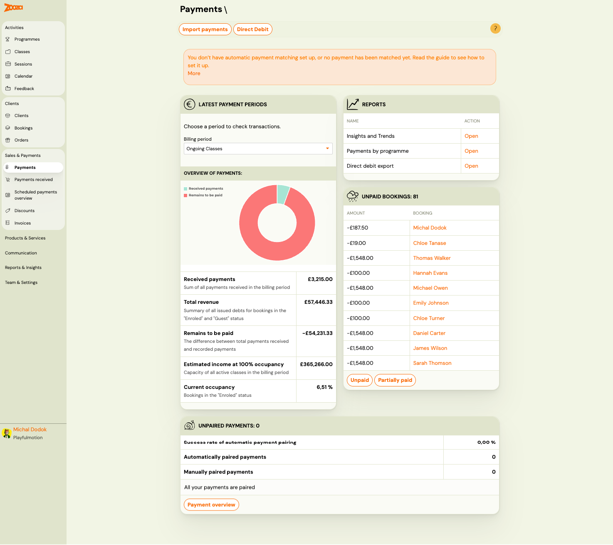
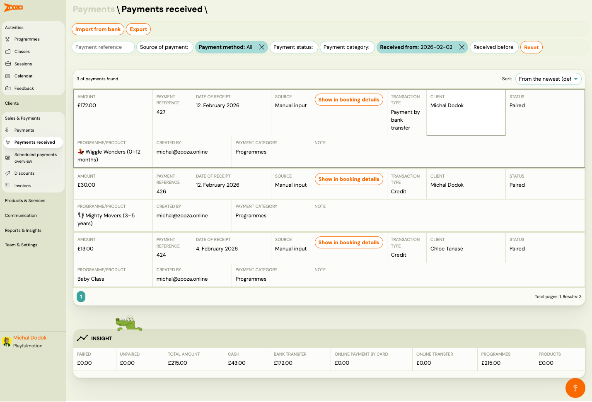
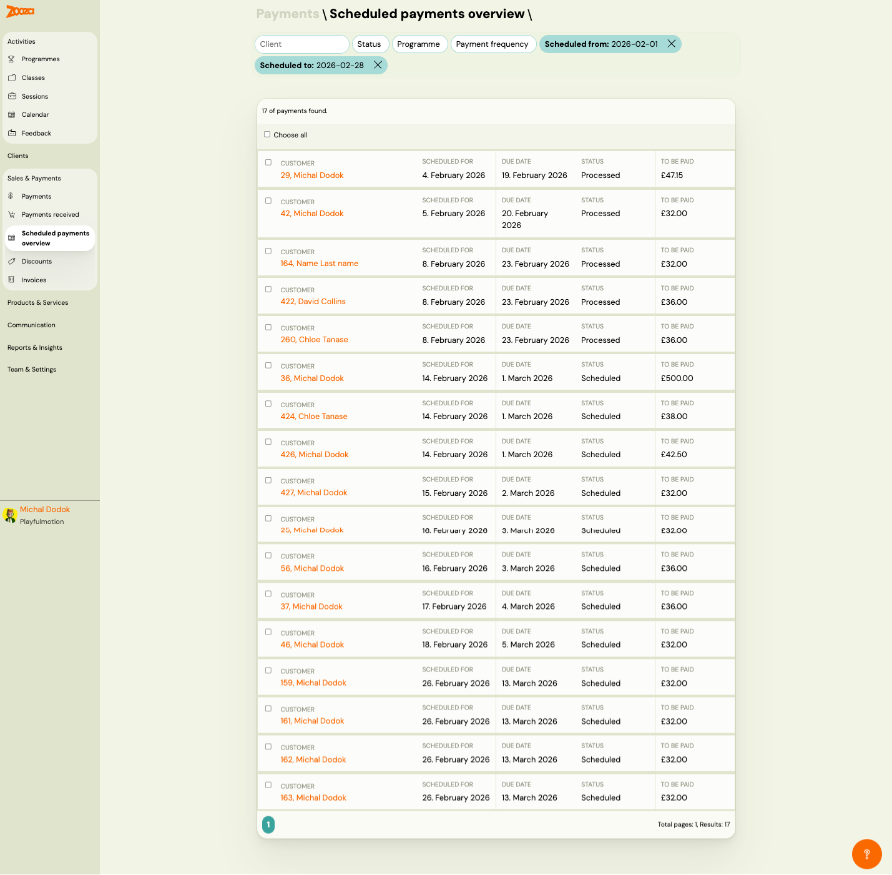
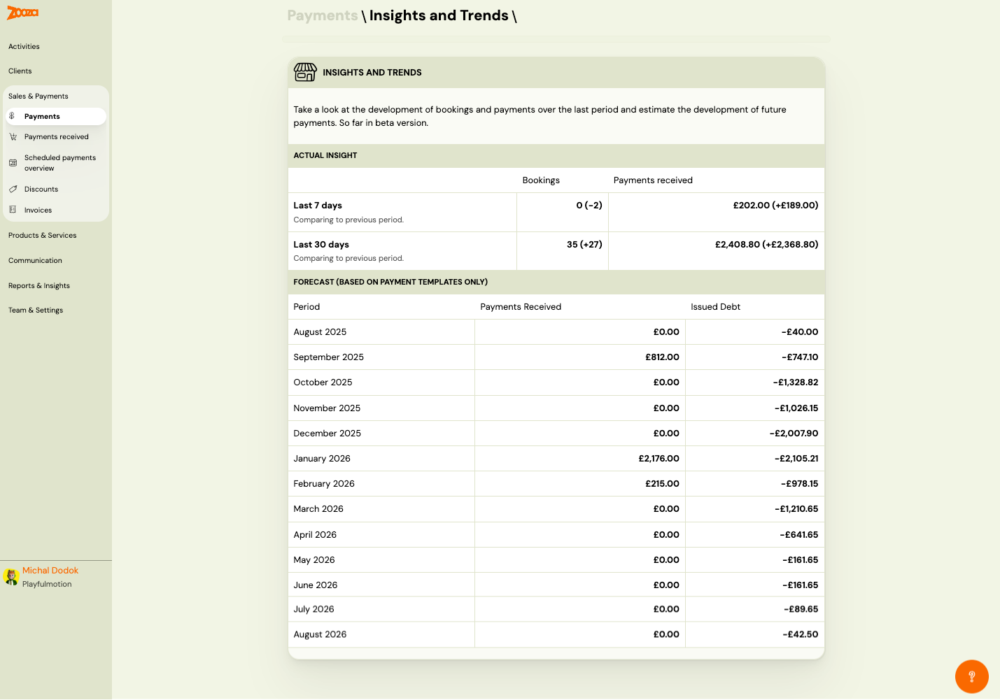
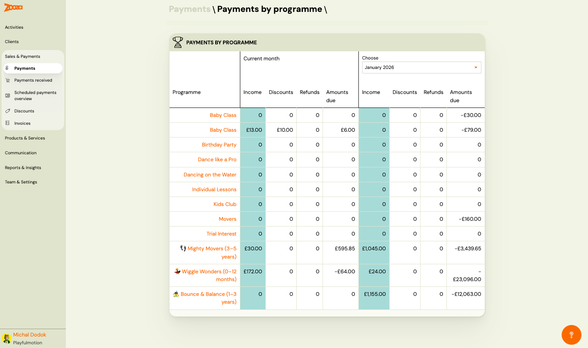
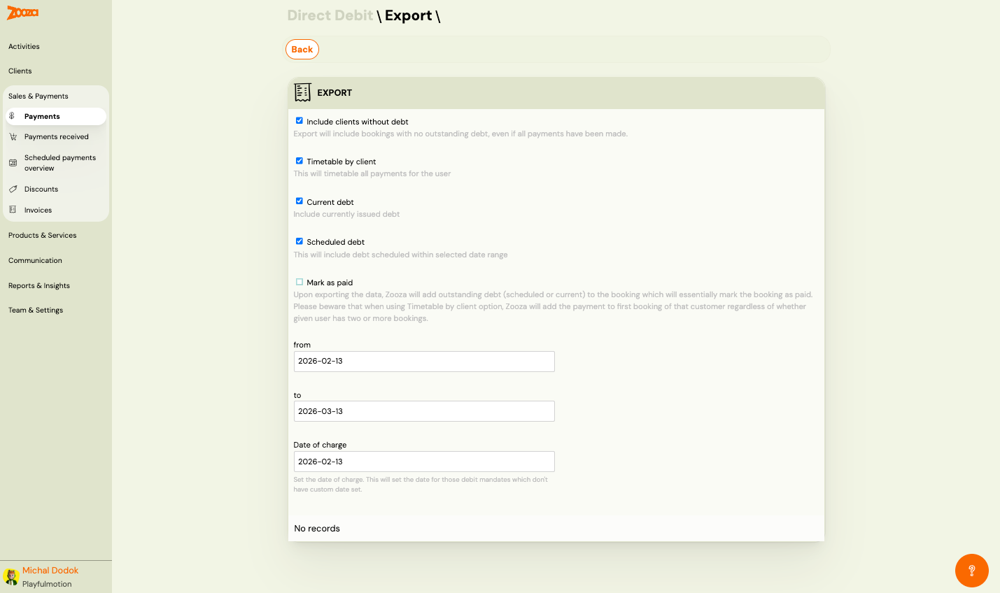

# Payments

The Payments screen is the central hub for managing all financial transactions. It provides an overview of received payments, outstanding balances, unpaid bookings, and payment pairing status.

> **Navigation:** Go to **Sales & Payments** → **Payments**.

## Dashboard

### Top Actions

| Button | Description |
|---|---|
| **Import payments** | Import bank payment data for automatic pairing. |
| **Direct Debit** | Opens the direct debit export screen (see [Direct Debit Export](#direct-debit-export)). |

### Latest Payment Periods

Select a billing period to view transactions for that period.

| Field | Description |
|---|---|
| `Billing period` | Dropdown to select a period (e.g. "Ongoing Classes"). |

#### Overview of Payments

A donut chart shows the split between received payments (green) and remaining amounts (red).

| Metric | Description |
|---|---|
| `Received payments` | Sum of all payments received in the billing period. |
| `Total revenue` | Summary of all issued debts for bookings in "Enrolled" and "Guest" status. |
| `Remains to be paid` | Difference between total revenue and received payments. |
| `Estimated income at 100% occupancy` | Capacity of all active classes in the billing period. |
| `Current occupancy` | Percentage of bookings in "Enrolled" status vs. total capacity. |

### Reports

Quick access to payment reports:

| Report | Description |
|---|---|
| **Insights and Trends** | Booking and payment trends over time (see [Insights and Trends](#insights-and-trends)). |
| **Payments by programme** | Breakdown of income, discounts, refunds, and amounts due per programme (see [Payments by Programme](#payments-by-programme)). |
| **Direct debit export** | Export direct debit data (see [Direct Debit Export](#direct-debit-export)). |

### Unpaid Bookings

Lists all bookings with outstanding balances, showing:

| Column | Description |
|---|---|
| `Amount` | Outstanding amount (negative = owed). |
| `Booking` | Client name (clickable link to booking). |

Filter buttons: **Unpaid** and **Partially paid**.

### Unpaired Payments

Shows payment pairing statistics:

| Metric | Description |
|---|---|
| `Success rate of automatic payment pairing` | Percentage of payments automatically matched. |
| `Automatically paired payments` | Count of auto-paired payments. |
| `Manually paired payments` | Count of manually paired payments. |

If all payments are paired, shows "All your payments are paired."

Button: **Payment overview** — opens detailed payment pairing view.

## Payments Received

> **Navigation:** **Sales & Payments** → **Payments received**.

### Top Actions

| Button | Description |
|---|---|
| **Import from bank** | Import bank statement data for payment matching. |
| **Export** | Export the payments received list. |

### Filters

- **Payment reference** — search by reference number.
- **Source of payment** — filter by source.
- **Payment method** — filter by method (e.g. "All"). Active filters show as highlighted chips with an X to remove.
- **Payment status** — filter by status.
- **Payment category** — filter by category.
- **Received from** — start date filter.
- **Received before** — end date filter.
- **Reset** — clear all filters.

Sort: **From the newest** (default).

### Payment List

Each payment card shows:

| Field | Description |
|---|---|
| `Amount` | Payment amount. |
| `Payment reference` | Reference number. |
| `Date of receipt` | When payment was received. |
| `Source` | "Manual input", "Zooza", "Bank import", etc. |
| **Show in booking details** | Link to the related booking. |
| `Transaction type` | E.g. "Payment by bank transfer", "Credit". |
| `Client` | Client name. |
| `Status` | "Paired" or "Unpaired". |
| `Programme/Product` | Programme or product name. |
| `Created by` | User who recorded the payment. |
| `Payment category` | E.g. "Programmes". |
| `Note` | Additional notes. |

Pagination shows total pages and results count.

### Insight

Summary bar at the bottom:

| Metric | Description |
|---|---|
| `Paired` | Total paired amount. |
| `Unpaired` | Total unpaired amount. |
| `Total amount` | Sum of all payments. |
| `Cash` | Cash payments total. |
| `Bank transfer` | Bank transfer total. |
| `Online payment by card` | Card payments total. |
| `Online transfer` | Online transfer total. |
| `Programmes` | Programme-related payments. |
| `Products` | Product-related payments. |

## Scheduled Payments Overview

> **Navigation:** **Sales & Payments** → **Scheduled payments overview**.

### Filters

- **Client** — search by client name.
- **Status** — filter by payment status.
- **Programme** — filter by programme.
- **Payment frequency** — filter by frequency type.
- **Scheduled from** — start date (active filters show as highlighted chips).
- **Scheduled to** — end date.

### Payment List

Each row shows:

| Column | Description |
|---|---|
| Checkbox | Select for bulk actions. |
| `Customer` | Booking number and client name (clickable link). |
| `Scheduled for` | Date the payment is scheduled for. |
| `Due date` | Payment due date. |
| `Status` | "Processed" or "Scheduled". |
| `To be paid` | Amount to be paid. |

**Choose all** checkbox at the top selects all visible payments.

Pagination shows total pages and results count.

## Insights and Trends

> **Navigation:** **Sales & Payments** → **Payments** → Reports → **Insights and Trends**.

> **Note:** This feature is currently in beta.

### Actual Insight

Compares current performance to previous periods:

| Period | Bookings | Payments received |
|---|---|---|
| **Last 7 days** | Count with change vs. previous period (e.g. "0 (−2)"). | Amount with change (e.g. "£202.00 (+£189.00)"). |
| **Last 30 days** | Count with change (e.g. "35 (+27)"). | Amount with change (e.g. "£2,408.80 (+£2,368.80)"). |

### Forecast (Based on Payment Templates Only)

Monthly forecast table:

| Column | Description |
|---|---|
| `Period` | Month and year. |
| `Payments Received` | Actual or projected amount received. |
| `Issued Debt` | Debt issued for the period (negative = outstanding). |

## Payments by Programme

> **Navigation:** **Sales & Payments** → **Payments** → Reports → **Payments by programme**.

A table comparing current month and a selectable historical month:

| Column (per period) | Description |
|---|---|
| `Programme` | Programme name (clickable link). |
| `Income` | Total income received. |
| `Discounts` | Discounts applied. |
| `Refunds` | Refunds issued. |
| `Amounts due` | Outstanding amounts (negative = owed). |

The "Choose" dropdown on the right lets you select a comparison month.

## Direct Debit Export

> **Navigation:** **Sales & Payments** → **Payments** → **Direct Debit**.

Export direct debit data for your payment provider.

| Field | Description |
|---|---|
| `Include clients without debt` | Checkbox — include bookings with no outstanding debt. |
| `Timetable by client` | Checkbox — timetable all payments for the user. |
| `Current debt` | Checkbox — include currently issued debt. |
| `Scheduled debt` | Checkbox — include debt scheduled within the selected date range. |
| `Mark as paid` | Checkbox — upon export, Zooza adds outstanding debt to the booking and marks it as paid. **Warning:** when using "Timetable by client", payment is added to the first booking regardless of multiple bookings. |
| `from` | Start date for the export period. |
| `to` | End date for the export period. |
| `Date of charge` | The charge date set for debit mandates without a custom date. |

The export generates records for matching debit mandates. Shows "No records" if no matching mandates are found.

## Related

- [Payment Pairing Guide](../guides/payment-pairing.md) — how to match bank payments to bookings.
- [Automatic Payment Reminders](../guides/automatic-payment-reminders.md) — set up automated payment reminders.
- [Payments and Billing FAQ](../faq/payments-and-billing-faq.md) — common payment questions.
