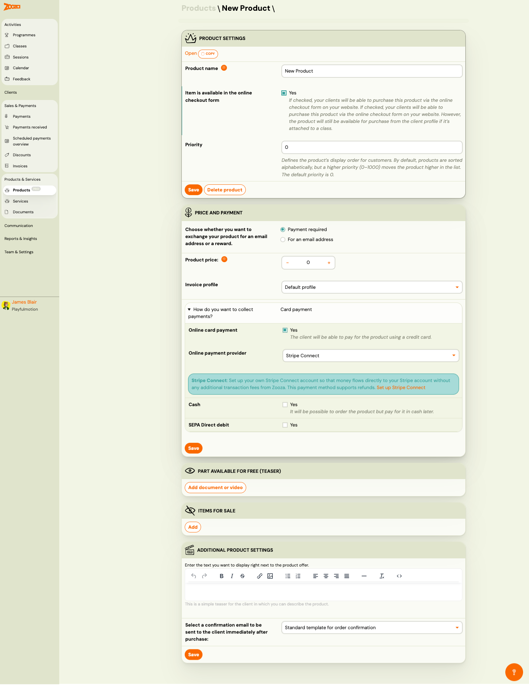
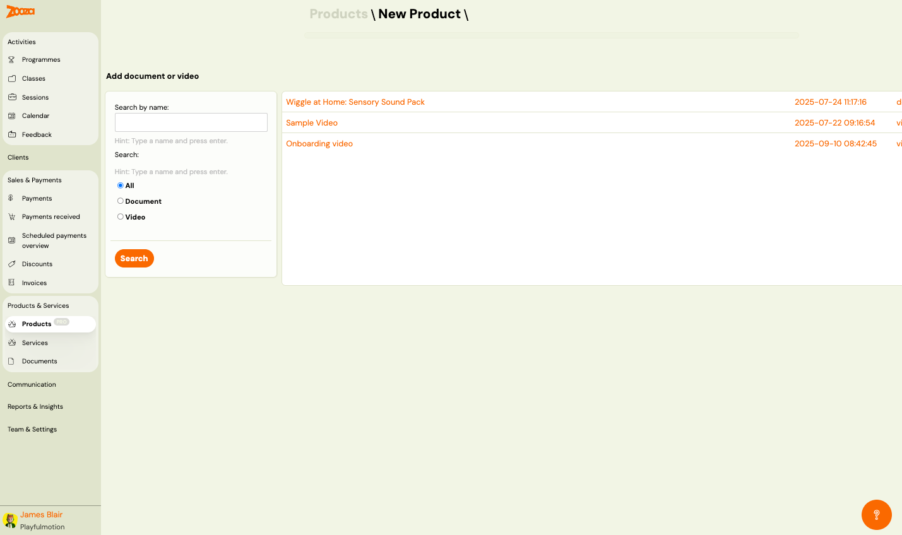
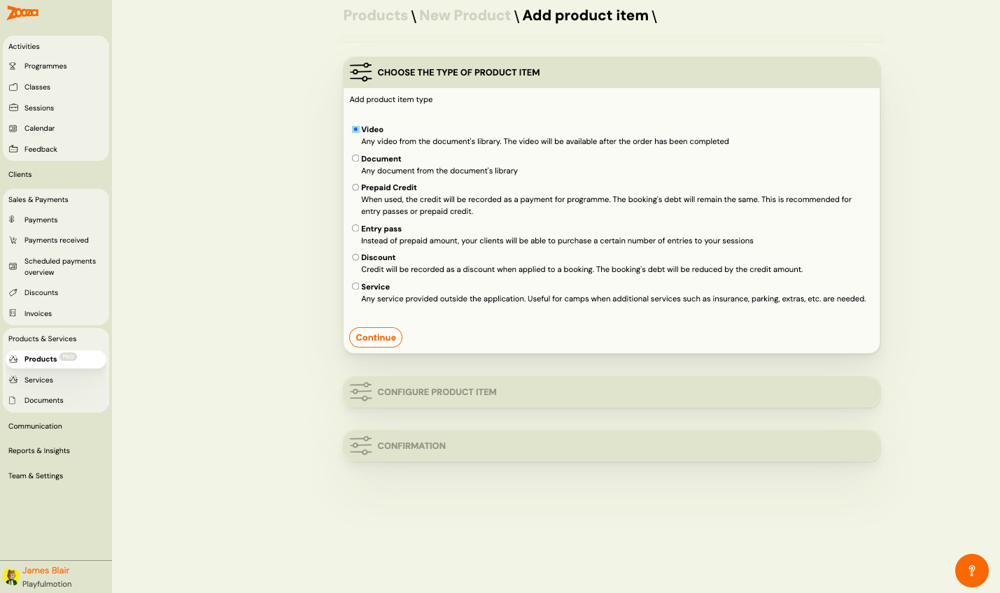
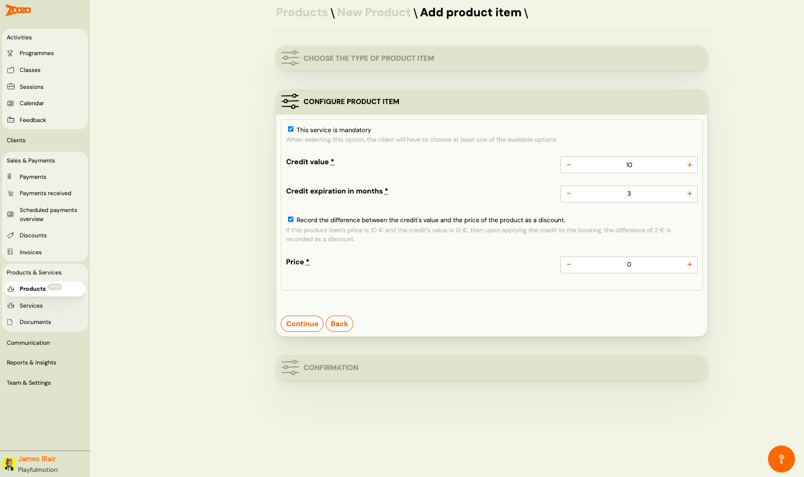
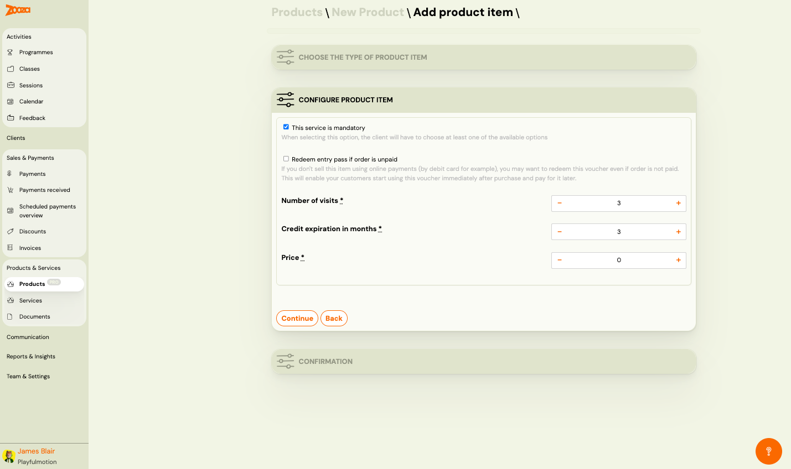
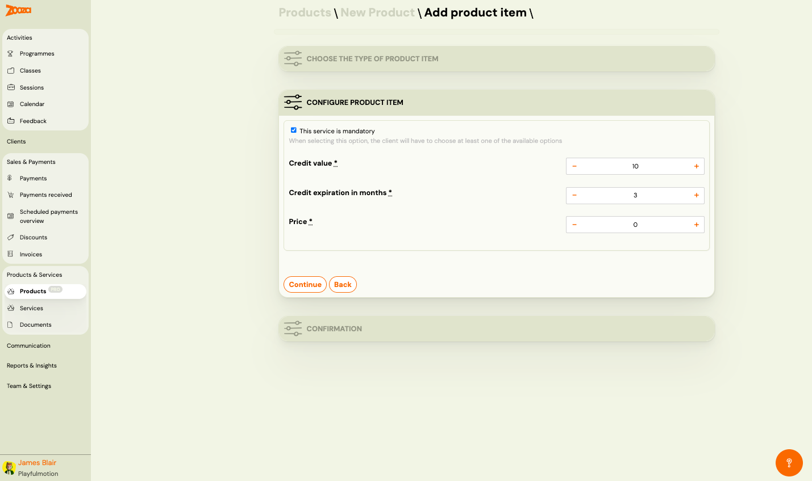

# Products

The Products screen manages all sellable products offered to clients during booking or separately. Use it to create products, configure pricing, attach digital items, and manage payment options. Requires PRO plan.

> **Navigation:** Go to **Products & Services** → **Products**.

## Top Actions

| Button | Description |
|---|---|
| **Add new product** | Create a new product (see [New Product](#new-product)). |
| **Services** | Switch to the [Services](services-list.md) list. |

## Filters

The left sidebar provides filters:

- **Search by name** — type a name and press Enter.
- **Filter — Select a product type:**
  - **All** — show all products.
  - **Simple products** — single-item products.
  - **Products bundle** — bundled products with multiple items.

Click **Search** to apply filters.

## Product List

The header shows the total number of records.

Each row displays:

| Column | Description |
|---|---|
| `Product` | Product name (clickable link to product detail). |
| `Type` | Product type — "product". |

Pagination shows total pages and results count.

## New Product

> **Navigation:** Products → **Add new product**.

### Product Settings

| Field | Description |
|---|---|
| **Open** / **Copy** | Top action buttons — open the product page or copy the product. |
| `Product name` | Display name of the product. Required. |
| `Item is available in the online checkout form` | Check **Yes** to allow clients to purchase via the online checkout form on your website. If unchecked, the product is still available from the client profile if attached to a class. |
| `Priority` | Display order for clients. Products are sorted alphabetically by default; higher priority (0–1000) moves the product higher. Default is 0. |

Buttons: **Save** and **Delete product**.

### Price and Payment

| Field | Description |
|---|---|
| `Choose whether you want to exchange your product for an email address or a reward` | **Payment required** (default) — client pays. **For an email address** — product is exchanged for an email (lead generation). |
| `Product price` | Price with +/− controls. |
| `Invoice profile` | Dropdown to select the invoice profile (e.g. "Default profile"). |

#### How Do You Want to Collect Payments?

| Field | Description |
|---|---|
| `Online card payment` | Check **Yes** to allow credit card payments. |
| `Online payment provider` | Dropdown — e.g. "Stripe Connect". |
| `Cash` | Check **Yes** to allow cash payments (order now, pay later). |
| `SEPA Direct debit` | Check **Yes** to allow SEPA direct debit payments. |

> **Stripe Connect:** Set up your own Stripe Connect account so that money flows directly to your Stripe account without any additional transaction fees from Zooza. This payment method supports refunds.

### Part Available for Free (Teaser)

| Button | Description |
|---|---|
| **Add document or video** | Attach a free teaser document or video that clients can preview before purchase. |

The picker lets you search and filter by type (**All**, **Document**, **Video**). Each item shows name, creation date, and type.

### Items for Sale

| Button | Description |
|---|---|
| **Add** | Add a product item (see [Add Product Item](#add-product-item)). |

### Additional Product Settings

| Field | Description |
|---|---|
| Text editor | Rich text editor for product description displayed next to the product offer. |
| `Select a confirmation email to be sent to the client immediately after purchase` | Dropdown to select the confirmation template (e.g. "Standard template for order confirmation"). |

## Add Product Item

> **Navigation:** New Product → Items for Sale → **Add**.

### Step 1: Choose the Type of Product Item

| Option | Description |
|---|---|
| **Video** | Any video from the document's library. The video will be available after the order has been completed. |
| **Document** | Any document from the document's library. |
| **Prepaid Credit** | When used, the credit will be recorded as a payment for programme. The booking's debt will remain the same. Recommended for entry passes or prepaid credit. |
| **Entry pass** | Instead of a prepaid amount, your clients will be able to purchase a certain number of entries to your sessions. |
| **Discount** | Credit will be recorded as a discount when applied to a booking. The booking's debt will be reduced by the credit amount. |
| **Service** | Any service provided outside the application. Useful for camps when additional services such as insurance, parking, extras, etc. are needed. |

Click **Continue** to proceed.

### Step 2: Configure Product Item

Configuration fields vary by item type:

#### Prepaid Credit

| Field | Description |
|---|---|
| `This service is mandatory` | When checked, the client must choose at least one of the available options. |
| `Credit value` | The monetary value of the credit. +/− controls. Required. |
| `Credit expiration in months` | How many months until the credit expires. +/− controls. Required. |
| `Record the difference between the credit's value and the price of the product as a discount` | If the product item's price is lower than the credit's value, the difference is recorded as a discount on the booking. |
| `Price` | Item price. +/− controls. Required. |

#### Entry Pass

| Field | Description |
|---|---|
| `This service is mandatory` | When checked, the client must choose at least one option. |
| `Redeem entry pass if order is unpaid` | If you don't sell this item using online payments, you may want to redeem this entry pass even if the order is not paid. Lets clients start using it immediately and pay later. |
| `Number of visits` | Number of session entries the pass grants. +/− controls. Required. |
| `Credit expiration in months` | Expiration period. +/− controls. Required. |
| `Price` | Item price. +/− controls. Required. |

#### Discount

| Field | Description |
|---|---|
| `This service is mandatory` | When checked, the client must choose at least one option. |
| `Credit value` | Discount monetary value. +/− controls. Required. |
| `Credit expiration in months` | Expiration period. +/− controls. Required. |
| `Price` | Item price. +/− controls. Required. |

### Step 3: Confirmation

Review and confirm the product item addition.

## Related

- [Services Reference](services-list.md) — manage service add-ons.
- [Documents Reference](documents-list.md) — manage documents and videos.
- [Selling Products During Booking](../guides/selling-products-during-booking.md) — how to offer products at booking time.
- [Orders Reference](orders-list.md) — track product orders.
