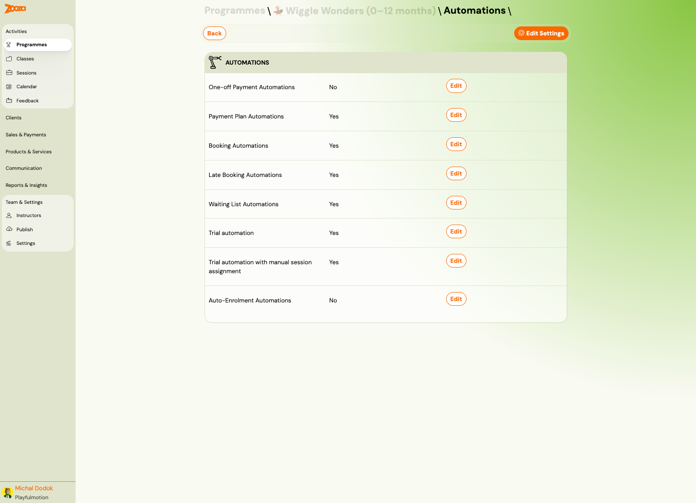
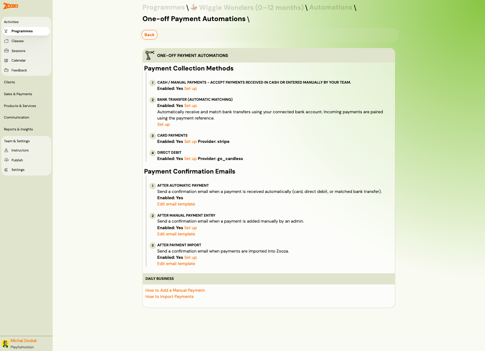
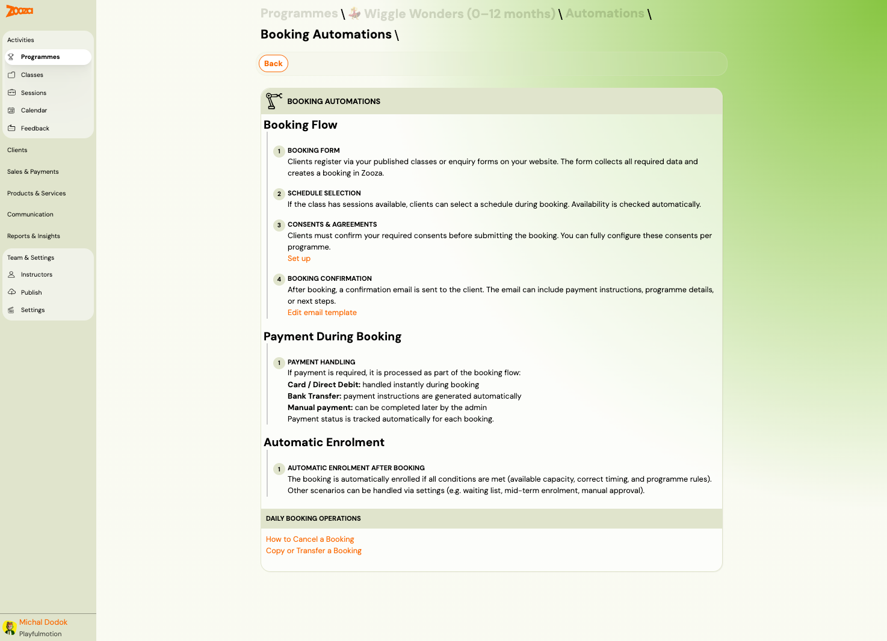
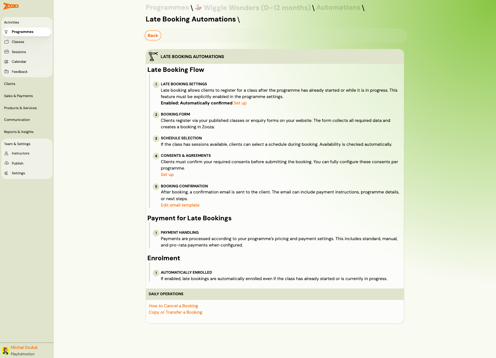
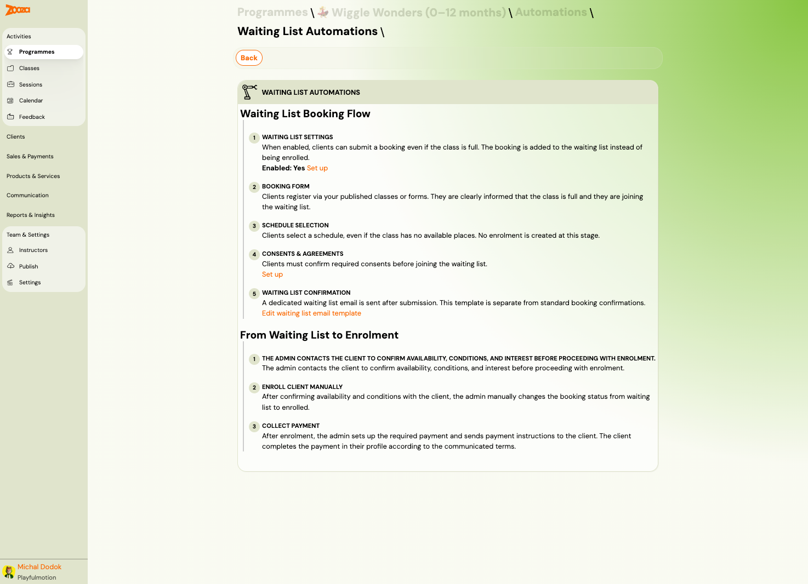
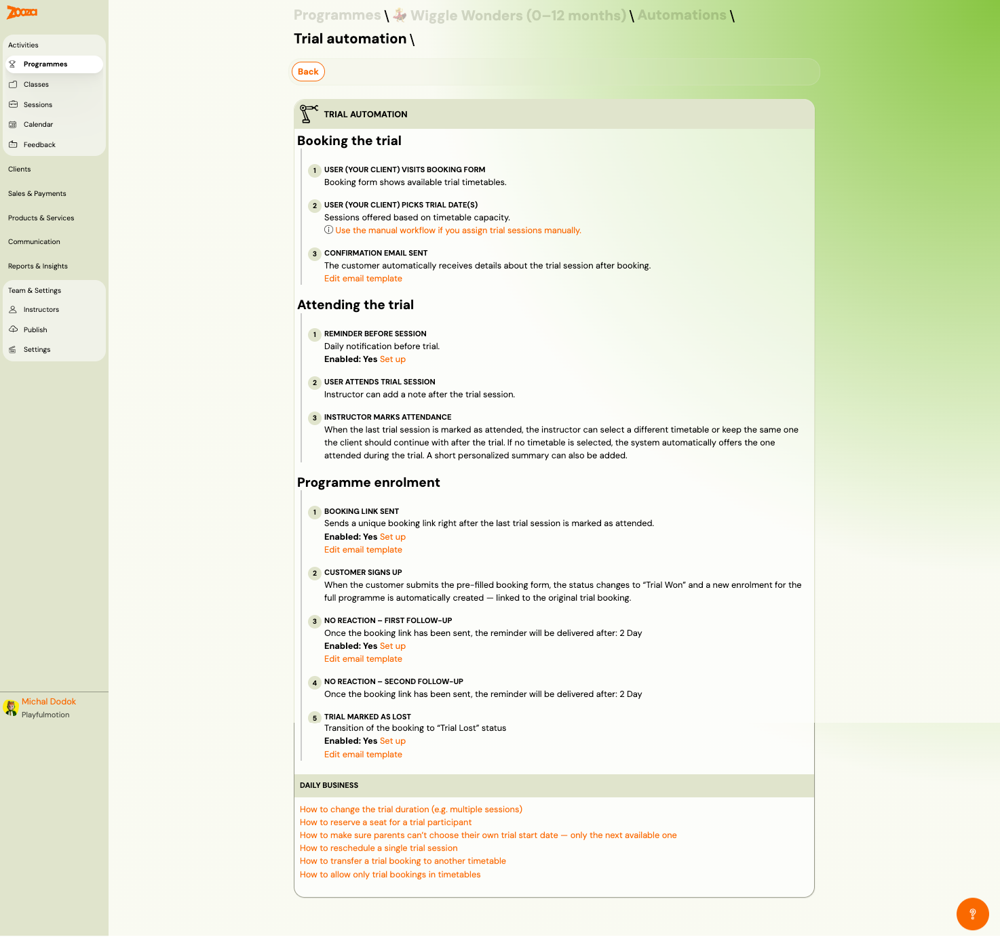
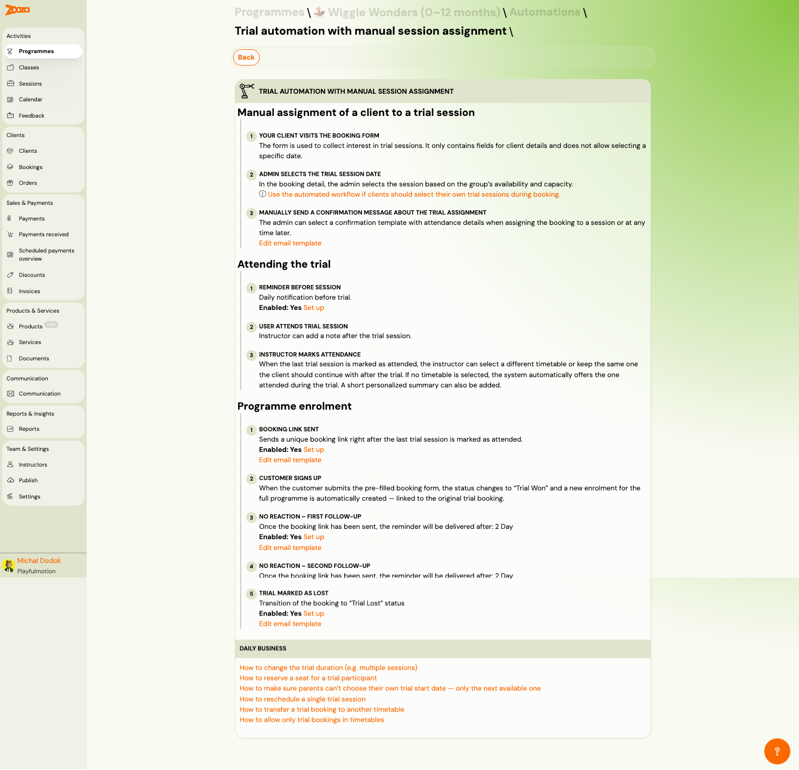
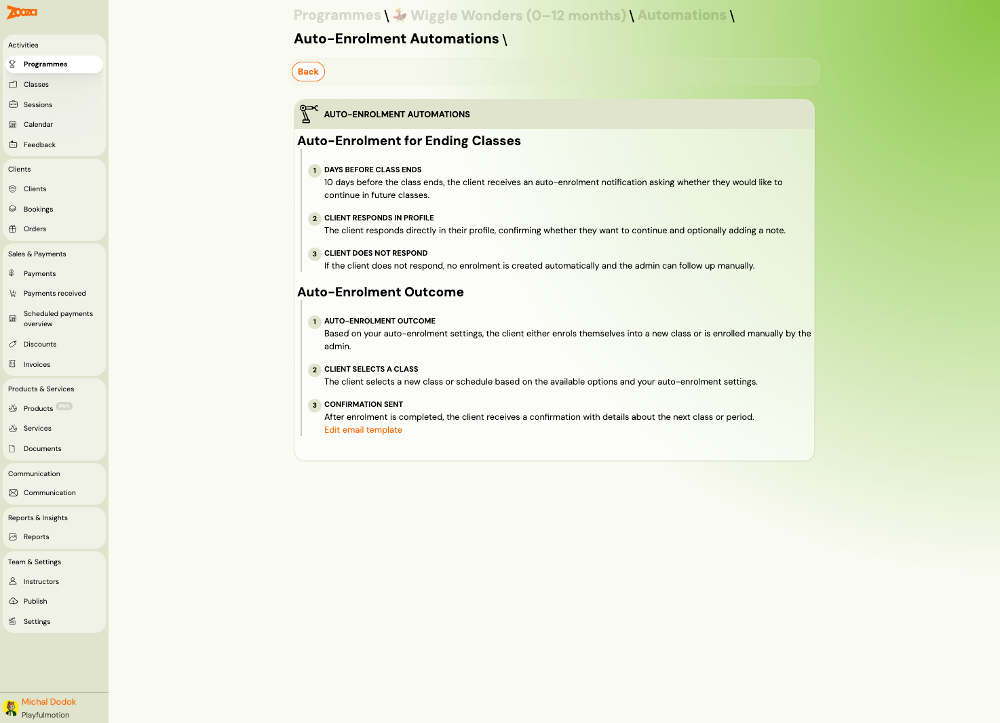

# Programme Automations

Automations define the workflows that run automatically when clients interact with your programme — booking, paying, joining trials, or getting enrolled. Each automation type describes a step-by-step flow with configurable email templates and behaviour.

> **Navigation:** Go to **Programmes** → select a programme → **Automations**.

## Automations Overview

The overview page lists all 8 automation types with their current status (Yes/No) and an **Edit** button for each.

| Automation | Description |
|---|---|
| **One-off Payment Automations** | Payment collection for programmes with a single payment. |
| **Payment Plan Automations** | Payment collection for programmes with scheduled/recurring payments. |
| **Booking Automations** | The standard booking flow — form, schedule, consents, confirmation. |
| **Late Booking Automations** | Handling bookings after the programme has already started. |
| **Waiting List Automations** | Flow when a class is full and the client joins the waiting list. |
| **Trial automation** | Automated trial-to-enrolment workflow. |
| **Trial automation with manual session assignment** | Trial workflow where the admin assigns sessions manually. |
| **Auto-Enrolment Automations** | Re-enrolment flow when a client's current class is ending. |

## One-off Payment Automations

Defines how payments are collected for programmes using a single payment model.

### Payment Collection Methods

1. **Cash / Manual Payments** — accept cash or manually entered payments.
2. **Bank Transfer (Automatic Matching)** — automatically match incoming bank transfers using the payment reference.
3. **Card Payments** — online card payments via Stripe.
4. **Direct Debit** — recurring collection via GoCardless.

Each method shows its enabled status and has a **Set up** link to configure.

### Payment Confirmation Emails

1. **After Automatic Payment** — sent when a payment is received via card, direct debit, or matched bank transfer.
2. **After Manual Payment Entry** — sent when an admin records a payment manually.
3. **After Payment Import** — sent when payments are imported into Zooza.

Each email template can be customized via the **Edit email template** link.

## Payment Plan Automations

Defines payment collection for programmes with scheduled/recurring payments. The structure is identical to One-off Payment Automations.

### Payment Collection Methods

Same four methods as One-off: Cash/Manual, Bank Transfer, Card Payments, Direct Debit.

### Payment Confirmation Emails

Same three triggers: After Automatic Payment, After Manual Payment Entry, After Payment Import.

### Daily Business Links

- How to Add a Manual Payment
- How to Import Payments

## Booking Automations

Defines the standard booking flow that clients go through when registering.

### Booking Flow

1. **Booking Form** — clients register via your published classes or enquiry forms. The form collects all required data and creates a booking in Zooza.
2. **Schedule Selection** — if the class has sessions available, clients can select a schedule during booking. Availability is checked automatically.
3. **Consents & Agreements** — clients confirm required consents before submitting. Consents are configurable per programme.
4. **Booking Confirmation** — a confirmation email is sent. The email can include payment instructions, programme details, or next steps.

### Payment During Booking

Payment is processed as part of the booking flow:

- **Card / Direct Debit** — handled instantly during booking.
- **Bank Transfer** — payment instructions are generated automatically.
- **Manual payment** — can be completed later by the admin.

Payment status is tracked automatically for each booking.

### Automatic Enrolment

The booking is automatically enrolled if all conditions are met (available capacity, correct timing, and programme rules). Other scenarios (waiting list, mid-term, manual approval) are handled via settings.

### Daily Booking Operations

- How to Cancel a Booking
- Copy or Transfer a Booking

## Late Booking Automations

Handles bookings submitted after the programme has already started or while it is in progress.

### Late Booking Flow

1. **Late Booking Settings** — must be explicitly enabled in programme settings. Controls whether clients can register mid-term.
2. **Booking Form** — same form as standard bookings.
3. **Schedule Selection** — availability checked automatically.
4. **Consents & Agreements** — same consent flow.
5. **Booking Confirmation** — confirmation email sent.

### Payment for Late Bookings

Payments follow the programme's pricing and payment settings, including standard, manual, and pro-rata (aliquot) payments when configured.

### Enrolment

If enabled, late bookings are automatically enrolled even if the class has already started or is in progress.

## Waiting List Automations

Defines the flow when a class is full and the client joins the waiting list.

### Waiting List Booking Flow

1. **Waiting List Settings** — when enabled, clients can submit a booking even if the class is full. The booking is placed on a waiting list.
2. **Booking Form** — clients are clearly informed that the class is full and they are joining the waiting list.
3. **Schedule Selection** — clients select a schedule even if no places are available. No enrolment is created.
4. **Consents & Agreements** — same consent flow.
5. **Waiting List Confirmation** — a dedicated waiting list email is sent (separate template from standard confirmations).

### From Waiting List to Enrolment

1. **Admin contacts the client** — confirms availability, conditions, and interest.
2. **Enroll client manually** — the admin changes the booking status from waiting list to enrolled.
3. **Collect payment** — the admin sets up payment and sends instructions. The client completes payment via their profile.

## Trial Automation

Automated workflow for trial sessions — from booking through attendance to enrolment or follow-up.

### Booking the Trial

1. **User visits booking form** — shows available trial timetables.
2. **User picks trial date(s)** — sessions are offered based on timetable capacity.
3. **Confirmation email sent** — automatic confirmation with trial session details.

### Attending the Trial

1. **Reminder before session** — daily notification before the trial. Configurable.
2. **User attends trial session** — instructor can add a note.
3. **Instructor marks attendance** — when the last trial session is marked attended, the instructor can select which timetable the client should continue with.

### Programme Enrolment

1. **Booking link sent** — unique enrolment link sent right after the last trial session is marked attended.
2. **Client signs up** — submitting the pre-filled form changes status to "Trial Won" and creates a full enrolment.
3. **No reaction — first follow-up** — reminder sent after a configurable number of days (e.g., 2 days).
4. **No reaction — second follow-up** — second reminder after additional days.
5. **Trial marked as lost** — booking transitions to "Trial Lost" status. Optional notification sent.

## Trial Automation with Manual Session Assignment

Similar to the standard trial automation but the admin assigns trial sessions manually instead of the client choosing dates.

### Manual Assignment Flow

1. **Client visits booking form** — the form collects interest and client details only (no date selection).
2. **Admin selects the trial session date** — in the booking detail, the admin picks the session based on availability and capacity.
3. **Manually send a confirmation message** — the admin selects a template with attendance details.

### Attending the Trial

Same as standard trial: reminder before session, attendance, instructor marks attendance.

### Programme Enrolment

Same follow-up flow: booking link sent, client signs up, follow-ups, trial lost.

## Auto-Enrolment Automations

Automated re-enrolment for clients whose current class is ending.

### Auto-Enrolment for Ending Classes

1. **Days before class ends** — the client receives a notification asking whether they want to continue.
2. **Client responds in profile** — confirms continuation and optionally adds a note.
3. **Client does not respond** — no enrolment is created. Admin can follow up manually.

### Auto-Enrolment Outcome

1. **Auto-enrolment outcome** — based on settings, the client either self-enrols or is enrolled by the admin.
2. **Client selects a class** — chooses a new class or schedule from available options.
3. **Confirmation sent** — the client receives a confirmation with details about the next class or period.

## Related

- [Programme Settings](programme-settings.md) — all settings tiles including trial and auto-enrolment configuration.
- [Programmes List](programmes-list.md) — the main programmes view.
- [Auto-Enrolment Setup](../setup/auto-enrollment.md) — step-by-step auto-enrolment configuration.
- [Automatic Payment Reminders Guide](../guides/automatic-payment-reminders.md) — configuring payment follow-ups.
- [Trials FAQ](../faq/trials-faq.md) — common trial questions.
- [Waiting List FAQ](../faq/waiting-list-faq.md) — waiting list behaviour.
