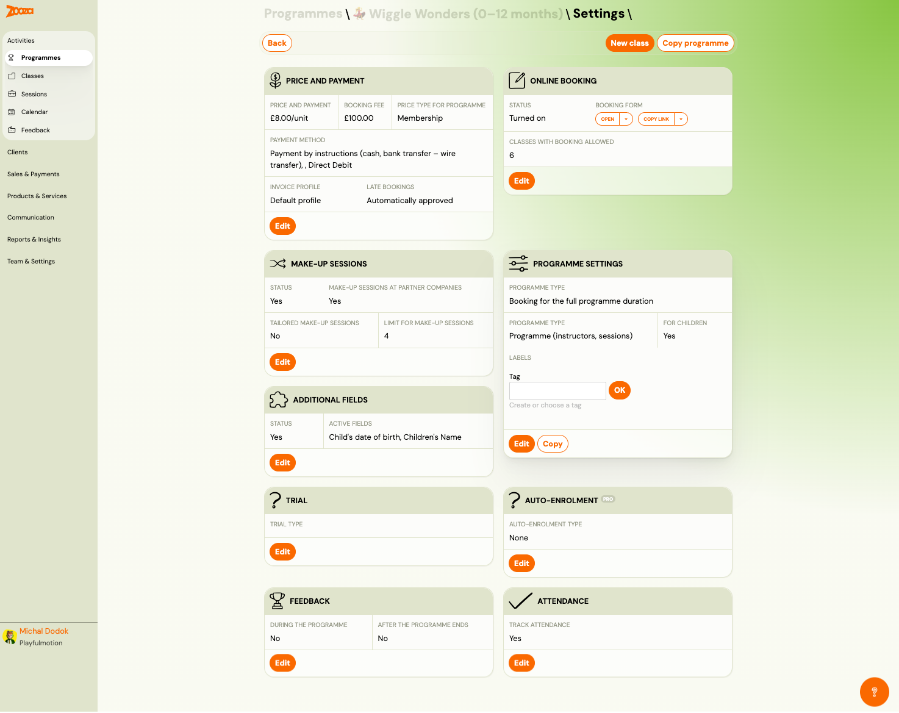
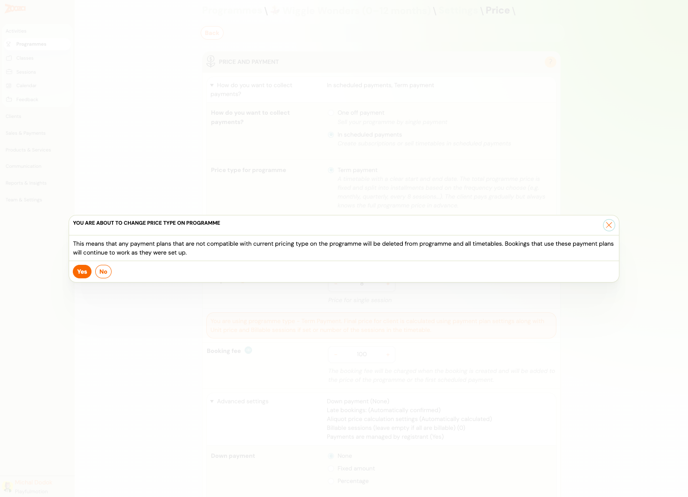
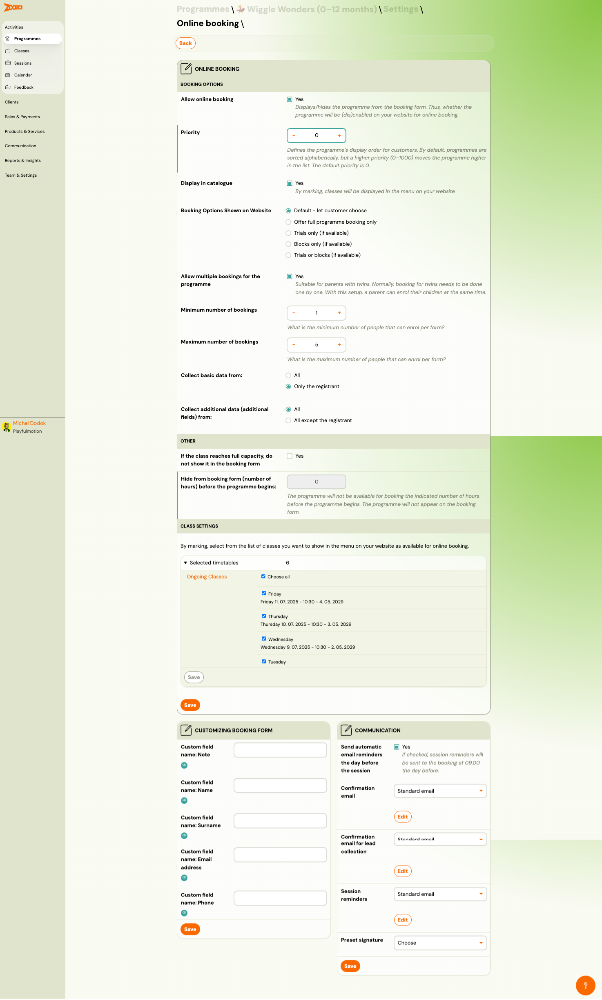
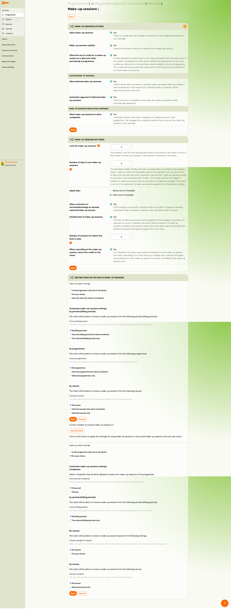
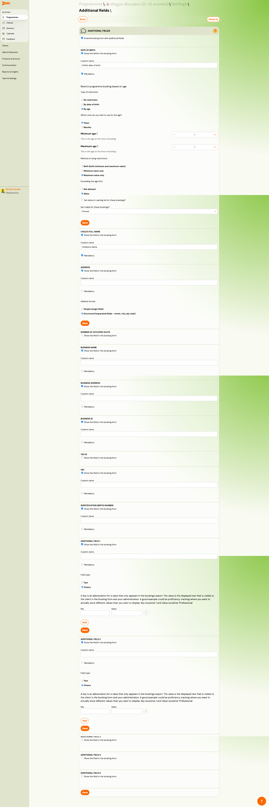
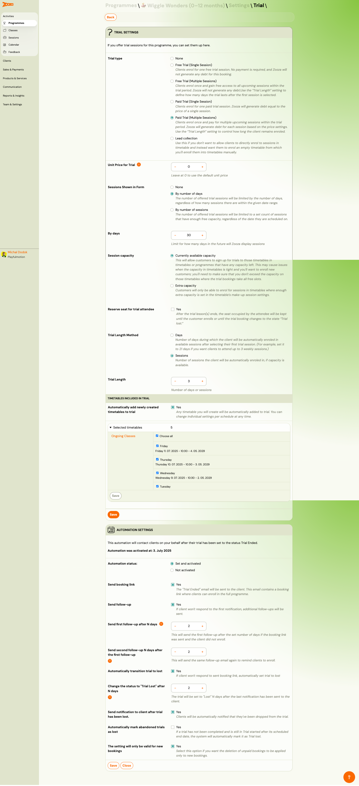
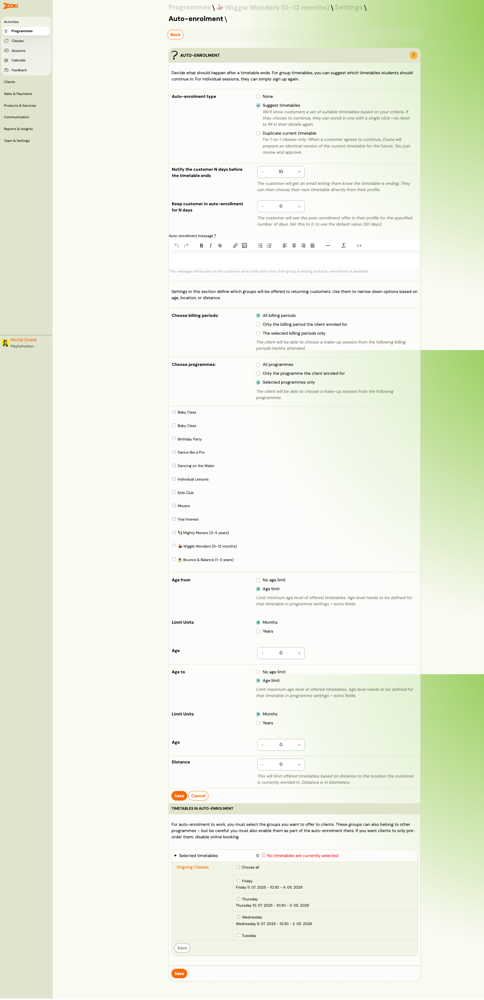
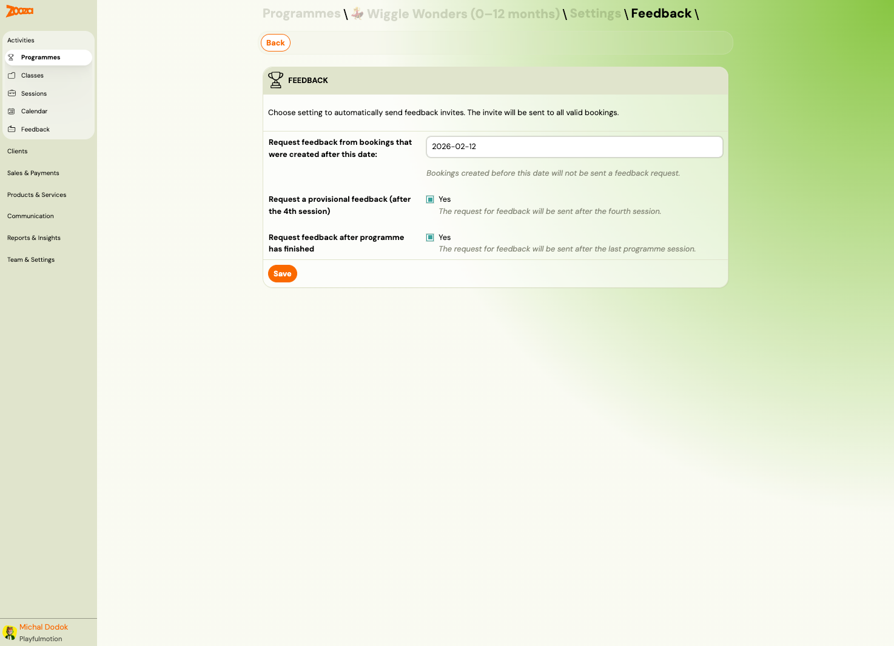
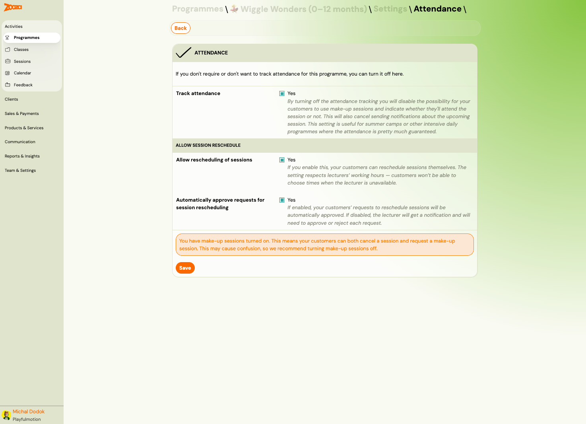

# Programme Settings

The Programme Settings page is a dashboard of configuration tiles. Each tile controls a different aspect of the programme. Open it by clicking **Edit Settings** on a programme detail page.

> **Navigation:** Go to **Programmes** → select a programme → **Edit Settings**.

## Settings Overview

The dashboard shows 10 tiles at a glance. Each tile displays a summary of current values and an **Edit** button to open the full editor.

| Tile | Summary shown |
|---|---|
| **Price and Payment** | Unit price, booking fee, price type, payment method, invoice profile, late bookings policy. |
| **Online Booking** | Status (on/off), booking form link, number of classes with booking allowed. |
| **Make-up Sessions** | Status, partner companies, tailored make-ups, session limit. |
| **Programme Settings** | Programme type, timetable type, for children flag, labels. |
| **Additional Fields** | Status, list of active fields (e.g., "Child's date of birth, Children's Name"). |
| **Trial** | Trial type (none, free, paid, etc.). |
| **Auto-Enrolment** | Auto-enrolment type (none, suggest timetables, duplicate). |
| **Feedback** | During programme (yes/no), after programme ends (yes/no). |
| **Attendance** | Track attendance (yes/no). |

Top-right buttons: **New class**, **Copy programme**.

## Price and Payment

Controls how much clients pay and how payments are collected.

| Field | Description |
|---|---|
| `How do you want to collect payments?` | **One off payment** — single charge. **In scheduled payments** — recurring (term, membership, subscription). |
| `Price type for programme` | **Term payment** — total price split into instalments by frequency. **Membership** — recurring charge at a fixed interval. |
| `Booking fee` | One-time fee charged at booking. |
| `Advanced settings` | Expandable section with: Down payment, Late bookings policy, Aliquot price calculation, Billable sessions, Payment managed by registrant. |
| `Down payment` | None, Fixed amount, or Percentage of total price. |

When changing the price type, a confirmation dialog warns that incompatible payment plans will be deleted from the programme and all timetables.

## Online Booking

Controls how the programme appears on your public booking forms.

### Booking Options

| Field | Description |
|---|---|
| `Allow online booking` | Master toggle — shows/hides the programme on your website. |
| `Priority` | Display order (0–1000). Higher priority = higher in the list. Default: 0. |
| `Display in catalogue` | Show classes in the website menu. |
| `Booking Options Shown on Website` | **Default** — client chooses. **Full programme only**, **Trials only**, **Blocks only**, **Trials or blocks**. |
| `Allow multiple bookings for the programme` | Enables parents to enrol multiple children at once (e.g., twins). |
| `Minimum / Maximum number of bookings` | Min and max children per form submission. |
| `Collect basic data from` | **All** enrolled or **Only the registrant**. |
| `Collect additional data from` | **All** enrolled or **All except the registrant**. |

### Other

| Field | Description |
|---|---|
| `If the class reaches full capacity, do not show it in the booking form` | Hides full classes entirely (instead of showing "class full"). |
| `Hide from booking form N hours before the programme begins` | Auto-hides the programme before it starts. |

### Class Settings

Select which classes (timetables) are available for online booking. Toggle individual classes or use **Choose all**.

### Customizing Booking Form

| Field | Description |
|---|---|
| `Custom field name: Note` | Custom label for the note field. |
| `Custom field name: Name` | Custom label for the name field. |
| `Custom field name: Surname` | Custom label for the surname field. |
| `Custom field name: Email address` | Custom label for the email field. |
| `Custom field name: Phone` | Custom label for the phone field. |

### Communication

| Field | Description |
|---|---|
| `Send automatic email reminders the day before the session` | Sends reminders at 09:00 the day before. |
| `Confirmation email` | Template used after booking. Click **Edit** to customize. |
| `Confirmation email for lead collection` | Separate template for lead-collection timetables. |
| `Session reminders` | Template for session reminder emails. |
| `Preset signature` | Select a pre-configured email signature. |

## Make-up Sessions

Controls whether clients can book replacement sessions for missed classes.

### Make-up Sessions Options

| Field | Description |
|---|---|
| `Allow make-up sessions` | Master toggle. |
| `Make-up sessions method` | How clients access make-ups (notified, self-service, etc.). |
| `Allow the use of credits for a make-up session` | Enables credit-based make-up redemption. |
| `Allow tailored make-up sessions` | Lets clients request a tailored (custom) make-up session. |
| `Automatic approval of tailored make-ups` | Auto-approves or requires admin review. |
| `Allow make-up sessions at other companies` | Partner company make-ups (cross-company). |

### Make-up Sessions Settings

| Field | Description |
|---|---|
| `Limit for make-up sessions` | Maximum number of make-ups per client per period (e.g., 4). |
| `Number of days to use make-up` | Deadline for using a make-up after the missed session. |
| `Apply filter` | "Before end of timetable" or "After end of timetable". |
| `Allow customers to purchase/exchange an already used make-up session` | Allows rebooking used make-ups. |
| `Flexible limit of make-up sessions` | Makes the limit soft — e.g., if limit is 3, client gets entitled to 3 make-ups every N sessions. |
| `When cancelling of the make-up by the client` | Controls what happens when a client cancels their make-up. |

### Restrictions on the Use of Make-up Sessions

Customize restrictions by:
- **Billing period** — limit make-ups to specific billing periods.
- **Programme** — limit to specific programmes.
- **Venue** — limit to specific locations.
- **Class** — limit to specific classes.

## Programme Settings (Basic Info)

Core programme identity and type.

### Basic Information

| Field | Description |
|---|---|
| `Programme name` | Public name shown on booking forms and your website. |
| `URL address` | Custom URL slug for the programme page. |
| `Programme description` | Rich text description shown during online booking. |
| `Archive` | Archive the programme (hides it from active lists). |

### Additional Settings

| Field | Description |
|---|---|
| `Programme type` | Programme (instructors, sessions) or other types. |
| `Target audience` | **Class Timetables** or **1-To-1 classes**. |
| `For children` | Uses child-oriented wording on booking forms. |

### Labels and Colour

- **Labels** — add tags to categorize the programme.
- **Colour** — select a colour for calendar display and visual identification. Choose from preset colours (each with a creative description) or use custom colours.

## Additional Fields

Configures extra data fields on the booking form.

| Field | Description |
|---|---|
| `Extend booking form with additional fields` | Master toggle. |
| `Date of birth` | Show on form, custom label, mandatory flag. Optionally restrict booking by age (min/max, by date of birth or by age). |
| `Child's full name` | Show on form, custom label, mandatory flag. |
| `Address` | Simple (single field) or Structured (street, city, zip code). |
| `Number of occupied slots` | Relevant for sessions (e.g., birthday parties). |
| `Business name` / `Business address` / `Business ID` / `Tax ID` / `VAT` | Business/invoice fields. |
| `Identification (birth) number` | National ID field. |
| `Additional field 1–5` | Custom fields with Text or Choice type. Choice fields use key/value pairs for export. |

## Trial

Configures trial session behaviour for the programme.

### Trial Settings

| Field | Description |
|---|---|
| `Trial type` | **None**, **Free Trial (Single Session)**, **Paid Trial (Single Session)**, **Free Trial (Multiple Sessions)**, **Lead collection** — each with different billing and session behaviour. |
| `Unit Price for Trial` | Price per trial session (if paid). |
| `Sessions Shown in Form` | **By number of days** — limited by date range. **By number of sessions** — limited by session count. **By dates** — specific date range. |
| `Session capacity` | **Currently available capacity** or **Force capacity** (override). |
| `Reserve seat for trial attendee` | Holds a spot during the trial period. |
| `Trial Length Method` | **Days** — number of days the trial remains active. **Sessions** — number of sessions. |
| `Trial Length` | Number of days or sessions. |

### Timetables Included in Trial

Select which timetables are available for trial bookings. Toggle **Automatically add newly created timetables to trial**.

### Automation Settings

| Field | Description |
|---|---|
| `Automation status` | Active/inactive toggle. |
| `Send booking link` | Sends an enrolment link after the trial ends. |
| `Send follow-up` | First follow-up email after N days. |
| `Send second follow-up` | Second reminder after additional N days. |
| `Automatically transition trial to lost` | Auto-marks abandoned trials as "Trial Lost". |
| `Change the status to "Trial Lost" after N days` | Timeout in days. |
| `Send notification to client after trial lost` | Notifies the client when their trial expires. |
| `Automatically mark abandoned trials` | Marks unattended trial bookings. |

## Auto-Enrolment

Controls what happens when a client's current class/timetable is ending.

| Field | Description |
|---|---|
| `Auto-enrolment type` | **None**, **Suggest timetables** (client picks from filtered options), **Duplicate current timetable** (1-to-1 classes only). |
| `Notify the customer N days before the timetable ends` | Days before expiry to send the notification. |
| `Keep customer in auto-enrollment for N days` | How long the offer stays visible in the client's profile (0 = default 30 days). |
| `Auto-enrolment message` | Rich-text message sent to the client. |

### Filtering Options

| Field | Description |
|---|---|
| `Choose billing periods` | All, only enrolled period, or selected periods. |
| `Choose programmes` | All, only enrolled programme, or selected programmes. |
| `Age from` / `Age to` | Filter offered timetables by child age. |
| `Distance` | Limit by distance (km) from the client's current location. |

### Timetables in Auto-Enrolment

Select which timetables to offer to returning clients. Must be explicitly enabled per timetable.

## Feedback

Controls automatic feedback collection.

| Field | Description |
|---|---|
| `Request feedback from bookings that were created after this date` | Only bookings after this date receive feedback invites. |
| `Request a provisional feedback (after the 4th session)` | Sends a mid-programme feedback request. |
| `Request feedback after programme has finished` | Sends feedback after the last session. |

## Attendance

Controls attendance tracking and session rescheduling.

| Field | Description |
|---|---|
| `Track attendance` | Disabling removes make-up session availability and cancels session notifications. Useful for summer camps or daily programmes. |

### Allow Session Reschedule

| Field | Description |
|---|---|
| `Allow rescheduling of sessions` | Lets clients reschedule their own sessions (respects instructor availability). |
| `Automatically approve requests for session rescheduling` | Auto-approves reschedule requests. If disabled, the instructor must approve each request. |

> If both make-up sessions and rescheduling are enabled, a warning appears: clients can both cancel and request a make-up, which may cause confusion.

## Related

- [Programmes List](programmes-list.md) — the main programmes view.
- [Programme Automations](programme-automations.md) — booking, payment, and enrolment automations.
- [Payment Options Guide](../guides/payment-options.md) — how to configure payment methods.
- [Trial Sessions Setup](../setup/trial-lessons.md) — step-by-step trial configuration.
- [Online Registration Setup](../setup/online-registration.md) — publishing your booking forms.
