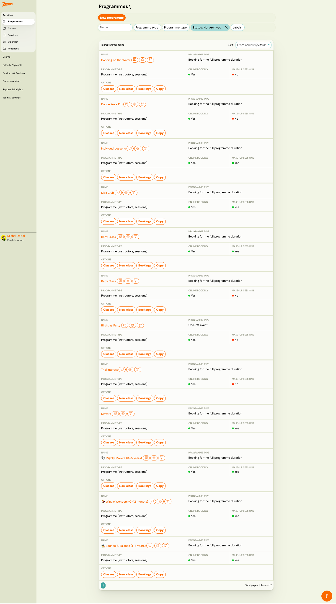
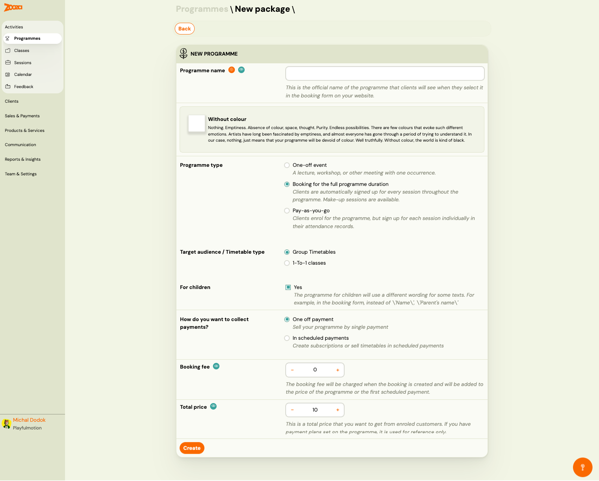
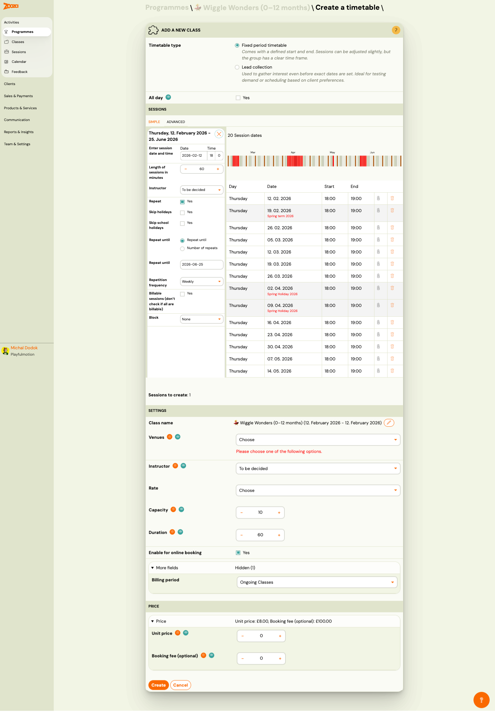

# Programmes List

The Programmes screen is the main entry point for managing your activity offering. It lists all programmes in your account and provides quick access to classes, bookings, and programme settings.

> **Navigation:** Go to **Activities** → **Programmes**.

## List View

Each programme card shows:

| Field | Description |
|---|---|
| `Name` | Programme name with optional emoji icon and label badges. |
| `Programme type` | Booking model — e.g., "Booking for the full programme duration" or "One-off session". |
| `Programme type` (detail) | Internal structure — e.g., "Programme (instructors, sessions)". |
| `Online booking` | Green dot = enabled, red dot = disabled. |
| `Make-up sessions` | Green dot = enabled, red dot = disabled. |

### Filters

Use the filter bar at the top to narrow the list:

- **Name** — free-text search.
- **Programme type** — filter by booking model (full duration, one-off, pay-as-you-go).
- **Programme type** — filter by structure (class, 1-to-1).
- **Status** — default is "Not Archived". Change to see archived programmes.
- **Labels** — filter by custom tags.

Results can be sorted using the **Sort** dropdown (default: "From newest").

### Quick Actions

Each programme card has four action buttons:

- **Classes** — opens the list of classes (timetables) within the programme.
- **New class** — creates a new class/timetable in this programme.
- **Bookings** — opens the bookings list filtered to this programme.
- **Copy** — duplicates the programme with its settings.

## Programme Detail

Click a programme name to open its detail page.

### Performance Overview

The top section displays key metrics with 7-day comparisons:

| Metric | Description |
|---|---|
| `New enrolments` | New bookings in the last 7 days vs. the previous 7 days. |
| `Enrolments` | Total active enrolments across all classes. |
| `New Waitlists` | New waiting list entries in the last 7 days. |
| `Waitlists` | Total waiting list entries. |
| `New Cancellations` | Cancellations in the last 7 days. |
| `Cancelled bookings` | Total cancellations. |
| `Received payments` | Payments received in the last 7 days. |
| `Occupancy` | Current occupancy vs. total capacity. |

### Classes Table

Below the overview, a filterable table lists all classes in the programme:

| Column | Description |
|---|---|
| `Name` | Class name (e.g., "Friday") with a **Copy link** button. |
| `Status` | "Fixed period (in progress)", "Scheduled", etc. |
| `Statistics` | Enrolment count vs. capacity with a visual progress bar. |
| `Date range` | Start and end dates of the timetable. |
| `Instructor` | Assigned instructor name. |
| `Location` | Venue name and address. |
| `Paid debt` / `Issued debt` / `Balance` | Financial summary for the class. |

Each class row has **Bookings** and **Add booking** action buttons.

### Top Action Bar

| Button | Description |
|---|---|
| **Back** | Returns to the Programmes list. |
| **Edit Settings** | Opens the programme settings dashboard (see [Programme Settings](programme-settings.md)). |
| **Automations** | Opens the automations configuration (see [Programme Automations](programme-automations.md)). |
| **New class** | Creates a new class/timetable. |
| **Copy programme** | Duplicates the entire programme. |

## New Programme

Click **New programme** on the Programmes list to create a programme from scratch.

| Field | Description |
|---|---|
| `Programme name` | The public name clients see on the booking form. |
| `Programme type` | **One-off session** — single occurrence. **Booking for the full programme duration** — clients are enrolled for all sessions. **Pay-as-you-go** — clients enrol but sign up for individual sessions. |
| `Target audience / Timetable type` | **Class Timetables** or **1-To-1 classes**. |
| `For children` | Check **Yes** to use child-oriented wording on forms (e.g., "Parent's name" instead of "Name"). |
| `How do you want to collect payments?` | **One off payment** — single charge. **In scheduled payments** — recurring billing (subscriptions, term payments). |
| `Booking fee` | One-time fee charged at booking time (added to the first payment). |
| `Total price` | The total price for the programme. Used as reference when payment plans are configured. |
| **Create** | Creates the programme and opens its detail page. |

## Create a Timetable (New Class)

From a programme detail, click **New class** to open the timetable creation form.

### Timetable Type

- **Fixed period timetable** — defined start and end dates. Sessions can be adjusted but the class has a clear time frame.
- **Lead collection** — used to gather interest before dates are set. Ideal for testing demand.

### Sessions (Simple mode)

| Field | Description |
|---|---|
| `Enter session date and time` | First session date, start time. |
| `Length of sessions in minutes` | Duration of each session (e.g., 60). |
| `Instructor` | Assigned instructor (or "To be decided"). |
| `Repeat` | Check **Yes** to generate recurring sessions. |
| `Skip holidays` | Automatically skip public holidays. |
| `Skip school holidays` | Automatically skip school holiday periods. |
| `Repeat until` | End by date or by number of repeats. |
| `Repetition frequency` | Weekly, biweekly, etc. |
| `Billable sessions` | Check **Yes** if not all sessions should be billed. |
| `Block` | Assign sessions to a named block (optional). |

The right panel shows a **visual timeline** with all generated session dates. Sessions falling on holidays are highlighted. Each session can be individually deleted.

### Settings

| Field | Description |
|---|---|
| `Class name` | Auto-generated from programme name + dates. Editable. |
| `Venues` | Select a venue (required). |
| `Instructor` | Confirm or change the instructor. |
| `Rate` | Instructor pay rate for this class. |
| `Capacity` | Maximum number of participants (e.g., 10). |
| `Duration` | Session duration in minutes. |
| `Enable for online booking` | Check **Yes** to make this class bookable online. |
| `More fields` | Expandable — hidden fields count shown. |
| `Billing period` | Payment grouping — e.g., "Ongoing Classes". |

### Price

| Field | Description |
|---|---|
| `Unit price` | Price per session/unit for this class (can override the programme default). |
| `Booking fee (optional)` | One-time booking fee for this class. |

Click **Create** to generate the class with all sessions, or **Cancel** to discard.

## Related

- [Programme Settings](programme-settings.md) — all settings tiles for a programme.
- [Programme Automations](programme-automations.md) — booking, payment, trial, and enrolment automations.
- [Programme Settings Guide](../guides/course-settings.md) — step-by-step guide to configuring programmes.
- [Programmes, Timetables, and Sessions FAQ](../faq/programmes-timetables-sessions-faq.md) — common questions about the hierarchy.
