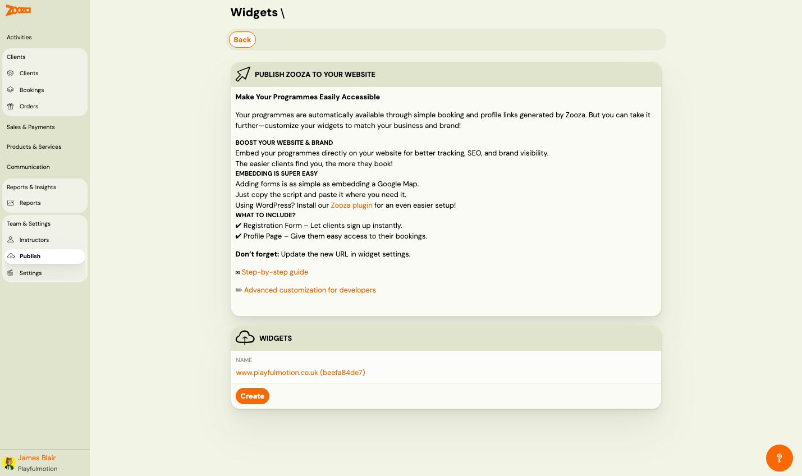
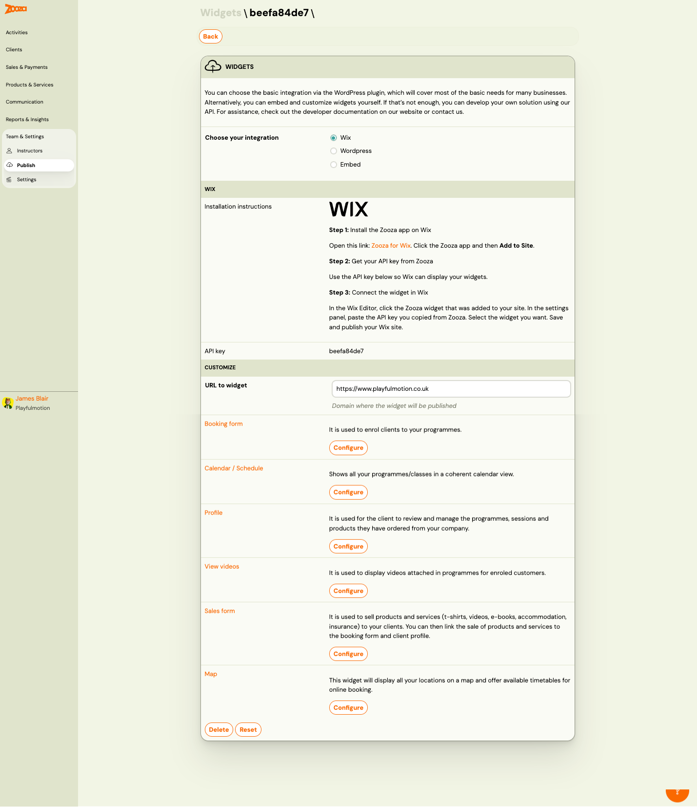

# Publish (Widgets)

The Publish screen manages widgets — embeddable components that let you display Zooza booking forms, calendars, profiles, and more on your website. Use it to create widgets, configure embed codes, and customize each widget type.

> **Navigation:** Go to **Team & Settings** → **Publish**.

## Publish Zooza to Your Website

Introductory guidance:

- Your programmes are automatically available through booking and profile links generated by Zooza.
- Embed programmes directly on your website for better tracking, SEO, and brand visibility.
- Adding forms is as simple as embedding a Google Map — copy the script and paste it.
- Using WordPress? Install the Zooza plugin for easier setup.

Links: **Step-by-step guide** and **Advanced customization for developers**.

## Widgets

Lists all created widgets. Each shows:

| Field | Description |
|---|---|
| `Name` | Widget name with ID (e.g. "www.playfulmotion.co.uk (beefa84de7)"). Clickable link to detail. |

Button: **Create** — create a new widget.

## Widget Detail

> **Navigation:** Publish → click a widget name.

### Integration Type

| Option | Description |
|---|---|
| **Wix** | Use the Zooza app for Wix. |
| **Wordpress** | Use the Zooza WordPress plugin. |
| **Embed** | Manual embed using a script tag. |

### Wix Integration

Installation steps:
1. Install the Zooza app on Wix (link provided).
2. Get your API key from Zooza.
3. Connect the widget in Wix — paste the API key in the Wix Editor settings panel.

| Field | Description |
|---|---|
| `API key` | Your widget's unique API key. |

### Embed Integration

For the Embed option, the detail shows:

#### Embed Code

Tabs for each widget type: **Booking Form**, **Calendar / Schedule**, **Profile**, **View Videos**, **Sales Form**, **Map**.

Each tab displays the embed script code with a **Copy** button.

| Field | Description |
|---|---|
| `Deployment URL of the widget` | The URL where the widget is deployed. |
| `Installation instructions` | How to place the embed code on your website. |
| **Customize embed code** | Open advanced embed customization. |
| `Choose programmes` | Select which programmes to include. Shows count of selected programmes. |
| `Show filter by programme` | Check **Yes** to let visitors filter by programme name. |
| `View filtering by location` | Check **Yes** to let visitors filter by location. |

### Customize Section

| Field | Description |
|---|---|
| `URL to widget` | Domain where the widget will be published. |

Available widget types:

| Widget | Description |
|---|---|
| **Booking form** | Used to enrol clients to your programmes. |
| **Calendar / Schedule** | Shows all programmes/classes in a coherent calendar view. |
| **Profile** | Used for clients to review and manage their programmes, sessions, and products. |
| **View videos** | Displays videos attached in programmes for enrolled customers. |
| **Sales form** | Used to sell products and services (t-shirts, videos, e-books, accommodation, insurance) to clients. Can be linked to the booking form and client profile. |
| **Map** | Displays all locations on a map and offers available timetables for online booking. |

Each widget type has a **Configure** button to open its settings.

### Actions

| Button | Description |
|---|---|
| **Delete** | Delete this widget. |
| **Reset** | Reset widget settings to defaults. |

## Related

- [Deploying Zooza on Website](../setup/deploying-zooza-on-website.md) — step-by-step embedding guide.
