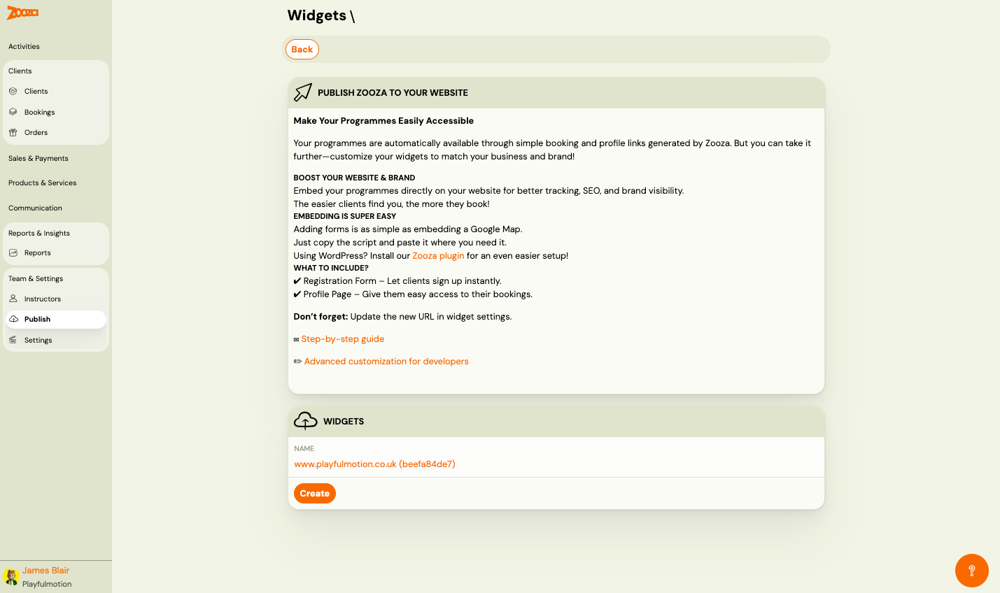
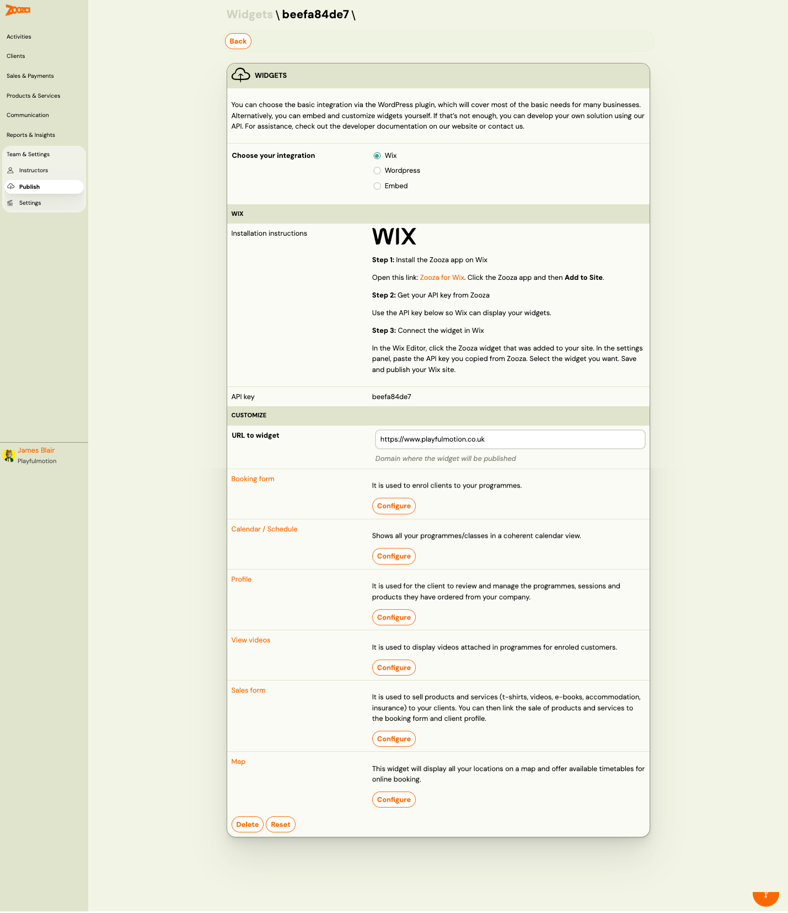

# Publish (Widgets)

The Publish screen manages widgets — embeddable components that let you display Zooza booking forms, calendars, profiles, and more on your website. Use it to create widgets, configure embed codes, and customize each widget type.

> **Navigation:** Go to **Team & Settings** → **Publish**.

## Publish Zooza to Your Website

Introductory guidance:

- Your programmes are automatically available through booking and profile links generated by Zooza.
- Embed programmes directly on your website for better tracking, SEO, and brand visibility.
- Adding forms is as simple as embedding a Google Map — copy the script and paste it.
- Using WordPress? Install the Zooza plugin for easier setup.

Links: **[Step-by-step guide](../setup/deploying-zooza-on-website.md)** and **[Advanced customization for developers](https://docs.zooza.online/widgets/)**.

## Widgets

Lists all created widgets. Each shows:

| Field | Description |
|---|---|
| `Name` | Widget name with ID (e.g. "www.playfulmotion.co.uk (beefa84de7)"). Clickable link to detail. |

Button: **Create** — create a new widget.

## Widget Detail

> **Navigation:** Publish → click a widget name.

### Integration Type

| Option | Description |
|---|---|
| **Wix** | Use the Zooza app for Wix. |
| **Wordpress** | Use the Zooza WordPress plugin. |
| **Embed** | Manual embed using a script tag. |

### Wix Integration

Installation steps:
1. Install the Zooza app on Wix (link provided).
2. Get your API key from Zooza.
3. Connect the widget in Wix — paste the API key in the Wix Editor settings panel.

| Field | Description |
|---|---|
| `API key` | Your widget's unique API key. |

### Embed Integration

For the Embed option, the detail shows:

#### Embed Code

Tabs for each widget type: **Booking Form**, **Calendar / Schedule**, **Profile**, **View Videos**, **Sales Form**, **Map**.

Each tab displays the embed script code with a **Copy** button.

> **JavaScript apps:** The embed panel also generates **npm install** snippets for React, Vue, Svelte, and Web Components. If your site is built as a JavaScript app, use these instead of the raw script — see [Deploying widgets in a JavaScript app](../setup/deploying-zooza-on-website.md#deploying-widgets-in-a-javascript-app-react-vue-and-others).

| Field | Description |
|---|---|
| `Deployment URL of the widget` | The URL where the widget is deployed. |
| `Installation instructions` | How to place the embed code on your website. |
| **Customize embed code** | Open advanced embed customization. |
| `Choose programmes` | Select which programmes to include. Shows count of selected programmes. |
| `Show filter by programme` | Check **Yes** to let visitors filter by programme name. |
| `View filtering by location` | Check **Yes** to let visitors filter by location. |

### Customize Section

| Field | Description |
|---|---|
| `URL to widget` | Domain where the widget will be published. |

Available widget types:

| Widget | Description |
|---|---|
| **Booking form** | Used to enrol clients to your programmes. |
| **Calendar / Schedule** | Shows all programmes/classes in a coherent calendar view. |
| **Profile** | Used for clients to review and manage their programmes, sessions, and products. |
| **View videos** | Displays videos attached in programmes for enrolled clients. |
| **Sales form** | Used to sell products and services (t-shirts, videos, e-books, accommodation, insurance) to clients. Can be linked to the booking form and client profile. |
| **Map** | Displays all locations on a map and offers available timetables for online booking. |

Each widget type has a **Configure** button to open its settings.

### Registration Form Settings

Settings specific to the **Booking Form** widget type. Open via **Booking form → Configure**.

#### Course list display

Controls how the list of Programmes is presented to the visitor before they choose one.

| Option | Description |
|---|---|
| **Dropdown** (default) | Classic `<select>` menu — compact, works everywhere. |
| **Grid** | Visual card grid with programme names. Better for sites with many programmes or a visual layout. |

When **Grid** is selected, an additional **Columns** setting appears (1–4). Choose how many cards appear per row.

> **Existing widgets** keep the dropdown behaviour until you explicitly change this setting. New widgets default to Grid.

#### Place grouping (Merge rooms)

When enabled, the widget shows one entry per location instead of listing individual rooms within a location. Clients see the place name; the room is determined automatically by the schedule they pick.

| Option | Default |
|---|---|
| **Merge rooms** checkbox | On for new widgets; Off for existing widgets (opt in to change) |

> **To reset** a registration widget to its defaults, use the **Reset** button. This will set Merge rooms to On.

#### Hide dates on block-based classes

For classes that use **Blocks** (where sessions are split into separately purchasable blocks), the widget normally shows the parent class start date on the registration tile. This can be confusing when a client is choosing a specific Block — the date shown is for the whole class, not their selected Block.

Enable **Hide dates on block-based classes** to suppress that date from the tile for any class that has Blocks configured.

| Option | Default |
|---|---|
| **Hide dates on block-based classes** checkbox | Off |

### Actions

| Button | Description |
|---|---|
| **Delete** | Delete this widget. |
| **Reset** | Reset widget settings to defaults. |

## Troubleshooting

### Why is a programme not showing in the widget?

Work through this checklist in order:

1. **Online registration is off.** Go to the programme → **Settings → Online registration** and confirm that online registration is enabled. If it is off, the programme will not appear in the booking form widget.
2. **No active classes.** A programme only appears in the widget if it has at least one class with active, upcoming sessions. If all classes have ended or are inactive, the programme is hidden.
3. **Programme is not selected in the widget.** Open the widget in **Publish** → widget detail → **Choose programmes**. Confirm the programme is included in the widget's programme list.
4. **Billing period has ended.** If the billing period for all classes has passed, the programme will not show as bookable.
5. **Widget is cached.** After making changes, wait a few minutes and do a hard refresh (Ctrl+Shift+R or Cmd+Shift+R) before checking again.

### Why is the Register button inactive or missing?

| Symptom | Likely cause | Fix |
|---|---|---|
| Button shows "Register" but is greyed out | Class is at full capacity | Increase class capacity or add a waiting list |
| Button shows "Express interest" instead of "Register" | Online registration is closed but interest collection is on | Open online registration in programme settings |
| No button at all | Online registration is off | Enable online registration in programme settings |
| Button works but shows error | Client is already registered | System prevents duplicate bookings |

### How to change the order of programmes in the widget

The order in which programmes appear in the booking form widget follows the order they are listed in your **Programmes** screen. To change the order:

1. Go to **Programmes**.
2. Drag and drop programmes into the desired order (if drag-and-drop is available), or rename them so they sort alphabetically in the order you want.
3. Alternatively, use the **Choose programmes** setting in the widget to select only specific programmes — unselected programmes are hidden regardless of their global order.

> There is no dedicated "widget order" setting separate from the Programmes list order.

---

## Related

- [Deploying Zooza on Website](../setup/deploying-zooza-on-website.md) — step-by-step embedding guide.
- [Customizing widgets](../guides/customizing-widgets.md) — step-by-step customizing HTML and view settings.
