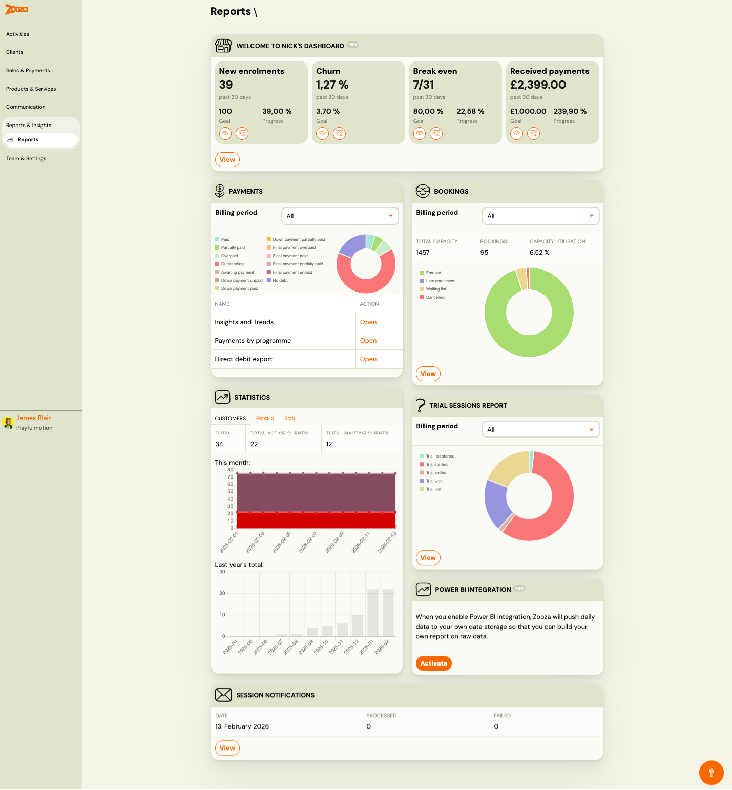
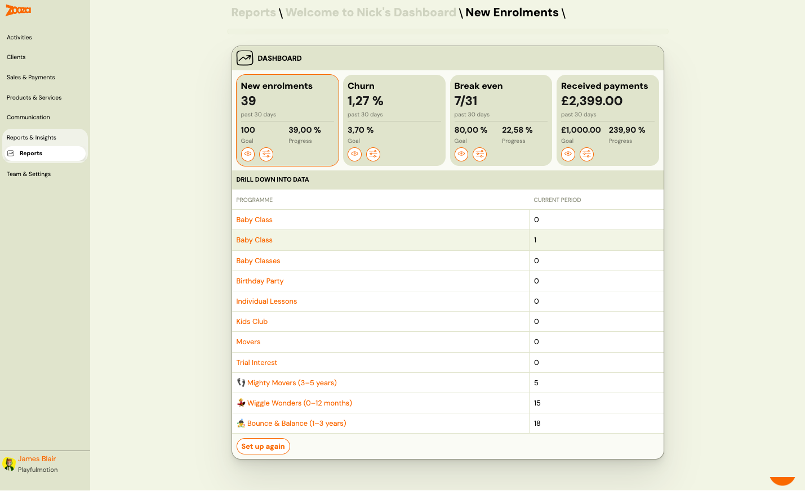
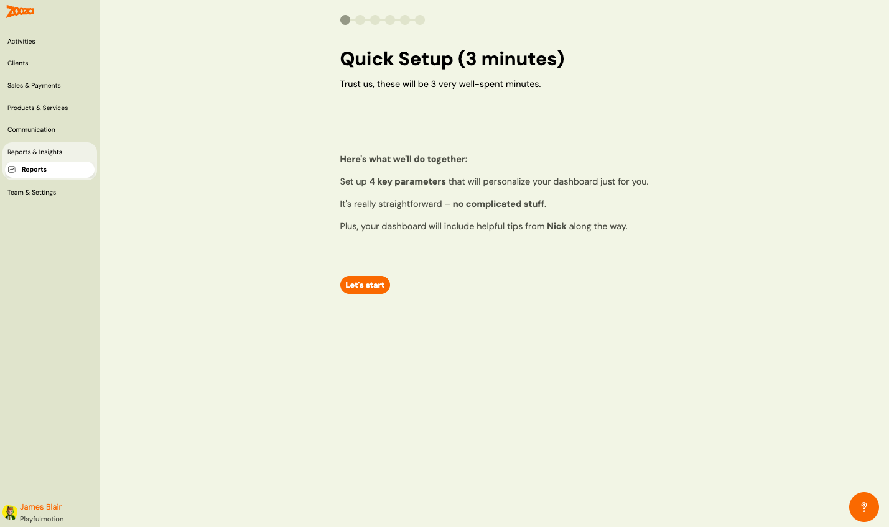
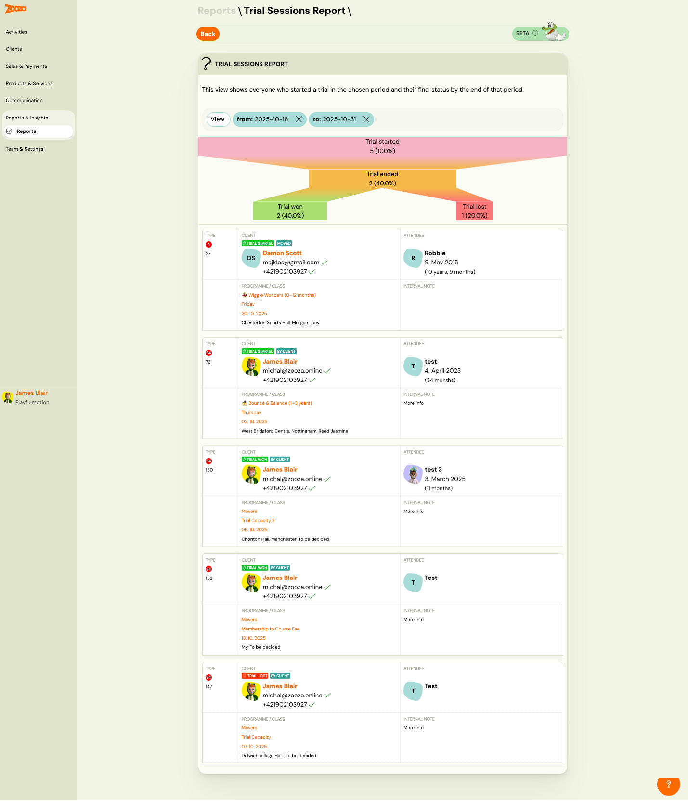
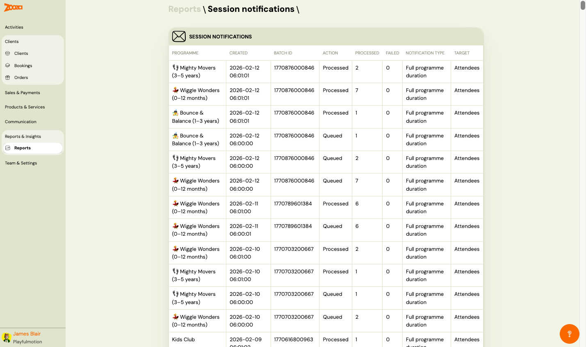

# Reports

The Reports screen provides an overview of your business metrics, payment status, booking occupancy, client statistics, trial conversion, and session notifications. It includes a personalizable dashboard with goal tracking powered by Nick's Dashboard (PRO).

> **Navigation:** Go to **Reports & Insights** → **Reports**.

## Nick's Dashboard (PRO)

A personalizable dashboard with four key business metrics tracked over the past 30 days:

| Metric | Description |
|---|---|
| **New enrolments** | Number of genuinely new and first-time paying clients who booked onto your programme, not including returning clients or children who came for a free trial. |
| **Churn** | Percentage of clients who did not re-enrol. |
| **Break even** | Progress toward your break-even point (e.g. "7/31"). |
| **Received payments** | Total payments received in the period. |

Each metric card shows:
- Current value (past 30 days)
- Goal value
- Progress percentage
- Eye icon (view detail) and settings icon (configure)

Button: **View** — opens the detailed dashboard with per-programme drill-down.

### Dashboard Detail

> **Navigation:** Reports → Nick's Dashboard → **View**.

The detail view shows:
- All four metric cards at the top
- **Drill down into data** — a table listing each programme with its current period value

| Column | Description |
|---|---|
| `Programme` | Programme name (clickable link). |
| `Current period` | Metric value for the current period. |

Button: **Set up again** — re-run the quick setup wizard.

### Quick Setup

> **Navigation:** First visit to Reports, or click **Set up again**.

A 6-step wizard to personalize your dashboard. Set up 4 key parameters:

1. **New Enrolments** — select which programme to track and set a monthly target goal.
2. **Churn** — configure churn tracking parameters.
3. **Break Even** — set your break-even targets.
4. **Received Payments** — set payment goals.

Each step shows the metric explanation with tips from Nick Empson (Education franchise expert) and a **Learn more about this growth metric** link.

## Payments

A summary of payment status for a selected billing period.

| Field | Description |
|---|---|
| `Billing period` | Dropdown to select the period (e.g. "All"). |

A donut chart visualizes payment status with the following categories:
- Paid, Partially paid, Overpaid, Outstanding, Awaiting payment, Down payment unpaid, Down payment partially paid, Final payment overpaid, Final payment paid, Final payment partially paid, Final payment unpaid, No debt

### Payment Reports

| Report | Description |
|---|---|
| **Insights and Trends** | Booking and payment trends over time (see [Payments Reference](payments-dashboard.md#insights-and-trends)). |
| **Payments by programme** | Income breakdown per programme (see [Payments Reference](payments-dashboard.md#payments-by-programme)). |
| **Direct debit export** | Export direct debit data (see [Payments Reference](payments-dashboard.md#direct-debit-export)). |

## Bookings

Booking occupancy overview for a selected billing period.

| Field | Description |
|---|---|
| `Billing period` | Dropdown to select the period. |
| `Total capacity` | Total available spots across all classes. |
| `Bookings` | Number of active bookings. |
| `Capacity utilisation` | Percentage of capacity filled. |

A donut chart shows the breakdown by booking status:
- Enrolled (green)
- Late enrolment (blue)
- Waiting list (yellow)
- Cancelled (red)

Button: **View** — opens detailed booking report.

## Statistics

Client and communication statistics with three tabs:

### Clients

| Metric | Description |
|---|---|
| `Total` | Total number of registered clients. |
| `Total active clients` | Clients with at least one active booking. |
| `Total inactive clients` | Clients with no active bookings. |

Two bar charts show:
- **This month** — daily client activity for the current month.
- **Last year's total** — monthly client totals for the past 12 months.

### Emails

Email sending statistics (tab).

### SMS

SMS sending statistics (tab).

## Trial Sessions Report

A summary of trial session outcomes for a selected billing period.

| Field | Description |
|---|---|
| `Billing period` | Dropdown to select the period. |

A donut chart shows trial statuses:
- Trial not started
- Trial started (red)
- Trial ended (purple)
- Trial won (green)
- Trial lost (beige)

Button: **View** — opens the [Trial Sessions Report detail](#trial-sessions-report-detail).

## Trial Sessions Report Detail

> **Navigation:** Reports → Trial Sessions Report → **View**.

> **Note:** This feature is currently in beta.

Shows everyone who started a trial in the chosen period and their final status by the end of that period.

### Filters

- **View** button with date range filters (**from** and **to**).

### Funnel Visualization

A visual funnel showing the conversion flow:
- Trial started → Trial ended → Trial won / Trial lost

Each stage shows count and percentage.

### Trial List

Each trial card shows:

| Field | Description |
|---|---|
| `Type` | Booking number with status badges (e.g. "Trial Started", "Moved", "By Client", "Trial Won", "Trial Lost"). |
| `Client` | Client name, avatar, email, and phone (with verification ticks). |
| `Attendee` | Child name, date of birth, and age. |
| `Programme / Class` | Programme name, class name, date, and location. |
| `Internal note` | Notes added by staff. |

## Power BI Integration (PRO)

When enabled, Zooza pushes daily data to your own data storage so you can build custom reports on raw data.

Button: **Activate** — enable the Power BI integration.

## Session Notifications

> **Navigation:** Reports → Session Notifications → **View**.

A log of automated session notification emails sent to clients.

| Column | Description |
|---|---|
| `Programme` | Programme name with icon. |
| `Created` | Timestamp of notification creation. |
| `Batch ID` | Internal batch identifier. |
| `Action` | Processing status — "Processed" or "Queued". |
| `Processed` | Number of notifications processed. |
| `Failed` | Number of failed notifications. |
| `Notification type` | Type — e.g. "Full programme duration". |
| `Target` | Target audience — e.g. "Attendees". |

The dashboard card shows the latest date with processed and failed counts.

## Related

- [Payments Reference](payments-dashboard.md) — detailed payment reports.
- [Dashboard Reference](dashboard.md) — admin home screen.
