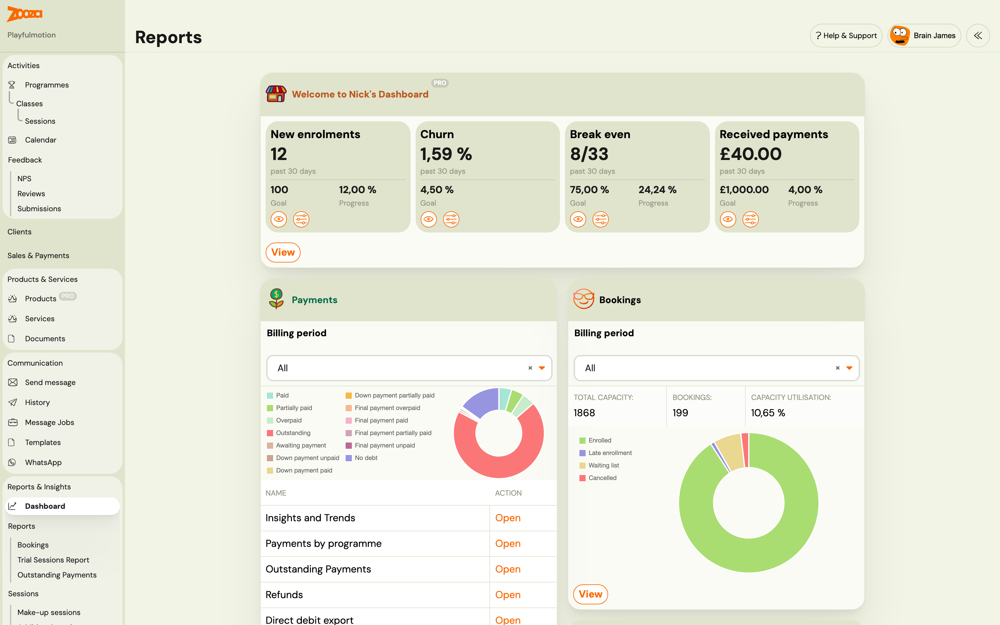
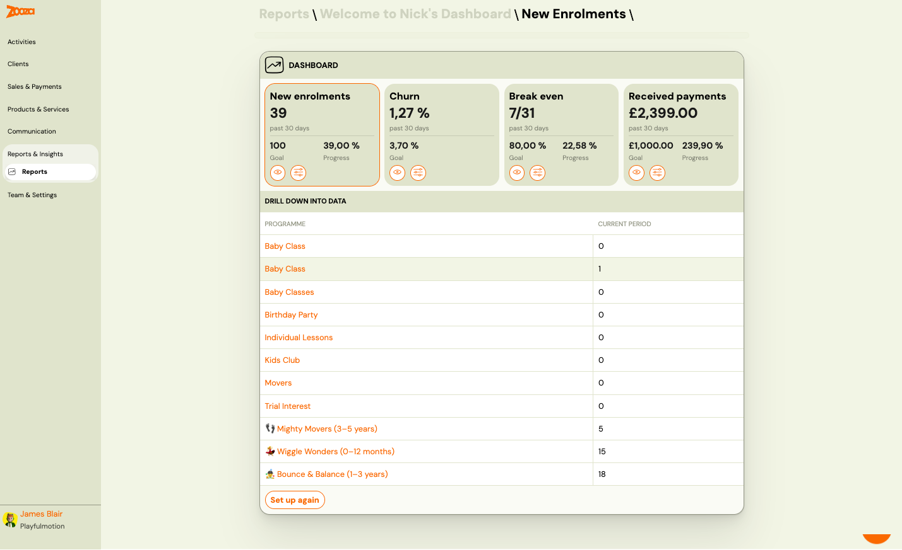
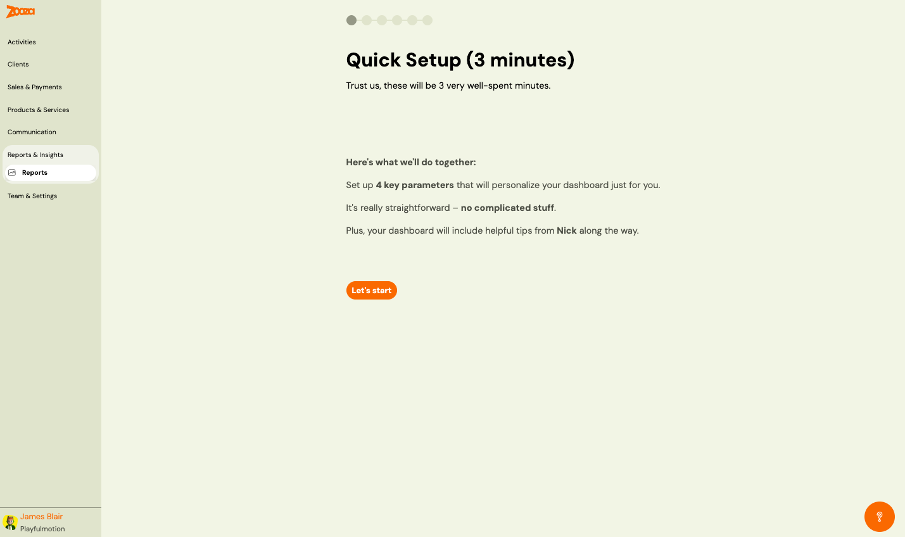
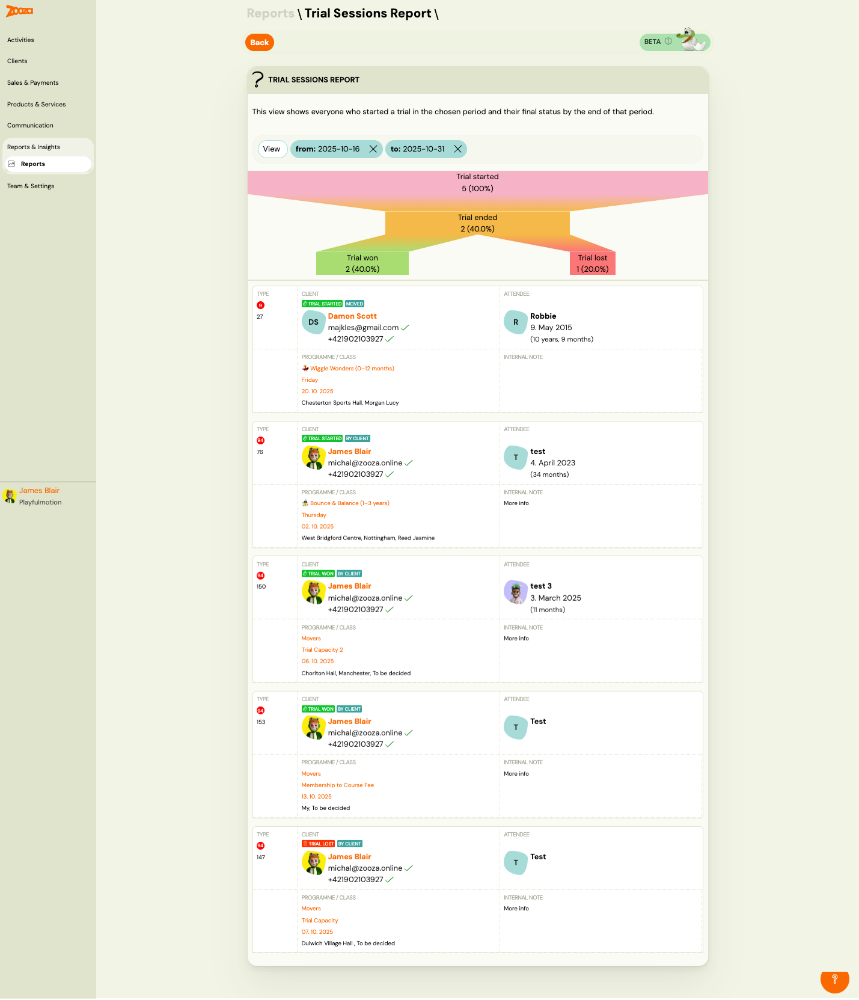
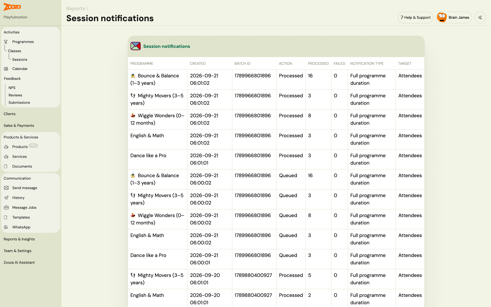

# Reports

The Reports screen provides an overview of your business metrics, payment status, booking occupancy, client statistics, trial conversion, and session notifications. It includes a personalizable dashboard with goal tracking powered by Nick's Dashboard.

> **Navigation:** Go to **Reports & Insights** → **Reports**.

> **The figure you want is not on any of these screens?** Ask
> [Zooza AI](../setup/claude-plugin.md) instead — connect Claude or ChatGPT to your
> account and ask in plain language ("what has each trainer been paid this term",
> "payments by programme since we opened"). It reads your real data, within your own
> permissions, and answers questions no fixed report covers.
>
> **The chat bubble inside Zooza cannot do this.** That one answers from the help
> documentation only — it has no access to your account, so it cannot tell you who has
> not paid or how full Monday is. Two different things with two different jobs: see
> [what each one can do](../faq/claude-plugin-faq.md).

## Nick's Dashboard

A personalizable dashboard with four key business metrics tracked over the past 30 days:

| Metric | Description |
|---|---|
| **New enrolments** | Number of genuinely new and first-time paying clients who booked onto your programme, not including returning clients or children who came for a free trial. |
| **Churn** | Percentage of clients who did not re-enrol. |
| **Break even** | Progress toward your break-even point (e.g. "7/31"). |
| **Received payments** | Total payments received in the period. |

Each metric card shows:
- Current value (past 30 days)
- Goal value
- Progress percentage
- Eye icon (view detail) and settings icon (configure)

Button: **View** — opens the detailed dashboard with per-programme drill-down.

### Dashboard Detail

> **Navigation:** Reports → Nick's Dashboard → **View**.

The detail view shows:
- All four metric cards at the top
- **Drill down into data** — a table listing each programme with its current period value

| Column | Description |
|---|---|
| `Programme` | Programme name (clickable link). |
| `Current period` | Metric value for the current period. |

Button: **Set up again** — re-run the quick setup wizard.

### Quick Setup

> **Navigation:** First visit to Reports, or click **Set up again**.

A 6-step wizard to personalize your dashboard. Set up 4 key parameters:

1. **New Enrolments** — select which programme to track and set a monthly target goal.
2. **Churn** — configure churn tracking parameters.
3. **Break Even** — set your break-even targets.
4. **Received Payments** — set payment goals.

Each step shows the metric explanation with tips from Nick Empson (Education franchise expert) and a **Learn more about this growth metric** link.

## Payments

A summary of payment status for a selected billing period.

| Field | Description |
|---|---|
| `Billing period` | Dropdown to select the period (e.g. "All"). |

A donut chart visualizes payment status with the following categories:
- Paid, Partially paid, Overpaid, Outstanding, Awaiting payment, Down payment unpaid, Down payment partially paid, Final payment overpaid, Final payment paid, Final payment partially paid, Final payment unpaid, No debt

### Payment Reports

| Report | Description |
|---|---|
| **Insights and Trends** | Booking and payment trends over time (see [Payments Reference](payments-dashboard.md#insights-and-trends)). |
| **Payments by programme** | Income breakdown per programme (see [Payments Reference](payments-dashboard.md#payments-by-programme)). |
| **Direct debit export** | Export direct debit data (see [Payments Reference](payments-dashboard.md#direct-debit-export)). |
| **Refunds** | Date-filterable list of all refunds, exportable to XLSX. See [Refunds report](#refunds-report) below. |

## Bookings

Booking occupancy overview for a selected billing period.

| Field | Description |
|---|---|
| `Billing period` | Dropdown to select the period. |
| `Total capacity` | Total available spots across all classes. |
| `Bookings` | Number of active bookings. |
| `Capacity utilisation` | Percentage of capacity filled. |

A donut chart shows the breakdown by booking status:
- Enrolled (green)
- Late enrolment (blue)
- Waiting list (yellow)
- Cancelled (red)

Button: **View** — opens detailed booking report.

## Statistics

Client and communication statistics with three tabs:

### Clients

| Metric | Description |
|---|---|
| `Total` | Total number of registered clients. |
| `Total active clients` | Clients with at least one active booking. |
| `Total inactive clients` | Clients with no active bookings. |

Two bar charts show:
- **This month** — daily client activity for the current month.
- **Last year's total** — monthly client totals for the past 12 months.

### Emails

Email sending statistics (tab).

### SMS

SMS sending statistics (tab).

## Trial Sessions Report

A summary of trial session outcomes for a selected billing period.

| Field | Description |
|---|---|
| `Billing period` | Dropdown to select the period. |

A donut chart shows trial statuses:
- Trial not started
- Trial started (red)
- Trial ended (purple)
- Trial won (green)
- Trial lost (beige)

Button: **View** — opens the [Trial Sessions Report detail](#trial-sessions-report-detail).

## Trial Sessions Report Detail

> **Navigation:** Reports → Trial Sessions Report → **View**.

> **Note:** This feature is currently in beta.

Shows everyone who started a trial in the chosen period and their final status by the end of that period.

### Filters

- **View** button with date range filters (**from** and **to**).

### Funnel Visualization

A visual funnel showing the conversion flow:
- Trial started → Trial ended → Trial won / Trial lost

Each stage shows count and percentage.

### Trial List

Each trial card shows:

| Field | Description |
|---|---|
| `Type` | Booking number with status badges (e.g. "Trial Started", "Moved", "By Client", "Trial Won", "Trial Lost"). |
| `Client` | Client name, avatar, email, and phone (with verification ticks). |
| `Attendee` | Child name, date of birth, and age. |
| `Programme / Class` | Programme name, class name, date, and location. |
| `Internal note` | Notes added by staff. |

## Power BI Integration

When enabled, Zooza pushes daily data to your own data storage so you can build custom reports on raw data.

Button: **Activate** — enable the Power BI integration.

## Session Notifications

> **Navigation:** Reports → Session Notifications → **View**.

A log of automated session notification emails sent to clients.

| Column | Description |
|---|---|
| `Programme` | Programme name with icon. |
| `Created` | Timestamp of notification creation. |
| `Batch ID` | Internal batch identifier. |
| `Action` | Processing status — "Processed" or "Queued". |
| `Processed` | Number of notifications processed. |
| `Failed` | Number of failed notifications. |
| `Notification type` | Type — e.g. "Full programme duration". |
| `Target` | Target audience — e.g. "Attendees". |

The dashboard card shows the latest date with processed and failed counts.

> **Asking is often quicker than finding the right report.** [Zooza AI](../faq/claude-plugin-faq.md) can answer questions across your data directly — who has not paid in a class, how many trials converted last term, which sessions are under-filled — without you working out which report holds it. It reads with your own permissions, so it can only see what your role can.

## Refunds Report

> **Permission required:** Owner role

> **Navigation:** Go to **Payments** → **Reports** → **Refunds**.

A date-filterable list of all refunds — the outbound mirror of the received-payments list. Use it for monthly reconciliation and accounting: "how much did we refund in June, and to whom?"

### Filters

| Filter | Description |
|---|---|
| `From` / `To` | Date range filter on the refund value date. |

### Report columns

Always visible:

| Column | Description |
|---|---|
| `Date` | Value date and posting date of the refund. |
| `Amount` | Refund amount (always shown as a negative value, e.g. −€30). |
| `Currency` | Payment currency. |
| `Client` | Client name and email linked to the refund. |
| `Reference` | Booking or order the refund relates to. |
| `Note` | Admin note attached to the refund (if any). |
| `Status` | Processing status (e.g. Pending, Completed). |

Additional columns visible on **Export** only (blank for older or manually-recorded refunds):

| Column | Description |
|---|---|
| `Payment method` | Original payment method (card, bank transfer, etc.). |
| `Refund type` | Full or partial. |
| `Source` | Gateway-initiated or administrative. |
| `Provider refund ID` | Reference from the payment gateway (e.g. Stripe). |
| `Issued by` | Admin who issued the refund. |

### Export

Click **Export** to download the full column set as XLSX. The export follows the same download mechanism as the Inbound payments export.

> **Note:** Older refunds recorded manually (before the refund gateway flow was introduced) appear in the on-screen list but some of the enrichment columns will be blank. This is expected — every refund is included; only the gateway metadata is missing for historical entries.

---

## Disrupted Sessions Report

> **Permission required:** Owner role

> **Navigation:** Go to **Reports & Insights** → **Reports** → **Sessions** → **Rescheduled**, **Substituted**, or **Cancelled**.

Shows which clients were affected by rescheduled, substituted, or cancelled sessions — one row per (booking × disrupted session). Use it to answer questions like "which clients had their May sessions rescheduled?" or to export a contact list after a batch of cancellations.

The three views (Rescheduled, Substituted, Cancelled) share the same layout and filters; each is accessed from the **Sessions** group in the Reports sidebar.

> **Shortcut from Calendar:** The Calendar action toolbar also has direct **Make-up sessions**, **Rescheduled**, and **Substituted** buttons to jump to the corresponding report.

### Filters

| Filter | Description |
|---|---|
| `Date range` | The period to report on (applies to the disrupted session date). |
| `Programme` | Narrow to a specific programme. |
| `Class` | Narrow to a specific class. |
| `Instructor` | Filter by the instructor originally assigned to the session. |
| `Location` | Filter by venue. |
| `Billing period` | Align with a billing period. |
| `Client` | Search by client name or email. |
| `Day` | Filter by day of week. |

### Report columns

| Column | Description |
|---|---|
| `Date` | Session date (rescheduled/cancelled date). For rescheduled sessions, the original date is shown as a subtitle. For substituted sessions, the original and substitute instructor are shown. |
| `Programme / Class` | Programme name and class name (both clickable links). |
| `Attendee` | The person who attended (may differ from the account holder if the booking is for a child). |
| `Client (Buyer)` | The account holder (booking owner), with name and email. |
| `Attendance` | The recorded attendance state for that session (attended, no-show, cancelled, etc.). |

### Export

Click **Export** to download the filtered result as XLSX.

---

## Common tasks

### How to export a list of active clients with contacts

Clients and registrations are two different things in Zooza — this is the most common source of confusion when exporting.

| What you want | Where to export from |
|---|---|
| List of **clients** (one row per person) with name, email, phone | **Clients** → **Export** |
| List of **registrations** (one row per booking, may include one client multiple times) | **Bookings** → **Export** |

To export active clients with contact details:

1. Go to **Clients**.
2. Use the filters to narrow down if needed (e.g. by programme or status).
3. Click **Export** — the CSV includes name, email, phone, and other client fields.

> If a client has two children enrolled, you will see them **once** in the Clients export but **twice** in the Bookings export. This explains why the two counts often differ.

### Why do the numbers in reports differ from my manual count?

Reports calculate figures based on **status filters and billing period** — changing either will give a different result. Common reasons for discrepancies:

| Situation | Explanation |
|---|---|
| Report shows fewer clients than the Clients list | Report is scoped to one billing period; Clients list shows all time |
| Bookings count is higher than client count | One client can have multiple bookings (different classes or terms) |
| Active bookings in report ≠ active bookings in list | Report may exclude waiting-list or trial bookings; check the status filter |
| Payment totals don't add up | Some payments may be in a different billing period or status (Partially paid, etc.) |

When numbers don't match, the fastest fix is to check which **billing period** and **status filters** are active in each view and align them.

---

## Related

- [Payments Reference](payments-dashboard.md) — detailed payment reports.
- [Sessions List](sessions-list.md) — filter and export individual sessions.
- [Dashboard Reference](dashboard-reference.md) — admin home screen.
