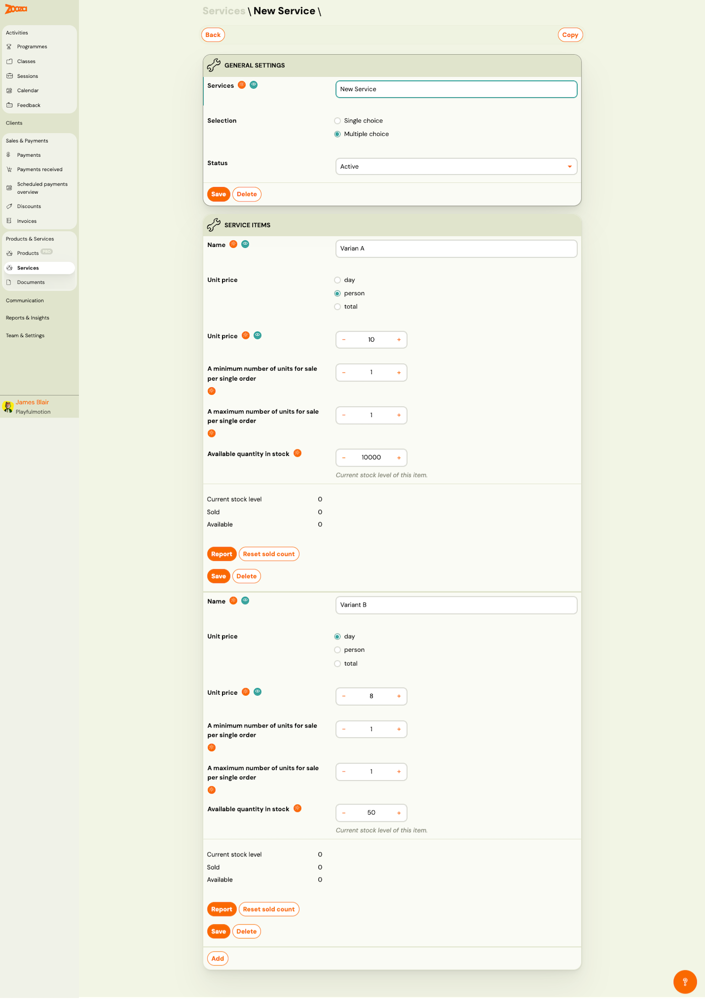

# Services

The Services screen manages service add-ons that can be attached to products or offered during booking. Services represent additional options such as insurance, parking, meal plans, or extras — typically for camps and sessions.

> **Navigation:** Go to **Products & Services** → **Services**.

## Top Actions

| Button | Description |
|---|---|
| **Add new** | Create a new service (see [New Service](#new-service)). |

## Service List

The header shows the total number of records.

Each row displays:

| Column | Description |
|---|---|
| `Name of service` | Service name (clickable link to service detail). |

Pagination shows total pages and results count.

## New Service

> **Navigation:** Services → **Add new**, or click an existing service name.

### General Settings

| Field | Description |
|---|---|
| `Services` | Service name. Required. |
| `Selection` | How clients choose options: **Single choice** (pick one) or **Multiple choice** (pick several). |
| `Status` | Dropdown — **Active** or **Inactive**. |

Buttons: **Save** and **Delete**.

Top-right action: **Copy** — duplicate the service.

### Service Items

Each service contains one or more variants (items). Each item has:

| Field | Description |
|---|---|
| `Name` | Variant display name (e.g. "Variant A", "Variant B"). Required. |
| `Unit price` | Pricing unit: **day** (per day), **person** (per person), or **total** (flat fee). |
| `Unit price` | Price amount. +/− controls. Required. |
| `A minimum number of units for sale per single order` | Minimum quantity a client must order. +/− controls. |
| `A maximum number of units for sale per single order` | Maximum quantity a client can order. +/− controls. |
| `Available quantity in stock` | Total available stock for this item. +/− controls. |

#### Stock Info

Below each variant, stock status is displayed:

| Field | Description |
|---|---|
| `Current stock level` | Current available stock. |
| `Sold` | Number of units sold. |
| `Available` | Remaining units available. |

#### Item Actions

| Button | Description |
|---|---|
| **Report** | View sales report for this item. |
| **Reset sold count** | Reset the sold counter back to zero. |
| **Save** | Save changes to this item. |
| **Delete** | Remove this item. |

The **Add** button at the bottom creates a new service item variant.

## Related

- [Products Reference](products-list.md) — manage sellable products.
- [Documents Reference](documents-list.md) — manage documents and videos.
- [Selling Products During Booking](../guides/selling-products-during-registration.md) — how to offer products and services at booking time.
