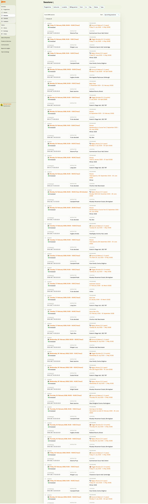

# Sessions List

The Sessions screen shows all individual sessions across all programmes and classes in a single chronological list. Use it to see your complete day-by-day schedule, check instructor assignments, and access session details.

> **Navigation:** Go to **Activities** → **Sessions**.

## Filters

| Filter | Description |
|---|---|
| `Programme` | Filter by specific programme. |
| `Instructor` | Filter by instructor. |
| `Location` | Filter by venue. |
| `Billing period` | Filter by billing period. |
| `From` / `To` | Date range filter. |
| `Status` | Filter by session status. |
| `Type` | Filter by session type. |

Results can be sorted by **Upcoming sessions** (default) or other criteria.

## Session List

Each session row shows:

| Element | Description |
|---|---|
| Session date and time | Full date with day of week, start and end time (e.g., "Friday, 13. February 2026, 10:00 – 11:00 (Fixed)"). |
| Status badge | Colour-coded: green = scheduled, orange = in progress, etc. |
| **Detail** link | Opens the session detail with attendance tracking. |
| Instructor | Assigned instructor name. |
| Programme and class | Programme name, class name, and date range. |
| Attendance icon | Quick-view of attendance status. |

The total number of sessions found is shown at the top (e.g., "Found 846 sessions"). Use **Choose all** to select all sessions for bulk operations.

## Related

- [Classes List](classes-list.md) — the cross-programme classes view.
- [Class Detail](class-detail.md) — managing a single class with its sessions.
- [Calendar](calendar.md) — visual calendar view of sessions.
- [Edit Sessions in Programmes Guide](../guides/edit-events-in-courses.md) — modifying session dates and times.
- [Attendance and Catch-ups FAQ](../faq/attendance-and-catchups-faq.md) — marking attendance.
