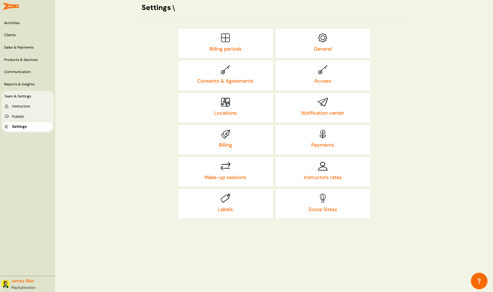
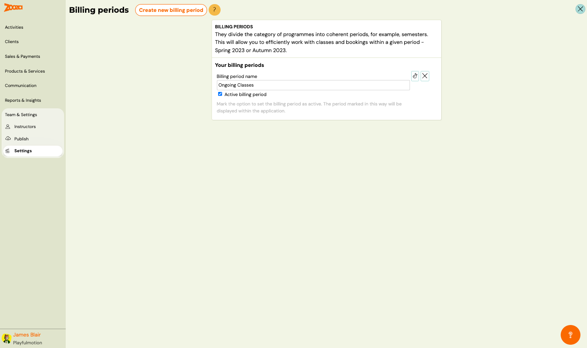
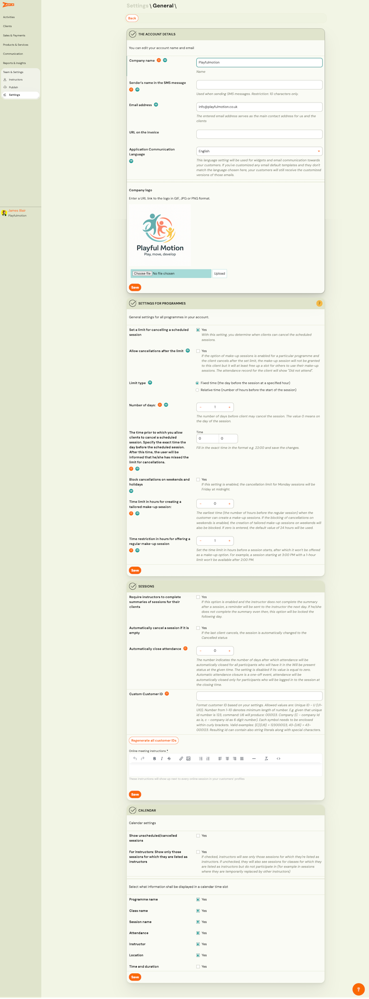

# Settings

The Settings screen is the central configuration hub for your Zooza account. It provides access to all system-wide settings organized as navigation tiles.

> **Navigation:** Go to **Team & Settings** → **Settings**.

## Settings Tiles

| Tile | Description |
|---|---|
| **Billing periods** | Manage billing periods (semesters, terms) to organize classes and bookings. See [Billing Periods](#billing-periods). |
| **General** | Account details, programme settings, session settings, calendar settings. See [General](#general). |
| **Consents & Agreements** | Manage consent forms and agreements for clients. |
| **Access** | Manage user accounts and permissions. |
| **Locations** | Manage venues and locations for classes. |
| **Notification center** | Configure notification preferences. |
| **Billing** | Manage invoice profiles and billing settings. |
| **Payments** | Configure payment templates and methods. |
| **Make-up sessions** | Configure make-up session rules. |
| **Instructors rates** | Manage instructor pay rates. |
| **Labels** | Create and manage labels for organizing programmes, classes, and clients. |
| **Zooza Sitesx** | Manage Zooza Sites (micro-sites). |

## Billing Periods

> **Navigation:** Settings → **Billing periods**.

Billing periods divide programmes into coherent periods (e.g. semesters: Spring 2023, Autumn 2023). This lets you work efficiently with classes and bookings within a given period.

| Field | Description |
|---|---|
| `Billing period name` | Name of the period (e.g. "Ongoing Classes"). |
| `Active billing period` | Check to set as the active period. The active period is displayed throughout the application. |

Actions: Edit icon (rename) and X (delete).

Button: **Create new billing period**.

## General

> **Navigation:** Settings → **General**.

### The Account Details

| Field | Description |
|---|---|
| `Company name` | Your business name. |
| `Sender's name in the SMS message` | Name shown when sending SMS. Restriction: 10 characters only. |
| `Email address` | Main contact email for you and your clients. |
| `URL on the invoice` | Website URL displayed on invoices. |
| `Application Communication Language` | Language for widgets and email communication to clients. If customized templates don't match this language, clients still receive the customized versions. |
| `Company logo` | Upload logo in GIF, JPG, or PNG format. |

### Settings for Programmes

General settings for all programmes:

| Field | Description |
|---|---|
| `Set a limit for cancelling a scheduled session` | When enabled, clients can cancel scheduled sessions within the defined limit. |
| `Allow cancellations after the limit` | If make-up sessions are enabled and the client cancels after the limit, the make-up session is not granted but a slot is freed for others. Attendance record shows "Did not attend". |
| `Limit type` | **Fixed time** (the day before at a specified hour) or **Relative time** (number of hours before the session). |
| `Number of days` | Days before the session when client may cancel. 0 = on the day of the session. |
| `The time prior to which you allow clients to cancel` | Exact time on the cancellation day. After this time, the user is informed they missed the limit. |
| `Block cancellations on weekends and holidays` | If enabled, the cancellation limit for Monday sessions will be Friday at midnight. |
| `Time limit in hours for creating a tailored make-up session` | Earliest time (hours before the regular session) when clients can create make-up sessions. If zero, default of 24 hours is used. |
| `Time restriction in hours for offering a regular make-up session` | Time limit in hours before a session starts, after which it won't be offered as a make-up option. |

### Sessions

| Field | Description |
|---|---|
| `Require instructors to complete summaries of sessions for their clients` | When enabled, if the instructor does not complete the summary, a reminder is sent the next day. |
| `Automatically cancel a session if it is empty` | When the last client cancels, the session is automatically changed to "Cancelled" status. |
| `Automatically close attendance` | Number of days after which attendance is automatically closed for all participants in "Will be present" status. Set to 0 to disable. For one-off sessions, attendance is closed only for logged-in participants at closing time. |
| `Custom Customer ID` | Format template for client IDs. Allowed values: Unique ID (U), sequence number (1–10 minimum length). Each symbol needs curly braces. |
| `Regenerate all customer IDs` | Regenerate all IDs based on the current format. |
| `Online meeting instructions` | Rich text editor for instructions shown in clients' profiles for online sessions. |

### Calendar

| Field | Description |
|---|---|
| `Show unscheduled/cancelled sessions` | Show or hide cancelled sessions in the calendar. |
| `For instructors: Show only those sessions for which they are listed as instructors` | If checked, instructors only see sessions they're assigned to. If unchecked, they also see other sessions for classes they're listed on. |

Calendar time slot display options (each can be toggled Yes/No):

- `Programme name`
- `Class name`
- `Session name`
- `Attendance`
- `Instructor`
- `Location`
- `Time and duration`

## Related

- [Locations and Venues FAQ](../faq/locations-and-venues-faq.md) — common questions about locations.
- [Holiday Settings Guide](../setup/holiday-settings.md) — how to configure holidays.
