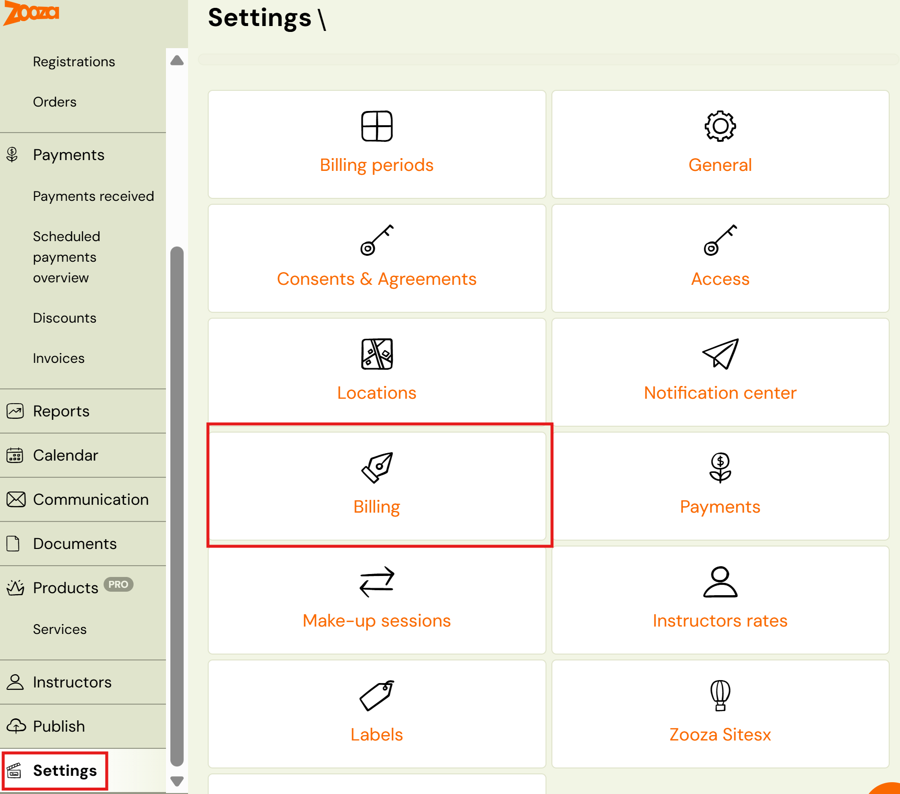
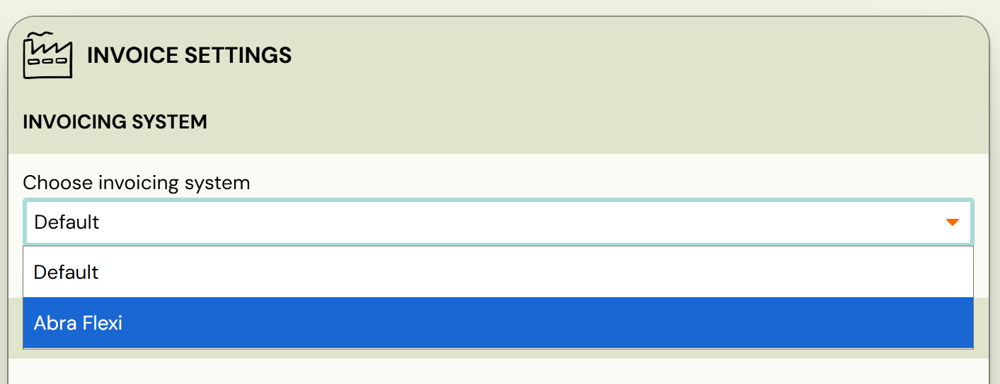
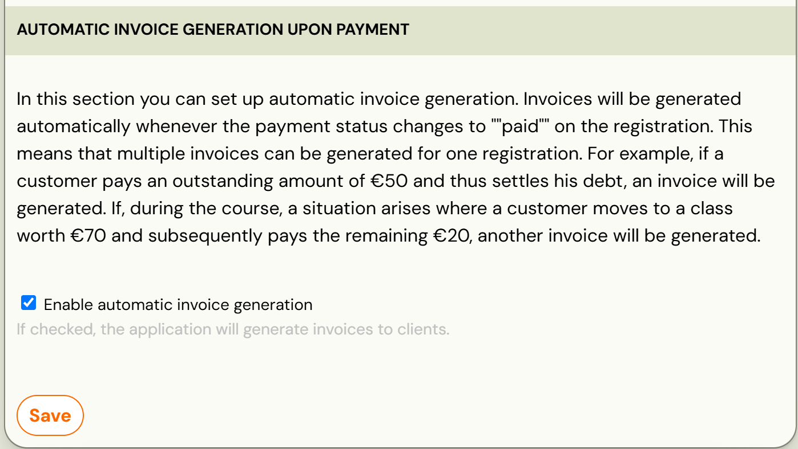
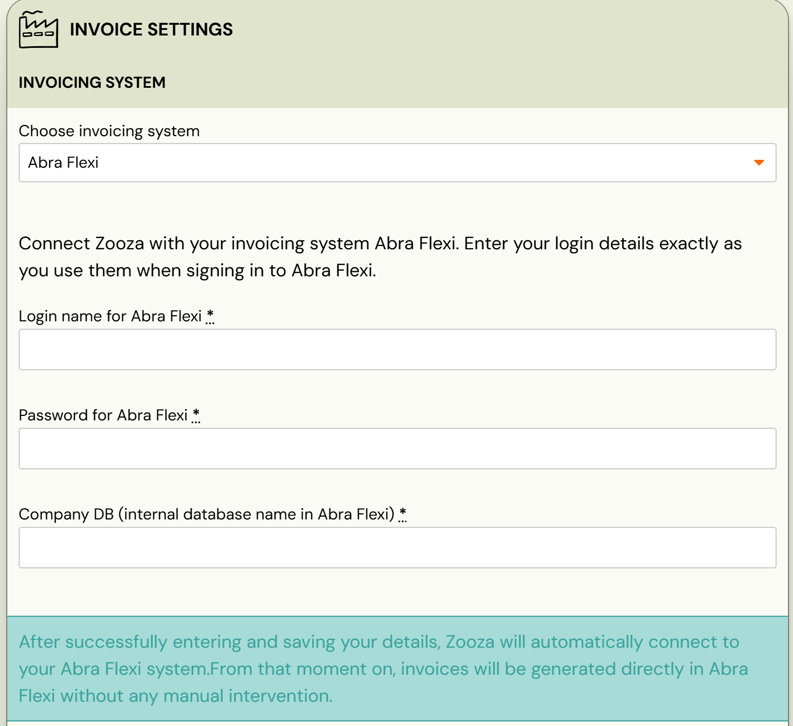
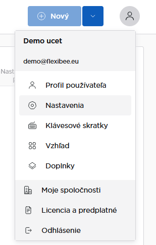
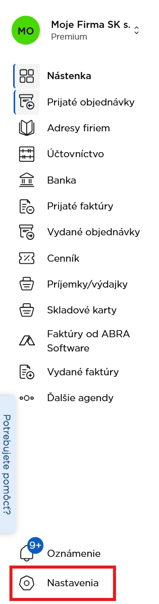
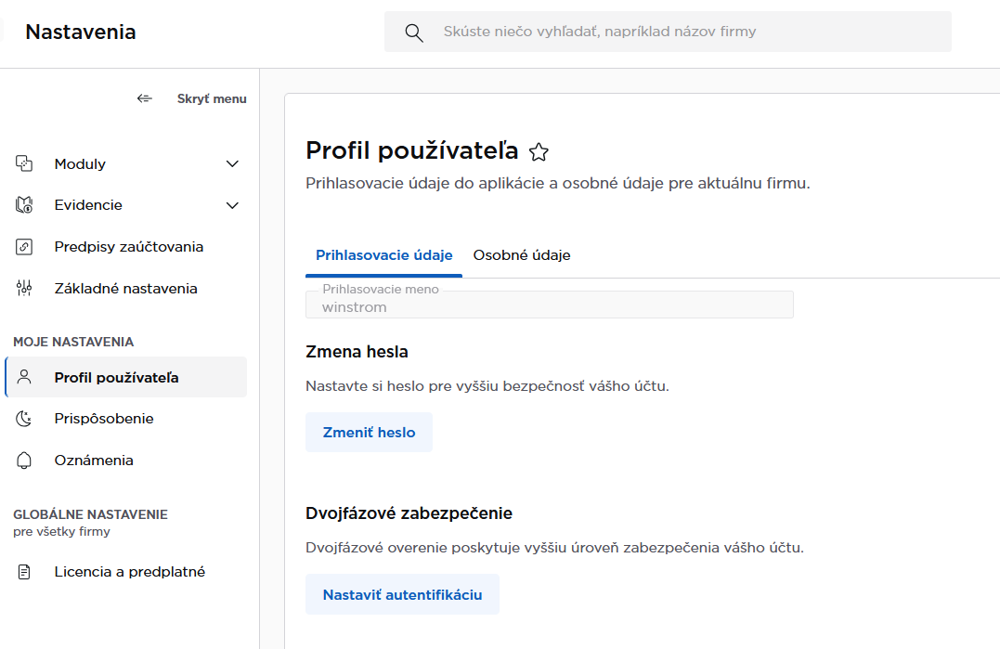

# Abra Flexi Invoice Management System

Zooza allows you to connect directly with Abra Flexi, an invoicing and accounting system. By linking these two platforms, you can streamline your financial processes - invoices are generated automatically from Zooza and sent to Abra Flexi.

Important notes for the invoicing process and billing profiles

1. The invoice number series is defined in Abra Flexi.
2. [VAT configurations](../guides/vat-management.md) are pulled from Zooza into Abra Flexi.
3. Invoices can only be edited or deleted in Abra Flexi.
4. Changes made in Abra Flexi are not synchronized back to Zooza.
5. The version of the invoice visible in Zooza remains unchanged after editing in Abra.
6. Currently, it is possible to connect only one database name (Company DB) per Zooza account.

## Connection step by step

1. In Zooza, go to* Settings → Billing.
 
 *
2. Under *Invoicing System*, change the system from Default to Abra Flexi.
 

3. Choose whether you want automatic generation of invoices or you will manually generate invoices per booking and click *Save.
 
 *
4. After saving, a section with Abra login information will appear in Zooza under* Abra Flexi Settings.
 
 *
5. In Abra Flexi, click on *Settings *(either from the profile icon or via the left menu).
 
 
6. Go to *User Profile* and copy the User Name and Password into Zooza.
 
7. Enter the Database name – Company DB:
8. This can be found in your browser URL after the last slash.
9. *Example: *[https://demo.flexibee.eu/flexi/demo_sk/](https://demo.flexibee.eu/flexi/demo_sk/)* → Company DB is demo_sk.*
10. Each company has its own database name in Abra Flexi.

After filling in all mandatory fields, click *Save*.
