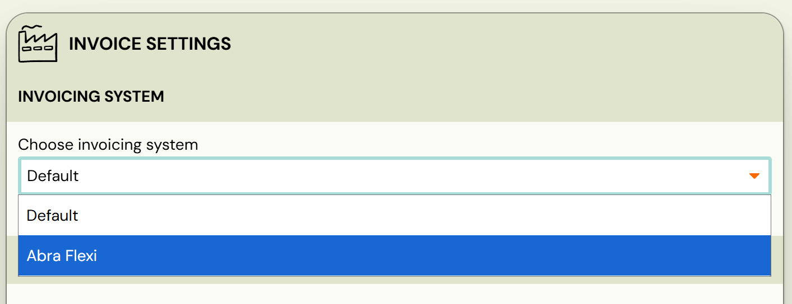
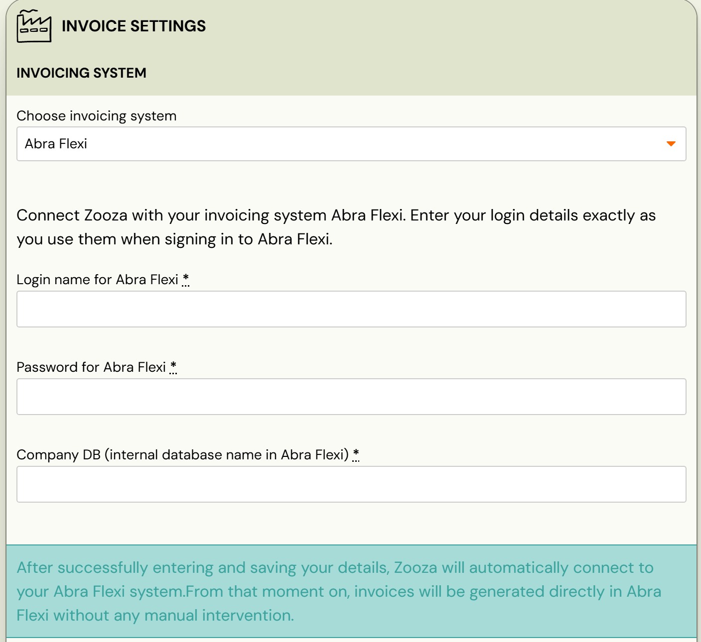
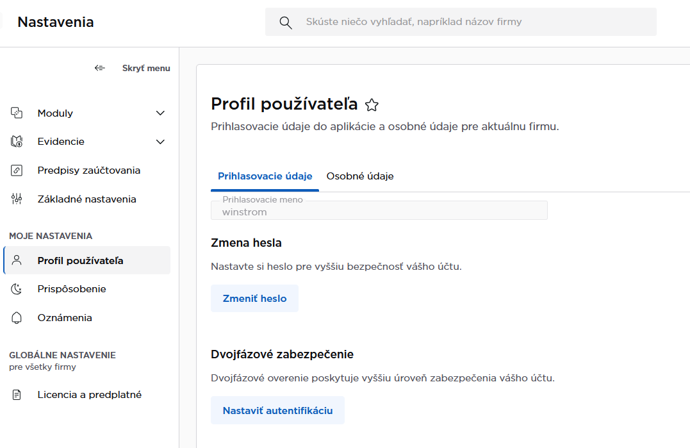

# ABRA Flexi Integration

ABRA Flexi (formerly FlexiBee) is a Czech ERP and accounting system. When connected, Zooza creates invoices directly in your ABRA Flexi instance.

**Market:** Czech Republic / Slovakia
**Setup effort:** Username + password + server URL + company database name

---

## Before you start

You need an active ABRA Flexi instance with your credentials. The **server URL** must point to your production instance — not the demo server.

> **Important:** ABRA Flexi defaults to a demo server URL (`demo.flexibee.eu`). You must change this to your own production server URL, otherwise invoices are created in the demo environment.

---

## Setup

1. Go to **Settings → Billing** and open your Invoice Profile.
2. In the **Invoice Engine** section, select **ABRA Flexi**.

   

3. The **ABRA Flexi Settings** section appears. Fill in your credentials:

   

   | Field | Where to find it |
   |---|---|
   | `Username` | ABRA Flexi → Settings → User Profile |
   | `Password` | ABRA Flexi → Settings → User Profile |
   | `Server URL` | The address of your ABRA Flexi instance |
   | `Company DB` | Last segment of the URL in your browser — e.g. `https://your-server.eu/flexi/**demo_sk**` → Company DB is `demo_sk` |

   

4. Optionally set **Cost Centre** (`Středisko`) and **Activity** (`Činnost`) at the profile level.
5. Click **Save**.

---

## How invoices work

Once connected:

- Every time a payment is recorded in Zooza, Zooza looks up the customer in ABRA Flexi by email, then by name. If not found, Zooza creates the customer automatically.
- The invoice is created with all line items, optionally tagged with cost centre and activity codes.
- Invoice numbering is managed by Zooza.
- PDF is available for download after creation.
- Changes made in ABRA Flexi are **not** synced back to Zooza. Zooza always shows the original version.

---

## Cost centre and activity codes (multi-line)

When multi-line invoices are enabled, you can map each transaction type to a specific **středisko** (cost centre) and **činnost** (activity code) in ABRA Flexi. This enables cost allocation — for example, course payments tracked under one cost centre, registration fees under another.

Configure transaction type mappings in the **Invoice Line Types** section of the Invoice Profile. See [Billing and invoicing — Multi-line invoices](./billing-and-invoicing.md#multi-line-invoices).

---

## What works and what doesn't

| Feature | Status |
|---|---|
| Invoice creation | ✓ Automatic |
| Customer management | ✓ Automatic (create if not found) |
| PDF generation | ✓ Available after creation |
| Cost centre / activity mapping | ✓ With multi-line enabled |
| Payment sync | ✗ Not supported — payments tracked in Zooza only |
| Credit notes | ✗ Not supported — issue in ABRA Flexi directly |
| Editing invoices after creation | ✗ Edit in ABRA Flexi — changes don't sync back |

---

## Known issues

**Demo server** — The server URL defaults to a demo instance. Change it to your production server URL before saving, otherwise invoices are not real.

**One database per account** — You can connect only one ABRA Flexi company database per Zooza account.

---

## Related

- [Invoicing overview](./invoicing-overview.md) — how invoice engines work
- [Billing and invoicing](./billing-and-invoicing.md) — Invoice Profiles, auto/manual generation, multi-line
- [VAT management](../guides/vat-management.md) — configuring VAT rates
