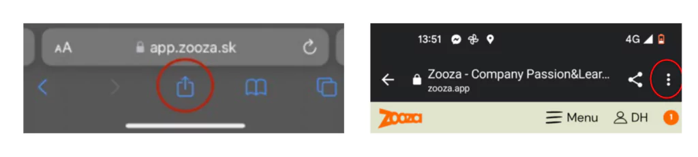
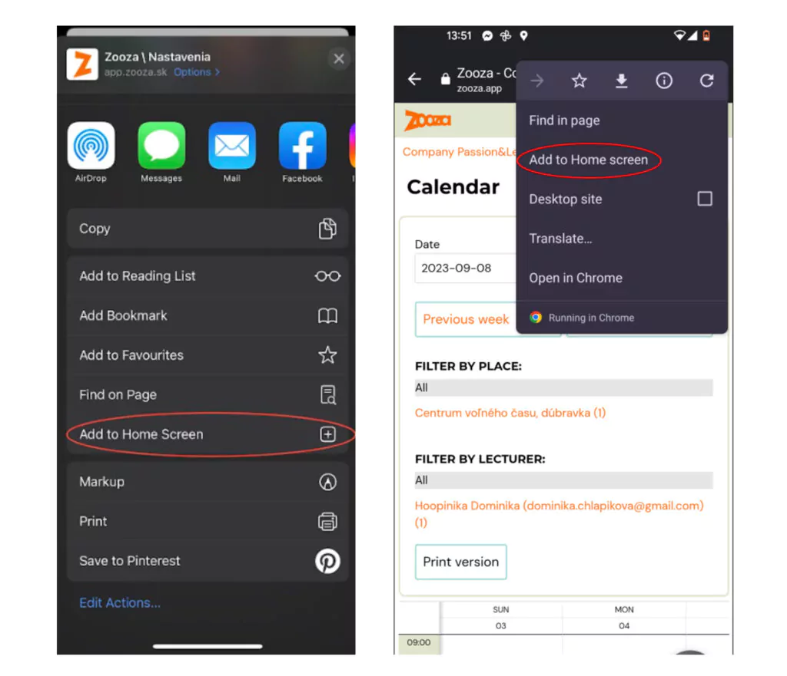
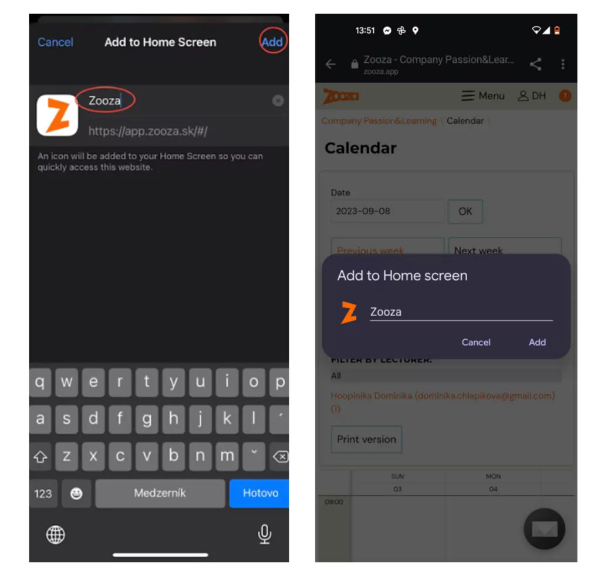

# Add the Zooza app to your phone’s desktop

If you use the Zooza app most often from your phone, you can simplify access to the app by simply adding a bookmark to your phone’s desktop.

Proceed as follows:

1. Open the Zooza app ([http://zooza.app)](http://zooza.app)) in the browser on your phone
2. On android, click on the 3 dots, top right
3. On the iPhone, select the square icon with the arrow, bottom centre
 
4. Select *Add to home screen*
 
5. Enter the name under which you want the app to appear on your phone and click *Add*
 

TIP: if you use Zooza as a instructor / most often for taking attendance / do this by clicking on the calendar section in the app and then adding it to your phone’s desktop. When you click on such an icon on your phone’s desktop, the calendar will be displayed directly and you can fill in your attendance more quickly.
Every click counts 🙂
