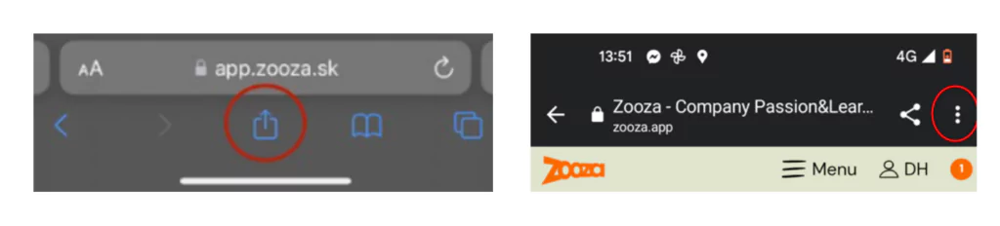
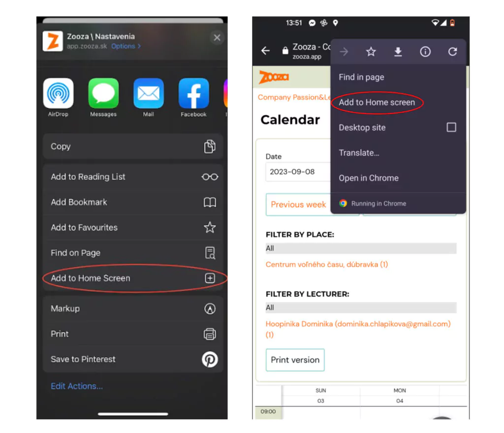
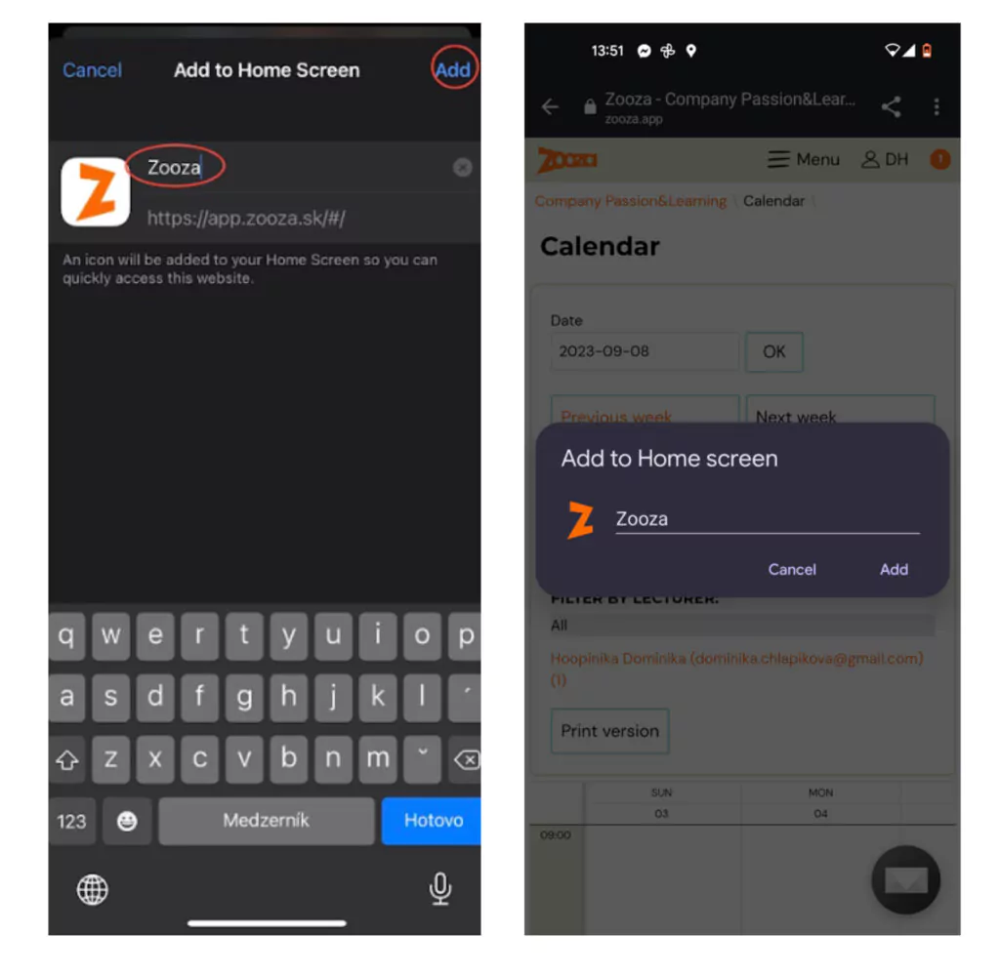

<!-- Synonyms: download Zooza app, install Zooza app, Zooza mobile app, add to home screen, Zooza on phone, stiahnuť aplikáciu, nainštalovať aplikáciu, zooza aplikácia, pridať na plochu, Zooza na mobile, letölteni a Zooza alkalmazást, Zooza app letöltése, Zooza alkalmazás telepítése, telepíteni a Zooza-t, how to get Zooza app, where is the Zooza app -->

# Add the Zooza app to your phone’s desktop

If you use the Zooza app most often from your phone, you can simplify access by adding it as a shortcut to your home screen.

1. Open [zooza.app](http://zooza.app) in the browser on your phone.
2. Open the share/options menu:
   - **Android** — tap the 3-dot menu (top right).
   - **iPhone** — tap the square icon with an arrow (bottom centre).
   
3. Select **Add to Home Screen**.
   
4. Enter the name for the shortcut and tap **Add**.
   

> **Tip for instructors:** If you use Zooza mainly for taking attendance, open the **Calendar** section first and then add that page to your home screen. The next time you tap the icon, the calendar opens directly — no extra navigation needed.
