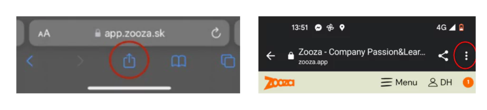
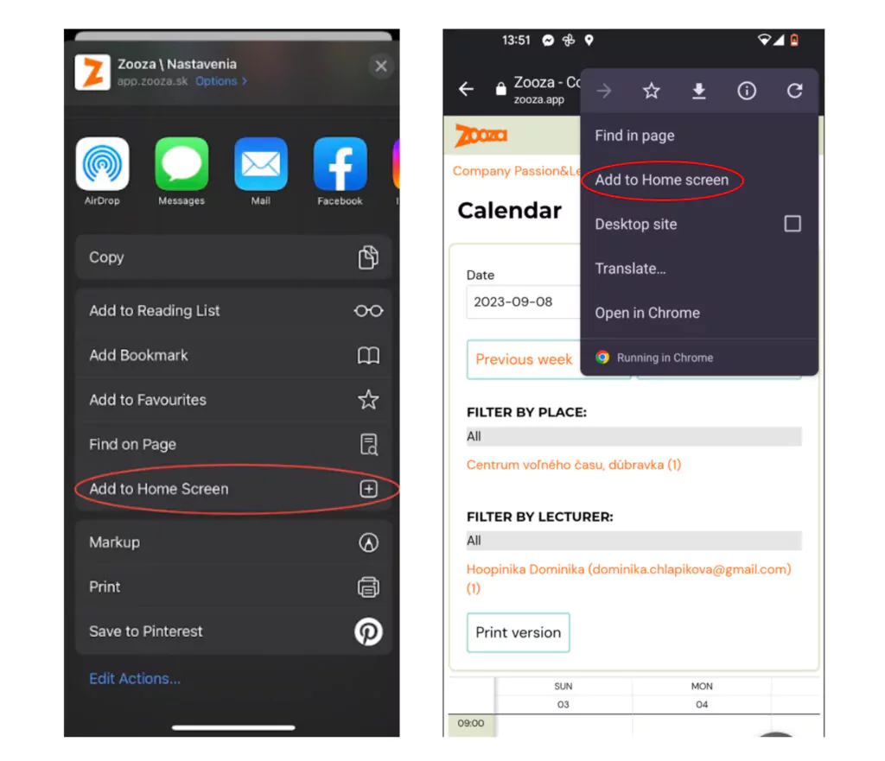
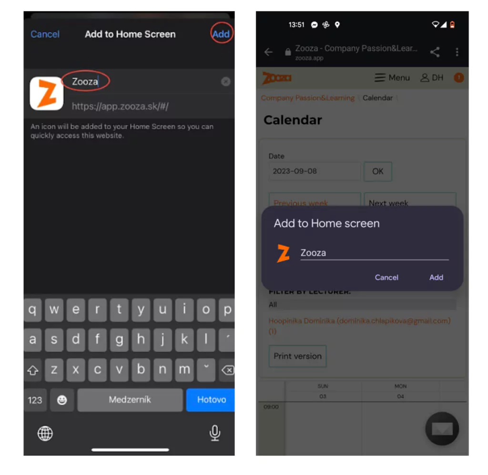

# Using Zooza on mobile

Zooza runs as a web app — there is no separate iOS or Android app to download. Open [zooza.app](http://zooza.app) in your phone’s browser and use it directly, or add it to your home screen for quicker access.

> **Parents can do the same with their profile.** The steps below work for any page, so a parent can put their own profile on their home screen — they just start from your profile page address instead of `zooza.app`. See [Sending parents to their profile](#parents-adding-their-profile-to-the-home-screen) below.

## Add to home screen

1. Open [zooza.app](http://zooza.app) in the browser on your phone.
2. Open the share/options menu:
   - **Android** — tap the 3-dot menu (top right).
   - **iPhone** — tap the square icon with an arrow (bottom centre).
   
3. Select **Add to Home Screen**.
   
4. Enter the name for the shortcut and tap **Add**.
   

> **Tip for instructors:** If you use Zooza mainly for taking attendance, open the **Calendar** section first and then add that page to your home screen. The next time you tap the icon, the calendar opens directly — no extra navigation needed.

## Parents: adding their profile to the home screen

Parents often ask for "an app". There is none, and they do not need one — the same home-screen trick works on their profile page, and afterwards it opens full-screen with your icon, which is close enough to an app for most people.

Send them their profile address — the page on your website where the profile widget lives — and the three steps above. Once added, the icon sits on their home screen and opens straight into their bookings and payments.

This is the practical answer when someone asks for a shortcut to their profile.

## Zooza does not send push notifications

There are no phone push notifications, and adding the profile to the home screen does not create any. Nothing pops up on the lock screen.

What Zooza does send:

| Channel | Used for |
|---|---|
| **Email** | Booking confirmations, payment requests and reminders, session reminders, anything you send from Communication |
| **SMS** | Messages you send from Communication |
| **WhatsApp** | Conversations and templates, if you have the integration — see [WhatsApp integration](whatsapp-integration.md) |

If a parent wants to be told about sessions and payments on their phone, WhatsApp or SMS is the answer, not a push notification.

## Log out on mobile

1. Tap your **avatar or initials** in the top-right corner of the screen.
2. Tap **Account**.
3. Tap **Log out**.

## Switch between company accounts

If you have access to more than one company (e.g. you manage multiple Zooza accounts), you can switch without logging out:

1. Tap your **avatar or initials** in the top-right corner.
2. Tap the company name or the **Switch account** option.
3. Select the company you want to work in.

> If you don't see the option to switch, your user account is linked to only one company. Contact the owner of the other account to request access.
