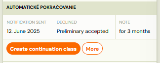
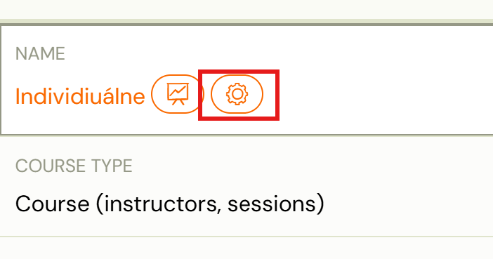
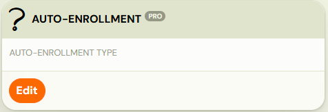
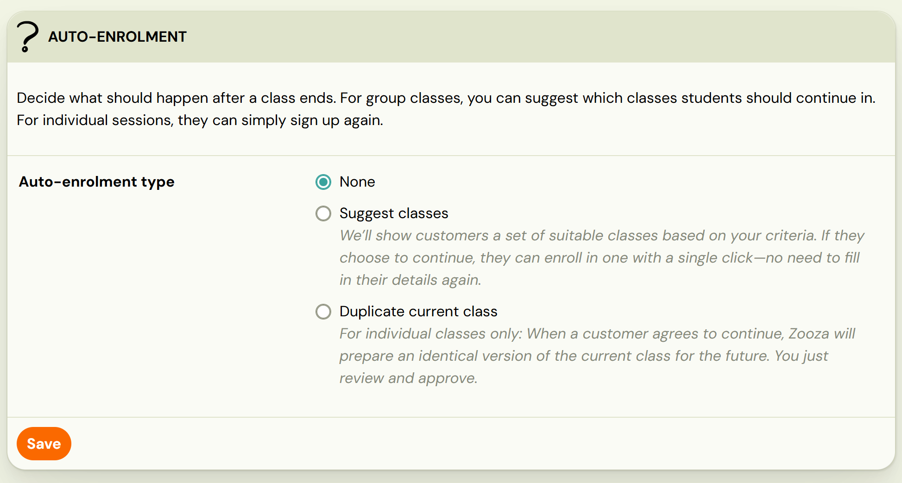
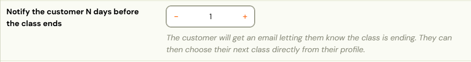
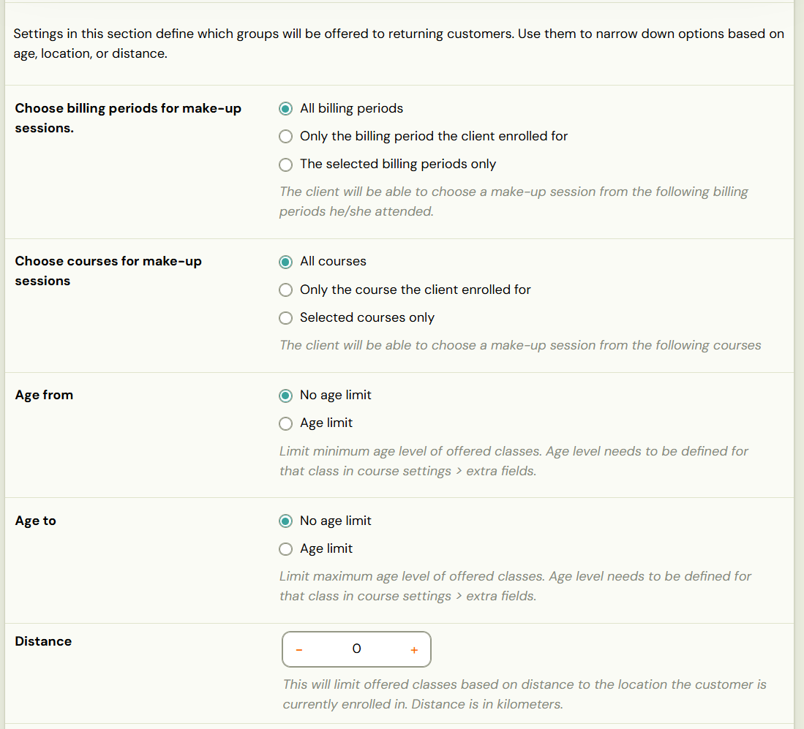
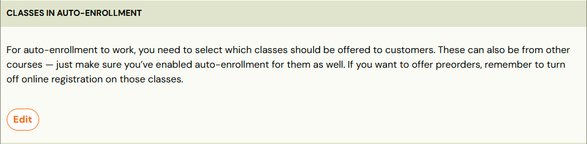
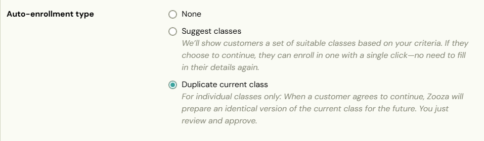
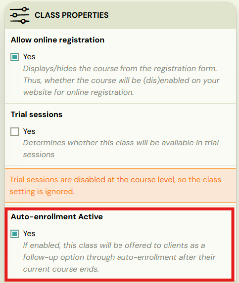

# Auto-enrollment

Auto-enrollment is used for efficient programme enrollment for existing clients with a pre-filled booking form. This allows the client to receive priority enrollment in a new period (for class programmes) or to select a new date for individual sessions, so that you can arrange further continuation via Zooza.

1. Priority enrollment for existing clients, whom you want to offer programmes before displaying them on your website. 
2. In this case, we recommend disabling online registration for these programmes (in the programme settings, *Online Registration*) or performing a bulk edit also in the* Online Registration* tile and disabling *Online Registration *only for the new classes you wish to offer priority enrollment to.
 

In the case of individual programmes, this feature lets you arrange the start of the next class with the client without manually preparing the class beforehand, exactly according to their preferences.

To successfully use auto-enrollment, you need to have created an offer of programmes and classes before activating the settings.

Auto-enrollment is configured in 2 places:

1. At the programme level in tile *Auto-enrollment*
2. At the class level in the *Settings* tile

## 1. At the programme level

First, you need to set which programmes and classes you want to offer clients for enrollment in the new period.

1. Open the settings of the selected programme.
 
2. In *Auto-enrollment* tile click on *Edit*
 
3. Select the type of offer:
4. *Suggest classes *- for class classes and follow-up programmes
5. *Duplicate current class* - ideal for individual clients.
 

Enter how many days before the end of the current term the system should notify clients.

Note: If you have manually set the class end date to a different day, the system will use this manual date instead of the last scheduled date.

## Suggest classes

If you have class ccourses and would like to offer existing clients the option to enroll before opening booking to new clients, select the *Suggest Classes* type of auto*-*enrollment

1. Define the offer:
2. Billing period
3. Filter specific programmes (All programmes, Only the billing period the client enrolled for, Selected programmes only)
4. Age restriction - e.g. offer only for children within a selected age range at the time of booking – enter months or years

Attention! Only programmes with an age restriction filled in under *Extra Fields* will be included in the offer.

1. Distance (set the maximum distance in km from the location where the client is currently enrolled)
 

 2. Finally, select classes you want to include in the auto-enrollment.

## Duplicate current class

This option allows the client to choose when they want to start the next class – especially suitable for individual sessions. Details on how this option works on client's side can be found in the *Client View *section of this manual.

*

*

## At the class level

If the auto-enrollment functionality is active and you need to add another class to the programme (or simply want to expand the list of classes for auto-enrollment), open the *Settings *tile. There you will find a checkbox to add the selected class to the auto-enrollment offer.

Note: If the programme does not have auto-enrollment enabled, the application will notify you and even if the checkbox is selected, this setting will be ignored.
