<!-- Synonyms: billing settings, invoice settings, billing profile, fakturácia, fakturačný profil, nastavenie fakturácie, IBAN, account holder, invoice generation, automatic invoicing -->

# Billing and invoicing

This guide explains how to set up billing profiles and invoicing in Zooza. Billing profiles store your company details (name, address, IBAN) that appear on invoices and in payment instructions sent to clients. Invoices can be generated automatically when a payment is received, or manually per booking.

> **Note:** If you use external invoicing software (Xero, Abra Flexi, Smartbill, Szamlazz), you may not need Zooza's built-in invoicing. See the [Related](#related) section for integration guides.

## Where to find billing settings

Go to **Settings** → **Billing**.

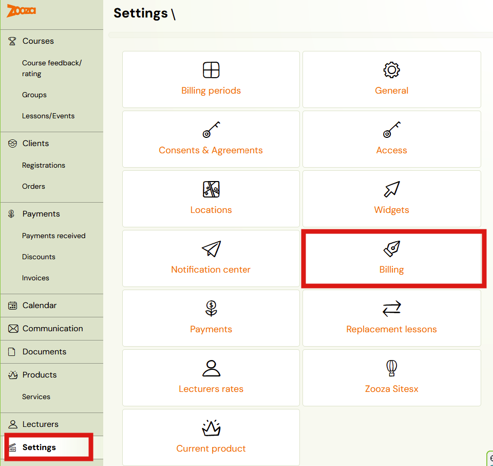

The Billing page has three sections:

1. **Invoice settings** — automatic invoice generation toggle.
2. **Default billing profile** — your primary company and bank details.
3. **Other billing profiles** — additional profiles for multi-entity businesses.

## Automatic invoice generation

The first section controls whether Zooza generates invoices automatically.

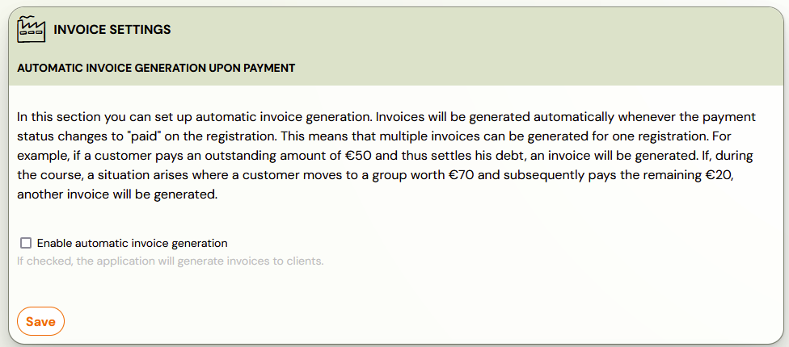

When **Enable automatic invoice generation** is checked, Zooza generates an invoice every time a payment status changes to "paid" on a booking. This means:

- A single booking can produce multiple invoices (e.g., one per instalment).
- If a client pays 50 EUR now and 30 EUR later, each payment triggers a separate invoice.

When unchecked, no invoices are generated automatically. You can still generate invoices manually per booking (see [Manual invoice generation](#manual-invoice-generation) below).

> **Tip:** If you are just getting started with Zooza, you can leave automatic invoicing off, accept bookings and payments, and enable it later once your accounting settings are ready. You can also generate invoices retrospectively.

## Default billing profile

The default billing profile is used on all programmes unless you assign a different profile. It contains your company and bank details that appear on invoices and in payment communications.

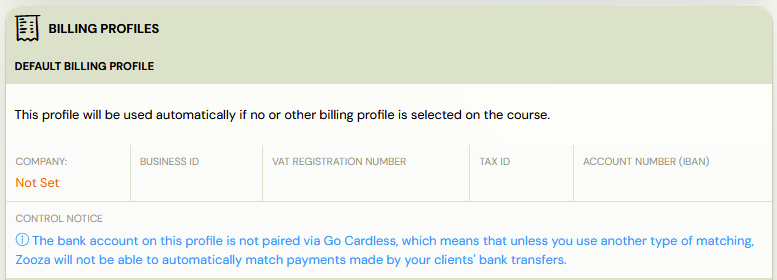

Click the company name (or **Not Set**) to open the profile editor.

### Billing profile fields

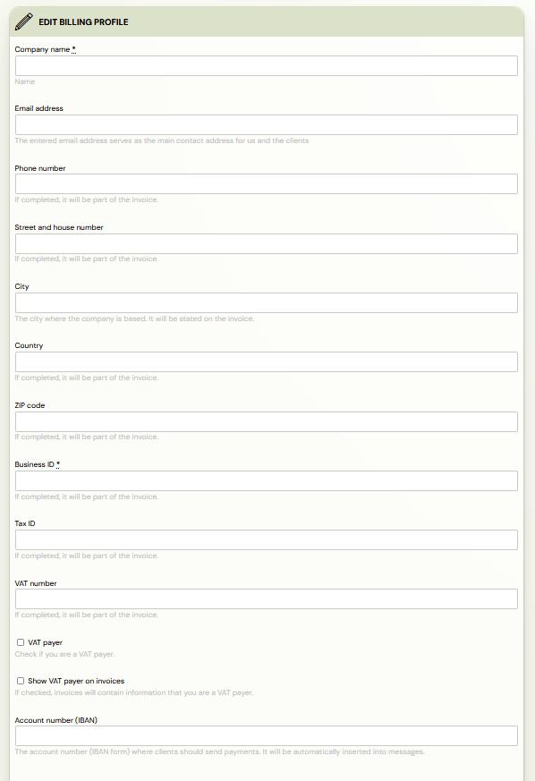

| Field | Description |
|---|---|
| `Company name` | Your company or trading name. Appears on invoices. **Required.** |
| `Email address` | Main contact email for your company and clients. |
| `Phone number` | Contact phone number (appears on invoice if filled). |
| `Street and house number` | Company address line. |
| `City` | City. |
| `Country` | Country. |
| `ZIP code` | Postal code. |
| `Business ID` | Company registration number. **Required.** |
| `Tax ID` | Tax identification number. |
| `VAT number` | VAT registration number (if applicable). |
| `VAT payer` | Check if your company is a VAT payer. |
| `Show VAT payer on invoices` | If checked, invoices display your VAT payer status. |
| `Account number (IBAN)` | Bank account in IBAN format. Automatically inserted into payment messages sent to clients. |
| `Account holder name` | The exact name registered with your bank for this IBAN. |

### Account holder name and IBAN

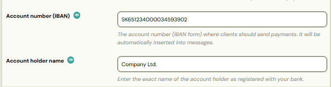

The `Account holder name` must match your bank account exactly. This field is important for two reasons:

1. **QR code payments** — When clients scan a QR code from a payment email, their banking app verifies the account holder name. A mismatch can cause the payment to fail.
2. **Instant Payments Regulation** — EU regulations require that the account holder name matches the IBAN. If these do not match, some banks will reject the transfer.

> **Tip:** You can include your IBAN in payment emails using the dynamic tag for bank account number. This pulls the value directly from the billing profile assigned to the programme.

### GoCardless bank pairing

If you use GoCardless for direct debit, you can pair your bank account with GoCardless directly from the billing profile. This enables Zooza to automatically match incoming bank transfers to the correct bookings.

If the bank account is not paired, you will see a notice:

> "The bank account on this profile is not paired via GoCardless, which means that unless you use another type of matching, Zooza will not be able to automatically match payments made by your clients' bank transfers."

For GoCardless setup details, see [GoCardless Integration FAQ](../faq/gocardless-faq.md).

## Additional billing profiles

If you operate multiple companies or brands, you can create additional billing profiles. Each profile has its own company details, IBAN, and invoice numbering.

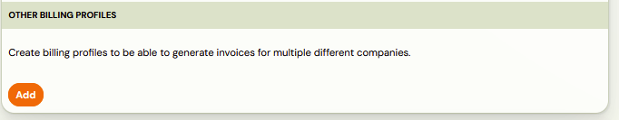

Click **Add** to create a new profile. The form is the same as the default profile.

### Assigning a billing profile to a programme

Each programme can use a specific billing profile for invoicing. To assign one:

1. Open the programme and go to **Settings**.
2. Open the **Price and Payment** tile.
3. In the **Invoicing** section, select the desired **Invoice profile** from the dropdown.
4. Click **Save**.

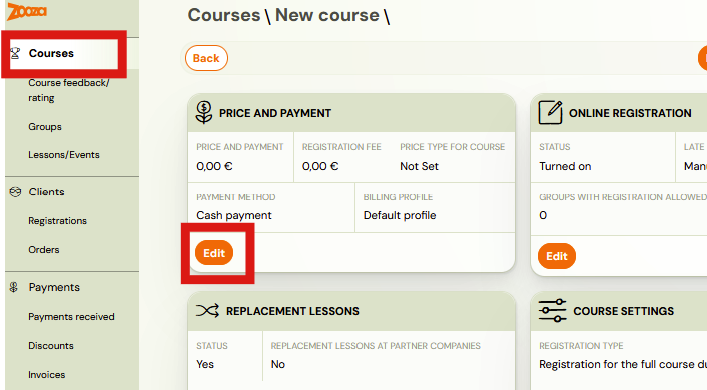

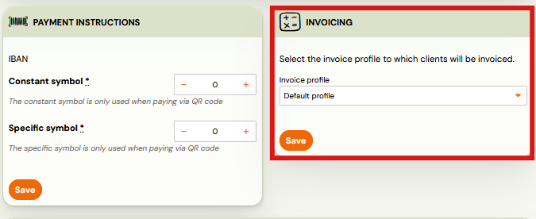

If no profile is selected, the default billing profile is used.

## Invoice overview

All generated invoices are listed under **Payments** → **Invoices** in the left menu.

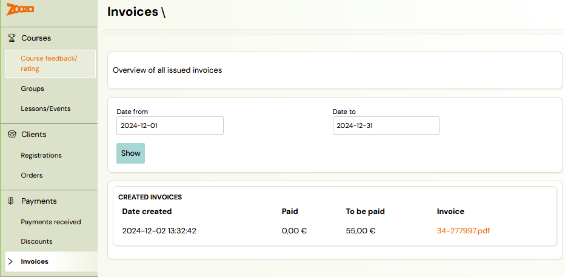

You can filter invoices by date range and see the creation date, paid amount, outstanding amount, and a link to download the PDF. For full details on the invoices screen, see [Invoices](../reference/invoices-list.md).

## Manual invoice generation

You can generate an invoice manually from any booking, regardless of whether automatic invoicing is enabled.

1. Open the booking detail.
2. Find the **Payments** tile — it shows the current payment status and balance.

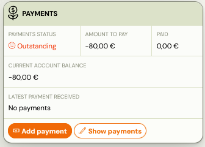

3. Click **Show payments** to expand the payment details.
4. In the **Invoices** section on the right, select the **Invoice profile** to use.
5. Click **Generate invoice**.

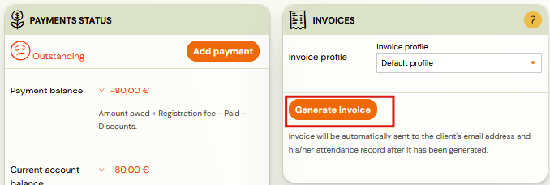

The invoice is generated immediately and sent to the client's email address. The client's attendance record is included in the invoice.

After generation, the invoice appears below the button with its timestamp, invoice number, and a link to the PDF.

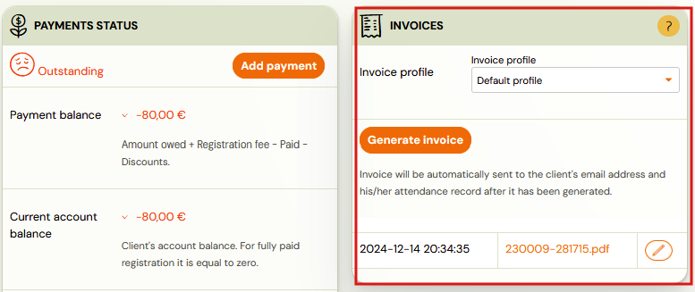

## Editing a generated invoice

After an invoice is generated, you can edit it by clicking the pencil icon next to the invoice PDF link. The edit dialog lets you change:

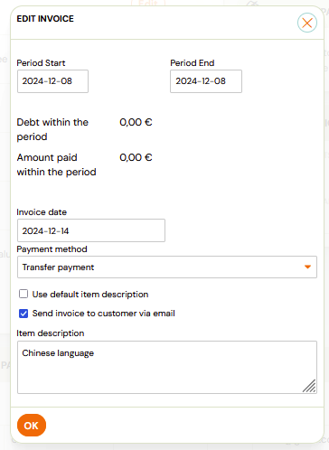

- **Period Start / Period End** — the billing period covered by the invoice.
- **Invoice date** — the date printed on the invoice.
- **Payment method** — how the client paid (e.g., Transfer payment, Cash, Card).
- **Use default item description** — uncheck to write a custom description.
- **Send invoice to client via email** — check to re-send the updated invoice.
- **Item description** — custom text for the invoice line item (e.g., the programme name or a custom note).

> **Note:** Editing an invoice does not change the underlying payment. It only changes what appears on the invoice document.

## Invoice numbering and item descriptions

Invoice numbers are generated sequentially per billing profile. The format and starting number are configured in the billing profile settings.

For the invoice item description, you can use dynamic tags to automatically insert programme-specific information (e.g., programme name, billing period). This is useful when generating invoices across many programmes — each invoice will contain the correct programme details without manual editing.

## Multi-line invoices

By default, Zooza generates a **single-line invoice** — one line item with the total amount.

**Multi-line invoices** break the amount into separate lines per transaction type — for example: Course Payment, Registration Fee, Discount. Each line can have its own label and, if you use Xero or ABRA Flexi, its own account code.

### Where to configure

Open an Invoice Profile (`/#settings/invoice_profiles`) and scroll to the **Invoice Line Types** section at the bottom of the profile.

> **Note:** Settings here override the company-wide defaults for this profile only.

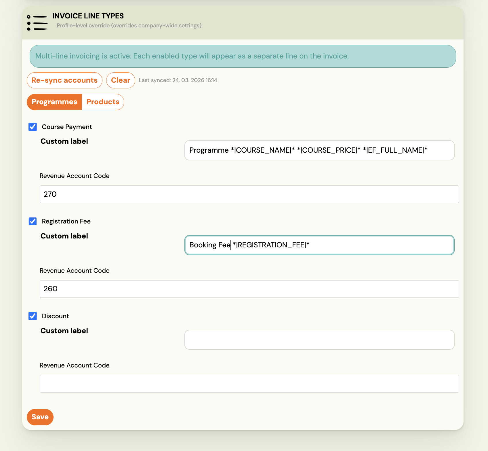

### How to activate multi-line

Multi-line activates automatically as soon as at least one transaction type is enabled. There is no separate on/off toggle.

1. Open the Invoice Profile at `/#settings/invoice_profiles`.
2. Scroll to **Invoice Line Types**.
3. Select the tab — **Programmes** (course registrations) or **Products** (product orders).
4. Check the transaction types you want to show as separate lines (e.g. **Course Payment**, **Registration Fee**, **Discount**).
5. Optionally set a **Custom label** for each line. You can use dynamic tags — for example `*|COURSE_NAME|*` inserts the programme name automatically.
6. Click **Save**.

The status banner confirms when multi-line is active: _"Multi-line invoicing is active. Each enabled type will appear as a separate line on the invoice."_

To return to single-line, uncheck all transaction types and save.

### Account codes (Xero and ABRA Flexi)

If your Invoice Profile uses Xero or ABRA Flexi, each transaction type also has an account code field:

- **Xero** — `Revenue Account Code` (e.g. `260 - Class Sales`). Use **Sync accounts** to pull the latest accounts from Xero.
- **ABRA Flexi** — `Středisko` (cost centre) and `Činnost` (activity code).

Account codes are optional. If left empty, the profile-level default account is used.

### Transaction types

| Type | Description |
|---|---|
| Course Payment | The main payment amount for a course registration |
| Registration Fee | One-time fee charged at registration |
| Discount | Any discount applied to the booking |
| Credit | Credit applied from a previous overpayment |

Unchecked types are merged into the main line (or into the nearest checked parent if they are a correction type).

### Correction types and merging

Each payment type has a corresponding correction type (e.g. `Course Payment Correction`). If a correction type is **not** in your mapping, its amount is automatically merged into the parent line — the result appears as a single net amount. If you add the correction type to the mapping, it appears as its own negative line.

## Related

- [Invoicing overview](./invoicing-overview.md) — how invoice engines work, which engine to use.
- [Invoices](../reference/invoices-list.md) — the invoices list screen reference.
- [Payments and Billing FAQ](../faq/payments-and-billing-faq.md) — common payment and billing questions.
- [Edit payment on booking](../guides/edit-payment-on-booking.md) — how to adjust payments on bookings.
- [Payment options](../guides/payment-options.md) — configuring payment methods and templates.
- [GoCardless Integration FAQ](../faq/gocardless-faq.md) — setting up GoCardless and email-notification payment matching.
- [Email-notification payment matching](../setup/email-payment-notifications.md) — faster alternative to GoCardless, no 90-day renewal.
- [Xero Integration](../setup/xero-integration.md) — connecting Zooza with Xero for invoicing.
- [VAT management](../guides/vat-management.md) — configuring VAT rates and rules.
