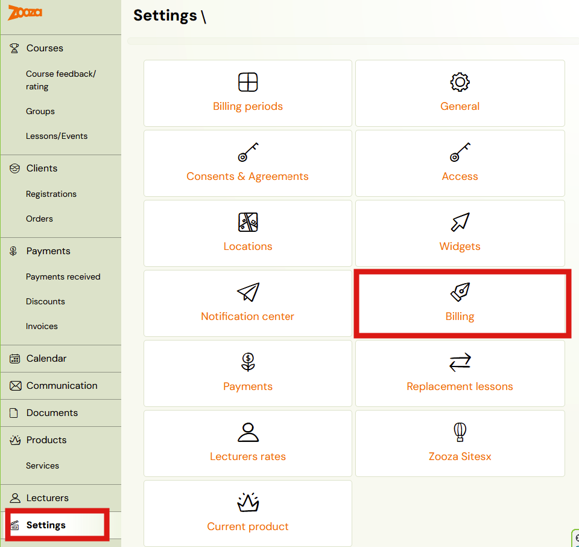
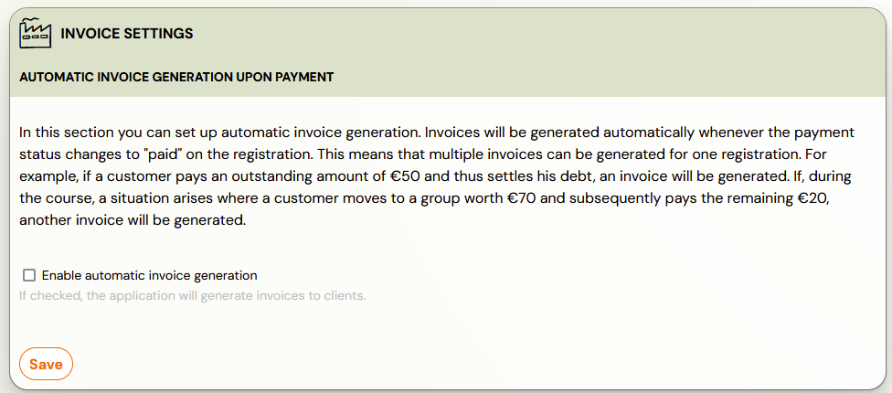
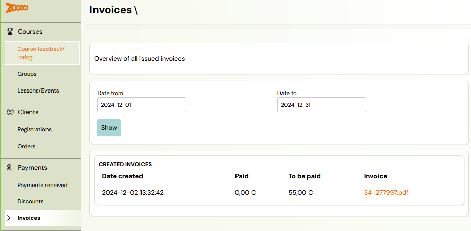
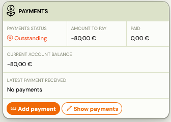
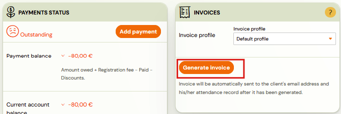
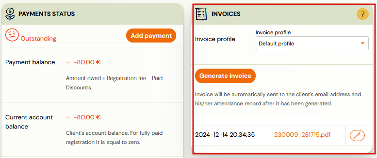
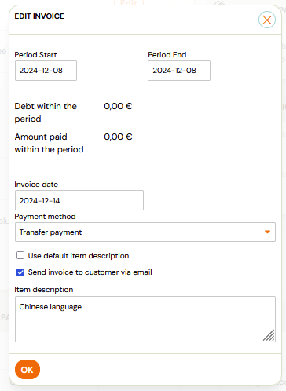
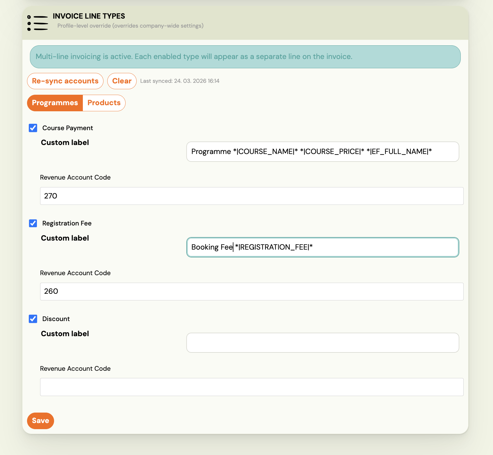

# Billing and invoicing

This guide explains how invoicing works in Zooza — when invoices are generated, how they are numbered and branded, and how to correct them. Your company details on the invoice come from an **invoice profile**; see [Set up invoice profiles and bank accounts](./invoice-profiles-and-bank-accounts.md).

> **Note:** If you use external invoicing software (Xero, Abra Flexi, Smartbill, Szamlazz), you may not need Zooza's built-in invoicing. See the [Related](#related) section for integration guides.

## Where to find billing settings

Go to **Settings** → **Billing**.



The Billing page has three sections:

1. **Billing periods** — the term blocks you bill against.
2. **Invoice profiles** — your legal entities and their bank accounts.
3. **Invoices** and **Payments** — the generated documents and the money received.

## Automatic invoice generation

The first section controls whether Zooza generates invoices automatically.



When **Enable automatic invoice generation** is checked, Zooza generates invoices automatically based on payment events. Two independent triggers are available:

| Trigger | When it fires | Typical use |
|---------|--------------|-------------|
| **Debt cleared** | When a booking reaches `Paid` or `Final payment paid` status | Standard — one invoice per settled payment |
| **Down payment paid** | When a booking reaches `Down payment paid` status | Useful when you want a separate invoice for the deposit upfront |

Both triggers are on by default when you enable automatic invoicing. You can turn each off independently if your accounting workflow doesn't need that event.

- A single booking can produce multiple invoices (e.g., one per instalment, or deposit + final).
- If a client pays 50 EUR now and 30 EUR later, each trigger fires separately.

When automatic invoicing is off, no invoices are generated automatically. You can still generate invoices manually per booking (see [Manual invoice generation](#manual-invoice-generation) below).

> **Tip:** If you are just getting started with Zooza, you can leave automatic invoicing off, accept bookings and payments, and enable it later once your accounting settings are ready. You can also generate invoices retrospectively.

## Invoice profiles and bank accounts

An **invoice profile** is a legal entity — company name, address, Business ID, Tax ID, VAT details and invoice numbering. It is the "From" block on every invoice. A **bank account** is one IBAN that belongs to a profile; a profile can hold several accounts and marks one of them as its default.

Go to **Settings → Billing → Invoice profiles** to manage both.


- The **default invoice profile** is used whenever nothing more specific is set. It cannot be deleted.
- Add another profile when you invoice under a second legal entity.
- Bank accounts live on the profile, in the **Bank accounts** card — including the `Account holder name`, which must match your bank exactly (banking apps verify it when a client scans a payment QR code).
- The same IBAN cannot be used on two invoice profiles in the same company.

Full steps: [Set up invoice profiles and bank accounts](./invoice-profiles-and-bank-accounts.md).

### Which profile a booking uses

A booking invoices under the lowest level that sets a profile: **Default profile → Programme → Class → Booking**. The **Invoicing** card on each of those shows the whole chain, which level decided, and lets you override it there.

Products and orders resolve the same way through the product's own profile.

Full steps: [Choose which invoice profile applies](../guides/invoice-profile-overrides.md).

### Bank statements

Each bank account reads its own bank statements, so incoming transfers are matched to bookings. See [Set up how Zooza collects money from clients](./inbound-payments-setup.md).

## Invoice overview

All generated invoices are listed under **Payments** → **Invoices** in the left menu.



You can filter invoices by date range and see the creation date, paid amount, outstanding amount, and a link to download the PDF. For full details on the invoices screen, see Invoices.

## Manual invoice generation

You can generate an invoice manually from any booking, regardless of whether automatic invoicing is enabled.

1. Open the booking detail.
2. Find the **Payments** tile — it shows the current payment status and balance.



3. Click **Show payments** to expand the payment details.
4. In the **Invoices** section on the right, select the **Invoice profile** to use.
5. Click **Generate invoice**.



The invoice is generated immediately and sent to the client's email address. The client's attendance record is included in the invoice.

After generation, the invoice appears below the button with its timestamp, invoice number, and a link to the PDF.



## Editing a generated invoice

After an invoice is generated, you can edit it by clicking the pencil icon next to the invoice PDF link. The edit dialog lets you change:



- **Period Start / Period End** — the billing period covered by the invoice.
- **Invoice date** — the date printed on the invoice.
- **Payment method** — how the client paid (e.g., Transfer payment, Cash, Card).
- **Use default item description** — uncheck to write a custom description.
- **Send invoice to client via email** — check to re-send the updated invoice.
- **Item description** — custom text for the invoice line item (e.g., the programme name or a custom note).

> **Note:** Editing an invoice does not change the underlying payment. It only changes what appears on the invoice document.

## Invoice numbering and item descriptions

Invoice numbers are generated sequentially per invoice profile. The format and starting number are configured on the invoice profile.

### Custom invoice number template

For invoice engines that support Zooza-generated numbers (**Faktury Online**, **Fakturoid**, **Zooza Invoice**, **Xero**), you can define a template that controls the exact format of the invoice number — for example aligning it with the client's variable symbol or making it human-readable.

**Available tags:**

| Tag | Resolves to | Example |
|-----|------------|---------|
| `{VS}` | Variable symbol (booking reference number) | `12345` |
| `{YYYY}` | 4-digit year | `2026` |
| `{YY}` | 2-digit year | `26` |
| `{MM}` | 2-digit month, zero-padded | `05` |
| `{DD}` | 2-digit day, zero-padded | `09` |
| `{N}` | Sequential invoice number per profile, zero-padded to 4 digits | `0042` |

**Example templates:**

| Template | Result |
|----------|--------|
| `{VS}-{DD}-{MM}-{YYYY}` | `12345-09-05-2026` |
| `ZOOZA-{VS}` | `ZOOZA-12345` |
| `INV-{YYYY}-{VS}` | `INV-2026-12345` |
| `{VS}-{N}` | `12345-0042` |

Set the template in the **Invoice profile** settings under the invoice number / series field. If you leave the field empty, Zooza uses sequential numbering.

> **Note:** This template feature applies only to the four engines listed above. For **Számlázz.hu**, **Smart_Bill**, **Oblio**, and **ABRA Flexi**, the field is interpreted as a literal prefix or series identifier, not a template — those engines manage number formatting on their own side.

For the invoice item description, you can use dynamic tags to automatically insert programme-specific information (e.g., programme name, billing period). This is useful when generating invoices across many programmes — each invoice will contain the correct programme details without manual editing.

### Putting the child's name on the invoice

By default an invoice line shows only the course name, so a parent with two children receives two invoices that look identical apart from the amount. Parents ask for the child's name, the dates, or the class time on the invoice — all of it goes in the **Item description** field.

The field accepts the same dynamic tags as email templates. A common line:

```
*|COURSE_NAME|* - *|EF_FULL_NAME|*
```

which renders as `Swimming 4–6 years - Patricie Janečková`.

Two things to get right:

1. **Uncheck "Use default item description"** — the custom text is ignored while it is ticked.
2. **Regenerate the invoices** afterwards. Existing invoices keep the description they were created with; the change only reaches invoices generated from that point on.

See [Dynamic tags](../guides/dynamic-tags.md) for the full list of available tags.

## Zooza Invoice — templates and branding

> **Applies to:** Invoice Profiles using the **Zooza Invoice** engine only.

When your Invoice Profile uses Zooza Invoice, you can choose a visual template and set brand colours and fonts. The invoice preview shows your actual company logo, name, address, bank details, and QR code alongside mock buyer data — so you see exactly what clients will receive.

### Choosing a template

Three templates are available:

| Template | Description |
|---|---|
| **Classic** | Traditional invoice with blue accents and clear structure. |
| **Minimal** | Clean white design with thin rules and subtle typography. |
| **Modern** | Bold coloured header, card layout, alternating row colours. |

To select a template:

1. Go to **Settings → Billing** and open the Invoice Profile.
2. In the **Invoice Engine** section, find **Template**.
3. Choose a template from the list.
4. Click **Preview** to see a rendered preview with your company branding.
5. Click **Save**.

### Setting brand colour and font

Below the template selector:

| Setting | Options |
|---|---|
| **Primary colour** | Any hex colour (e.g. `#e63946`). Applied to headers, accents, and highlights. |
| **Font** | **Default** (Inter / Segoe UI), **Serif** (Georgia / Times), **Mono** (JetBrains Mono / Courier). |

Changes are reflected immediately in the preview.

### Preview

Click **Preview** at any point to generate a full-page preview. The preview uses:
- Your real company name, address, tax IDs, logo, IBAN, and QR code.
- Translated mock buyer data and sample line items (no real client data is used).

This means the preview is an accurate representation of what your invoices will look like — including your logo and bank details.

### Per-invoice template override

If you need a specific invoice to use a different template, set `template_id` in the invoice's `engine_data` at generation time. The company default applies to all invoices unless overridden.

## Multi-line invoices

By default, Zooza generates a **single-line invoice** — one line item with the total amount.

**Multi-line invoices** break the amount into separate lines per transaction type — for example: Course Payment, Registration Fee, Discount. Each line can have its own label and, if you use Xero or ABRA Flexi, its own account code.

### Where to configure

Open an Invoice Profile (`/#settings/invoice_profiles`) and scroll to the **Invoice Line Types** section at the bottom of the profile.

> **Note:** Settings here override the company-wide defaults for this profile only.



### How to activate multi-line

Multi-line activates automatically as soon as at least one transaction type is enabled. There is no separate on/off toggle.

1. Open the Invoice Profile at `/#settings/invoice_profiles`.
2. Scroll to **Invoice Line Types**.
3. Select the tab — **Programmes** (course registrations) or **Products** (product orders).
4. Check the transaction types you want to show as separate lines (e.g. **Course Payment**, **Registration Fee**, **Discount**).
5. Optionally set a **Custom label** for each line. You can use dynamic tags — for example `*|COURSE_NAME|*` inserts the programme name automatically.
6. Click **Save**.

The status banner confirms when multi-line is active: _"Multi-line invoicing is active. Each enabled type will appear as a separate line on the invoice."_

To return to single-line, uncheck all transaction types and save.

### Account codes (Xero and ABRA Flexi)

If your Invoice Profile uses Xero or ABRA Flexi, each transaction type also has an account code field:

- **Xero** — `Revenue Account Code` (e.g. `260 - Class Sales`). Use **Sync accounts** to pull the latest accounts from Xero.
- **ABRA Flexi** — `Středisko` (cost centre) and `Činnost` (activity code).

Account codes are optional. If left empty, the profile-level default account is used.

### Transaction types

| Type | Description |
|---|---|
| Course Payment | The main payment amount for a course registration |
| Registration Fee | One-time fee charged at registration |
| Discount | Any discount applied to the booking |
| Credit | Credit applied from a previous overpayment |

Unchecked types are merged into the main line (or into the nearest checked parent if they are a correction type).

### Correction types and merging

Each payment type has a corresponding correction type (e.g. `Course Payment Correction`). If a correction type is **not** in your mapping, its amount is automatically merged into the parent line — the result appears as a single net amount. If you add the correction type to the mapping, it appears as its own negative line.

## How clients access their invoices

Clients can find their invoices in two places:

1. **Client Profile → Payments** — invoices generated for their bookings appear here as downloadable PDF links. The client does not need to contact you — they can download invoices themselves at any time.
2. **Email** — when an invoice is generated (automatically or manually), Zooza sends it to the client's email address. The invoice is attached as a **PDF** to the email.

### Why a client says they cannot see their invoice

| Situation | Cause | Fix |
|---|---|---|
| Invoice not in Client Profile | Invoice was not yet generated | Generate it manually from the booking detail or enable automatic generation |
| Client received email but no attachment | Invoice email may have been the payment notification, not the invoice email | Check whether automatic invoice generation is enabled and which trigger fired |
| Invoice is in the profile but client cannot find it | Client is looking in the wrong section | Tell them: Client Profile → open the booking → Payments → Invoices |
| Invoice shows in admin but client cannot see it | Invoice may be assigned to a different email address | Check the email address on the booking vs. the email the client uses to log in |

### Sending an invoice manually to a client

To re-send or send an invoice that was not delivered automatically:

1. Open the booking detail.
2. In the **Payments** tile, click **Show payments**.
3. Find the invoice in the **Invoices** section.
4. Click the **pencil icon** to edit it.
5. Check **Send invoice to client via email** and save.

The invoice is emailed to the client immediately.

---

## Related

- [Set up invoice profiles and bank accounts](./invoice-profiles-and-bank-accounts.md) — legal entities and the accounts that collect payments.
- [Choose which invoice profile applies](../guides/invoice-profile-overrides.md) — inherit and override per programme, class or booking.
- [Invoicing overview](./invoicing-overview.md) — how invoice engines work, which engine to use.
- [Payments and Billing FAQ](../faq/payments-and-billing-faq.md) — common payment and billing questions.
- [Edit payment on booking](../guides/edit-payment-on-booking.md) — how to adjust payments on bookings.
- [Payment options](../guides/payment-options.md) — configuring payment methods and templates.
- [GoCardless Integration FAQ](../faq/gocardless-faq.md) — setting up GoCardless and email-notification payment matching.
- [Email-notification payment matching](../setup/email-payment-notifications.md) — faster alternative to GoCardless, no 90-day renewal.
- [Xero Integration](../setup/xero-integration.md) — connecting Zooza with Xero for invoicing.
- [VAT management](../guides/vat-management.md) — configuring VAT rates and rules.

## Invoices list

Go to **Sales & Payments → Invoices** to view all generated invoices. Use the filter bar to narrow by date range, billing period, invoice profile, or billing status. From the list you can download individual invoices, download all as a ZIP, or export the full list. Each invoice row shows the invoice number, client, amount, and status.

## Zooza platform subscription billing

As of June 2025, all Zooza subscription billing is handled through the Zooza platform in partnership with [Buyloop](http://buyloop.io/) (a subscription and billing management provider).

**To manage your Zooza subscription:**

1. Log in to your Zooza account.
2. Go to **Settings → Current Product → Change Subscription → Checkout**.
3. Choose your subscription type and enter billing and payment information.
4. To pay online, register a payment card under **Payment Methods**.

Contact Zooza support if you need a copy of a past subscription invoice or have a billing query about your Zooza account.
