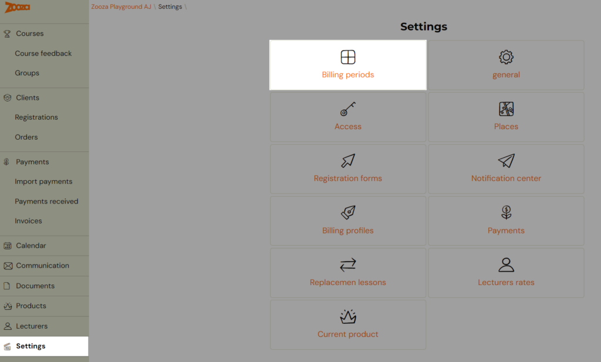
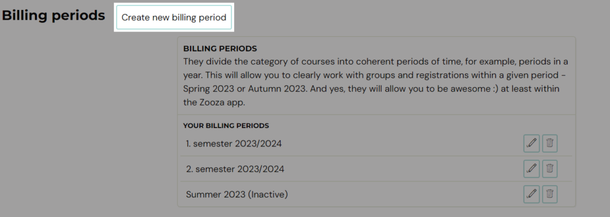
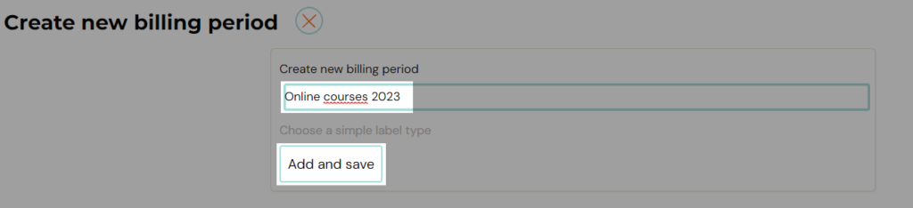
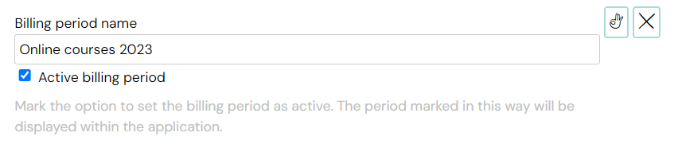
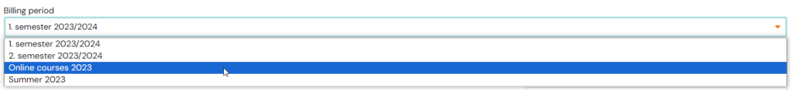
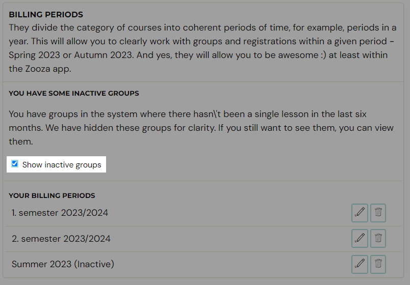

# Setting up billing periods

Billing periods are used for better orientation and overview in which period the courses were held and therefore invoiced to the client. From an accounting point of view, this may be a fundamental setting. As you will be able to record individual invoices according to this classification. This billing record is mainly for your better categorization of groups over time, but it also allows substitutions within courses and carryover of replacement lessons between periods. This setting will make it clearer and easier for you to work with the application.

## How and when to use billing periods?

You set the billing periods according to your needs. For a practical application of the different types of billing periods, here are some examples.

## Exercise for children

I am a children’s exercise organiser and I offer classes for 3 months, per trimester. I set the following billing periods for such courses:

1. Autumn 2024 – Group exercises
2. Winter 2025 – Group exercises
3. Spring 2025 – Group exercises

However, I also offer individual lessons, which I want to have separated by billing periods for clarity. I don’t need a trimester division for individual lessons.

1. Calendar year 2024 – Individual lessons
2. Calendar year 2025 – Individual lessons

## Language courses

I am an organizer of language courses for children and for adults, which last the whole school year, i.e. from September to June of the following year. I set the following billing periods for such courses:

1. 2023/2024 – children
2. 2023/2024 – adults
3. 2024/2025 – children
4. 2024/2025 – adults

I also offer camps for children in the summer and will create a separate billing period for these camps

1. Summer Camps 2024

## Create billing period

Billing periods are created in Settings and then added to the course group. To set them up, proceed as follows:

1. Click on the *Settings* tab in the left menu after logging into the app and then click on *Billing periods*
 
2. Click the *Create new billing period *button at the top of the screen
 
3. Enter the name of your billing period in the blank field and click *Add and Save*
 

The billing period created in this way will be displayed in the list where you have the option to:

1. edit its name – pen icon
2. set active period – pen icon
3. delete – bin icon

Active billing periods will also be displayed in the menu when creating/editing a course group or transferring registrations. You won’t find inactive periods there. See the documentation for more information on the settings.

Note:
 All created billing periods and the classification of registrations
within them are displayed only to the course organizer. Clients do not
see this setting.

If you want to show inactive billing periods in the reports, you need to click *Show Inactive Periods* under *Settings*.

Inactive periods are defined as those in which there has not been a single exercise in the last six months or is only used within the collection bins.
