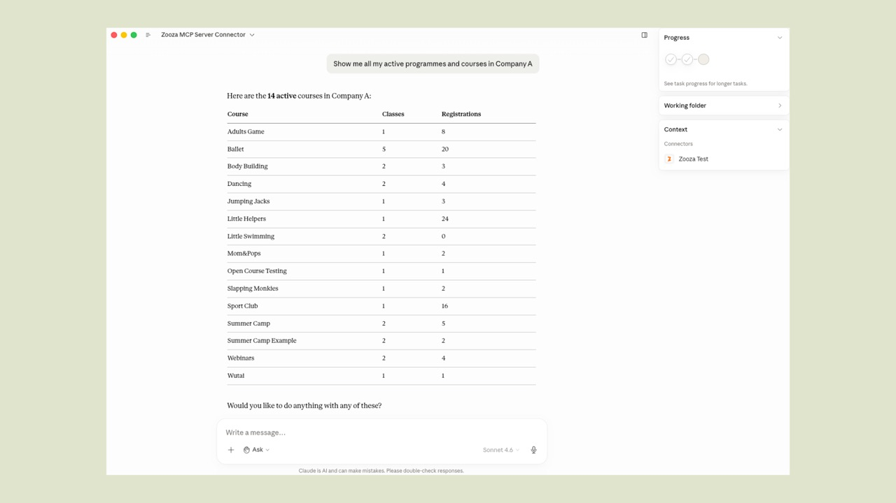
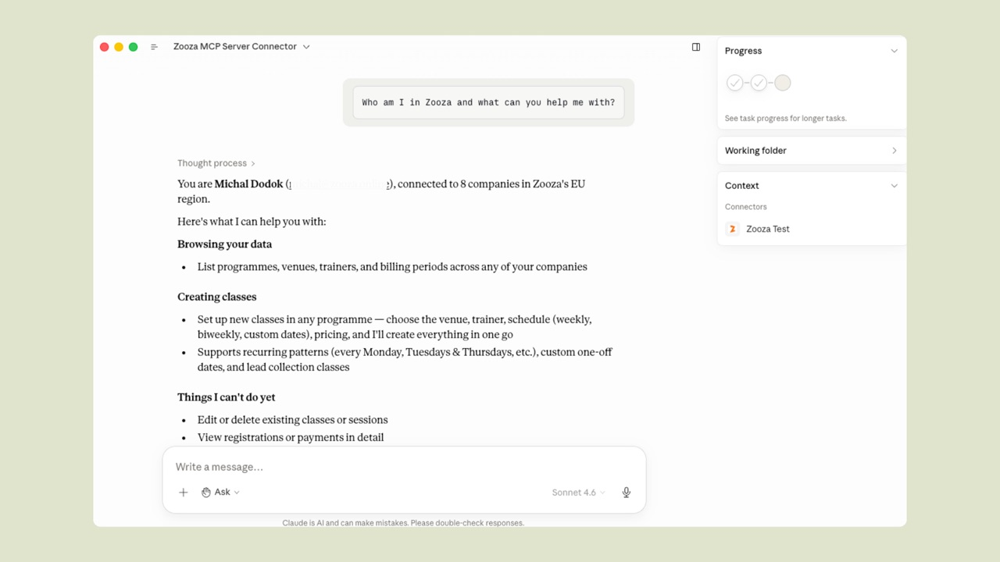
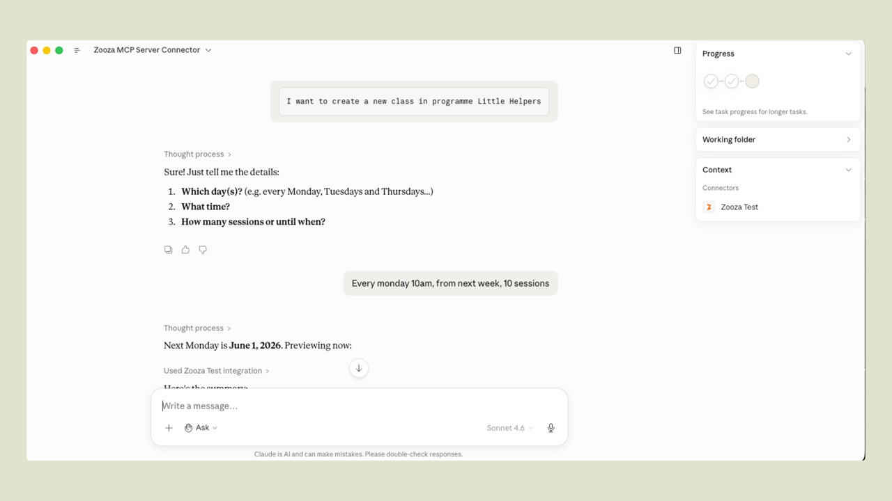
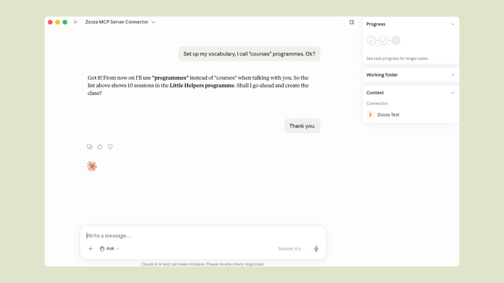
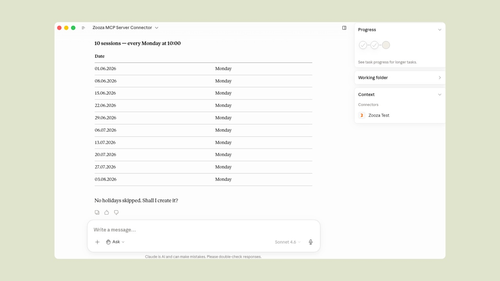

# Connect Zooza to Claude (Zooza AI)

Zooza AI connects Claude (Anthropic's AI assistant) to your Zooza account via an MCP connector. Instead of switching between tabs, you can manage classes, schedules, attendance, and more through a simple conversation — in any language Claude supports.

**Prerequisite:** An active Zooza account with Admin access.

---

## Connect via Claude.ai

1. Open [claude.ai](https://claude.ai) and go to **Settings → Connectors**.
2. Click **Add connector** and enter:
   - **Name:** `Zooza`
   - **URL:** `https://mcp.zooza.app/mcp`
3. Click **Save**.
4. Sign in with your Zooza account — OAuth, same login as zooza.app.

The connector is active immediately.

---

## What you can do

Ask Claude anything about your Zooza data, or use it to take action.

**View programmes and groups**
> *"Show me all my active programmes and how many groups each has"*

**Check your account and capabilities**
> *"Who am I in Zooza and what can you help me with?"*

Claude shows your identity, which companies you have access to, and a summary of what it can and cannot do yet.

**Create a new class**
> *"I want to create a new class in programme Little Helpers"*

Claude asks for any missing details one at a time — days, time, number of sessions. Once you answer, it shows a full schedule preview and waits for your confirmation before saving anything.

<video controls width="100%" style={{borderRadius: '8px', marginBottom: '1rem'}}>
  <source src="/video/mcp-demo-create-class.webm" type="video/webm" />
</video>

**Mark attendance**
> *"Mark attendance for today's 10am dance class — Peter and Sofia were absent"*

**When a parent calls to report an absence**
> *"Remove Sofia from today's 3pm gymnastics session"*

You can ask Claude while handling the call — no need to navigate to the attendance screen first. Claude confirms the change and shows which session was updated.

**Add a session note**
> *"Add a summary to today's session: focused on breathing, 8 students attended"*

**Set your vocabulary**
> *"Set up my vocabulary, I call 'courses' programmes. Ok?"*

Claude confirms it has learned your terms and uses them from that point on.

---

## Skills — guided multi-step operations

Skills are structured guides for more complex operations. Claude asks questions one at a time, validates inputs, and shows a preview before saving.

| Skill | How to start | What it does |
|---|---|---|
| Create a class | `/class-management` or *"I want to create a new class"* | Programme → location → instructor → schedule → preview → confirm |
| Set vocabulary | `/zooza-setup` or *"Set up my vocabulary"* | Teaches Claude your preferred terms — saved across conversations |
| Send feedback | *"I want to report a bug"* | Sends a message directly to the Zooza team |

---

## Preview before saving

When creating a class, Claude always shows a table of planned sessions **before saving anything**. Check dates, times, and instructors — if anything looks wrong, say so and Claude will adjust.

Saving only happens after your explicit confirmation.

---

## Works in multiple languages

Claude responds in the language you write in — Slovak, Czech, Hungarian, Romanian, English, or any other language Claude supports. Data from Zooza is displayed in your account's configured language.

---

## Model performance

Zooza AI supports multiple Claude models. You can compare their accuracy, speed, and cost directly in the app: go to **Settings → Zooza AI → Model performance**.

The comparison is based on real requests and updated periodically — use it to choose the model that best fits your priorities (accuracy vs. speed vs. cost).

---

## What it can't do yet

Some things still require the Zooza web app directly:

- Creating or editing **programmes** (Claude can read them, not create)
- **Payment** processing, refunds, or invoicing
- **Bulk operations** — e.g. cancelling an entire class run or reassigning all clients
- Sending **email or WhatsApp** messages to clients
- Managing **staff accounts** or access permissions

These are planned for future versions. If something is missing that would help your workflow, use the feedback skill: *"I want to suggest a feature."*

---

## See also

- [Zooza AI FAQ](../faq/claude-plugin-faq.md) — pricing, security, and troubleshooting
- [Integrations](./integrations-hub.md) — overview of all Zooza integrations
