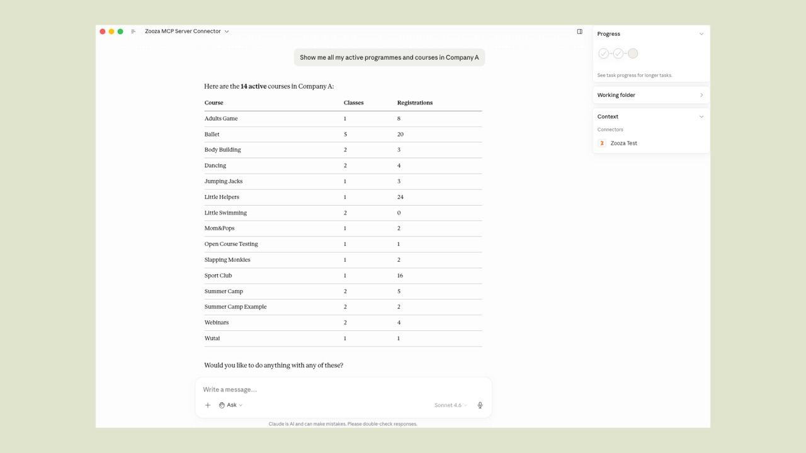
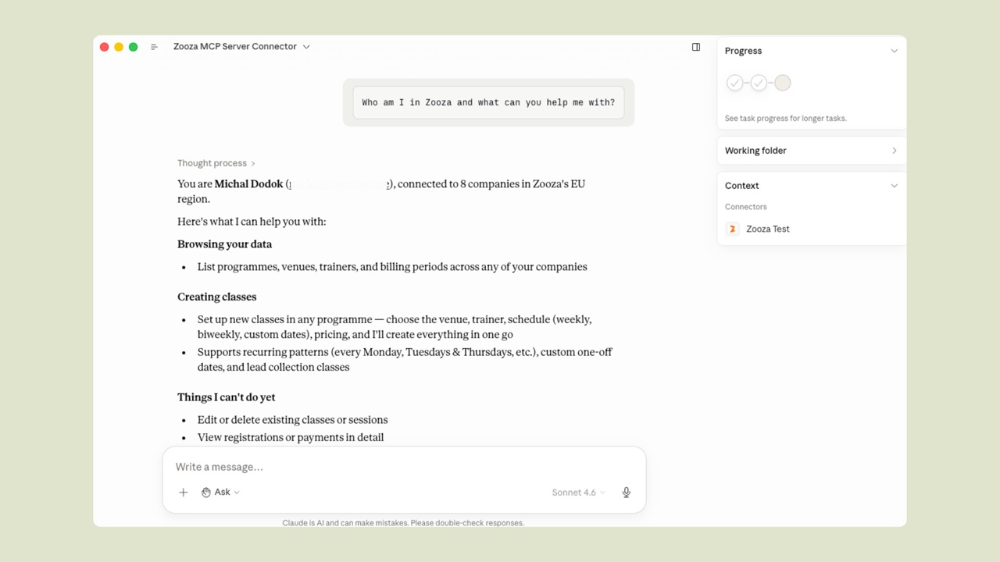
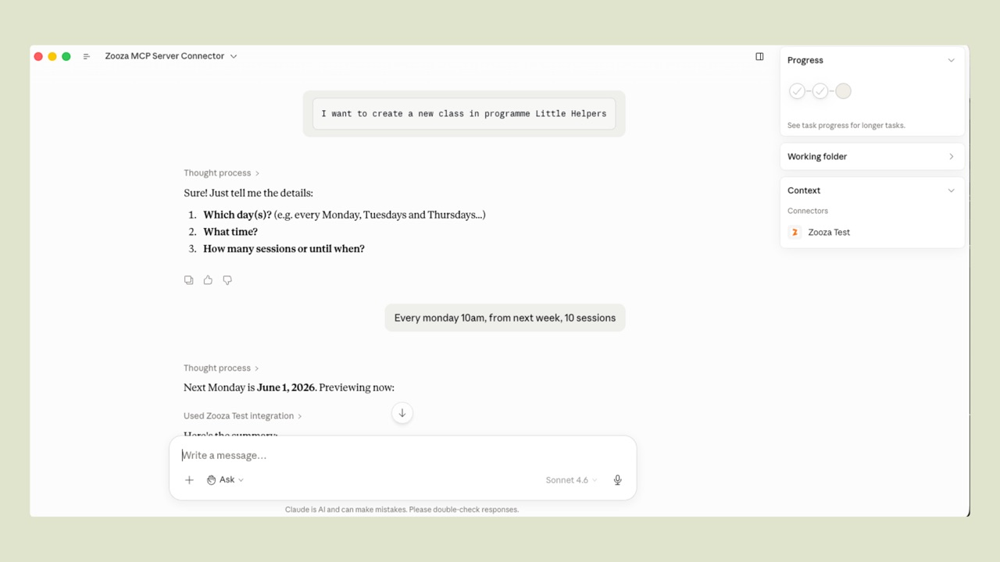
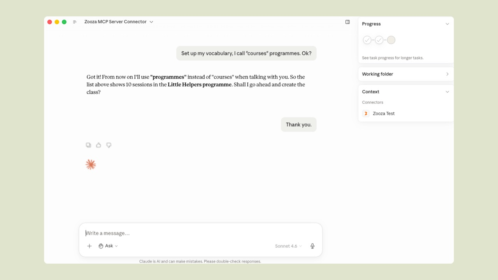
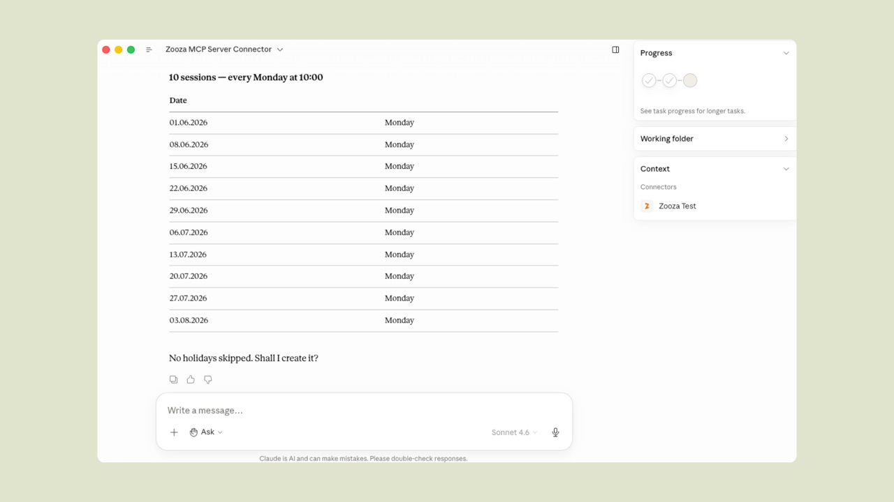

# Connect Zooza to Claude (Zooza AI)

Zooza AI connects Claude (Anthropic's AI assistant) to your Zooza account via an MCP connector. Instead of switching between tabs, you can manage classes, schedules, attendance, and more through a simple conversation — in any language Claude supports.

**Prerequisite:** An active Zooza account with Admin access.

---

## Connect via Claude.ai

1. Open [claude.ai](https://claude.ai) and go to **Settings → Connectors**.
2. Click **Add connector** and enter:
   - **Name:** `Zooza`
   - **URL:** `https://mcp.zooza.app/mcp`
3. Click **Save**.
4. Sign in with your Zooza account — OAuth, same login as zooza.app.

The connector is active immediately.

---

## What you can do

Ask Claude anything about your Zooza data, or use it to take action.

**View programmes and groups**
> *"Show me all my active programmes and how many groups each has"*

**Check your account and capabilities**
> *"Who am I in Zooza and what can you help me with?"*

Claude shows your identity, which companies you have access to, and a summary of what it can and cannot do yet.

**Create a new class**
> *"I want to create a new class in programme Little Helpers"*

Claude asks for any missing details one at a time — days, time, number of sessions. Once you answer, it shows a full schedule preview and waits for your confirmation before saving anything.

<video controls width="100%" style={{borderRadius: '8px', marginBottom: '1rem'}}>
  <source src="/video/mcp-demo-create-class.webm" type="video/webm" />
</video>

**Edit an existing class or session**
> *"Change the instructor for all upcoming Monday sessions in Little Helpers to Jana"*

> *"Move next Tuesday's 5pm session to 6pm and notify clients"*

Claude previews every change — how many sessions are affected, what will change — and only applies it after your confirmation. You can edit class settings (price, instructor, venue, capacity) or individual sessions (date, time, instructor, venue).

**Mark attendance**
> *"Mark attendance for today's 10am dance class — Peter and Sofia were absent"*

**When a parent calls to report an absence**
> *"Remove Sofia from today's 3pm gymnastics session"*

You can ask Claude while handling the call — no need to navigate to the attendance screen first. Claude confirms the change and shows which session was updated.

**Add a session note**
> *"Add a summary to today's session: focused on breathing, 8 students attended"*

**Create a programme**
> *"Create a new programme called Baby Swimming, term payment, trials on"*

A genuinely new offering, not another run of an existing one — for that, add a class to the programme you already have.

**Email your clients**
> *"Email everyone in Little Helpers that Monday's session is cancelled"*

Claude works out the audience, drafts the message, and shows you both before anything is sent. **Email only** — WhatsApp is not available through the connector yet, however you phrase the request.

**Set up how a programme is paid for**
> *"Add a monthly payment template and apply it to Sofia's booking"*

Claude can create payment templates and apply a payment plan to a booking. It does not take payments, issue refunds, or produce invoices.

**Set your vocabulary**
> *"Set up my vocabulary, I call 'courses' programmes. Ok?"*

Claude confirms it has learned your terms and uses them from that point on.

---

## Working an enquiry from first contact to booking

Five tools added in late August 2026 chain together, so a parent's enquiry can be
tracked from the moment it arrives instead of living in your inbox.

> *"A parent emailed asking about Tuesday baby swimming — add her as a lead, tag it
> enquiry, and send her the class details"*

Then, a few days later:

> *"Any replies from leads this week? Anything still unanswered?"*

What each step does:

| Step | What Claude does |
|---|---|
| **Capture the enquiry** | Creates a **lead** from a name and email — a lightweight record you can track. |
| **Tag it** | Attaches a **label** so you can group enquiries and see where each one stands. |
| **Email them** | Sends the class details, previewed by you first. |
| **Read what came back** | Lists replies parents sent to your Zooza emails, and whether each is unread, needs a human, or is handled. |
| **Leave yourself a to-do** | Creates a to-do linked to the record, which you mark done, cancelled or reopened later. |

Four things worth knowing before you rely on it:

- **A lead is not a booking.** It sits on a lead-collection class, takes no payment, enrols nobody, and **sends the parent nothing** — it is a record for you. Convert it to a real booking when they commit.
- **Ask once.** Adding the same lead twice creates two records; Claude cannot tell it has already captured that enquiry.
- **Replies only appear if the original email went out through Zooza** on that registration. A parent replying to a message you sent from your own mailbox is invisible here.
- **Labels on a class can be seen by parents** on the public booking page. Labels on programmes and on bookings stay internal — so keep pipeline notes like *chasing* off the class itself.

The to-dos are the same ones in the app's to-do list — see [Manage your to-do list](../guides/todos.md).

---

## Skills — guided multi-step operations

Skills are structured guides for more complex operations. Claude asks questions one at a time, validates inputs, and shows a preview before saving.

| Skill | How to start | What it does |
|---|---|---|
| Create a class | `/class-management` or *"I want to create a new class"* | Programme → location → instructor → schedule → preview → confirm |
| Set vocabulary | `/zooza-setup` or *"Set up my vocabulary"* | Teaches Claude your preferred terms — saved across conversations |
| Send feedback | *"I want to report a bug"* | Sends a message directly to the Zooza team |

---

## Preview before saving

When creating a class, Claude always shows a table of planned sessions **before saving anything**. Check dates, times, and instructors — if anything looks wrong, say so and Claude will adjust.

Saving only happens after your explicit confirmation.

---

## Works in multiple languages

Claude responds in the language you write in — Slovak, Czech, Hungarian, Romanian, English, or any other language Claude supports. Data from Zooza is displayed in your account's configured language.

---

## Model performance

Zooza AI supports multiple Claude models. You can compare their accuracy, speed, and cost directly in the app: go to **Settings → Zooza AI → Model performance**.

The comparison is based on real requests and updated periodically — use it to choose the model that best fits your priorities (accuracy vs. speed vs. cost).

---

## What it can't do yet

Some things still need the Zooza web app. As of **31 August 2026**:

| Not available through Claude | Where to do it |
|---|---|
| **Cancelling a session**, or ending a class run | Calendar → the session, or archive the class |
| **Adding sessions to a class that already exists** — Claude builds the schedule when it creates the class, but cannot add dates afterwards | Class → **Add sessions** |
| **Taking payments, refunds and invoicing** — templates and payment plans yes, money no | Payments |
| **WhatsApp messages** — email works, WhatsApp does not | Communication |
| **Staff accounts and permissions** | Settings → General → Access |

If something is missing that would help your work, say so in the conversation:
*"I want to suggest a feature."* It reaches the team with the context of what you
were trying to do.

> **Claude says it cannot do something you have read about here?** Refresh the
> connector's tool list — it does not update itself. Your connector kept the list it
> learned on the day you connected, so anything that shipped since is invisible to
> it, and it will tell you so with complete confidence. In Claude, refresh the tools
> from your connectors screen; in ChatGPT, **Settings → Apps → Zooza → Refresh**.
> Full steps, including what to do when refreshing is not enough:
> [Zooza AI says it cannot do something I know it can do](../faq/claude-plugin-faq.md#zooza-ai-says-it-cannot-do-something-i-know-it-can-do).
>
> This is worth doing now if you connected before late August 2026 — everything in
> the enquiry section above shipped after that.

---

## See also

- [Zooza AI FAQ](../faq/claude-plugin-faq.md) — pricing, security, and troubleshooting
- [Integrations](./integrations-hub.md) — overview of all Zooza integrations
