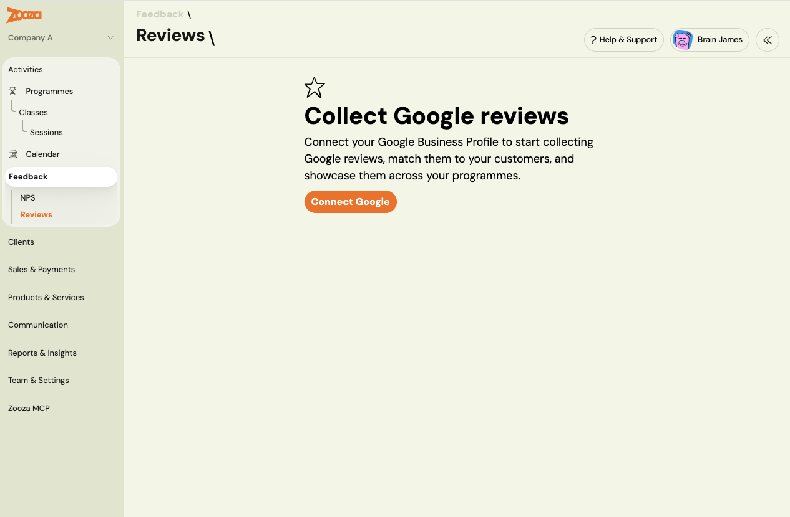
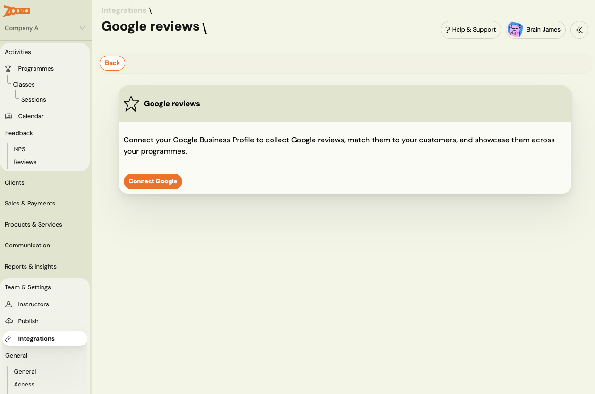
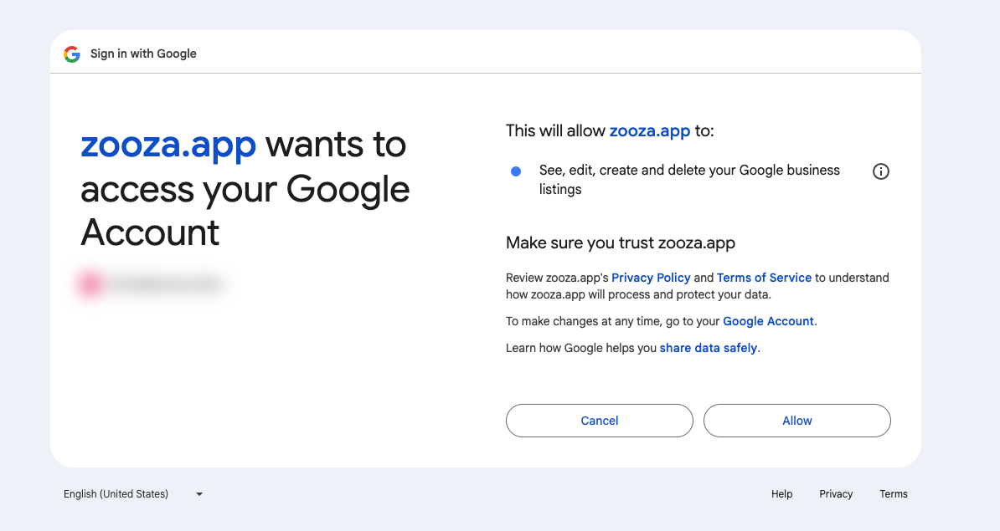
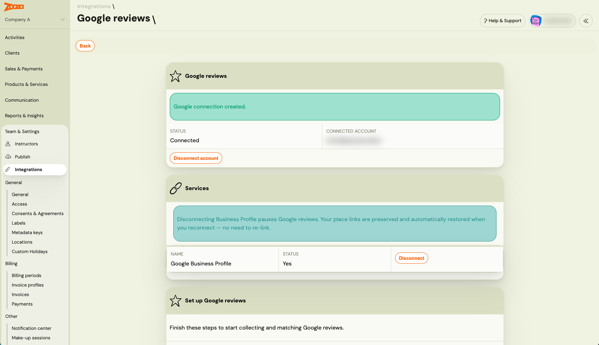
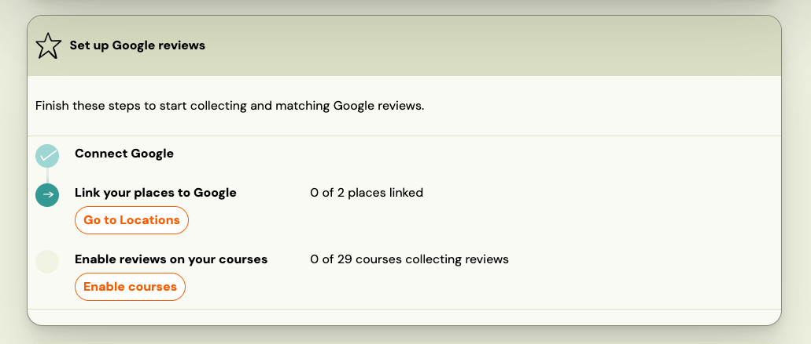
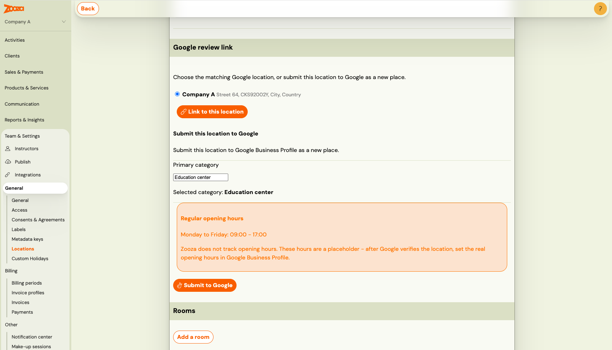
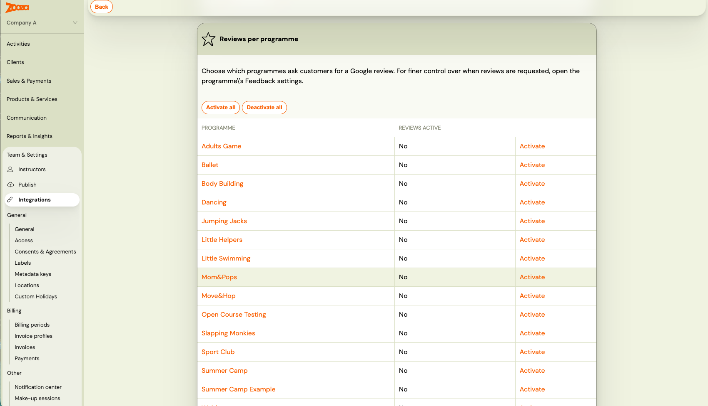
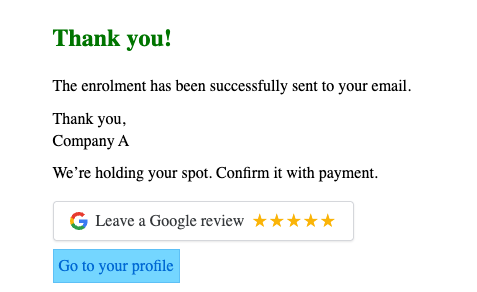
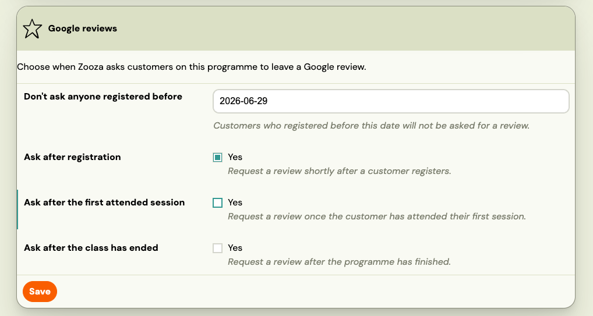

# Collect Google reviews from your clients

The **Reviews** module lets Zooza ask your clients for a public **Google review** at the right moment — after they register, after their first session, or after a course ends — and then reads those reviews back into Zooza so you can see who left them.

> **Where to find it:** In the main menu, **Feedback** has two sections: **NPS** (your existing feedback questions) and **Reviews** (this feature).

> **Rolling out:** Reviews is being rolled out gradually and the admin screens are still being finalised. Button and field names in your account may differ slightly from the names used here.

## Reviews vs NPS feedback — what's the difference

Zooza has two separate, parallel ways of hearing from clients. They do **not** replace each other.

| | **NPS feedback** | **Reviews** |
|---|---|---|
| Purpose | *Private* improvement feedback | *Public* reputation |
| Where it goes | Stays inside Zooza | Posted publicly on Google |
| Question | "How likely are you to recommend us?" | "Leave us a Google review" |
| Provider | Built into Zooza | Google (only provider for now) |

A client who has **already given NPS feedback is not asked for a Google review** — Zooza assumes that was their moment to share an opinion. Your existing NPS questions keep working exactly as before; turning Reviews on changes nothing about NPS.

## Step 1 — Connect your studio to Google

Reviews works through your **Google Business Profile**. You connect once, for the whole company.

1. Go to **Feedback → Reviews** and open the **Google connection** settings.
2. Click **Connect to Google** and sign in with the Google account that manages your business locations. You authorise Zooza on Google's own screen.
3. After authorising, you are returned to Zooza and the connection shows as **Connected as `your-account@gmail.com`**.

Only **one Google account per company** can be connected. Connect the account that owns (or manages) the Google Business Profile listings for your venues.

**Connection status** can show as:

- **Connected** — everything works.
- **Needs reconnect** — Google has expired or revoked the permission. Reviews pause until you click **Reconnect** and authorise again. You'll see this prompt in the same Google connection panel.
- **Not connected / disconnected** — no Google account is linked, or you removed it. You can **Disconnect** at any time to stop all review activity.

## Step 2 — Link your places to their Google locations

Connecting the account is not enough on its own — Zooza needs to know **which Google location matches each of your places**. Reviews are requested and read back **per location**.

1. Go to **Settings → Locations**. Each place now has a **Google** column showing its link status.
2. Open a place. Zooza suggests the most likely matching Google location (matched by name and city).
3. Choose one of:
   - **Confirm the suggested match** — one click links the place to that Google location.
   - **Pick a different Google location** from the dropdown, if the suggestion is wrong.
   - **Leave it unlinked** — a place with no Google link simply never asks for reviews and never pulls any back. Nothing breaks.

Each place's Google link status is one of:

- **Linked** — matched to a verified Google location; it can request and collect reviews.
- **Unverified** — a Google location exists but isn't verified yet (see Step 3).
- **Unlinked** — no Google location attached; the place is left out of Reviews.

You can **Unlink** a place at any time to remove its Google connection.

## Step 3 — No Google listing yet? Submit your place to Google

If a place has no matching Google location in the picker, you can create one from Zooza.

1. On the place, choose **Submit this place to Google**.
2. Pick a **primary business category** from the autocomplete (Google requires one). Start typing and choose the closest match.
3. Review the **opening hours**. Zooza prefills **Monday–Friday, 09:00–17:00** as a placeholder.

   > ⚠️ **Zooza does not track opening hours.** Your classes are individual scheduled events, not shop opening times, so these prefilled hours are only a placeholder. **After your location is verified, update the hours in your Google Business Profile** to match your studio's real availability.

4. Confirm to submit. The place status becomes **Unverified** and the new Google location is created.

### Verification happens on Google's side, not in Zooza

This is the part that most often looks "stuck" but isn't. **Zooza only submits the location — it does not verify it.** Google verifies new locations through its own process (a postcard, phone call, or video), which you complete **inside your Google Business Profile**, not in Zooza.

Once Google has verified the location:

1. Come back to the place in Zooza.
2. Click **Refresh status**.
3. When Google reports the location as verified, the status flips to **Linked** and the review link is filled in automatically.

If it's still unverified, Zooza shows the reason Google gave (for example, "verification pending"). Keep the verification flow going in Google Business Profile, then press **Refresh status** again.

## Step 4 — Choose which programmes ask for reviews, and when

Review requests are turned on **per programme**, and you choose **when** they go out. Nothing is sent until you switch it on.

1. Go to **Programmes → {your programme} → Settings → Feedback**.
2. In the **Reviews** section, enable any of the three moments:

   - **After registration** — shown on the registration widget's thank-you screen, right after someone signs up. 
   - **After the first session** — sent by email and WhatsApp once the client attends their first session.
   - **After the class has ended** — sent by email and WhatsApp after the programme's last session has passed.

3. Optionally set a **start date** ("don't ask anyone who registered before this date"). Clients who registered earlier are left out — useful when you switch the feature on for an existing programme and don't want to message people who joined long ago.

All three moments are **off by default** and are independent — turn on as many or as few as you like, for each programme separately.

## When a client is (and isn't) asked for a review

Even with a moment enabled, Zooza deliberately holds back in several cases so your clients are never over-asked.

A client **will not** be asked when:

- **They were already asked in the last 12 months.** Each client is asked at most once per company per 12 months, no matter how many programmes they're in.
- **They already gave NPS feedback.** Public review and private feedback don't both fire.
- **They are unsubscribed from marketing** for your company.
- **They already left a Google review** that Zooza has matched to them.
- **The relevant place isn't linked** to a verified Google location (an *unverified* or *unlinked* place never sends).

All of these are **expected behaviour**, not errors — if a particular client didn't get asked, one of the rules above almost certainly applies.

## Where your reviews show up

Once reviews start coming in, Zooza reads them back from Google daily and shows them in two places.

> **Reviews update once a day.** Zooza pulls new reviews from Google **once every 24 hours**, so a review a client just left may not appear in Zooza straight away. If you can see it on Google but not yet in Zooza, that's normal — it will show up at the next daily sync.

**On the client's profile.** When Zooza can match a Google review to one of your clients, the review (star rating, comment, date, and the Google source) appears on that client's profile. This lets you recognise advocates and follow up with anyone who left a low rating.

**In the company-wide Reviews list.** Go to **Feedback → Reviews** to see every review pulled from Google:

- Both **matched** (linked to a client) and **unmatched** reviews.
- Filterable by **star rating** and **time**.

Zooza matches reviews automatically when a reviewer's name closely matches a client who recently clicked your review link. When it can't be sure, the review stays in the list as **unmatched** — you can **link it to a client with one click**.

## Related

- [Google reviews — frequently asked questions](../faq/google-reviews-faq.md)
- [Create and manage your locations](./creating-a-location.md)
- [Set up online registration](./online-registration.md)
- [WhatsApp integration & usage](./whatsapp-integration.md)
