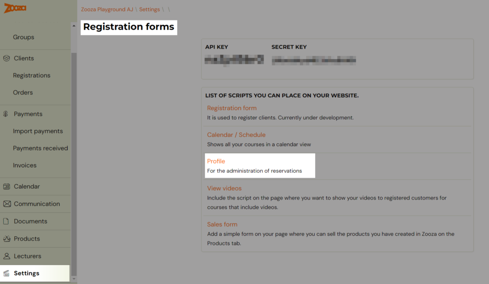
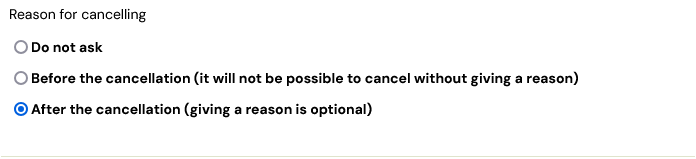
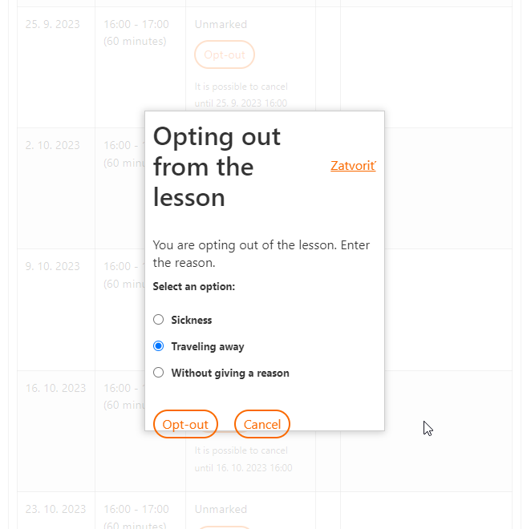

# Collecting the reason for cancelling the lesson

Due to the pandemic situation, we have developed the ability to collect reasons for opting out of classes from customers. Why they are checking out of individual lessons.

They can then choose from the following three options when cancelling:

1. Sickness
2. Traveling away
3. Without giving a reason

The actual collection of cancelling reasons must be activated. Without activation, nothing changes for customers.

## Setting up collecting reasons

There are two places in the app where you can record the reasons for opting out:

1. On the registration details in the *Attendance *tab
2. On the details of the term

You can record the reasons manually. Unless recording the reasons is enabled in the profile, clients will not see the reason logging form.

Note: Clients do not see the actual reason for opting out under any circumstances. Regardless of whether the collection of reasons is activated or not.

## On the registration details

In the *Settings *tab, click *Registration Forms, *under *Profile*.

Under *Reason for cancelling*, select one of the three options:

The biggest difference between the other two options is that in the first case, the reason for opting out is mandatory and the customer has to enter it in order to opt out. In the second case, the submission of the reason for opting-out is voluntary.

## On the event detail

At the time the customer chooses to cancel, a form will be displayed prompting the customer to enter a reason.

The customer chooses one of the options and clicks the* opt-out* button to opt-out of the event.

## Collecting the reason for cancelling after the cancellation

The same procedure is repeated when collecting the reason after logging out, except that the client is logged out first and the form is displayed afterwards.
