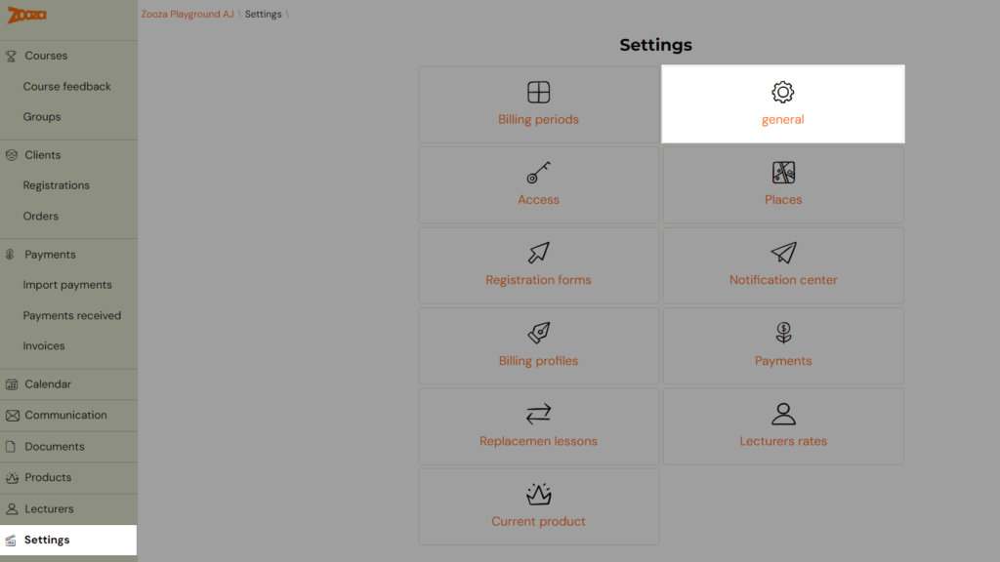
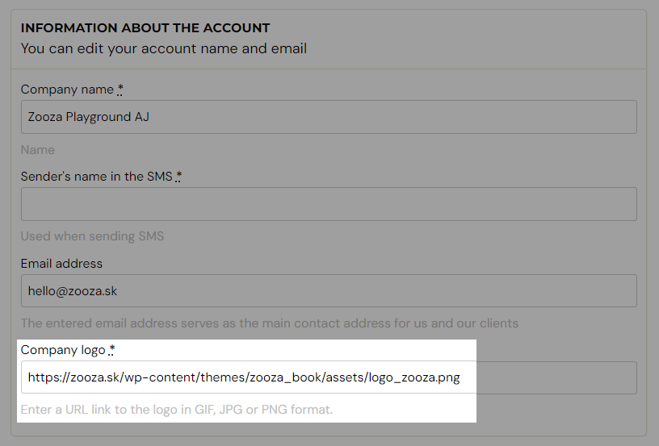
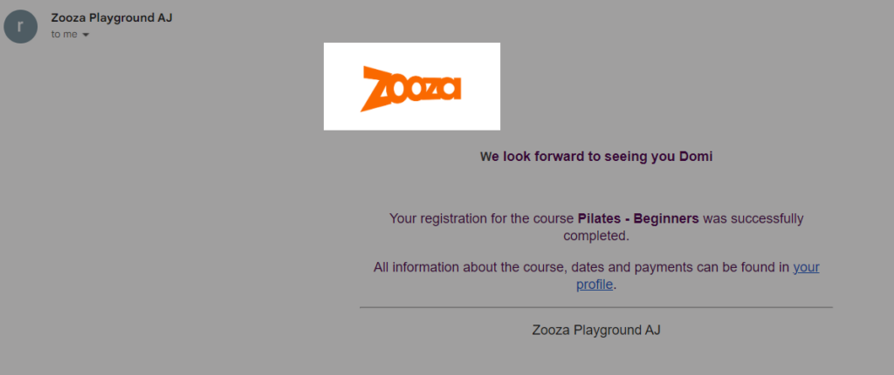

# Company logo in email communication

You can insert your company logo within the application. Once set, it will appear in the header of all email communication with your clients.

1. Go to **Settings --> General**.

2. In the first section, **Account Information**, there is an option to insert a logo. Enter the URL where the logo is stored.

3. After inserting the link with the logo, scroll to the bottom of the page and click **Save**.

Visualisation of the email with the logo:

