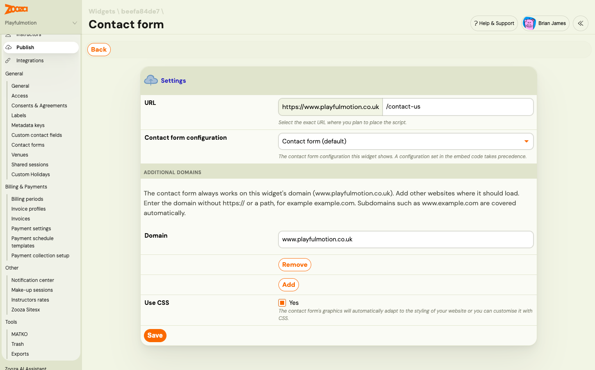

# Put the contact form on your website

The contact form is a widget, like the booking form or the client profile. It belongs to a widget in **Team & Settings → Publish**, is embedded with a short snippet, and loads only on the websites you allow. What the form asks is set in its [configuration](contact-form-setup.md). This article is about getting it onto the page.

> **Navigation:** Go to **Team & Settings → Publish**, click your widget, and find the **Contact form** row. You need the permission to edit company settings.

## Configure the Contact form on your widget

Click **Configure** on the **Contact form** row.



| Setting | What it does |
|---|---|
| `URL` | The exact page where you will place the form, for example `https://www.example.com/contact-us`. Its domain is allowed automatically. |
| `Contact form configuration` | Which configuration this widget shows. **Company default** is your default configuration. A configuration named in the embed code always wins. |
| `Additional domains` | Other websites where the form may load. Enter the domain without `https://` or a path, for example `example.com`. Subdomains such as `www.example.com` are covered automatically. Click **Add** for another domain. |
| `Use CSS` | Loads Zooza's minimal default styling. The form inherits your website's font and colours, and any CSS rule on your site overrides it. |

Click **Save**.

**Allowed websites.** The form loads on the widget's own domain, on the domain of the `URL` above, and on every additional domain, subdomains included. Anywhere else it shows an error instead of the form. A staging site on a different domain, or a local copy of your website, needs its own entry, for example `staging-site.netlify.app` or `localhost`.

## Get the embed code

Open the widget's embed code section and choose the **Contact form** tab. Two placements are offered, both fully supported:

- **Body only**: paste the placeholder and the loader together, where the form should appear. Choose this if you cannot edit your site's template.
- **Head + body**: put the loader in the page's `<head>` and the placeholder where the form should appear. The form starts loading a little earlier.

The snippet looks like this. Your widget key and your region's address are already filled in when you copy it from Zooza.

```html
<div data-zooza-widget='contact' data-zooza-id='YOUR_WIDGET_KEY'></div>
<script async src='https://api.zooza.app/widgets/v1/loader.js'></script>
```

The loader address depends on your region: `api.zooza.app` for Europe, `uk.api.zooza.app` for the UK, `asia.api.zooza.app` for the UAE. Copy from Zooza rather than typing it.

**Embed code for one configuration.** The snippet above shows the configuration selected on the widget, or your default. To show a specific configuration on a page, open that configuration in **Team & Settings → General → Contact forms** and copy the code from its **Embed code for this form** card. It adds `data-zooza-config-id` with the configuration's number. If the configuration has hidden fields filled from the embed code, the snippet also lists the attributes to fill: replace `REPLACE_ME` with the value for that page.

## WordPress and page builders

The Zooza WordPress plugin's `[zooza]` shortcode does not render the contact form. Add a **Custom HTML** block to the page and paste the embed code into it. In other builders, use whatever block accepts raw HTML or a script.

One contact form per page. If a page contains the placeholder twice, the first one shows the form and the second shows a notice. You can put the form on as many pages as you like.

## Which configuration the visitor sees

1. The configuration named in the embed code with `data-zooza-config-id`, if any.
2. Otherwise the **Contact form configuration** selected on the widget.
3. Otherwise your company's default configuration.

If the embed code names a configuration that no longer exists or has been archived, the form shows an error rather than falling back to the default.

## Match your website's look and wording

With **Use CSS** on, the form takes your website's font and text colour and sits at most 660 px wide. Colours, corners and spacing are CSS variables you can set on the widget's root element. This is a job for whoever maintains your site:

```css
.zooza-contact-widget {
  --zooza-accent: #FA6900;
  --zooza-border-color: #d0d0d0;
  --zooza-radius: 5px;
  --zooza-max-width: 100%;
}
```

The button label, the standard field labels and the validation messages can be changed per page with a small script before the widget, in the same way as for the booking form (see [Changing the wording in a widget](../guides/customizing-widgets.md#changing-the-wording-in-a-widget)). The texts you wrote yourself, such as custom field labels, consent texts and the success message, are changed in the configuration, not on the page.

The full list of CSS variables, class names, wording keys and the language options is in the developer documentation: [docs.zooza.online/widgets/contact-widget](https://docs.zooza.online/widgets/contact-widget).

## Check that it works

Open the configuration in **Team & Settings → General → Contact forms** and look at the **Form on your website** card.

- **Never seen on a website**: the snippet has not loaded anywhere. Check that it is on a published page and that the page is on an allowed domain.
- **Loading, no enquiries yet**, with the page it loads on: the embed works. Send a test enquiry.
- **Blocked domain**, with the domain it was blocked on: click **Allow** and Zooza adds that domain to the widget. The status updates the next time the form loads there.
- **Receiving enquiries**: done.

**A test enquiry did not show up in Contacts?** Zooza treats an enquiry as spam if it is sent within three seconds of the page loading, contains several links, or fills every text field with the same text. It also drops more than five enquiries per hour from one email address. A spam enquiry still gets the thank-you message, so the form looks fine. Write your test the way a real parent would, and check **Clients → Contacts → Spam** for anything caught. See [Work with contacts and enquiries](../guides/working-with-contacts.md#spam-review-and-rescue).

Page caching is not a problem. The widget fetches what it needs each time the page loads.

## Related

- [Set up a contact form](contact-form-setup.md)
- [Contact form (lead capture): turn website enquiries into contacts](../guides/contact-form-lead-capture.md)
- [Track campaigns and conversions from the contact form](../guides/contact-form-campaign-tracking.md)
- [Publish (Widgets)](../reference/publish-widgets.md)
- [Deploying Zooza app on your website](deploying-zooza-on-website.md)
- [Customizing widgets](../guides/customizing-widgets.md)
- [Contact form and contacts FAQ](../faq/contact-form-and-contacts-faq.md)
