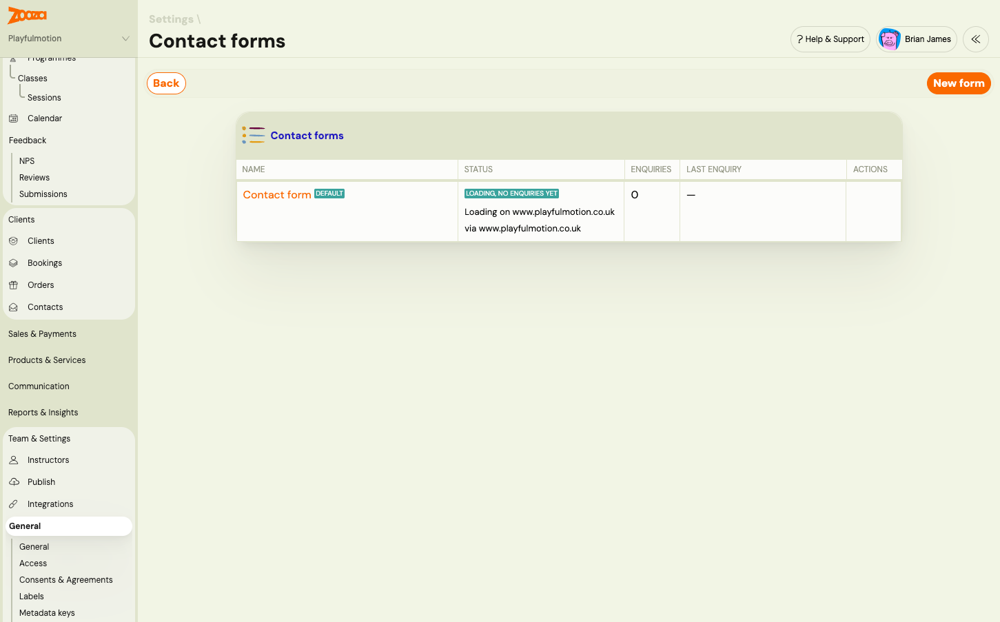
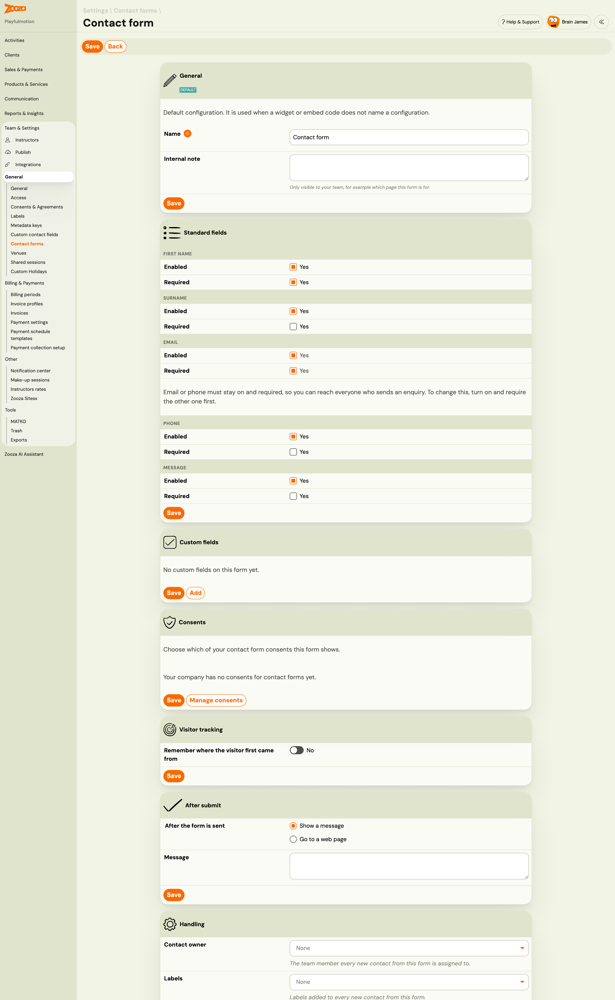
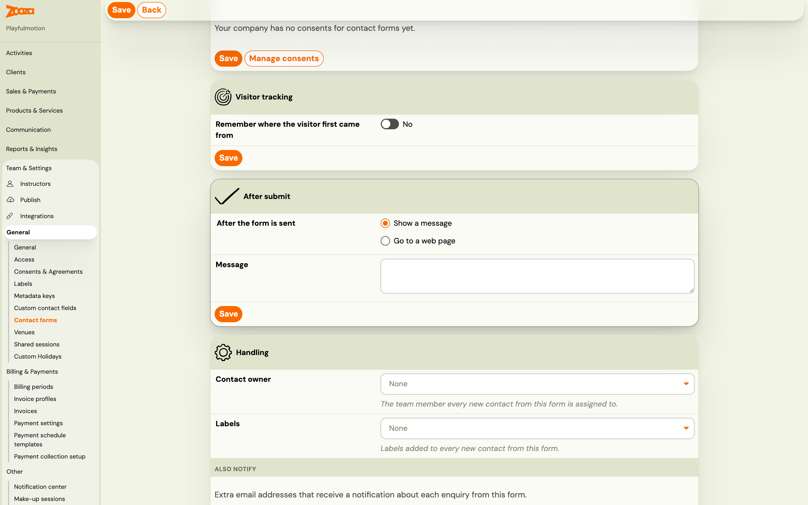
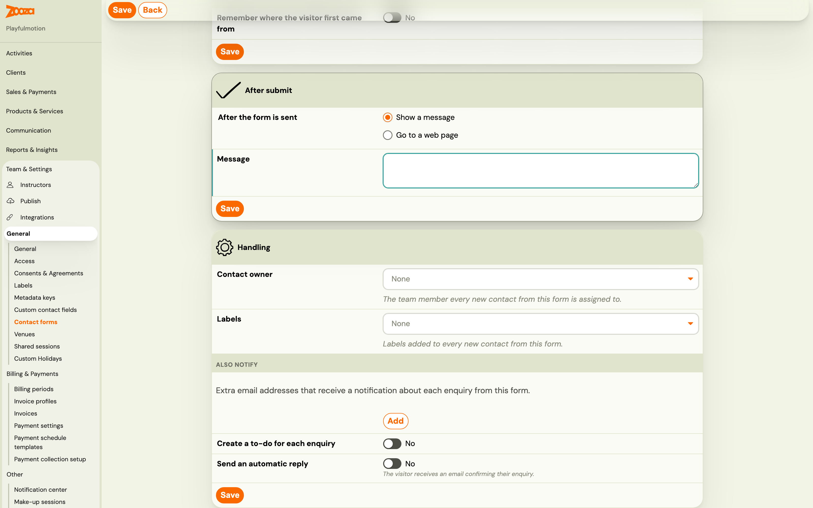
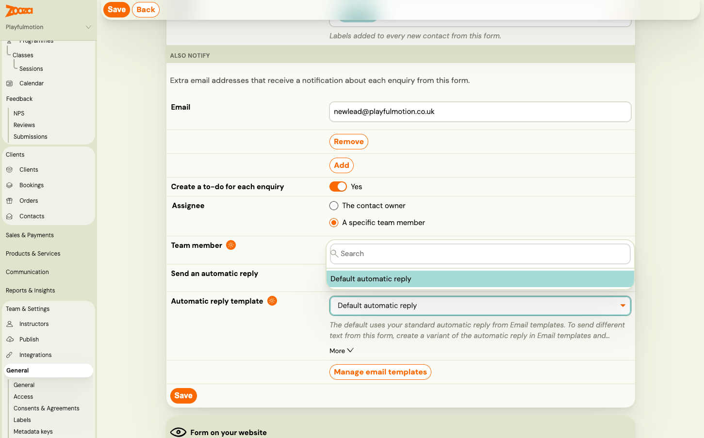

# Set up a contact form

A **contact form configuration** decides what the form on your website asks, which consents it shows, what the visitor sees after sending, and what Zooza does with each enquiry. The embed code on your website only decides *where* the form appears. Change the configuration and the form on your website changes with it, without touching the website.

> **Navigation:** Go to **Team & Settings → General → Contact forms**. You need the permission to edit company settings.

## Your default configuration

Every company has one configuration from the start, marked **DEFAULT**. It is what a contact form shows unless the widget or the embed code names a different configuration. You can edit it freely. It cannot be archived, so a form on your website always has something to show.

The list shows each configuration with its **Status** on your website, the number of **Enquiries** it has received and the **Last enquiry**. Click **New form** when you need a second configuration: different questions on a different page, a different owner per location, or a different automatic reply. Most companies only need the default.

To retire a configuration, open it and archive it. An archived form stops accepting enquiries, even where it is still embedded on your website, so remove it from the page first.

## General and standard fields

Give the configuration a **Name** and, if you like, an **Internal note** such as which page it is for. Neither is shown to visitors.

**Standard fields** are built in. Each has an **Enabled** and a **Required** toggle.

| Field | Shown to the visitor as |
|---|---|
| First name | Name |
| Surname | Last name |
| Email | Email, with a suggestion when it looks like a typo |
| Phone | Phone, a single field with the country code |
| Message | Note |

**Email or phone must stay on and required.** Zooza needs one way to reach every person who sends an enquiry, and it uses the email address to recognise a returning person. To switch one off or make it optional, turn on and require the other one first. The editor locks the toggle and tells you so.

Keep the form short. For a campaign page, first name plus email or phone is often enough. Ask for the rest when you talk to the person.

## Custom and hidden fields

Custom fields are your own questions. They are defined once, in [Custom contact fields](custom-contact-fields.md), and reused on any form. Click **Add** in the **Custom fields** card, tick the fields you want and confirm. Each field on the form has a **Required** toggle, and **Move up** / **Move down** set the order.

Every custom field can also be **Hidden**. A hidden field is not shown to the visitor. Its value is filled in automatically from the **Value source** you choose:

| Value source | The value comes from | Example |
|---|---|---|
| **URL parameter** | A parameter in the address of the page | Source name `ref` reads `?ref=newsletter` |
| **Cookie** | A cookie set on your website | Source name `partner_id` reads the `partner_id` cookie |
| **Embed code attribute** | An attribute you write into the embed code on each page | Source name `location` reads `data-zooza-field-location` |
| **Fixed value** | The **Value** you type here | Always `website` |

The **Source name** uses lowercase letters, numbers, hyphens and underscores, up to 40 characters. Hidden fields are never required. If the source has no value on a given page, the field is simply empty.

Hidden fields are how you tell enquiries apart without asking the visitor: which location page, which partner link, which campaign variant. [Track campaigns and conversions from the contact form](../guides/contact-form-campaign-tracking.md) walks through the common patterns.

## Consents

Zooza's own consents, the ones your booking form already shows, are always part of the contact form. Your own consents are added per configuration.

1. Create the consent in **Team & Settings → General → Consents & Agreements** and set **Consent is intended for** to **Contact forms**. See [Consents and agreements](setting-gtc-gdpr-consents.md).
2. Give it a **category**: General, Terms, Privacy, Marketing, or Photos & videos.
3. Back in the contact form editor, switch the consent on in the **Consents** card and save.

The visitor's answer to each consent is stored on the enquiry, not on a booking. If the person accepts a consent in the **Marketing** category, the contact shows **Marketing consent: Yes**. That is how you tell which contacts you may send newsletters to.

## Visitor tracking and after submit

Every enquiry records the page it was sent from and any campaign parameters in that page's address. **Remember where the visitor first came from** goes one step further: the widget stores the campaign parameters in the visitor's browser when they arrive, so they are still attached when the person sends the form from another page days later. Set **Remember for (days)** between 1 and 90. This stores data in the visitor's browser, so turn it on only if your website asks visitors for consent to such tracking.

**After the form is sent** offers two options:

- **Show a message**: type the text. Leave it empty and the visitor sees *Thank you, we've received your message.* in the widget's language.
- **Go to a web page**: enter a full address starting with `https://`, for example your thank-you page. A thank-you page is also where analytics tools usually count a conversion.

## Handling: owner, labels, notifications, to-do and automatic reply

The **Handling** card decides what happens in Zooza when an enquiry arrives.

- **Contact owner**: the team member every new contact from this form is assigned to. Leave it empty to assign owners by hand.
- **Labels**: added to every new contact from this form. Useful when one person handles several forms.
- **Also notify**: click **Add** and enter extra email addresses that receive a notification about each enquiry from this form. This is in addition to the company-wide recipients in **Notification center** under **New contact enquiry**. The notification email contains the name, email, phone, message, custom field answers and campaign, plus a link to the contact. Reply to it and your answer goes directly to the enquirer.
- **Create a to-do for each enquiry**: creates a to-do *New enquiry — get back to [name]* for **The contact owner** or **A specific team member**. Only one open to-do of this kind exists per contact, so a repeat enquiry does not pile up tasks. If you choose the contact owner but the form has no owner, no to-do is created.
- **Send an automatic reply**: the visitor receives an email confirming their enquiry, in the language the form was shown in. Choose **Default automatic reply** or a variant.

The automatic reply is the template **Contact form - automatic reply** in **Communication → Templates**. Edit it there, or make a copy to create a variant for one form. It can use the visitor's first name and the form name. The visitor's message is never repeated back, so the reply cannot be misused by spam. A contact receives at most one automatic reply per 24 hours, however many times they send the form. See [Message templates](../guides/message-templates.md).

## Form on your website

The last card tells you whether the form is actually live. Zooza records every time the form loads on a page and every time it is blocked.

| Status | Meaning | What to do |
|---|---|---|
| **Never seen on a website** | The form has not loaded anywhere yet | Paste the embed code into your website. See [Put the contact form on your website](contact-form-on-your-website.md). |
| **Loading, no enquiries yet** | The form loads on the page shown, nobody has sent it | Send a test enquiry. |
| **Receiving enquiries** | Enquiries are arriving | Nothing. |
| **Blocked domain** | The form loaded on a website that is not allowed | Click **Allow** next to the blocked domain. Zooza adds it to the widget's additional domains. |

**Embed code for this form** at the bottom gives you a snippet that always shows this configuration. The general embed code in your widget shows the configuration selected on the widget, or the default.

## Related

- [Contact form (lead capture): turn website enquiries into contacts](../guides/contact-form-lead-capture.md)
- [Custom contact fields](custom-contact-fields.md)
- [Put the contact form on your website](contact-form-on-your-website.md)
- [Work with contacts and enquiries](../guides/working-with-contacts.md)
- [Track campaigns and conversions from the contact form](../guides/contact-form-campaign-tracking.md)
- [Consents and agreements (GTC, GDPR)](setting-gtc-gdpr-consents.md)
- [Notifications Center](../guides/notifications-center.md)
- [Contact form and contacts FAQ](../faq/contact-form-and-contacts-faq.md)
