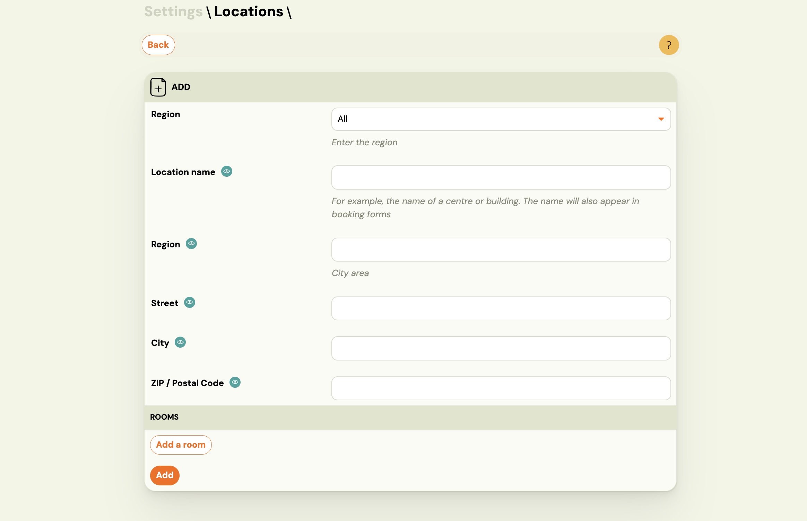
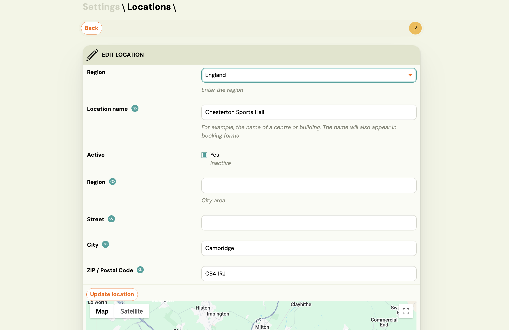
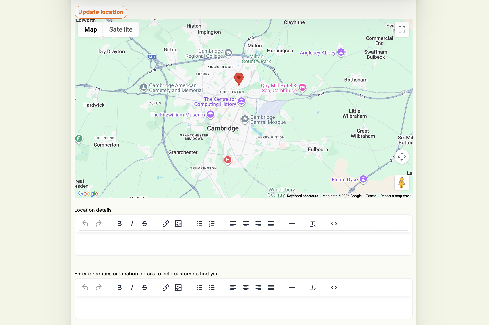
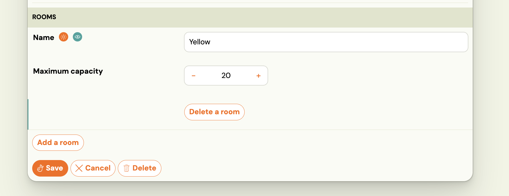

# Creating and managing locations

Locations are the physical venues where your classes take place. Every class requires a location, and the location name appears on your booking forms so clients know where to go. You can also add rooms within a location to track capacity per space.

Go to **Settings → Locations** to manage all your locations.

## Adding a location

1. Go to **Settings → Locations**.
2. Click **Add**.
3. Fill in the fields:

   | Field | Description |
   |---|---|
   | **Region** | Filter dropdown — assign this location to a region if you use regions to organise your venues. Leave as **All** if not applicable. |
   | **Location name** | The name of the venue (e.g. `Chesterton Sports Hall`). This name appears on the booking form. |
   | **Region** (second field) | City area or district — a freetext label to help clients orient (e.g. `North Cambridge`). |
   | **Street** | Street address. |
   | **City** | City name. |
   | **ZIP / Postal Code** | Postal code. Used to pin the location on the map. |

4. Click **Add** to save.

After saving, the location is available when creating or editing classes.

## Editing a location

Open a location from the list to edit it. In addition to the fields above, the edit view includes:

- **Active** — uncheck to deactivate the location. Inactive locations are hidden from class creation but remain visible on existing classes. Use this instead of deleting when you temporarily stop using a venue.
- **Update location** — click this after changing the address to refresh the map pin.
- **Map** — a Google Map is shown based on the address. The map appears on the booking form to help clients find you.
- **Location details** — a rich-text field for any additional details about the venue (e.g. parking, access code, floor number).
- **Directions** — a second rich-text field specifically for travel directions or arrival instructions shown to clients.

Click **Save** to apply changes.

## Adding rooms to a location

If your venue has multiple rooms (e.g. Studio A and Studio B), you can define them here. Room capacity is used when assigning classes to specific rooms.

1. Open a location.
2. In the **Rooms** section, click **Add a room**.
3. Enter the room **Name** and set the **Maximum capacity**.
4. Click **Save**.

You can add multiple rooms. To remove a room, click **Delete a room** next to it.

> Rooms are optional. If you don't need to track capacity per room, leave this section empty.

## Deleting a location

Click **Delete** on the edit screen. Before deleting, make sure no active classes are assigned to this location — classes without a valid location will behave unexpectedly.

If you want to stop using a venue without removing it, set it to **Inactive** instead.

## See also

- [Locations and Venues FAQ](../faq/locations-and-venues-faq.md)
- [Creating a class](../guides/creating-a-class.md)
