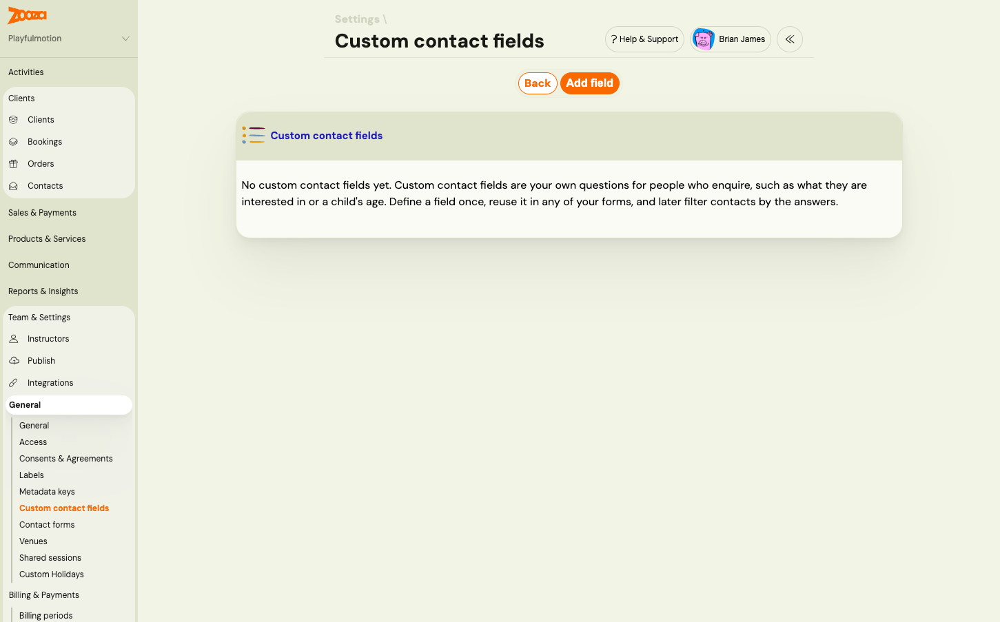
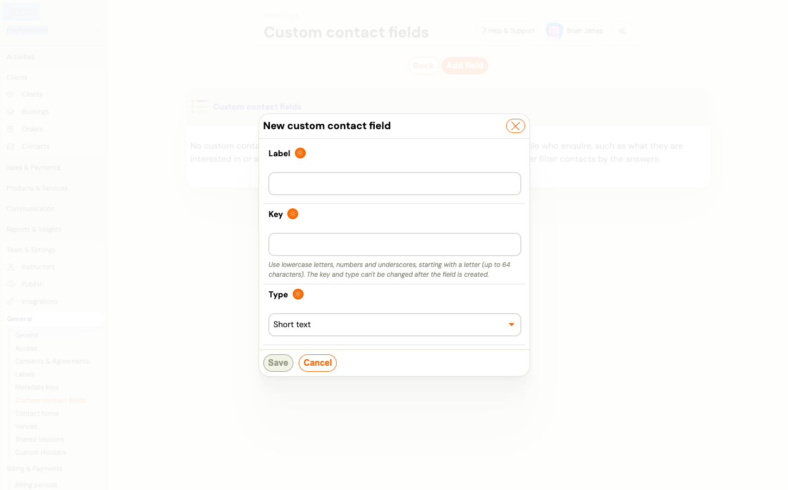
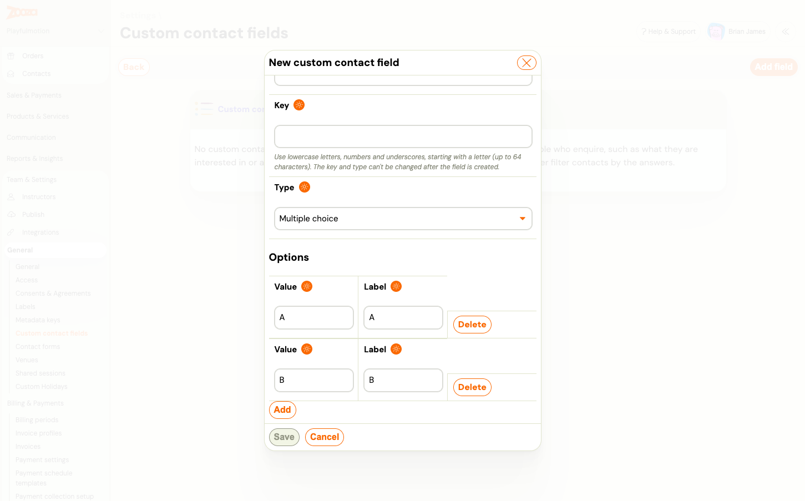

# Custom contact fields: your own questions on the contact form

Custom contact fields are your own questions for people who enquire through the [contact form](../guides/contact-form-lead-capture.md). You define a field once, add it to any contact form, and later filter contacts by the answers. Typical fields: *What are you interested in?*, *Child's age*, *Preferred location*, *How did you hear about us?*

They are separate from the [additional fields](../guides/additional-fields.md) on the booking form. Those belong to bookings. Custom contact fields belong to contacts.

> **Navigation:** Go to **Team & Settings → General → Custom contact fields**. You need the permission to edit company settings.

## Create a field

1. Click **Add field**.
2. Enter a **Label**. This is the question as the visitor sees it, in your own words.
3. Enter a **Key**: lowercase letters, numbers and underscores, starting with a letter, up to 64 characters. The key is the field's technical name. You never show it to visitors.
4. Choose a **Type** (below).
5. For **Single choice** and **Multiple choice**, add the **Options**: a **Value** and a **Label** for each. Click **Add** for another option.
6. Click **Save**.

| Type | The visitor sees | Answers can be filtered by |
|---|---|---|
| **Short text** | A single-line text box | Exact text |
| **Long text** | A multi-line text box | Not filterable |
| **Number** | A number box | A from–to range |
| **Date** | A date picker | A from–to range |
| **Yes / No** | One checkbox | Yes or No |
| **Single choice** | A drop-down list, one option | One option |
| **Multiple choice** | A list of checkboxes, any number of options | Any of the chosen options |

**Option values and labels.** The label is what the visitor reads. The value is what is stored and filtered on. Keep values short and stable, for example `swimming` with the label *Swimming lessons*. You can change a label at any time. Once an option has been saved, its value is fixed.

## What cannot be changed, and why

The **key** and the **type** are fixed once the field is created, and saved option values are fixed too. Answers already given must keep their meaning: a number stays a number, and *swimming* chosen last month still means swimming. If you need a different type, create a new field and stop using the old one.

You can always edit the **label** and add new options.

## Archive a field

Fields are archived, not deleted. Open the field and archive it. It disappears from the form builder and from new enquiries, but every answer already given stays on the contacts, and the field's filter keeps working for them. An archived field cannot be brought back, so archive only when the question is really gone.

## Where the answers show up

- On the contact's **timeline**, under the enquiry that carried them, with your label.
- In the **Contacts** list filters, one filter per active field, matched to the type above.
- In the **New contact enquiry** email your team receives.

To add a field to a form, open the form in **Team & Settings → General → Contact forms**, click **Add** in the **Custom fields** card and tick it. The same field can be **Hidden** on a form and filled in automatically from the page address, a cookie, the embed code or a fixed value. See [Set up a contact form](contact-form-setup.md).

## Related

- [Set up a contact form](contact-form-setup.md)
- [Contact form (lead capture): turn website enquiries into contacts](../guides/contact-form-lead-capture.md)
- [Work with contacts and enquiries](../guides/working-with-contacts.md)
- [Track campaigns and conversions from the contact form](../guides/contact-form-campaign-tracking.md)
- [Additional fields on the booking form](../guides/additional-fields.md)
