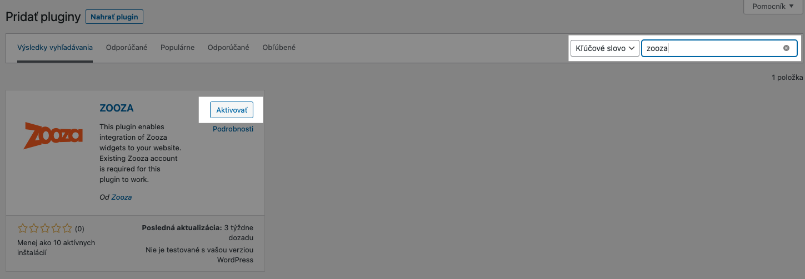
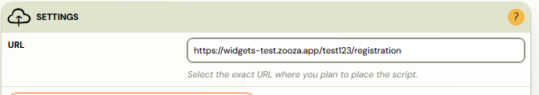
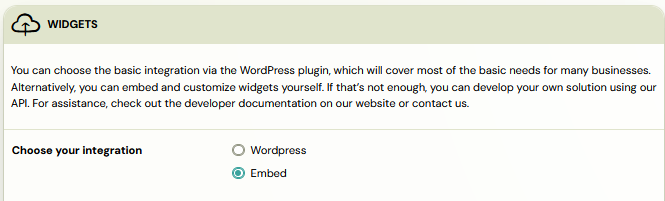
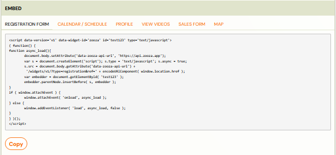
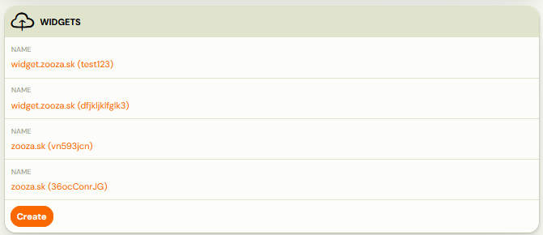

# Deploying Zooza app on your website

Integration into your website is simple. As soon as a new account is created in Zooza, there is nothing to prevent the individual forms from being deployed to your website. What's great about Zooza's forms is that your client will never leave your site. Zooza will become part of yours and will look like it was created for your website.

At the same time, know that you can also edit each form graphically through what are called CSS styles (your programmer will know), so you'll be able to further customize the forms to your graphical liking. To deploy the forms on your site you need to have the Zooza plugin downloaded.
There are 3 ways to deploy widgets on your page:

1. Zooza plugin installation
2. Deploying widgets via HTML
3. Integrating widgets on multiple web pages through one Zooza account

## Zooza plugin installation

If you have a website built on the WordPress platform, you can take advantage of a basic integration through our WordPress plugin that will cover most basic needs for a variety of companies. Below you will find a detailed guide on how to proceed with its integration.

- In the *Plugin *section, click *Add New*
- Search for the keyword Zooza and then click the *Activate *button next to the plugin you searched for

- In the Settings tab, click on *Zooza*
- Fill in the required fields and follow the written procedure

- API and Secret Key can be found in the *Publish *section

- In the booking forms, select the subpages you have created for this purpose. You will then need to enter these URLs into Zooza for each widget in order for them to work properly.

Warning! For each widget, you need to enter the URL where the widget will be deployed. If you do not enter the correct address, the widget will not function properly. Also, if you decide to change the location of the widget after a certain period of time, or if your domain changes, you must change the URL in the widget settings. 

## Deploying widgets via HTML

If your site is not built on the WordPress platform or you need to place widgets in specific locations within the site, you can use the option to insert HTML code directly into the desired location. This method allows you more flexibility to integrate and customize the widgets according to your needs.

1. In the *Publish *section, select the *Embed *integration type*
 
 *
2. This will open a menu of widgets that you can integrate. Click on one of them to open the HTML script
 

If you have a page built around a specific programme offering, Zooza allows you to integrate widgets based on exactly what programmes you want to display on each page. Simply click *Edit Embed Code* below the code itself to open a menu with a selection of programmes and sites.

If you collect a lot of additional data in the booking form or use products, you can enable the Multi-Step Booking option. This feature breaks the booking process into multiple steps, improving clarity and user experience.

Once you have Zooza successfully integrated on your site, you can customize the individual widgets to suit your needs. Find out what customization options are available and how to set them up in this [guide.](../guides/customizing-widgets.md)

## Integrating widgets on multiple websites through one Zooza account

It may happen that you have programmes split across multiple pages, either due to location or programme type,... In this case, Zooza offers you the possibility to have one account for programme administration, but multiple integrations to all websites. Just create a new widget in the Publish section by clicking *Add*.

