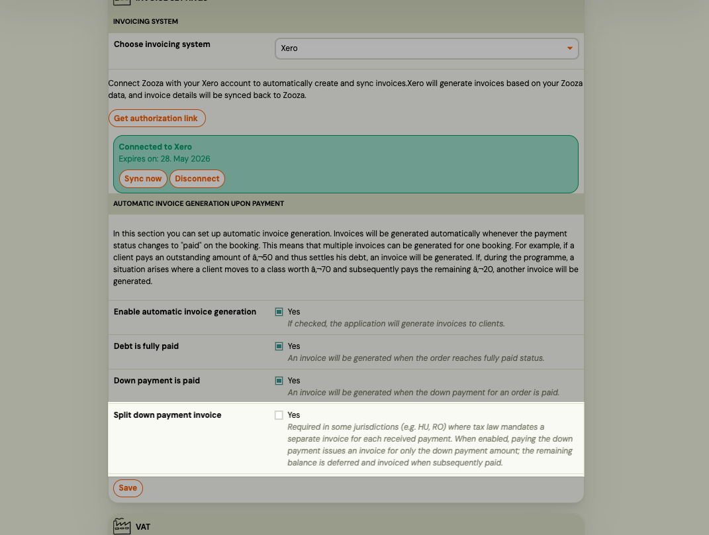

# Set up split invoicing for downpayments

E.g. in Hungary and Romania and other countries, tax law requires that an invoice is issued within approximately 8 days of each payment received. When a client pays a downpayment followed by a final balance, this means **two separate invoices** — one for the downpayment amount and one for the remaining balance.

Without split invoicing enabled, Zooza issues a single invoice that shows the full course price as the charge, the downpayment as a partial payment, and the remaining balance as an open debt. This format does not meet HU/RO legal requirements.

**Split invoicing** resolves this by issuing:
1. A first invoice at downpayment — showing only the downpayment amount as the charge.
2. A second invoice when the final balance is paid (or becomes due) — showing only the remaining amount.

---

## Requirements

- **Automatic invoicing on downpayment** must already be enabled in your Invoice Profile (`auto_invoice_triggers → downpayment_paid`).
- The programme must use a downpayment — programmes with full upfront payment are not affected.
- Split invoicing does **not** apply to registrations with a payment schedule (installment plans).

---

## Enable split invoicing

1. Go to **Settings → Billing** and open your Invoice Profile.
2. In the **Automatic invoicing** section, confirm that **Issue invoice on downpayment paid** is enabled.
3. Enable **Split downpayment invoice**.
4. Click **Save**.

Once enabled, the split logic applies to all new registrations that reach `DOWNPAYMENT_PAID` status from this point forward. Existing registrations that have already been invoiced under the previous flow are not affected.

---

## How it works

### When the client pays the downpayment

Zooza issues the **first invoice** covering only the downpayment amount.

Internally, Zooza creates a deferred debt entry for the remaining balance. This keeps the client's account balanced while holding the outstanding amount for the second invoice.

### When the client pays the final balance

Zooza issues the **second invoice** covering only the remaining amount, dated on the day the final payment is received.

If the payment due date arrives before the client pays, Zooza transfers the deferred balance on the due date and issues the invoice then.

### Example

| Step | Amount | Invoice issued |
|---|---|---|
| Course price | €100 | — |
| Downpayment paid | €20 | Invoice #1: €20 |
| Final balance paid | €80 | Invoice #2: €80 |

---

## Limitations

- **No retroactive split.** Only registrations that reach downpayment-paid status after you enable the setting are split. Previously issued invoices are unchanged.
- **Installment plans excluded.** Registrations with a payment schedule (installments) are not subject to split logic. A single invoice is issued as before.
- **Cancellations and refunds.** If a registration is cancelled after the first invoice is issued, Zooza does not automatically generate a credit note. Handle credit notes and the deferred balance entry manually.
- **Admin-changed downpayment amounts.** If you change the downpayment amount after the first invoice has been issued, Zooza recalculates the deferred balance. Issue a credit note for any discrepancy manually.

---

## Supported invoice engines

| Engine         | Market          | Split invoicing |
| -------------- | --------------- | --------------- |
| Számlázz.hu    | Hungary         | Supported       |
| SmartBill      | Romania         | Supported       |
| Oblio          | Romania         | Supported       |
| Faktury Online | SK/CZ (default) | Supported       |
| Zooza Invoice  | All             | Supported       |
| Fakturoid      | CZ/SK           | Supported       |
| Xero           | International   | Supported       |

---

## Related

- [Invoicing overview](./invoicing-overview.md)
- [Számlázz.hu integration](./szamlazz-invoices.md)
- [SmartBill integration](./smartbill-invoices.md)
- [Oblio integration](./oblio-invoices.md)
